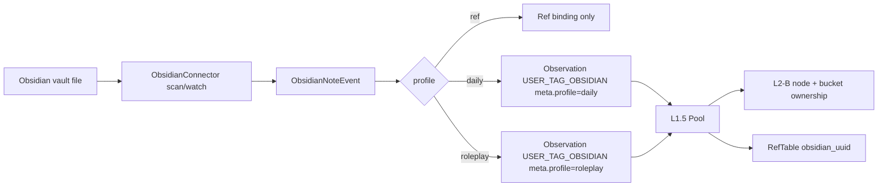
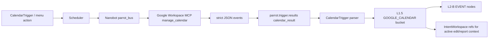

# Chat B - Obsidian + Google + Nanobot Real Connection Audit

> Scope: audit first, not final menu-node design. The Google / Obsidian / GOSLO module / Nanobot blocks in the canvas should use this as the capability source before UI layout is finalized.

## 1. Executive Conclusion

### 1.1 Current Capability Grade

| Channel | Current grade | Real-connection status |
|:--|:--|:--|
| Obsidian | Skeleton + partial L1.5 support | Not real yet. Current script is one-shot `Markdown -> Graphiti episode`; current `USER_TAG_OBSIDIAN` filter always creates an OBJECT and does not implement the three locked profiles. |
| Google Calendar | Configured Nanobot MCP + skeleton trigger | Blocked. Google Workspace MCP is configured in the Nanobot fork, but `calendar_fetch` does not currently reach real Nanobot through ParrotCarriers Scheduler, and real Nanobot does not publish the result back on the trigger channel expected by `CalendarTrigger`. |
| Nanobot worker | Real gateway launch exists + stub test worker exists | Real gateway path exists, but ParrotBus result routing, heartbeat, and task type registration are incomplete for Google/calendar/message work. |
| Photos | Real Phase 4 path exists | Preview DataChannel + HTTP upload + PhotoNode observer are implemented and tested. Not part of Chat B write scope, but it is the reference pattern for heavy payload vs lightweight refs. |
| AR render / ECP / HTTP | Static scan only in this round | No new obvious AR render-channel blocker found in static scan. Full runtime testing is intentionally deferred to App v1 integrated testing. |

### 1.2 Biggest Blocking Bugs

1. `calendar_fetch` and `message_check` are not in `NANOBOT_TASK_TYPES`, so Scheduler routes them to `brain_direct`, not Nanobot. Code: `src/parrot/scheduler/nodes.py`.
2. The real Nanobot `ParrotBusChannel.send()` publishes result `type=task_type` only to `parrot.nanobot.results`; it does not preserve `params.result_channel` or publish to `parrot.trigger.results`. Code: `D:/GOSLOParrot/nanobot/nanobot/channels/parrot_bus.py`. Therefore `CalendarTrigger.on_event(type=="calendar_result")` will not fire.
3. `CalendarTrigger._process_calendar_data()` writes `SemanticNode` directly into L2-B, bypassing L1.5 Pool, `BucketKind.GOOGLE_CALENDAR`, RefTable, and TriggerOutcome V2 upload channels.
4. Obsidian `profile="ref"` is not implemented. Current admission routing treats every `USER_TAG_OBSIDIAN` profile except `roleplay` as daily, and `user_tag_filter.py` always emits `NodeKind.OBJECT`. This violates the locked rule: Ref-加强 is a reference binding, not a node.

## 2. Facts Read Back

### 2.1 Architecture Facts

- Obsidian three subclasses are locked:
  - `ref`: strengthen an existing node by `obsidian_uuid`; does not create an L2-B node.
  - `daily`: authoritative daily setting node; enters Obsidian daily bucket and L2-B.
  - `roleplay`: authoritative roleplay setting node; only active under Roleplay mode and must not pollute daily life.
- `SemanticNode.source` and `source_meta` are Python-side extension surfaces. Obsidian must use `ObservationSource.USER_TAG_OBSIDIAN + meta.profile`; no new Obsidian enum is needed.
- `BucketKind.GOOGLE_CALENDAR` already exists and is fresh/cleared on scene switch.
- `IntentWorkspace` is the heavy resource staging boundary. It is not a UI tab.
- `2DWorkspace` is the user-visible canvas/workdesk selection. It can carry lightweight metadata pointing to IntentWorkspace refs, but it must not own payloads or eviction.

### 2.2 Implementation Facts

- `src/scripts/sync_obsidian_to_graphiti.py` parses frontmatter with a regex and writes Graphiti episodes into `PARTITIONS.SCENE`; it does not use L1.5 Pool or the three Obsidian profiles.
- `src/parrot/dsg/ingest/user_tag_filter.py` requires `obsidian_uuid`, emits `USER_TAG_OBSIDIAN`, and currently always creates `NodeKind.OBJECT` with `meta={"tags": ...}`.
- `src/parrot/dsg/l1_5/admission.py` routes `USER_TAG_OBSIDIAN` with `profile=roleplay` to `OBSIDIAN_SETTING_ROLEPLAY`, otherwise to `OBSIDIAN_SETTING_DAILY`; `profile=ref` is missing.
- `src/parrot/dsg/triggers/calendar_trigger.py` dispatches `calendar_fetch`, expects a `calendar_result`, then writes L2-B nodes directly.
- `D:/GOSLOParrot/nanobot/config/parrot_config.json` enables `parrot_bus` and `google_workspace` MCP with `manage_accounts`, `manage_calendar`, and `manage_email`.
- `D:/GOSLOParrot/nanobot/nanobot/skills/google-workspace/SKILL.md` knows `calendar_fetch` and asks Nanobot to return strict JSON arrays.

## 3. Business Flow Draft

### 3.1 Obsidian Read/Ingest Flow

1. User configures one vault/root for the current profile.
2. Obsidian connector runs boot scan plus debounced file change scan.
3. Each markdown note is parsed with YAML frontmatter, not ad-hoc regex.
4. Note is normalized into `ObsidianNoteEvent`.
5. Router reads `profile` from frontmatter or path rule:
   - `ref`: bind/update RefTable or existing node `obsidian_uuid`; do not create an L2-B node.
   - `daily`: emit `Observation(USER_TAG_OBSIDIAN, meta.profile="daily")`.
   - `roleplay`: emit `Observation(USER_TAG_OBSIDIAN, meta.profile="roleplay")`, but only admit when Roleplay mode is active.
6. L1.5 Pool admits daily/roleplay nodes and records bucket ownership.
7. Graphiti remains long-term memory/output target; it must not be the first write gate for runtime L1.5 state.

### 3.2 Google Calendar Read Flow

1. `CalendarTrigger` or a menu action requests a bounded calendar window.
2. Scheduler dispatches `calendar_fetch` to Nanobot.
3. Nanobot uses Google Workspace MCP `manage_calendar`.
4. Nanobot returns strict JSON through the same `task_id`, preserving `result_channel="calendar_result"`.
5. Trigger parses events into `GoogleCalendarEventDTO`.
6. Trigger emits `BucketOp(IMPORT, GOOGLE_CALENDAR, items=[...])` or `commit_observations` plus explicit target bucket support.
7. L1.5 Pool owns the event nodes and RefTable binding; scene switch clears the bucket.
8. Brain/GOSLO sees summary, not the raw full calendar dump.

### 3.3 Google Calendar Writeback Flow

1. User speaks or edits a plan in GOSLO.
2. Brain creates a draft calendar operation in IntentWorkspace. This is where large/structured edit context lives.
3. UI/voice asks for confirmation when the operation changes external Google state.
4. Confirmed operation dispatches to Nanobot:
   - `calendar_create`
   - `calendar_patch`
   - `calendar_delete`
5. Nanobot executes MCP/API write and returns an operation result with Google `event_id`, `etag`, and status.
6. Calendar bucket refreshes only the affected window or sync token delta.
7. Failure returns a visible status, not silent fallback.

## 4. Data Flow Draft

### 4.1 Obsidian



### 4.2 Google + Nanobot



## 5. Interface Draft

### 5.1 ObsidianNoteEvent

```python
@dataclass(frozen=True)
class ObsidianNoteEvent:
    vault_id: str
    obsidian_path: str
    obsidian_uuid: str
    profile: Literal["ref", "daily", "roleplay"]
    label: str
    body: str
    tags: tuple[str, ...]
    double_links: tuple[str, ...]
    frontmatter: dict[str, Any]
    file_mtime: float
    content_hash: str
```

Required behavior:

- Missing `obsidian_uuid`: reject only when `profile=ref`.
- `profile=ref`: bind only; if target node is missing, emit a recoverable status `ref_target_missing`; do not create a new L2-B node.
- `profile=daily/roleplay`: UUID is optional; emit `ObservationSource.USER_TAG_OBSIDIAN`; set `meta.profile`; attach `obsidian_note_key`, `obsidian_path`, `file_mtime`, `double_link_count`, and `content_hash` through source meta.

### 5.2 GoogleCalendarEventDTO

```python
@dataclass(frozen=True)
class GoogleCalendarEventDTO:
    calendar_id: str
    event_id: str
    ical_uid: str
    etag: str
    status: str
    summary: str
    description: str
    location: str
    start: str
    end: str
    time_zone: str
    updated: str
    html_link: str
    attendees: tuple[str, ...] = ()
    recurrence: tuple[str, ...] = ()
    objects: tuple[str, ...] = ()
    source_meta: dict[str, Any] = field(default_factory=dict)
```

Recommended source decision:

- Preferred: add Python-only `ObservationSource.GOOGLE_CALENDAR` with a source meta factory. Calendar has stable distinct fields (`calendar_id`, `event_id`, `etag`, `sync_token`, `time_zone`, `status`) and different lifecycle/authority from GOSLO autonomous curiosity.
- Conservative temporary path: use `BucketOp(IMPORT, BucketKind.GOOGLE_CALENDAR, items=[...])` to force bucket ownership, but do not keep this as final because source authority and merge semantics remain ambiguous.

### 5.3 Nanobot Task Envelope

```json
{
  "task_id": "task_xxx",
  "type": "calendar_fetch",
  "params": {
    "window_start": "2026-05-09T00:00:00+08:00",
    "window_end": "2026-05-10T00:00:00+08:00",
    "calendar_id": "primary",
    "max_events": 20,
    "fields": ["id", "etag", "status", "summary", "description", "location", "start", "end", "updated", "htmlLink"],
    "result_channel": "calendar_result",
    "token_budget": 1200
  }
}
```

Result envelope must preserve both task type and delivery channel:

```json
{
  "task_id": "task_xxx",
  "type": "calendar_result",
  "task_type": "calendar_fetch",
  "status": "completed",
  "result": "[...]",
  "completed_at": 1760000000.0
}
```

## 6. Monitoring Points

### 6.1 Obsidian

- `obsidian.connector.status`: disabled / scanning / watching / error.
- `obsidian.last_scan_at`, `obsidian.last_success_at`, `obsidian.last_error`.
- Count: parsed files, rejected missing uuid, rejected invalid profile, admitted daily, admitted roleplay, ref-bound, ref-missing.
- L1.5 bucket counts: `OBSIDIAN_SETTING_DAILY`, `OBSIDIAN_SETTING_ROLEPLAY`.
- RefTable health: stale/unverified `OBSIDIAN_UUID` refs.

### 6.2 Google Calendar

- OAuth/MCP auth state: unauthenticated / authenticated / expired / error.
- `calendar.last_fetch_at`, `calendar.last_success_at`, `calendar.last_error`.
- `calendar.next_sync_token` or equivalent persisted cursor.
- Count: fetched events, parsed events, cancelled events, bucket imports, writeback successes/failures.
- Token budget: returned event count, raw bytes, summarized bytes, estimated prompt tokens.
- Conflict status: stale etag, 412/precondition failure, user confirmation pending.

### 6.3 Nanobot

- Redis stream length: `parrot.nanobot.dispatch`.
- Active/pending task count and age.
- Result channel health: last message on `parrot.nanobot.results`, last bridged message on `parrot.trigger.results`.
- Heartbeat hash: `parrot:nanobot_heartbeat main_worker`.
- Busy/idle state so archive triggers do not run while Nanobot is working.

### 6.4 App / Runtime Console Later

A read-only Web console after this slice should show:

- LiveKit room and ECP connection health.
- Audio/video publish state and current app capability mode.
- L1.5 bucket counts and recent Timeline markers.
- IntentWorkspace pressure and active refs.
- Obsidian connector status.
- Google Calendar sync/writeback status.
- Nanobot pending/result/heartbeat status.
- Last photo event and upload status.

## 7. Bug/Risk List

### P0 - Must Fix Before "True Google Connection"

| Risk | Evidence | Required fix |
|:--|:--|:--|
| `calendar_fetch` not routed to Nanobot | `NANOBOT_TASK_TYPES` lacks `calendar_fetch` / `message_check` | Add task types and router tests. |
| Real Nanobot result not delivered to `CalendarTrigger` | `ParrotBusChannel.send()` publishes only `type=task_type` to results channel | Preserve `result_channel`; publish a bridge event to `CH_TRIGGER_RESULTS`. |
| Calendar bypasses L1.5 | `CalendarTrigger._process_calendar_data()` calls `self._graph.upsert_node()` directly | Convert parsed events to TriggerOutcome V2 upload channel, preferably `BucketOp(IMPORT, GOOGLE_CALENDAR, items=...)`. |
| No Google source/ref semantics | No `ObservationSource.GOOGLE_CALENDAR` or `RefKind.CALENDAR_EVENT_ID` | Make a source/ref decision before writeback. |

### P1 - Must Fix Before Stable Obsidian Connection

| Risk | Evidence | Required fix |
|:--|:--|:--|
| Ref-加强 incorrectly becomes daily object | admission maps all non-roleplay Obsidian to daily; filter always emits `NodeKind.OBJECT` | Implement `profile=ref` as binding-only path. |
| No source_meta factory | only tests call `register_source_meta_factory`; production Obsidian fields are absent | Register `USER_TAG_OBSIDIAN` source meta factory. |
| One-shot regex parser | `sync_obsidian_to_graphiti.py` manually parses frontmatter | Use YAML parser and boot scan + debounce watcher. |
| Graphiti is used as first write gate | sync script writes directly to Graphiti | Runtime ingest should enter L1.5 first; Graphiti writeback can be downstream/archive. |

### P1 - Runtime Robustness

| Risk | Evidence | Required fix |
|:--|:--|:--|
| Calendar fallback event id unstable | fallback uses Python `hash(title)` | Use stable hash of calendar_id + start + summary when Google id is missing. |
| Naive time parse assumes UTC | `_parse_time()` assigns UTC to naive values | Require RFC3339 offset from Nanobot, or carry `timeZone` and normalize. |
| Nanobot heartbeat writer missing | `IdleArchiveTrigger` has reader and TODO writer | Add heartbeat in real `ParrotBusChannel` or ParrotCarriers stub. |
| Start script key drift | `start_nanobot_worker.py` checks `google-workspace`, config uses `google_workspace` | Fix key name to avoid future config isolation bugs. |

### P2 - Design/UX Follow-up

- Google writeback needs explicit confirmation and conflict UI.
- Menu canvas modules should expose state and last error first; deeper settings can wait.
- Google/Obsidian blocks should not directly write Blackboard; they call backend interfaces and display status.
- Web console should be read-only first.

## 8. Completion Criteria

### 8.1 Obsidian

- Boot scan plus watcher can process a real vault path.
- Missing UUID is rejected with visible count/status.
- `profile=ref` never creates an L2-B node.
- `profile=daily` enters `OBSIDIAN_SETTING_DAILY`.
- `profile=roleplay` enters roleplay bucket only when Roleplay mode is active.
- `source_meta` contains `obsidian_path`, `file_mtime`, `double_link_count`, and `profile`.
- Re-running sync is idempotent by `obsidian_uuid + content_hash`.

### 8.2 Google + Nanobot

- `calendar_fetch` reaches real Nanobot, not just the stub.
- Real Nanobot can authenticate/use Google Calendar MCP or returns a clear auth-required status.
- Result arrives on `calendar_result`.
- Parsed events enter `GOOGLE_CALENDAR` bucket through L1.5.
- Scene switch clears the Google calendar bucket.
- Writeback draft uses IntentWorkspace and asks for confirmation.
- Writeback update/delete carries `etag` or explicit conflict strategy.
- Token budget is bounded by window/max_events/field selection and summary size.

## 9. External API Notes

Google official docs currently define Calendar Event resources with `id`, `etag`, `status`, `summary`, `description`, `location`, `start`, `end`, and `updated`. `events.list` supports bounded windows with `timeMin`/`timeMax`, pagination with `nextPageToken`, and incremental sync with `nextSyncToken`. Writes require authorization; `events.patch` supports patch semantics but costs extra quota, while ETag conditional modification is the safer conflict-control primitive for update/delete flows.

References:

- Google Calendar Events resource: https://developers.google.com/workspace/calendar/api/v3/reference/events
- Google Calendar Events list: https://developers.google.com/workspace/calendar/api/v3/reference/events/list
- Google Calendar Events patch: https://developers.google.com/workspace/calendar/api/v3/reference/events/patch
- Google Calendar resource versions / ETags: https://developers.google.com/workspace/calendar/api/guides/version-resources
