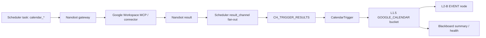
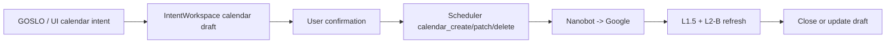

# Google Calendar + Nanobot 真连接指南

## 0. 结论

Google 日程的真实连接应以 Nanobot 为外部能力代理，以 Scheduler 为调度单写者，以 L1.5 为记忆入池边界。Google 事件不能由菜单、2DWorkspace 或 GOSLO 对话逻辑直接写入 L2-B。

当前实现已经完成第一版真实链路：

- Scheduler 将 `calendar_fetch` / `calendar_create` / `calendar_patch` / `calendar_delete` / `message_check` 路由到 Nanobot。
- Nanobot 保留 `result_channel`，将 Google 能力结果返回给 Scheduler 指定通道。
- Scheduler 负责把 Nanobot result fan-out 到 `CH_TRIGGER_RESULTS`。
- `CalendarTrigger` 读取 trigger result 后进入 L1.5 `GOOGLE_CALENDAR` bucket，再生成 L2-B `EVENT` 节点。
- Calendar 读取不默认进入 IntentWorkspace；写入/修改/删除类操作应在未来通过 IntentWorkspace draft + 用户确认闭环。

## 1. 业务流程

### 1.1 读取日程

1. Scheduler 产生或接收 `calendar_fetch` 调度任务。
2. Scheduler 把任务发给 Nanobot，并设置 `result_channel`。
3. Nanobot 调用 Google Workspace MCP / connector 能力读取日程。
4. Nanobot 返回结构化结果到指定 result channel。
5. Scheduler fan-out 到 trigger result channel。
6. `CalendarTrigger` 将日程记录写入 L1.5 `GOOGLE_CALENDAR` bucket。
7. L1.5 决定是否上升到 L2-B `EVENT` 节点。
8. Blackboard / Web 控制台只展示摘要、连接状态和错误，不承载完整日程历史。

### 1.2 写入或修改日程

写入、修改、删除日程的业务链路不能跳过用户确认：

1. GOSLO 或 UI 生成 calendar intent。
2. IntentWorkspace 创建 calendar draft，保存目标动作、候选时间、参与者、说明和风险。
3. 用户确认后，Scheduler 派发 `calendar_create` / `calendar_patch` / `calendar_delete`。
4. Nanobot 调用 Google。
5. 成功结果回到 Scheduler 和 CalendarTrigger。
6. L1.5 更新 `GOOGLE_CALENDAR` bucket 与 L2-B EVENT。
7. IntentWorkspace 关闭 draft 或记录失败原因。

## 2. 数据流

写入/修改时多一层 IntentWorkspace：

## 3. 写边界

### Scheduler

Scheduler 是 Google 外部动作的调度入口和 result fan-out 单写者。Trigger 不应直接订阅 Nanobot 原始结果，否则会出现重复消费和生命周期混乱。

### Nanobot

Nanobot 是外部连接代理，负责 Google 能力调用、OAuth/connector 适配、结构化结果返回和 heartbeat。Nanobot 不应直接写 L2-B。

### L1.5

`CalendarTrigger` 必须把 Google 结果转换为 `ObservationSource.GOOGLE_CALENDAR`，进入 `BucketKind.GOOGLE_CALENDAR`。这是 Google 日程成为记忆前的协议边界。

### L2-B

L2-B 只保存可以被 GOSLO 使用的日程语义节点，例如事件标题、时间、地点、参与者、来源 id 和状态。完整 Google payload、OAuth token、connector 原始响应不进 L2-B。

### Blackboard

Blackboard 只保存轻量运行态，例如最近同步时间、今日事件数、连接健康、最近错误、是否有待确认 draft。它不是 Calendar cache。

### IntentWorkspace

IntentWorkspace 默认不接收普通 calendar fetch 结果。它参与以下场景：

- 用户要求创建、修改、删除日程，需要确认草稿。
- Google 返回大量候选或冲突信息，需要临时比较。
- GOSLO 要把某次对话中的计划转换成可执行日程动作。

## 4. 接口草案

### Scheduler task

| 字段 | 说明 |
|:--|:--|
| `task_type` | `calendar_fetch` / `calendar_create` / `calendar_patch` / `calendar_delete` |
| `result_channel` | Scheduler 指定回传通道 |
| `time_range` | fetch 时间范围 |
| `calendar_id` | Google calendar id |
| `draft_ref` | 写操作对应 IntentWorkspace draft ref |
| `request_id` | 幂等追踪 id |

### CalendarTrigger result

| 字段 | 说明 |
|:--|:--|
| `source` | `GOOGLE_CALENDAR` |
| `bucket` | `GOOGLE_CALENDAR` |
| `external_event_id` | Google event id |
| `event_time` | start/end |
| `visibility` | busy/free/private 等 |
| `l2b_node_uuid` | 成功 upsert 后的 EVENT 节点 |

## 5. 状态监控点

| 监控点 | 目的 |
|:--|:--|
| Nanobot heartbeat / busy / last_active | 防止 idle archive 误关连接 |
| Scheduler pending task 数 | 判断外部动作是否堵塞 |
| `calendar_*` 成功/失败计数 | 判断 Google 连接稳定性 |
| result_channel 缺失计数 | 防止结果丢失 |
| L1.5 `GOOGLE_CALENDAR` bucket 写入数 | 确认没有绕过 L1.5 |
| L2-B EVENT upsert 失败数 | 排查 schema 或时间解析 |
| IntentWorkspace open calendar draft 数 | 控制待确认动作 |

## 6. 已知问题

1. OAuth/connector 的用户级配置仍需 App 第一版统一测试。
2. Google writeback 的完整业务闭环尚未完成：已有路由和 prompt，但还需要 IntentWorkspace draft、用户确认、执行结果回填。
3. Token 预算和长日程摘要策略仍需在 Web 控制台或调度层观察。
4. 菜单画布 Google 块应等本链路稳定后设计，只展示状态、授权、今日摘要和 draft，不直接调用 Google。

## 7. 第一版验收

- Calendar fetch 结果经 Nanobot 返回 Scheduler，再由 CalendarTrigger 入 L1.5。
- L1.5 使用 `ObservationSource.GOOGLE_CALENDAR` 和 `BucketKind.GOOGLE_CALENDAR`。
- L2-B EVENT 节点可被 GOSLO 查询，但原始 Google payload 不进入 L2-B。
- 写操作必须有 IntentWorkspace draft 和用户确认。
- Blackboard 只保存状态摘要，不保存完整日程。
