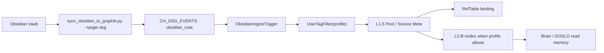

# Obsidian 真连接指南

## 0. 结论

Obsidian 真连接的第一版目标不是把 Obsidian 当作普通文本导入器，而是把它作为 **USER_TAG_OBSIDIAN** 来源进入 L1.5，再由三子类 profile 决定是否写入 authority bucket、是否只绑定已有节点、以及是否进入 L2-B。

当前实现已经完成最小真实链路：

- `src/scripts/sync_obsidian_to_graphiti.py` 默认 `--target dsg`，把 Markdown/frontmatter 转成 `obsidian_note` 事件发布到 DSG 事件通道。
- `ObsidianIngestTrigger` 监听 `obsidian_note` 并调用 `UserTagFilter`。
- `UserTagFilter` 支持 `profile=ref | daily | roleplay`。
- `ref` profile 只做已有节点引用绑定，不新建 L2-B 节点。
- `daily` / `roleplay` profile 会走 L1.5 bucket 与 L2-B upsert。

Obsidian 的菜单画布块可以等这条链路稳定后再做，因为 UI 只应持有 Obsidian 连接状态、可选 profile、最近同步摘要和 ref id，不应绕过 L1.5 直接写 Graphiti / L2-B。

## 0.1 三 profile 硬规则（防混淆）

后续所有实现和菜单设计必须先判断 `profile`，不能把 “Obsidian = UUID 绑定 Graphiti” 当成通用规则：

- `daily`：设定源 note，可不带 UUID；用 `obsidian_note_key` / path / title 作为本地身份，进入 L1.5 daily bucket，并可生成 L2-B 设定节点。
- `roleplay`：设定源 note，可不带 UUID；用于大小姐宅邸、RolePlay Mode、人物/场景设定，进入 L1.5 roleplay bucket，并可生成 L2-B 设定节点。
- `ref`：引用加强 note，必须带 `obsidian_uuid` 或等价绑定线索；只绑定/加强已有 L2-B / Graphiti 节点，不凭空新建节点。

菜单里的 Obsidian 设定模块默认面对的是 `daily` / `roleplay` 设定 note，不应要求用户填写 UUID；Ref shelf / 强化绑定区才显示 UUID、Graphiti、L2-B 绑定状态。

## 1. 业务流程

1. 用户在 Obsidian 中维护设定、参考资料、日常注记或 roleplay 资料。
2. 同步脚本读取 vault 路径、frontmatter、正文摘要和 profile。
3. 脚本发布 `obsidian_note` 事件到 DSG。
4. `ObsidianIngestTrigger` 将事件转给 `UserTagFilter`。
5. `UserTagFilter` 根据 profile 与 source meta factory 形成 L1.5 ingest 输入。
6. L1.5 Pool 执行去重、bucket 选择、引用绑定和 L2-B upsert。
7. 下游 GOSLO / Brain 只看到 L2-B 节点、RefTable 绑定或 Blackboard 摘要，而不是直接读取 Obsidian 原文。

## 2. 数据流



### 2.1 profile 行为

| profile | 语义 | 默认写入 |
|:--|:--|:--|
| `ref` | 参考资料加强；用于绑定已有人物、物件、世界观节点；需要 `obsidian_uuid` 或等价绑定标识 | 只写 RefTable / bucket record，不新建 L2-B |
| `daily` | 日常设定与用户生活素材；不强制 UUID，可用 path/title 作为本地 note identity | L1.5 authority bucket + L2-B upsert |
| `roleplay` | roleplay 设定、人格/场景资料；不强制 UUID，可用于菜单里的设定 Obsidian 模块 | L1.5 roleplay/authority bucket + L2-B upsert |

## 3. 写边界

### L1.5

L1.5 是 Obsidian 真连接的首个写入边界。所有 Obsidian 事件必须带 `ObservationSource.USER_TAG_OBSIDIAN` 或等价 source meta，不能伪装成对话记忆、系统事实或 Graphiti 原生事件。

### L2-B

L2-B 只存已经通过 profile 和 bucket 策略确认的语义节点。`ref` profile 的 Obsidian 条目不应该凭空制造 L2-B 节点，否则会把外部参考资料误升格成 GOSLO 已确认记忆。

### RefTable

RefTable 存 Obsidian 条目和已有节点的轻量绑定，例如 note path、frontmatter id、外部 uuid、目标 node uuid。这个绑定可以被菜单、IntentWorkspace 或后续写回流程引用。

### Blackboard

Blackboard 只适合放最近同步状态、错误摘要、活跃 Obsidian profile、连接健康度等轻量状态。Blackboard 不是 Obsidian note 仓库，也不是菜单直接写 L2-B 的通道。

### IntentWorkspace

Obsidian 文本条目默认不进入 IntentWorkspace。只有这些情况才应进入：

- 大文档、附件、图片或 rich media 需要被 GOSLO 在当前任务中临时阅读。
- Obsidian 写回前需要用户确认草稿。
- 菜单画布拖入某个 Obsidian ref，需要在当前任务中作为 staged ref 使用。

IntentWorkspace 应保存 staged ref 和必要 payload，L1.5 RefTable 保存持久引用，2DWorkspace 只保存可视化块的 metadata。

## 4. 接口草案

### CLI / 后台同步

```bash
uv run python src/scripts/sync_obsidian_to_graphiti.py --target dsg <vault_path>
```

### 事件字段建议

| 字段 | 说明 |
|:--|:--|
| `type` | `obsidian_note` |
| `source` | `USER_TAG_OBSIDIAN` |
| `profile` | `ref` / `daily` / `roleplay` |
| `obsidian_note_key` | daily / roleplay 的本地路径或 note key；不等同于绑定 UUID |
| `obsidian_uuid` | `profile=ref` 的强化绑定 id；daily / roleplay 可为空 |
| `note_path` | Vault 内相对路径 |
| `frontmatter` | 结构化 metadata |
| `content_excerpt` | 可控长度摘要，不直接塞满总线 |
| `target_ref` | `profile=ref` 时用于绑定已有节点 |

## 5. 状态监控点

| 监控点 | 目的 |
|:--|:--|
| Obsidian sync 成功/失败次数 | 判断 vault 连接是否真实可用 |
| 最近 ingest note path/profile | 排查 profile 路由错误 |
| L1.5 bucket 写入数 | 判断是否越过 L1.5 |
| `ref` profile 新建节点数 | 必须保持 0，除非未来明确放开 |
| L2-B upsert 错误 | 判断 schema 或去重策略是否漂移 |
| Blackboard 最近同步摘要 | 供菜单/控制台展示，不承载正文 |

## 6. 已知问题

1. Obsidian 写回还未闭环。当前完成的是读取和进入 L1.5，未来写回必须走 IntentWorkspace draft + 用户确认。
2. 菜单画布的 Obsidian 设定块尚未设计最终交互。它应在本指南稳定后只展示连接状态、profile、同步结果和 ref，而不是直接编辑 L2-B。
3. 大文档和附件的 IntentWorkspace 策略还需要与 Photo / Google draft 统一。
4. 权限和 vault 路径配置需要在 App 第一版测试前统一做状态可视化。

## 7. 第一版验收

- `profile=ref` 不新建 L2-B 节点，只产生引用绑定。
- `profile=daily` 和 `profile=roleplay` 即使不带 UUID，也能通过 L1.5 写入对应 bucket 与 L2-B。
- Blackboard 只暴露同步摘要和健康状态。
- IntentWorkspace 只在大 payload 或写回草稿场景参与。
- 菜单画布后续只引用 ref id / staged ref，不持有 Obsidian payload。

## 8. 本地 vault 与 MCP 判断（2026-05-09）

用户已创建本地 Obsidian vault：

```text
D:\GOSLOParrot\GOSLObsidian\GOSLOParrot
```

判断如下：

- 这个 vault 应留在用户本机，不送到 ECS。ECS 侧可以运行 Brain、LiveKit、TURN、Nanobot 等服务，但 Obsidian vault 是用户本地知识库。
- 第一版 ingest 继续使用本地 Markdown 读取：`src/scripts/sync_obsidian_to_graphiti.py --target dsg`。
- 新增检查工具：`src/scripts/check_obsidian_vault.py`，用于判断 vault 是否可达、Markdown 数量、合法 frontmatter 数量和 profile 分布。daily / roleplay 设定 note 不要求 UUID；`profile=ref` 才要求 UUID 或等价绑定标识。
- `cyanheads/obsidian-mcp-server` 可作为后续交互式读写层。它依赖 Obsidian Local REST API 插件和本机 API key，适合 read/search/write/patch/frontmatter/tag 等工具能力；第一版不把它作为 ingest 的必需依赖。
- Obsidian 写回必须走 IntentWorkspace draft + 用户确认，再由 MCP 或等价 adapter 执行，不能让菜单画布直接写 vault。

当前本机检查结果：

```text
status: ingest_ready
vault_path: D:\GOSLOParrot\GOSLObsidian\GOSLOParrot
markdown_count: 6
ingest_ready_count: 5
invalid_count: 1
profile_counts: {'daily': 1, 'ref': 1, 'roleplay': 3}
sample_invalid_notes:
  - 欢迎.md
```

当前测试数据覆盖了：

- 不带 UUID 的 `daily` 设定 note。
- 不带 UUID 的大小姐宅邸 / RolePlay Mode / 场景类 `roleplay` 设定 note。
- 带 `obsidian_uuid` 和占位 `graphiti_uuid` 的 `ref` 强化 note。

`欢迎.md` 没有 GOSLO ingest frontmatter，因此仍作为普通 Obsidian 欢迎页跳过。
