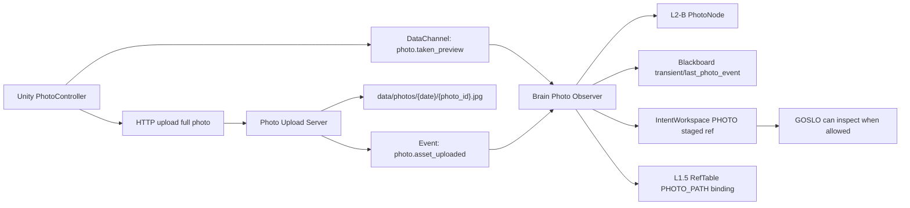

# Photo 记忆与 Awareness 真连接指南

## 0. 结论

照片是本项目的核心功能，不能只当作 HTTP 上传后的文件 URI。第一版真实连接需要同时满足三件事：

1. 高质量照片可靠落盘：`data/photos/{date}/{photo_id}.jpg`。
2. GOSLO 可以在需要时快速知道“用户拍照了”，并拿到可用的短期引用。
3. 大 payload 进入 IntentWorkspace 或磁盘引用，L2-B / Blackboard 只保存轻量语义和状态。

当前代码已经完成“高质量 HTTP 落盘 + L2-B PhotoNode + IntentWorkspace PHOTO staged ref + L1.5 RefTable photo path binding”的基础闭环。2026-05-10 已补齐 **AwarenessPolicy v1**：拍照 preview 到达时可以按策略决定是否通知 GOSLO、是否 stage 短期 preview ref、是否允许后续 turn 轻反应。第一版仍固定禁止 interrupt。

旧文档 `docs/sprint_archive/sprint4/audit_photo_awareness_memory_pipeline_20260429.md` 是 draft，不是当前事实源。本指南吸收其中有效需求，并按 IntentWorkspace 升级后的架构重新划边界。

## 1. 相机模式 vs Awareness

### 相机模式

相机模式是 UI / capture / video tier 层的能力，包含拍照入口、视频档位、未来镜头、曝光、焦距、相册等专业相机功能。它回答的是：

- 当前是否允许拍照？
- 画质和帧率是什么？
- 使用主视频流、补充通道还是 HTTP 高质量上传？
- UI 如何显示拍照、相册、镜头控制？

### Awareness

Awareness 是 GOSLO 是否知道这次拍照、怎么知道、是否说话或打断的策略。它回答的是：

- 拍照后是否通知 GOSLO？
- GOSLO 是否能立即看到 preview？
- 当前对话是否允许插话？
- 只静默记录，还是生成短反应？
- 用户是否打开了 “GOSLO Awareness” 开关？

这两个概念相关，但不能合并。相机模式可以提高画质或切换 capture 管线；Awareness 只决定 GOSLO 的认知和对话行为。

## 2. 当前业务流程

1. Unity 拍照后先发 `photo.taken_preview` DataChannel 事件，携带 `photo_id`、低质量 preview、context 和时间。
2. Brain Observer 收到 preview，创建或更新 L2-B `PHOTO` 节点，并把 `transient/last_photo_event` 写入 Blackboard。
3. Unity 同步或异步用 HTTP 上传高质量照片到 Brain。
4. Brain upload server 将照片保存到 `data/photos/{date}/{photo_id}.jpg`。
5. upload server 发布 `photo.asset_uploaded`，包含 `asset_ref`、`asset_path` 和字节数。
6. Brain Observer 更新已有 PhotoNode 的 `reference_image_path`。
7. Brain Observer 将照片作为 `StagedRefKind.PHOTO` stage 到 IntentWorkspace。
8. Brain Observer 在 L1.5 RefTable 绑定 `RefKind.PHOTO_PATH`，把 L2-B PhotoNode 与真实磁盘路径、IntentWorkspace ref 关联起来。

## 3. 数据流

## 4. 写边界

### L2-B

L2-B 保存 PhotoNode：`photo_id`、时间、capture source、reference image path、少量语义摘要和必要 metadata。L2-B 不保存高质量图片字节，也不把照片自动当成场景事实写 Graphiti。

### IntentWorkspace

IntentWorkspace 是照片核心链路的一部分。它用于保存当前认知任务内的大 payload 引用或短期可读资源：

- 高质量照片的 staged ref。
- 未来可选的 preview cache ref。
- GOSLO 需要立刻比较、描述、标注、写入 Obsidian 或加入日程附件时的临时工作对象。

IntentWorkspace 不等于 2DWorkspace。2DWorkspace 可以显示照片块、缩略图和 ref id，但不拥有原图 payload，也不直接改 L2-B。

### L1.5 RefTable

RefTable 保存 PhotoNode 到真实磁盘路径、IntentWorkspace staged ref、未来 Obsidian ref 或 Episode ref 的绑定。它是跨模块引用的轻量事实源。

### Blackboard

Blackboard 只保存轻量状态：

- 最近拍照事件。
- 最近上传结果。
- Awareness 开关状态。
- 当前是否有待 GOSLO 处理的 photo notice。
- 错误摘要和连接健康。

Blackboard 不是图片缓存，也不保存高质量图片。

### GOSLO / Nanobot

GOSLO 只能通过 AwarenessPolicy、IntentWorkspace ref 和 L2-B/RefTable 读取照片上下文。Nanobot 默认不参与照片链路，除非未来要把照片写入 Google、Obsidian 或外部服务。

## 5. AwarenessPolicy v1

旧 draft 提出五态：`UNAWARE_RECORDED`、`AWARE_SILENT`、`AWARE_REACT`、`AWARE_INTERRUPT`、`STARTLED`。第一版已收敛为三态，先保证稳定性：

| 状态 | 第一版语义 |
|:--|:--|
| `UNAWARE_RECORDED` | 只落盘和入记忆，不通知 GOSLO，不影响当前对话 |
| `AWARE_SILENT` | 通知 GOSLO 的内部状态和 IntentWorkspace ref，但不说话、不打断 |
| `AWARE_REACT` | 允许 GOSLO 在合适的 turn 后短反应，不抢当前语音 |

`AWARE_INTERRUPT` 和 `STARTLED` 建议推迟到语音生命周期、LiveKit 连接稳定、用户体验测试后再打开。拍照不应默认打断当前对话。

### Awareness 开关

已增加后端拥有的开关，不让 UI 直接写 Blackboard：

| 字段 | 建议 |
|:--|:--|
| `session/photo_awareness_enabled` | 用户级或 session 级开关 |
| `session/photo_awareness_policy` | 当前策略：`UNAWARE_RECORDED` / `AWARE_SILENT` / `AWARE_REACT` |
| `session/photo_awareness_preview_ttl_seconds` | preview ref TTL，第一版限制在 60-1800 秒 |
| `session/photo_awareness_allows_interrupt` | 第一版固定 false |
| `transient/photo_awareness_notice` | 最近一次觉知决策和 preview ref id |

菜单画布的 “GOSLO Awareness” 块可以绑定 `AppFirstVersionFacade.set_photo_awareness(...)`。它不应直接写 L2-B，也不应直接改 IntentWorkspace payload。

## 6. 快速内存策略

高质量 HTTP 上传可靠但不一定足够快。为了让 GOSLO 及时理解拍照，应补齐 preview 级短期内存：

1. `photo.taken_preview` 到达时创建 preview staged ref，TTL 可设为 5-30 分钟。
2. preview ref 与 PhotoNode 绑定，后续高质量 `asset_path` 到达后升级绑定。
3. 如果 AwarenessPolicy 是 `AWARE_SILENT` 或 `AWARE_REACT`，GOSLO 可以拿 preview ref 做即时理解。
4. 高质量照片上传失败时，PhotoNode 仍保留 preview 状态和错误摘要。
5. preview 不应长期进 Graphiti；长期归档走 PhotoNode + asset path + 用户确认。

当前代码已经有 preview event、高质量 asset path、短期 IntentWorkspace preview ref。preview ref 只用于 GOSLO 即时觉知，不应替代高质量照片落盘，也不应自动进入 Graphiti。

## 7. 已知问题

1. `AWARE_REACT` 只允许后续 turn 轻反应，尚未接入完整对话调度预算。
2. `AWARE_INTERRUPT` / `STARTLED` 仍不进入第一版，等待 LiveKit 语音生命周期、用户体验和隐私测试后再议。
3. 如果 `photo.asset_uploaded` 到达时 preview 丢失，当前逻辑可能只能记录 asset 事件，不能完整恢复 PhotoNode。这是旧 BUG-U4 的新版本。
4. 没有 `photo_preview_caption` 或快速视觉摘要，GOSLO 不一定能以低 token 理解照片。
5. Graphiti 归档策略未最终决定。当前原则仍是默认不把照片当场景事实写 Graphiti。
6. HTTP upload 的认证、大小限制、移动端失败重试和隐私策略需要 App 第一版统一测试。

## 8. 状态监控点

| 监控点 | 目的 |
|:--|:--|
| preview received count | 判断 DataChannel 预览是否稳定 |
| asset upload success/failure | 判断 HTTP 高质量落盘是否稳定 |
| orphan asset count | 发现 asset 到达但 PhotoNode 缺失 |
| IntentWorkspace photo staged count | 判断照片是否进入认知工作区 |
| RefTable PHOTO_PATH binding count | 判断 L2-B 到磁盘路径是否可追踪 |
| Awareness policy decision count | 未来判断 GOSLO 是否被通知 |
| `AWARE_REACT` count | 控制 GOSLO 是否过度说话 |
| Blackboard `last_photo_event` age | 控制 UI/控制台状态显示 |

## 9. 第一版验收

- 拍照 preview 能创建 PhotoNode 和 Blackboard 状态。
- 高质量 HTTP 上传能落盘到 `data/photos/{date}/{photo_id}.jpg`。
- asset 到达后能更新 PhotoNode `reference_image_path`。
- asset 到达后能 stage 到 IntentWorkspace，并在 RefTable 绑定 `PHOTO_PATH`。
- Awareness 开关存在，默认不打断当前对话。
- `AWARE_SILENT` 能让 GOSLO 内部知道照片 ref，但不主动说话。
- `AWARE_SILENT` / `AWARE_REACT` 能 stage 短期 preview ref，并写入 `transient/photo_awareness_notice`。
- 菜单画布只展示相机模式、Awareness 状态和照片 ref，不持有图片 payload。

## 10. 2026-05-15 Time-Aligned Evidence Addendum

Source chat: `web-console`
Writer: Codex
Approved by: user
Origin: `time_aligned_evidence_interface_20260515.md`

Photo Awareness now shares the Time-Aligned Evidence boundary:

1. Photo bytes still travel through HTTP/storage, not ECP/RPC/DataChannel.
2. Photo upload metadata may include a `timebase` stamp. If missing, backend
   code may fall back to envelope time, but must mark the stamp as estimated.
3. Full photo assets and uploaded snapshots are represented in the evidence
   ledger as `image_asset` rows, then linked to PhotoNode / RefTable /
   IntentWorkspace by existing business flow.
4. `transient/photo_awareness_notice` is consumed by `ContextInjector` as C3
   chat-context only when policy allows it. `UNAWARE_RECORDED` stays passive,
   and pending preview refs are not pushed as strong context.
5. `AWARE_REACT` is still no-interrupt C3 in V1. It is not C4 speech yet.
6. BBox, Focus, and magnifier attention should attach evidence refs or staged
   visual hints. They should not become special PhotoNode or L2-B NodeKind
   subclasses.

See:

- `time_aligned_evidence_interface_20260515.md`
- `goslo_trigger_awareness_taxonomy_20260515.md`
- `codex_workspace/design_workspace/backend_interface_map/web_console/observability_runtime_business_flow_20260513.md`
