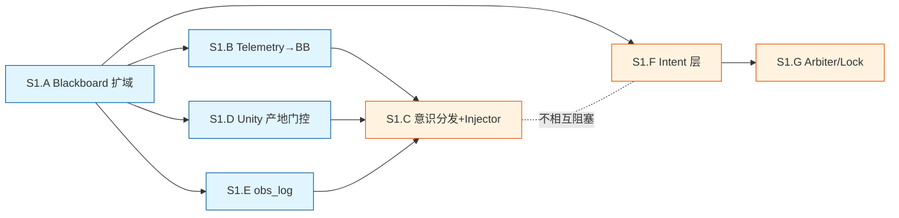

# AR 特性 P2.5 实施计划

> 创建: 2026-04-21
> 前置文档: `ar_feature_vision.md` (愿景 + 架构) / `ar_app_flow_ui_design.md` (当前 App Flow + UI + 功能入口) / `ar_app_plan.md` (早期需求问卷追溯) / `ar_camera_interaction_survey.md` (玩法问卷) / `audit_identify_object_no_screenshot_20260420.md` (现有坑)
> 原则: **简单 / 模块化 / 每 Sprint 独立可验收 / 不做不必要的"完美"**

---

## 零、总览 — 五个 Sprint

```
Sprint 0 ─ 基建修缮  ──→  依赖: 无                 (1-2 天)
   │                      交付: requirements/配置/软约定落地
   ▼
Sprint 1 ─ 自知底座  ──→  依赖: Sprint 0           (3-4 天)
   │                      交付: Blackboard 扩域 + telemetry→BB + RPC ack 回灌 + visual_state 四级
   ▼
Sprint 2 ─ 两轴模式  ──→  依赖: Sprint 1           (3-4 天)
   │                      交付: VideoTier / DsgMode 枚举 + Ingest 过滤器 + Supervisor + 降档话术
   ▼
Sprint 3 ─ AR 桌面 MVP ─→ 依赖: Sprint 0           (5-7 天, 可与 S1/S2 并行)
   │                      交付: 平面检测 + 点击放置 + 启动界面 + Token mint + 4 个动画
   ▼
Sprint 4 ─ 玩法糖衣  ──→  依赖: Sprint 1 + 3       (4-5 天)
                          交付: 相机模式 + captureSnapshot + identify_object 升级 + 便签 UI + 食指 perching
```

**每个 Sprint 目标**: 跑通测试用例就算验收。**不追求完美**, 不做 P3 的事。

---

## Sprint 0 — 基建修缮 (1-2 天)

> 目的: 把现在已知会踩的坑一次性补上, 避免后面每个 Sprint 都要停下来修。

### S0 任务清单

| # | 任务 | 位置 | 验收 |
|:--|:-----|:-----|:-----|
| S0.1 | 把 `livekit-agents[images]` 钉进 requirements | `pyproject.toml` | 新机器 `pip install -e .` 后 Gemini 能看图 |
| S0.2 | `.env.example` 补 `PARROT_AR_SCENE` 默认值 (`DESKTOP_WEBCAM`) 和视频门控阈值占位 | `src/parrot/shared/config.py` + `.env.example` | Brain 启动日志打印当前 Scene |
| S0.3 | `commit_guidelines.md` 硬记: "Editor Play/Stop 间隔 ≥30s" | `.cursor/memory/commit_guidelines.md` | 文档落地 |
| S0.4 | Castle docker volume 加 `data/snapshots/` `data/photos/` 两个持久化目录 | `infra/docker-compose.yml` | 重启容器后目录仍在 |
| S0.5 | `.gitignore` 补 `data/snapshots/` `data/photos/` | 仓库根 | 本地测试文件不进 git |
| S0.6 | Unity: `ARVideoPublisher` 已加到 `Dev.unity`, 但确认没遗漏 (ReadRecent Test p2 后已改, 确认) | `unity/ParrotDev/Assets/Scenes/Dev.unity` | Play 时日志看到"video track published" |

### S0 不做的事
- 不动 Python 代码逻辑
- 不改 Unity 脚本 (只确认)
- 不新建模块

### S0 验收用例
```
1. rm -rf .venv && pip install -e . → 无 ImportError (S0.1)
2. python -m parrot.brain.agent dev → 启动日志出现 "scene=DESKTOP_WEBCAM" (S0.2)
3. docker-compose down && docker-compose up → Castle snapshots/ photos/ 仍然存在 (S0.4)
```

---

## Sprint 1 — 自知底座 (Blackboard 扩域 + 状态回灌) (3-4 天)

> 目的: 让 GOSLO 能**实时感知自己的身体/视觉/后台状态**。这是所有玩法的底座。
> 对应 `ar_feature_vision.md` §3.5 + 决策默认 P1/P2 + V1-V3。

### S1 任务清单 (每项 ≤ 0.5 天)

#### S1.A — Blackboard 扩域 (复用现有 py-trees)

| # | 任务 | 位置 | 依赖 |
|:--|:-----|:-----|:-----|
| S1.A1 | 新增 namespace `vision` + 4 个 key (`state` / `state_reason` / `state_since` / `ar_tracking`) | `src/parrot/scheduler/blackboard.py` (扩现有函数, 不新建文件) | — |
| S1.A2 | 新增 namespace `body` + 3 个 key (`state` / `head_state` / `cognitive_state`) | 同上 | — |
| S1.A3 | 新增 namespace `session` + 3 个 key (`scene` / `last_rpc_ack` / `connected_since`) | 同上 | — |

**代码量**: 约 40 行纯新增, 不改现有逻辑。

#### S1.B — Telemetry → Blackboard

| # | 任务 | 位置 |
|:--|:-----|:-----|
| S1.B1 | `telemetry_receiver.py` 收到 body/head/cognitive 事件 → 写 `body/*` key | `src/parrot/brain/telemetry_receiver.py` 扩 |
| S1.B2 | `_rpc_bridge.py` RPC 调用失败回写 `session/last_rpc_ack` (对应 P1 决策) | `src/parrot/brain/tools/_rpc_bridge.py` 扩 |

#### S1.C — 三层意识分发 (潜意识 / 行动 / 通报) + Injector

> 对齐 `ar_feature_vision.md` §3.5 新增的"三层意识分发模型"。
> 关键设计: **Injector 不是简单"变化即推送"**, 而是先查事件的"意识层分配表" (§3.5), 决定层①/②/③。

| # | 任务 | 位置 |
|:--|:-----|:-----|
| S1.C1 | 新增 `brain/vision/state.py` — `VisualState` 枚举 + 融合三层信号 → 写 `vision/state` | 新文件 |
| S1.C2 | 新增 `brain/consciousness/dispatcher.py` — **事件 → 意识层决策器** (借 agentguard 风格的失败分类 + §3.5 分配表) | 新文件 |
| S1.C3 | 新增 `brain/consciousness/soul_constraints.py` — "允许/禁止" 约束表 (按 visual_state 分档, 学 Gat 3T) + Blackboard key `global/soul_constraints` | 新文件 |
| S1.C4 | `context_injector.py` 扩: 订阅 Blackboard 变化 → 查 dispatcher → **仅层③送 system message** | `src/parrot/brain/context_injector.py` 扩 |
| S1.C5 | `context_injector.py` 扩: turn 开头附 3 字段摘要 (P2 决策) + 当前激活的 soul_constraints 表 | 同上 |
| S1.C6 | `soul.py` 改造: 不再硬写 if-else 话术, 改成**读 soul_constraints 表**, 由 Gemini 生成具体措辞 (V2 决策升级) | `src/parrot/brain/soul.py` |
| S1.C7 | `soul.py` failure 时拉 Graphiti 最近记忆 (V3 决策) | 同上, 复用 `inject_memory` |

#### S1.D — Unity 产地门控 (简版)

| # | 任务 | 位置 |
|:--|:-----|:-----|
| S1.D1 | `VideoStateReporter.cs` — ARTrackingState / TrackMuted 变化时 RPC `onVideoDegraded(reason, ts)` | 新建 |
| S1.D2 | `ARVideoPublisher.cs` 接入 StateReporter | 扩 |
| S1.D3 | Brain 侧 RPC handler 收 `onVideoDegraded` → 写 `vision/state_reason` | `_rpc_bridge.py` 扩 |

#### S1.E — Observation Log (VIGIL 风格外挂反思层)

> 不阻塞主对话。所有事件并行写一份到 Redis Stream, 给 P3 做 soft-failure 诊断和技能蒸馏留料。

| # | 任务 | 位置 |
|:--|:-----|:-----|
| S1.E1 | 新增 Redis Stream key `parrot:obs_log`, schema: `{ts, kind, layer(①②③), payload}` | `shared/constants.py` 加常量 |
| S1.E2 | `brain/consciousness/obs_log.py` — 写入 helper, dispatcher 同时往这里写 | 新文件 |
| S1.E3 | 简单的 `scripts/tail_obs_log.py` 调试工具 | 新文件 |

**S1.E 不做**: EmoBank (VIGIL 的 affective layer) / RBT 诊断 / 反射层自动 remediation — 都是 P3 给技能蒸馏时再做。

#### 🆕 S1.F — E2 Intent 层补全 (requirements.md E2 PLANNED → 落地)

> **架构主源**: `ar_feature_vision.md §3.5 三合一统一视图` (2026-04-22). 本节只写任务, 不复述架构。
> **缘起**: `requirements.md E2` 早备了"Reflex / Intent / Task"三级调度, `router.py` 只实现了 Reflex + Task (DispatchToNanobot + BrainDirect), **Intent 中间层缺失**。本 Sprint 顺手补上, 和 S1.C "意识分发 dispatcher" 是**调度层双胞胎**: dispatcher 管"哪层意识", router 管"哪层调度"。
> 对齐 CTHA (ICLR 2026) + GR00T N1.6 双系统架构。

| # | 任务 | 位置 |
|:--|:-----|:-----|
| S1.F1 | 新增 `HandleIntent` 节点: 处理"s-min 时间尺度"的决策 (切 mode / 切 video_tier / 更新 soul_constraints), **不派 Nanobot, 不调 tool, 只改 BB 状态** | `src/parrot/scheduler/nodes.py` |
| S1.F2 | `router.py` Selector 从 3 叶 → 4 叶: `HandleReflex → HandleIntent → DispatchToNanobot → HandleBrainDirect` | `src/parrot/scheduler/router.py` |
| S1.F3 | 事件 schema 扩: 在 `priority` 字段外加 `layer: "reflex"\|"intent"\|"task"`, 默认 `task` | `shared/parrot_actions.py` |
| S1.F4 | `context_injector` 只订阅 layer=task 的 BB 变化 (与 S1.C4 对齐, 防 Gemini 被潜意识/中层事件淹) | `context_injector.py` |

#### 🆕 S1.G — Arbiter/ResourceLock 最小版 (requirements.md E5 PLANNED → 落地最简)

> **缘起**: CTHA 的 Arbiter Resolution Constraints, 对应 `requirements.md E5 ResourceLockManager`. body 通道 (fly_to / animate / head_look) 不能同时被三层抢。先做最简版, 完整抢占协议留 P3。

| # | 任务 | 位置 |
|:--|:-----|:-----|
| S1.G1 | `scheduler/locks.py` — `BodyChannelLock` (互斥锁 + 当前持有层号), 高层请求时记录 "preempt_request", **不打断正在执行的低层** (Brooks Subsumption: 低层自治) | 新文件 |
| S1.G2 | `HandleReflex` / `HandleIntent` / `DispatchToNanobot` 执行 body action 前 `lock.try_acquire(layer)` | 改 3 个 node |
| S1.G3 | 日志: 冲突时写 obs_log `{kind: "arbiter_conflict", winner, loser}` | 复用 S1.E |

**S1.F/G 不做**: 完整的抢占协议 (高层真的打断低层) / 超时释放 / 死锁检测 — P3。

### S1 不做的事
- ❌ 不做 Unity LiveKit 路上层门控 (G1 决策: P3)
- ❌ 不做 Python 消费端模糊/锐度过滤 (Sprint 2 做)
- ❌ 不做 AR Session Lifecycle 完整恢复 (Sprint 3 做)
- ❌ 不做 EmoBank / 情感反思 (S1.E 只铺日志, 反思 P3)

### S1 验收用例
```
1. Editor Play → 遮住摄像头 → Brain 终端日志出现
   "[video] state=degraded reason=low_brightness"
   Gemini 不再说"你桌上有个..."
   
2. Editor Play → Play/Stop/Play → 30s 内第二次 Play:
   system message [video] state=active, reason=resumed
   Gemini 自然接话 ("又见面啦")

3. Brain 发 fly_to(远点) → Unity 拒绝 (超出场景边界) → Blackboard
   session/last_rpc_ack = {method: "fly_to", status: "rejected", reason: "out_of_bounds"}
   Gemini 收到 [action] fly_to rejected: out_of_bounds

4. 🆕 三级调度路由验证 (S1.F):
   - event {priority: "reflex", layer: "reflex"}  → reflex_direct
   - event {layer: "intent", action: "switch_video_tier"} → intent_direct (只改 BB, 不走 Nanobot, 不通报 Gemini)
   - event {type: "research"} → nanobot (layer=task 默认)
   - context_injector 日志显示: intent 层事件 **不推 system message**, task 层才推

5. 🆕 Arbiter 仲裁验证 (S1.G):
   - 同时触发 reflex fly_to (张手) 和 task fly_to (Gemini 主动飞) → reflex 优先
   - task 被拒时写 obs_log {arbiter_conflict, winner:reflex, loser:task}
```

### S1 任务依赖图 (执行顺序参考)



**关键路径**: `S1.A` 是所有工作的前置。完成 A 后, **B/D/E 可并行**, 全部就绪后再做 C。F/G 与 C 逻辑解耦, 可并行线开发, 最后通过 S1 验收用例 4-5 一起验收。

---

## Sprint 2 — 两轴模式 (VideoTier × DsgMode) (3-4 天)

> 目的: A10 关闭时 DSG 仍能部分工作, 视频流能按需降档省流量。
> 对应 `ar_feature_vision.md` §3.6 + 决策默认 M1-M4。

### S2 任务清单

#### S2.A — 枚举 + 合法组合校验

| # | 任务 | 位置 |
|:--|:-----|:-----|
| S2.A1 | `shared/tiers.py` 新增 `VideoTier` / `DsgMode` 两枚举 | 新文件 |
| S2.A2 | `shared/tiers.py` 新增 `ALLOWED_COMBOS` 常量 (5 种合法组合) 和 `validate(video_tier, dsg_mode)` | 同文件 |
| S2.A3 | 两枚举加进 Blackboard `session/video_tier` `session/dsg_mode` | `blackboard.py` |

#### S2.B — DSG Ingest 过滤器层

| # | 任务 | 位置 |
|:--|:-----|:-----|
| S2.B1 | 新建 `dsg/ingest/` 子包 | 新目录 |
| S2.B2 | `text_source_filter.py` — 名词短语 + 位置介词抽取 (30s 内复述升级 TENTATIVE→CONFIRMED, 60s 无复述降 UNCERTAIN) | 新文件 |
| S2.B3 | `tool_result_filter.py` — identify_object 命中 → 直接 CONFIRMED | 新文件 |
| S2.B4 | `user_tag_filter.py` — 读 Obsidian 双链 obsidian_uuid, 永不 GHOST | 新文件 |
| S2.B5 | `cv_track_filter.py` — 占位 (A10 P3+ 才填) | 新文件, 空实现 |
| S2.B6 | `gemini_transcript_extractor.py` — 订阅 Gemini 转写 → 喂 text_source_filter | 新文件 |

#### S2.C — 模式控制器 + Supervisor

| # | 任务 | 位置 |
|:--|:-----|:-----|
| S2.C1 | `dsg/mode_controller.py` — 根据 `session/dsg_mode` 切换 Ingest 过滤器启用集合 | 新文件 |
| S2.C2 | `brain/perception_supervisor.py` — A10 健康 ping (30s 失败降档, 60s 恢复升档, 升档等 turn 结束) | 新文件 |
| S2.C3 | `set_video_tier` RPC — Brain 告诉 Unity 调推流参数 | `_rpc_bridge.py` 扩 |
| S2.C4 | Unity `ARVideoPublisher.cs` 扩: 动态调整码率/fps/分辨率 (不重建 Track) | `ARVideoPublisher.cs` 扩 |
| S2.C5 | 降档时 Injector 注入 system message ("我现在只靠你的描述记事") | `context_injector.py` 扩 |

### S2 不做的事
- ❌ A10 真机接入 (P3)
- ❌ 笔记本 Sentinel (P4 备选)
- ❌ 自定义模式 (M4 决策: 不做)
- ❌ VIDEO_BURST 模式 (P3, 等摄影玩法需要时)

### S2 验收用例
```
1. A10 未开 (默认): 启动后 session/video_tier=VIDEO_GEMINI_ONLY, session/dsg_mode=DSG_GEMINI_VISION
   Unity 推 500kbps 低码率, Python CV 管线不启动

2. Gemini 说 "你桌上的紫色杯子真好看" → 30s 后再说一次
   L2-B 节点 label="紫色杯子" confirmation=CONFIRMED source=gemini_oral

3. identify_object tool 命中 Mug → 直接 CONFIRMED, 覆盖 gemini_oral

4. 手动 set_video_tier(VIDEO_OFF) → Unity 停推 → Gemini 收到 [video] state=paused
   Gemini 不再提画面
```

---

## Sprint 3 — AR 桌面 MVP (5-7 天, 可与 S1/S2 并行)

> 目的: 手机上能把 GOSLO 放在桌面, 对话, 简单动画。
> 对应 ar_app_plan 答案 A1(b) / A2 / B10 / D14-15 / E17-19 / 决策默认 S1-S2 / §八 gap 回填 8.1-8.5。

### S3 任务清单

#### S3.A — AR Foundation 桌面场景 (§8.1)

| # | 任务 | 位置 |
|:--|:-----|:-----|
| S3.A1 | 新建 `unity/ParrotAR` 项目 (当前只有 `ParrotDev`) 或在 ParrotDev 加 AR 平台分支 | `unity/` |
| S3.A2 | 安装 `com.unity.xr.arfoundation` + `com.unity.xr.arcore` 包 | Package Manager |
| S3.A3 | `ARPlaneManager` 配置 `PlaneDetectionMode.Horizontal`, 最小面积 0.3×0.3m | AR Session Origin |
| S3.A4 | `TapToPlace.cs` — ARRaycast + 点击放置 + 创建 ARAnchor | 新 C# |
| S3.A5 | 桌面安全区校验 (放置点 + flyTo 目标的 bounds check) | `ParrotController.cs` 扩 |

#### S3.B — Scene 管理 + 启动界面

| # | 任务 | 位置 |
|:--|:-----|:-----|
| S3.B1 | `SceneProfileManager.cs` — 读 config → 初始化 `DESKTOP_WEBCAM` 或 `AR_HANDHELD` → RPC `setScene` 告诉 Brain | 新 C# |
| S3.B2 | Editor Webcam 路径作为一等公民, 无 AR 平面时虚拟 y=0 (§8.2) | 同上 |
| S3.B3 | 启动界面 (Unity Scene `Launcher.unity`): 连接按钮 + 状态显示 + 权限申请 | 新 scene |
| S3.B4 | 权限拒绝 → 退回 Launcher + 提示文字 (对齐 B12 答案) | Launcher script |

#### S3.C — LiveKit Token Mint (§8.3)

| # | 任务 | 位置 |
|:--|:-----|:-----|
| S3.C1 | Castle 上新建 `src/parrot/castle/token_mint.py` — FastAPI `/mint` 端点 | 新文件 |
| S3.C2 | `infra/docker-compose.yml` 加一个 token-mint service (复用 brain 镜像) | `infra/` |
| S3.C3 | Unity `TokenService.cs` — POST 请求 → 存 PlayerPrefs 24h | 新 C# |
| S3.C4 | fallback: 请求失败回退读 StreamingAssets/parrotdev.json | 同上 |

#### S3.D — 动画 + 模型 (§8.4)

| # | 任务 | 位置 |
|:--|:-----|:-----|
| S3.D1 | 把 `GOSLO.glb` 换下当前方块占位 | `ParrotController.cs` 扩 |
| S3.D2 | `AnimationDriver.cs` — 程序化 idle / head_bob / fly / perch 四个 | 新 C# |
| S3.D3 | body_state 变化 → AnimationDriver 切换动画 (复用 telemetry 通道) | 同上 |
| S3.D4 | 简单打招呼 (D15): Unity 启动后 500ms 触发 Gemini generate_reply("早上好"分时段) | `RoomManager.cs` 扩 |

### S3 不做的事
- ❌ iOS 支持 (B8: P3+)
- ❌ 2D 回退模式 (B7: 不做)
- ❌ 墙面/地面平面 (A2: 只做桌面)
- ❌ Mixamo/骨骼动画 (§8.4: 不做)
- ❌ dance / thinking 动画 (P3)

### S3 验收用例
```
1. IQOO NEO9 上运行 → 启动界面 → 授权摄像头/麦 → 点连接 → 进 AR
2. 摄像头对桌面 2 秒 → 看到半透明平面网格
3. 点击平面 → GOSLO 从上方飞入, 落在手指处
4. GOSLO 说 "早上好 (根据当前时间)"
5. 语音"过来一点" → GOSLO flyTo 手指附近
6. 切后台 10s 再回来 → GOSLO 仍在原位, Gemini 继续对话
```

---

## Sprint 4 — 玩法糖衣 (4-5 天)

> 目的: 相机模式 + 识物 + 便签。Sprint 1-3 的收获集中变现。
> 对应 `ar_camera_interaction_survey` 所有答案 + identify_object audit 升级。

### S4 任务清单

#### S4.A — captureSnapshot 基建 (对齐 audit B1-B3)

| # | 任务 | 位置 |
|:--|:-----|:-----|
| S4.A1 | Unity `SnapshotService.cs` — AsyncGPUReadback + EncodeToJPG + base64 | 新 C# |
| S4.A2 | RPC `captureSnapshot(max_kb, resolution)` 注册 | `ParrotRpcHandler.cs` 扩 |
| S4.A3 | Python `brain/vision/snapshot.py::capture_current_frame()` 封装 | 新文件 |
| S4.A4 | 落盘约定 `data/snapshots/objects/{uuid}/reference.jpg` `data/photos/{date}/{ts}.jpg` | config |
| S4.A5 | `SemanticNode` 扩字段 `reference_image_path: str = ""` + `last_sighting_path: str = ""` (audit B4) | `dsg/l2b_types.py` |
| S4.A6 | L2 "新物体" 通用前置: `confirm_new` 落盘+自描述+写 Graphiti+L2-B (audit L2-2) | `identify_object.py` + `visual_match.py::describe_image` |

#### S4.B — identify_object 三段升级 (audit §5.2-5.4)

| # | 任务 | 位置 |
|:--|:-----|:-----|
| S4.B1 | L0 `_match_quick` — 只搜 L2-B + 最近物体, 候选 ≤3 | `identify_object.py` 扩 |
| S4.B2 | L1 `match_deep` — Graphiti 扩搜 + 批量 VLM 多图比对 | 同上 + `visual_match.py` 新 |
| S4.B3 | 改造 `identify_object` 不再"火即忘", 改为同步等 ≤4s (audit §3.4 修正, 选项 α 优先) | 同上 |
| S4.B4 | Soul prompt 加 "unknown 时自主决策"指引 (audit L2-α3 选项 α 默认) | `soul.py` |
| S4.B5 | 新 tool `web_search` (Gemini grounding / SerpAPI), 给选项 α 做后备 (audit L2-α1) | `brain/tools/web_search.py` 新 |

#### S4.C — 相机模式 / 补充通道 (对齐 survey A1 / B3 / C4)

> **通道语义** (务必和 identify_object 主通道区分):
> - **主通道** (已跑, Sprint 1-3 都用这个): `ARCameraBackground._rt → "ar-camera" track` — 纯摄像头画面, Gemini Live 看的就是这路, **identify_object L0/L1/L2 不抓二次帧**, 直接向 Gemini 提问即可。
> - **补充通道** (本段新建): `Unity 渲染后的完整帧 (相机 + 鹦鹉 + UI) → captureSnapshot RPC → base64 → Python` — 只在**用户触发相机模式 / 主动拍照**时按需拉一帧。
> - 不要混用 — 识物走主通道够了, 相册/回忆杀才走补充通道。

| # | 任务 | 位置 |
|:--|:-----|:-----|
| S4.C1 | Unity `CameraModeUI.cs` — 手动触发纯净版拍照 | 新 C# |
| S4.C2 | 语音指令通道: Gemini 说"拍张照"触发 (P3 从 Obsidian 加载自定义指令) | `set_mode` tool 扩 |
| S4.C3 | 分流: 用户层 (相册+ECS+Obsidian 链接, 走美化合成后的渲染帧) / 认知层 (DSG PhotoEvent 节点, 可选原图) | `SnapshotService.cs` + `dsg/ingest/photo_filter.py` 新 |
| S4.C4 | `PhotoEvent` 节点类型 (情绪为主 + 时间/坐标/物品关联) | `dsg/l2b_types.py` 扩 |
| S4.C5 | 登记"补充通道"在 `ar_feature_vision §3.4` (相机模式) 正式落地 — 写一段说明 identify_object 为何仍走主通道 | `ar_feature_vision.md` §3.4 补注 |

#### S4.D — 便签 UI + 食指 perching

| # | 任务 | 位置 |
|:--|:-----|:-----|
| S4.D1 | UIToolkit 便签组件 (极简卡片, 右上抽屉) | 新 UXML/USS |
| S4.D2 | Scheduler → Brain 结果路径加"便签显示"RPC (猫娘女仆给主人传话) | `_rpc_bridge.py` 扩 + `ParrotRpcHandler.cs` 扩 |
| S4.D3 | XR Hands 食指 perching — 检测 index tip 手势, GOSLO 落到中段 | `PerchOnHand.cs` 扩 |

### S4 不做的事
- ❌ 空间锚点照片悬浮 (survey E6: P3+)
- ❌ 手势反射动作 (C9: P3)
- ❌ iOS / 墙面 AR (P3+)

### S4 验收用例
```
1. 对桌上杯子说"这是啥" → GOSLO "让我看看..." (1-2s) → "是上次展会的蓝色马克杯" (L0 命中)
2. 新物体 "那这个" → "我没见过" → captureSnapshot → save_new → 下次命中
3. 相机模式 UI 按钮 → 咔嚓 → 相册有图, ECS data/photos/ 有图, Graphiti 有 PhotoEvent 节点
4. 猫娘女仆发消息 → Unity 右上角弹便签 "主人,该喝水了"
5. 伸食指 → GOSLO 飞过来落在指节中段
```

---

## 十、Sprint 之外 — 明确不做 / 延期清单

| 项 | 状态 | 去向 |
|:--|:----|:----|
| A10 DSG Worker 真机接入 | P3 | 等笔记本 + Castle 都熟了再开第二阵地 |
| 笔记本 Sentinel | P4 备选 | 跨太平洋延迟太高, 不做 |
| ARCore iOS | P3+ | 等设备 |
| ARWorldMap 多人 Presence | P4 储备 | `lore/ideas.md` 登记过 |
| LiveKit 路上层门控 | P3 | 当前产地+消费端够 |
| Turn 快照摘要升级为可学习 | P4 | Voyager 式, 先做静态版 |
| 场景: 户外 / 多人 | P4 | `AR_WORLD_LOCKED` / `MULTIPLAYER_PRESENCE` 已登记 |

---

## 十一、验收 & 回溯

- **每个 Sprint 结束跑"验收用例"**, 失败就不进下个 Sprint
- **每个 Sprint 完成后更新** `active_context.md` 的"下一步"
- **verification 脚本** 放到 `Test/p{N}.{letter}/` 目录, 对齐现有 `Test/p2` 风格
- **不做事后补文档** — Sprint 内边做边记 (audit/skill 规则)

---

*本文档维护*: 每 Sprint 完成后在对应段落加 ✅ + 完成日期。遇到卡点可在当 Sprint 段落补 "⚠️ 卡点" 说明。
