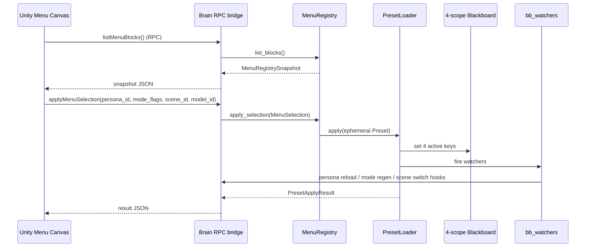

# Backend Interface Refinement — Menu / BB / IntentWorkspace / L2-B (2026-05-07)

> **Mission**: ratify the Brain-side public surface that the Unity frontend
> needs to wire menu canvas, HUD, and 4-block presets. No wire / cs_parity
> drift; no Phase 4 § 8 lock touched. Outputs of this round = code now in
> `src/parrot/`, plus this doc.

---

## §0 What landed in this build

| Layer | Module | Status |
|:--|:--|:--|
| Persona externalisation | `brain/personas/<id>.md` + `brain/persona_loader.py` + `brain/soul.py` shim | ✅ NEED-P2.5-A resolved |
| 4-block menu API | `brain/menu_registry.py` | ✅ NEED-P3-B / D / E (read + apply contract) |
| Preset loader | `brain/preset_loader.py` + `data/presets/default.json` | ✅ NEED-P3-C |
| Scene 2 baselines | `dsg/l1_5/scene_snapshot.py` (DESKTOP_WEBCAM + AR_HANDHELD) | ✅ NEED-P2.5-SCENE-2BASELINE |
| BehaviorMode ROLEPLAY | `shared/parrot_actions.py` BehaviorMode flag | ✅ NEED-P3-MODE-ROLEPLAY (flag only — Persona / Bucket / skin coupling deferred) |
| 4 active BB keys + watcher registry | `shared/bb_schema.py` + `brain/bb_watchers.py` | ✅ |
| IntentWorkspace upgrade | `brain/intent_workspace.py` + `brain/intent_workspace_backend.py` | ✅ Disk recovery + scope chain + pressure callbacks + role helpers |
| L2-B baseline algorithms | `dsg/l2b/clustering.py` + `dsg/l2b/attention/mechanism.py:IterativeSpreadingActivation` + `l2b_graph.connect()` cross-compartment tagging | ✅ Phase 4 baseline real algos |

Test deltas:
- 207 → 222 in {tests/test_brain, test_dsg, test_scheduler, test_shared}
- Phase 4 § 8 cs_parity 4/4 + L1 NodeKind / EdgeKind / L13 attention export guards: all green.

---

## §1 Menu Backend API (Phase 1)

### §1.1 Persona

```
parrot.brain.persona_loader.PersonaLoader
    list_personas() -> list[PersonaSummary]
    load(persona_id, mode, visual_state) -> PersonaInstructions | None
    render_visual_constraint(persona_id, state) -> str | None
    invalidate(persona_id=None)
```

- Files live at `src/parrot/brain/personas/<persona_id>.md` (markdown
  with YAML frontmatter + `## core` / `## mode.<flag>` / `## visual_state.<level>`
  sections).
- Custom paths via `$PARROT_PERSONA_DIRS` (os.pathsep-separated).
- Default persona: `goslo_parrot_default` mirrors the legacy `soul.py`
  text 1:1 (verified via `tests/test_brain/test_intent_workspace_lifecycle.py`
  baseline + manual smoke comparing `get_instructions()` byte-equivalent
  modulo whitespace).

How TODO:
- **Format = markdown not TOML.** Persona text is large free-form prompt;
  markdown sections are the smallest format that preserves it verbatim.
- **No PyYAML dep.** A 30-line `_parse_frontmatter` keeps the loader
  dependency-free.
- **Section regex anchored to known prefixes** (`core` / `mode.*` /
  `visual_state.*`). The body is free to use any other `##` heading.

### §1.2 4-block menu registry

```
parrot.brain.menu_registry.MenuRegistry
    list_blocks() -> MenuRegistrySnapshot
    apply_selection(MenuSelection) -> PresetApplyResult
    apply_preset_id(preset_id) -> PresetApplyResult
    validate_mode_flags(flags) -> (BehaviorMode, unknown_names)
```

`MenuRegistrySnapshot` exposes:
- `personas: tuple[PersonaSummary, ...]`
- `modes: tuple[ModeBlockSummary, ...]` (BASE / COMPANION / BUTLER /
  RESEARCHER / PLAYFUL / ROLEPLAY)
- `scenes: tuple[SceneBlockSummary, ...]` with `is_baseline=True` for
  DESKTOP / DESKTOP_WEBCAM / AR_HANDHELD
- `models: tuple[ModelBlockSummary, ...]` (single GOSLO_default until the
  Brain-side ModelManifestRegistry mirror lands)
- `active_*` reflectors and `available_preset_ids`.

How TODO:
- **4 separate registries with a thin aggregator** (Option A in plan).
  Persona / Mode / Scene / Model already exist as independent modules.
  A unified ABC would churn imports without buying anything Phase 4 needs.
- **`apply_selection` synthesises an ephemeral Preset** then routes through
  `PresetLoader.apply` so the BB single-writer contract holds.

### §1.3 PresetLoader

```
parrot.brain.preset_loader.PresetLoader
    list_presets() -> list[str]
    load(preset_id) -> Preset
    save(preset) -> Path
    apply(preset) -> PresetApplyResult
```

Preset JSON schema (`data/presets/<id>.json`):
```json
{
  "schema_version": 1,
  "preset_id": "default",
  "active_model_id": "GOSLO_default",
  "active_persona_id": "goslo_parrot_default",
  "active_mode": ["BASE", "COMPANION"],
  "active_scene_id": "ar_handheld",
  "metadata": { "user_label": "...", "theme_skin": "manor" }
}
```

- **Single writer = `brain.preset_loader`** for `global/active_*` keys.
- **Watcher fan-out**: after BB writes, `apply` calls
  `bb_watchers.fire_watcher(...)` for each changed key — same-process
  subscribers (mode_watcher, persona watcher) react immediately.
- Cross-process subscribers (Redis Pub/Sub) keep their own paths;
  `apply` does not duplicate them.

### §1.4 Frontend usage flow



Frontend never writes Blackboard directly; menu RPC contract stays narrow.

---

## §2 Blackboard 4-scope completion (Phase 2)

### §2.1 New BB keys

Added to `shared/bb_schema.BB_KEYS` (single writer = `brain.preset_loader`):

- `global/active_persona_id` (str, event_driven)
- `global/active_model_id` (str, event_driven)
- `global/active_scene_id` (str, event_driven)
- `global/active_mode` (list[str], event_driven)

Existing `global/behavior_mode` retained for legacy mode_watcher path. New
code reads `global/active_mode`.

### §2.2 Watcher registry

```
parrot.brain.bb_watchers
    register_watcher(name, bb_key, callback, fire_on_unchanged=False)
    fire_watcher(bb_key, new_value)
    snapshot_turn_start_keys() -> dict[str, Any]
    attach_standard_brain_watchers(on_persona_change, on_mode_change, ...)
```

How TODO:
- **Voyager twin-path injector** (ar_feature_vision § 3.6):
  - `TURN_START_SNAPSHOT_KEYS` — global active_*, attention_thresholds,
    user_profile, session/scene, session/visual_state, tick/body_state.
    `cognitive_state` deliberately absent (LLM is that state).
  - `EVENT_DRIVEN_FAILURE_KEYS` — `tick/last_rpc_ack`, `tick/last_ecp_ack`
    inject only on `ok==False` (BrainBody-LLM "successes don't talk").
- **Synchronous callbacks** — heavy work hops `asyncio.create_task` inside
  the callback; BB write path stays unblocked.
- **Threadsafe registry** — `RLock`-backed because preset_loader.apply
  fires on the asyncio main loop while mode_watcher fires from its own
  Pub/Sub task.

### §2.3 Plan namespace exception (unchanged)

`plan/{plan_id}/*` stays a documented exception: keys allocated dynamically
when a Plan is drafted; not declared in `BB_KEYS`. `PlanBlackboardClient`
is the writer. Documented in `scheduler/blackboard.py` docstring + this §.

---

## §3 IntentWorkspace upgrade (Phase 3)

### §3.1 New / changed APIs

```
IntentWorkspace.stage(req, *, owner_id="")
IntentWorkspace.evict_owner(owner_id) -> int
IntentWorkspace.scope(owner_id) -> ScopedIntentWorkspace
IntentWorkspace.recover_from_disk() -> int
IntentWorkspace.register_pressure_callback(cb)
IntentWorkspace.unregister_pressure_callback(cb) -> bool
IntentWorkspace.list_active(..., plan_id=None, role=None,
                            origin_prefix=None, owner_id=None,
                            include_parent=True)
IntentWorkspace.list_by_role(role) -> list[RefHandle]
IntentWorkspace.get_owner(ref_id) -> str
```

### §3.2 ScopedIntentWorkspace (multi-agent collaboration)

```
ScopedIntentWorkspace
    stage(req)             # owns refs under owner_id
    fetch(ref_id)          # reads parent + scope (read-up)
    list_active(...)       # filters parent + scope by default
    evict(ref_id)          # only own refs
    shutdown() -> int      # evicts all refs owned by this scope
```

Pattern borrowed from LimboAI / Unreal Blackboard scope chain + Cursor
Agent.create + resume sub-context. Sibling actors never see each other's
private refs unless explicitly promoted to parent.

How TODO:
- **No physical copy** — child views are filters over the parent index.
- **Idempotency keyed on owner_id** — same payload from two scopes gets
  two distinct ref_ids (orthogonal lifecycles).
- **Parent eviction never via child** — `child.evict(parent_ref)` returns
  `False` instead of erroring.

### §3.3 Disk recovery

```
DiskBackend.recover() -> list[(ref_id, StagedRef)]
IntentWorkspace.recover_from_disk() -> int
```

- Rebuilds `_index` + `_idempotency` from `<ref_id>.meta.json` companion
  files.
- **Lazy payload loading**: large bodies (PHOTO / VIDEO_SHORT) stay on
  disk; `StagedRef.payload` carries a `Path` and reads happen on first
  `fetch_payload`. Recovery cost is independent of payload size.
- Crash-resilient: skips unreadable / orphaned / invalid meta files.

### §3.4 Pressure callbacks

```
ws.register_pressure_callback(lambda report: ...)
```

Fires synchronously when `pressure_level` first transitions
(`OK ↔ WATCH ↔ WARN ↔ CRITICAL`). `candidate_evictions` excludes `PLAN`
and `RICH_REPORT` kinds — those need explicit user / agent decision.

### §3.5 StagedRefKind clarification (drift fix)

The 9 enum values are **content-typed**, not semantic-role names:

```
PHOTO / DOC / URL / MERMAID / RICH_REPORT / VIDEO_SHORT / AUDIO_CLIP / PLAN / OTHER
```

Semantic roles (the v0 doc described them as enum values) are encoded in
metadata:
- `metadata.related_plan_id`
- `metadata.related_intent_event_id`
- `metadata.custom_meta["role"]` (e.g. `"plan_draft"` /
  `"identify_object_pending"` / `"plan_step"`)

Filter helpers:
- `list_active(plan_id="plan_001")`
- `list_by_role("plan_draft")`
- `list_active(origin_prefix="trigger:")`

This decision is documented in the concept dictionary and the Phase 5 doc
patches.

---

## §4 L2-B baseline algorithms (Phase 4)

### §4.1 Cluster strategy

```
parrot.dsg.l2b.clustering
    Cluster, ClusterResult, ClusterStrategy (Protocol)
    NoOpClusterStrategy
    ConnectedComponentsClusterStrategy
    get_cluster_strategy() / register_cluster_strategy(...)
```

`ConnectedComponentsClusterStrategy` builds a transient undirected
`rustworkx.PyGraph`, runs `connected_components`, and emits
`Cluster(cluster_id, member_uuids, axis="wcc")` with a stable sha1 digest
of sorted member uuids — deterministic across runs.

How TODO:
- **Read-only.** Strategies must not mutate node attention or graph
  topology. The L2-B single-write boundary stays at IngestRunner /
  IntentEventBoundary.
- **Transient helper graph.** Avoids dependency on L2BGraph internal
  RustworkX index (which can change across episode resets / scene clears).
- **Leiden / Louvain / VF2++ deferred** to P3 仿生 chat — interfaces are
  ready, no code touched.

### §4.2 Iterative spreading activation

```
parrot.dsg.l2b.attention.mechanism.IterativeSpreadingActivation
    decay=0.7, epsilon=0.01, max_iter=5,
    cross_compartment_weight=0.5
    activate(graph, seed_uuids, max_depth=4, top_k=16)
```

Algorithm (Collins-Loftus 1975):
```
activation[t+1][n] = decay * Σ ( w[m→n] * activation[t][m] )
                            for m in incoming neighbours
```

Termination conditions (any one wins):
- `iter >= max_iter` (default 5)
- `Σ delta < epsilon` (default 0.01)
- distance from any seed > `max_depth` (hard ceiling 4 hops, AGCN)

Cross-compartment edge handling:
- `connect()` auto-tags `edge.meta["cross_compartment"]` when src/dst
  differ on event / bucket / scene / location axes.
- Spreading multiplies cross-compartment flow by
  `cross_compartment_weight` (default 0.5).
- Open a wider channel by registering a custom mechanism with weight
  closer to 1.0.

`SpreadingActivationPlaceholder` retained as a back-compat alias
delegating to `IterativeSpreadingActivation` so existing imports keep
working.

### §4.3 RustworkX mechanism choices

| Decision | Choice | Why |
|:--|:--|:--|
| Cluster baseline | `connected_components` over PyGraph | Deterministic, no community-detection deps; covers "isolated subgraph" UI use-case |
| Spreading baseline | iterative diffusion (not BFS expansion) | Real Collins-Loftus; respects edge strength and cross-compartment weighting |
| Hop hard cap | 4 (AGCN empirical) | Prevents over-globalization; documented in dsg-rustworkx-master § 3.5 |
| Compartment downweighting | edge meta tag + multiplier | No node mutation; flag in one place (graph.connect), read in spreading |
| Fold strategy | NoOpFoldStrategy retained | VF2++ / SubgraphFold deferred to IntentEventBoundary chat |
| Cluster identity | sha1 of sorted member uuids | Stable across runs; tests can compare without re-sorting |

---

## §5 Frontend integration map (Sub-Chat A consumes)

| Frontend action | Backend RPC method | Backend module | BB writes |
|:--|:--|:--|:--|
| Open menu | `listMenuBlocks` (RPC, JSON-out) | `MenuRegistry.list_blocks` | none |
| Apply 5-block selection | `applyMenuSelection` | `MenuRegistry.apply_selection` → `PresetLoader.apply` | `global/active_*` (5) |
| Load preset by id | `applyPreset` | `MenuRegistry.apply_preset_id` | same as above |
| Save current as preset | `saveAsPreset` | `PresetLoader.save` | none |
| Switch 2DWorkspace only | `applyWorkspace` | `WorkspaceRegistry.apply_workspace` → `PresetLoader.apply_workspace_id` | `global/active_workspace_id` |
| Set app capability / silence policy | `setAppCapabilityMode` | `session_policy.apply_capability_mode` + `PerceptionSupervisor.apply_capability_profile` | `session/app_capability_mode`, video/dsg tier keys |
| Read active state at turn start | snapshot (no RPC) | `bb_watchers.snapshot_turn_start_keys` | none |
| HUD `visual_state` icon | inline EcpEvent (existing) | `brain.vision.state` | `session/visual_state` |
| HUD `behavior_mode` icon | inline EcpEvent (existing) | menu apply path | `global/active_mode` |

How TODO:
- **No new wire / EcpEventType.** Menu, 2DWorkspace, and session policy actions piggyback on
  existing RPC bridge (per `protocol_snapshot_p4 §1`).
- **Frontend never writes Blackboard.** Always go through the menu RPC.
- **Default boot preset = `default.json`** if no PlayerPrefs override
  exists.

### §5.1 ChatA 2026-05-09 LiveKit + 2DWorkspace addendum

This addendum is the implemented ChatA slice. It keeps the canvas menu small
because the menu surface currently blocks LiveKit startup stability, while the
LiveKit connection lifecycle itself is treated as final-path application
behavior, not as a stub.

**Menu registry is now 5-block for runtime selection.**

- Existing four blocks remain `model`, `persona`, `mode`, and `scene`.
- New block: `2DWorkspace`, backed by `parrot.brain.workspace_registry`.
- `Preset` schema is v2 and writes `active_workspace_id` in addition to the
  four existing active keys. v1 presets still load with default workspace
  fallback.
- `MenuRegistrySnapshot` includes `workspaces` and `active_workspace_id`.

**2DWorkspace vs IntentWorkspace boundary.**

- `2DWorkspace` is the user-visible app/canvas surface: mansion hub, workdesk,
  report desk, or future 2D tools. It is switched through menu/startup RPC and
  reflected in `global/active_workspace_id`.
- `IntentWorkspace` remains the Brain-side resource staging layer for photos,
  events, notes, plan refs, and large payload lifecycles. It is not a UI tab and
  is not switched by user canvas selection.
- Relationship: a `2DWorkspace` may carry lightweight metadata pointing to
  IntentWorkspace refs later, but it must not own or duplicate those payloads.

**Session capability policy.**

- `session/app_capability_mode` is the central policy key. It gates Brain
  proactive speech and clamps perception/video behavior.
- `SessionOnlySilent` means LiveKit room stays connected, GOSLO does not
  proactively call `generate_reply`, Unity disables mic publish intent, and
  video is locally gated off.
- "No dialogue and no keepalive" is a graceful shutdown request. Unity must
  first stop mic publish intent, then route through `LifecycleShutdownService`;
  direct room disconnects remain outside the normal path.
- Mic blocking alone is not sufficient for silence. Brain-level speech
  generation is also blocked through `session_policy.should_generate_reply`.

**LiveKit security audit anchors.**

- Token minting stays server-side because LiveKit access tokens are JWTs signed
  with the API secret and include participant identity, room, capabilities, and
  permissions: <https://docs.livekit.io/frontends/reference/tokens-grants/>.
- Client grants are scoped to join/publish/subscribe/data. Admin/list/create/
  record grants are intentionally not minted for Unity clients.
- Self-hosted revocation cannot invalidate an existing token immediately, so
  `/mint` now defaults to short TTL and avoids long-lived cached Unity
  tokens.
- Production LiveKit endpoints require WSS/HTTPS with trusted certificates, and
  TURN/TLS should be planned for restrictive networks:
  <https://docs.livekit.io/transport/self-hosting/deployment/>.

---

## §6 Brain Control-Plane API（2026-05-12 新增 — Phase 1-5）

This section records the control-plane surfaces added after Round 5. It is
additive and does not change Phase 4 wire enums/topics.

### §6.1 配置层级（file > BB > env > default）

| 层 | 入口 | 谁写 | 谁读 |
|:---|:---|:---|:---|
| file | `data/runtime_config.json` | `parrot.castle.runtime_config.write_runtime_config(...)`（仅 orchestrator） | `parrot.castle.runtime_config.resolve_runtime_config()` |
| BB | `global/brain_runtime_snapshot` | Brain 启动 / disconnect snapshot | Brain `_resolve_pipeline()`、orchestrator `/status` |
| env | `.env` / systemd `PARROT_LLM_PIPELINE` | 运维（fallback only） | `_resolve_pipeline()` 兜底 |
| default | `line_a` + 默认 LineProfile | 代码 | 兜底 |

Important split: `running_line_id()` deliberately ignores BB to avoid Round 5
Bug O; `active_line_id()` remains BB-first for user selection surfaces.

### §6.2 新 RPC

| RPC name | Owner | Caller | 用途 |
|:---|:---|:---|:---|
| `forceUnityReconnect` | Brain `room.local_participant` | orchestrator -> BB marker -> Brain self-call | Tier 1 触发 LiveKit room disconnect；Unity 重新 mint token / rejoin 后，新 `brain_entrypoint` 读取新的 `line_id` / `room_profile_id`。 |

Return shape:

```json
{
  "status": "ok",
  "reason": "<orchestrator reason>",
  "request_id": "<optional>",
  "next": {
    "line_id": "...",
    "line_profile_id": "...",
    "room_profile_id": "..."
  },
  "note": "..."
}
```

### §6.3 Setting Change Tier 注册表

`data/registries/setting_change_tier.json` maps 24 settings to Tier 0-3.
Brain reads it through:

```python
from parrot.brain.setting_change_tier import (
    tier_for,
    tier_label,
    tier_summary,
    tier_ui_action,
    line_switch_tier_for_profile,
)
```

`RoomSettingService.compatibility()` exposes `tier`, `tier_label`,
`tier_summary`, `tier_summary_zh`, and `tier_ui_action`; Unity can render the
same decision with `SettingChangeTierDto`.

### §6.4 BB 新 key

| key | 写者 | 内容 |
|:---|:---|:---|
| `global/brain_runtime_snapshot` | Brain entrypoint / disconnect | `{pid, room_name, started_at, line_id, line_profile_id, room_profile_id}` |
| `global/brain_boot_preflight` | `parrot.brain.boot_preflight` | `{redis_ok, photo_upload_port_in_use, runtime_config_valid, started_at}` |
| `global/brain_last_crash` | `parrot.brain.crash_hook` | `{exception_type, message, traceback, ts, pid, kind}` |
| `global/orchestrator_force_reconnect_marker` | orchestrator `/force_unity_reconnect` | `{request_id, reason, ts}`；Brain 轮询触发本地 RPC。 |

### §6.5 Castle Orchestrator HTTP API

| Endpoint | Method | Auth | Primary consumer | Purpose |
|:---|:---:|:---|:---|:---|
| `/health` | GET | open | systemd / docker | liveness |
| `/status` | GET | dev-open; Bearer when `PARROT_ORCH_SECRET` is set | Web console / HUD badge | runtime_config, Brain snapshot, selection drift, process/container status, preflight, crash, restart stats |
| `/set_active_line` | POST | Bearer when secret set | Unity startup / operator | write runtime_config `line_id`; caller should set `force_reconnect=true` after user confirmation |
| `/apply_room_profile` | POST | Bearer when secret set | Unity startup / operator | write runtime_config `room_profile_id` plus optional line fields |
| `/force_unity_reconnect` | POST | Bearer when secret set | orchestrator / operator | trigger Tier 1 reconnect marker |
| `/restart_component` | POST | Bearer when secret set | operator / Tier 2 UI | `systemctl restart parrot-<component>` and optional heartbeat wait |
| `/clear_runtime_config` | POST | Bearer when secret set | operator | remove runtime_config override |
| `/rolling_restart_brain` | POST | Bearer when secret set | operator | current light-downtime rolling path |

Python client:

```python
from parrot.castle.orchestrator.client import OrchestratorClient

client = OrchestratorClient(
    base_url="http://localhost:7890",
    secret=os.getenv("PARROT_ORCH_SECRET"),
)
client.set_active_line("line_b", force_reconnect=True)
status = client.status()
```

---

## §7 Phase 4 § 8 + cs_parity guard log

| Lock | This build's relationship | Status |
|:--|:--|:--|
| L1 NodeKind 6 / EdgeKind 8 | unchanged | ✅ guarded by `test_compatibility_with_phase4` |
| L7 PhotoEvent → no auto ObjectNode | unchanged | ✅ |
| L9 attention threshold numerics | unchanged | ✅ FocusBboxThreshold untouched |
| L11 identify_object 1.9s budget | unchanged | ✅ |
| L13 dsg.attention exports no `Attention` | unchanged | ✅ guarded; `dsg/l2b/clustering.py` also passes |
| ObservationSource 7+1 verbatim | unchanged | ✅ |
| EcpEventType 13 | unchanged | ✅ cs_parity 4/4 |

---

## §8 Out of scope (still pending)

| Item | Where it goes |
|:--|:--|
| Brain-side `ModelManifestRegistry` mirror | Chat 4 4-A increment |
| Plan UI wire (new EcpEventType) | P3 wire ADR chat |
| Obsidian 3-subclass IngestFilter rewiring | DSG protocol upgrade chat |
| Pirate skin SO swap | NEED-P3-PIRATE-SKIN (frontend chat) |
| Multi-Scene profiles (HOME / OUTDOOR / LIBRARY / KITCHEN) | P3 / A10 chat |
| L2-B Leiden / Louvain / VF2++ fold / GAT-like / PPR | P3 仿生 chat |
| `brain.state.loader` for `global/user_profile` | Chat 4 4-A or P3 |

---

## §9 Change log

- **2026-05-12 ECS Orchestrator addendum**: added §6 Brain control-plane API:
  runtime_config hierarchy, `forceUnityReconnect`, tier registry, new BB keys,
  and Castle Orchestrator HTTP API. Phase 4 wire and cs_parity unchanged.
- **2026-05-09 ChatA**: implemented the LiveKit startup/session slice:
  5-block menu registry with `2DWorkspace`, preset schema v2, app capability
  mode, silent keepalive speech gate, Unity startup token mint flow, and scoped
  LiveKit security notes. Phase 4 DataChannel topics and EcpEventType remain
  unchanged.
- **2026-05-07**: doc created. Ratifies the menu / BB / IntentWorkspace /
  L2-B baseline interface contracts landed in the same commit. 222
  pytest pass; Phase 4 § 8 + cs_parity untouched.
