# ParrotCarriers 总线架构 v4.2 (2026-04-08)

> LiveKit Room = 服务总线骨架 · 三层协议 · N 个可插拔模块
> v4.2: 适配 HKUDS Nanobot 作为后台复杂任务处理器；补全 L2-only 模块支持、双入口拓扑、心跳边界
> 关联文档: `docs/InfoCollections/Opus/24_parrotcarriers_bus_architecture.md`
> 前置: `system_core.md` (v3 内部数据流详图)
> 变更依据: `docs/InfoCollections/Opus/24_parrotcarriers_bus_architecture.md` + `.cursor/memory/BigIssue.md` §3

---

## 核心原则

| 原则 | 说明 |
|:-----|:-----|
| 总线即房间 | 实时模块通过加入 LiveKit Room 挂载到 L1 总线 |
| 层级可选参与 | 模块按需声明参与的层级（L1/L2/L3）；纯状态层模块无需加入 L1 实时房间 |
| 模块即参与者 | 每个模块声明 ModuleManifest（capabilities / subscriptions / 层级参与声明） |
| 三层协议 | 实时层(LiveKit) + 状态层(Redis) + 知识层(Graphiti) |
| 热插拔 | 模块可动态加入/离开，总线自动发现与降级 |
| 协议不绑实现 | 调度器/DSG/生态桥接均可替换 |
| 双入口并行 | 同一模块可同时从 Bus 路径和外部渠道路径接收事件，两条路径互不阻塞 |

---

## 三层总线协议

| 层级 | 技术 | 延迟 | 职责 |
|:-----|:-----|:-----|:-----|
| L1 实时层 | LiveKit Room (WebRTC) | <50ms | 音视频流 / RPC指令 / DataChannel遥测 |
| L2 状态层 | Redis | <5ms | Blackboard / Pub/Sub / 资源锁 / 任务队列 |
| L3 知识层 | Graphiti + Neo4j | <500ms | 情景记忆 / 知识图谱 / 社区摘要预加载 |

---

## 宏观拓扑图 v4.2

```mermaid
graph TB
    classDef bus fill:#fff3e0,stroke:#ef6c00,stroke-width:3px
    classDef core fill:#e8f5e9,stroke:#2e7d32,stroke-width:2px
    classDef perception fill:#fce4ec,stroke:#c62828,stroke-width:2px
    classDef worker fill:#eceff1,stroke:#455a64,stroke-width:2px,stroke-dasharray: 5 5
    classDef bridge fill:#e0f7fa,stroke:#00838f,stroke-width:2px
    classDef client fill:#e3f2fd,stroke:#1565c0,stroke-width:2px
    classDef redis fill:#fff9c4,stroke:#fbc02d,stroke-width:2px
    classDef graphiti fill:#f3e5f5,stroke:#7b1fa2,stroke-width:2px

    %% ===================== 中央总线 =====================
    subgraph BUS ["ParrotCarriers Bus (三层)"]
        direction TB

        subgraph L1_BUS ["L1 实时层: LiveKit Room parrot-main"]
            LK_Room["LiveKit Server\nRoom: parrot-main\nRPC + Track + DataChannel Router"]:::bus
        end

        subgraph L2_BUS ["L2 状态层: Redis"]
            Redis_BB["Blackboard\nparrot_state / scene_context\nresource_locks"]:::redis
            Redis_PS["Pub/Sub\nparrot.events.firehose\nparrot.brain / dsg / scheduler\nnanobot / external"]:::redis
            Redis_Q["Streams\ntask_queue / event_log"]:::redis
        end

        subgraph L3_BUS ["L3 知识层: Graphiti + Neo4j"]
            Graphiti["Graphiti Core\nepisodic / objects\npersonality / vocabulary\nnanobot_research"]:::graphiti
            Neo4j[("Neo4j\nLeiden Community\nBolt :7687")]:::graphiti
            Graphiti <--> Neo4j
        end
    end

    %% ===================== 核心模块 (Castle 常驻) =====================
    subgraph CORE ["Core Modules — Castle 常驻 ECS（当前 ecs.g9i.large）"]
        Brain["Brain Agent\nGemini RealtimeModel\nAgentSession / ParrotSoul\nContext Injector / Tool Forwarding"]:::core
        Scheduler["Scheduler\nMVP: SimpleRouter\nPhase3: py-trees BT\nResourceLockManager"]:::core
    end

    %% ===================== 感知模块 (Mecha 按需) =====================
    subgraph PERCEPTION ["Perception Modules — Mecha A10 按需 / 本地哨兵"]
        DSG["DSG Worker\n可热插拔\nL1: SAM2(主)+DINOv2+YOLO(插件)\nL2-A: RustworkX 空间图\nL2-B: RustworkX 语义图\nL3: Observer Pipeline"]:::perception
        Sentinel["DSG Sentinel\n笔记本哨兵 可选\nYOLO-World 轻量探测\nparrot.dsg.sentinel.evidence"]:::perception
    end

    %% ===================== 后台工人 (Castle 常驻) =====================
    subgraph WORKERS ["Worker Modules — Castle 常驻 (纯 L2/L3)"]
        Nanobot["Nanobot Worker\n改造后 HKUDS Nanobot\n同服务器独立实体(猫娘女仆)\nresearch / memory_consolidation\nvocabulary_learn / reminder_check\n通过Redis异步 不阻塞GOSLO\n⚠ 纯 L2/L3 · 不参与 L1"]:::worker
    end

    %% ===================== 外部渠道 (Nanobot 双入口) =====================
    subgraph EXTERNAL ["External Channels — Nanobot 外部事件源"]
        WeChat["WeChat"]:::bridge
        Telegram["Telegram"]:::bridge
        OtherChan["其他渠道\nDiscord/Feishu/..."]:::bridge
    end

    %% ===================== 生态桥接 (可选挂载) =====================
    subgraph BRIDGES ["Bridge Modules — 可选挂载"]
        MCP["MCP Sidecar\nFastMCP + FastAPI\n/mcp SSE\n/api/v1 REST\n/ws WebSocket"]:::bridge
        GeminiExt["Gemini 外部分身\n二重身机制\n通过 Drive 工作区同步\n设定/状态/交互模式"]:::bridge
        Lobe["LobeChat Bridge\n候选学习项目\n多智能体群聊 UI"]:::bridge
        Obsidian["Obsidian Bridge\nMCP Client\nCanvas 读写\n知识同步 · SSOT 兜底"]:::bridge
    end

    %% ===================== 前端客户端 =====================
    subgraph CLIENTS ["Client Modules"]
        Unity["Unity AR Client\nclient-sdk-unity v1.3.3\nARCore / XR Hands\nAnimator HSM\nRPC Handler"]:::client
        WebClient["Web Client\n可选调试\nLiveKit JS SDK"]:::client
    end

    %% ===================== L1 连接 (LiveKit Room) — 仅 L1 模块 =====================
    Brain <-- "WebRTC\nRPC + Audio + Video" --> LK_Room
    Scheduler <-- "RPC + DataChannel" --> LK_Room
    DSG <-- "Video Track + DataChannel" --> LK_Room
    Sentinel -. "Video Track 可选\nsentinel.evidence" .-> LK_Room
    Unity <-- "WebRTC 全通道" --> LK_Room
    WebClient -. "WebRTC 调试" .-> LK_Room
    MCP <-- "RPC 桥接" --> LK_Room
    %% ⚠ Nanobot 不参与 L1 — 无 LiveKit 连接

    %% ===================== L2 连接 (Redis) =====================
    Brain <--> Redis_BB
    Brain <--> Redis_PS
    Scheduler <--> Redis_BB
    Scheduler <--> Redis_PS
    DSG --> Redis_PS
    DSG <--> Redis_BB
    Nanobot <--> Redis_PS
    Nanobot <--> Redis_Q
    Sentinel -. "sentinel.evidence" .-> Redis_PS
    MCP --> Redis_PS
    Lobe <--> Redis_PS
    Obsidian <--> Redis_PS

    %% ===================== L3 连接 (Graphiti) =====================
    Brain <--> Graphiti
    Nanobot --> Graphiti
    DSG -- "语义预加载" --> Graphiti
    Obsidian -. "知识同步" .-> Graphiti

    %% ===================== 外部渠道连接 (Nanobot 双入口) =====================
    WeChat <-- "Gateway\n聊天消息" --> Nanobot
    Telegram <-- "Gateway\n聊天消息" --> Nanobot
    OtherChan <-. "Gateway\n聊天消息" .-> Nanobot

    %% ===================== North-South 外部网络 =====================
    Nanobot -. "HTTPS\n外部 LLM API\n(OpenRouter/Anthropic)" .-> ExtLLM["外部 LLM\nAPI"]
    Brain -. "HTTPS\nGemini API" .-> ExtLLM
```



---

## LiveKit Room 内部通信详图

```mermaid
graph TB
    classDef rpc fill:#e0f7fa,stroke:#00838f,stroke-width:2px
    classDef dc fill:#fff3e0,stroke:#ef6c00,stroke-width:2px
    classDef track fill:#e3f2fd,stroke:#1565c0,stroke-width:2px
    classDef participant fill:#e8f5e9,stroke:#2e7d32,stroke-width:2px

    subgraph Room ["LiveKit Room: parrot-main"]

        subgraph Tracks ["媒体流 Tracks"]
            V_Up["Video Track\nUnity to Cloud"]:::track
            A_Up["Audio Track Up\nUnity to Gemini"]:::track
            A_Down["Audio Track Down\nGemini TTS to Unity"]:::track
        end

        subgraph RPC_Layer ["RPC 通道 — 可靠 双向 15KB"]
            RPC_fly["fly_to target style"]:::rpc
            RPC_anim["animate action"]:::rpc
            RPC_focus["focus_on uuid"]:::rpc
            RPC_query["query_scene"]:::rpc
            RPC_ext["external_command cmd"]:::rpc
        end

        subgraph DC_Layer ["DataChannel 通道"]
            DC_Tele["Telemetry Lossy 10Hz\nPose Hands Sensors 1300B"]:::dc
            DC_Scene["Scene Events Reliable\nNEW OBJECT MISSING DISPLACED"]:::dc
            DC_State["State Sync Reliable\nScheduler to Client"]:::dc
        end

    end

    Unity_P["Unity Client"]:::participant
    Brain_P["Brain Agent"]:::participant
    DSG_P["DSG Worker"]:::participant
    Sentinel_P["DSG Sentinel\n(笔记本 可选)"]:::participant
    Sched_P["Scheduler"]:::participant
    MCP_P["MCP Sidecar"]:::participant

    Unity_P -- "Publish" --> V_Up
    Unity_P -- "Publish" --> A_Up
    Unity_P -- "Subscribe" --> A_Down
    Unity_P -- "Publish" --> DC_Tele
    Unity_P -- "Provides RPC" --> RPC_fly
    Unity_P -- "Provides RPC" --> RPC_anim
    Unity_P -- "Provides RPC" --> RPC_focus

    Brain_P -- "Subscribe" --> V_Up
    Brain_P -- "Subscribe" --> A_Up
    Brain_P -- "Publish" --> A_Down
    Brain_P -- "Calls RPC" --> RPC_fly
    Brain_P -- "Calls RPC" --> RPC_anim
    Brain_P -- "Calls RPC" --> RPC_focus
    Brain_P -- "Subscribe" --> DC_Scene

    DSG_P -- "Subscribe" --> V_Up
    DSG_P -- "Subscribe" --> DC_Tele
    DSG_P -- "Publish" --> DC_Scene

    Sched_P -- "Calls RPC" --> RPC_fly
    Sched_P -- "Calls RPC" --> RPC_anim
    Sched_P -- "Subscribe" --> DC_Scene
    Sched_P -- "Subscribe" --> DC_Tele

    MCP_P -- "Calls RPC" --> RPC_ext
    MCP_P -- "Subscribe" --> DC_State

    Sentinel_P -. "Subscribe (可选)" .-> V_Up
    Sentinel_P -. "Publish evidence" .-> DC_Scene
```



---

## 模块挂载协议速查

### ModuleManifest 层级声明（候选方向）

> ⚠ 以下 dataclass 为候选参考，具体字段需代码验证后收敛。
> v4.2 关键变更：增加 `layers_participated` 层级参与声明，L1 字段对 L2-only 模块可选。

```python
@dataclass
class ModuleManifest:
    module_id: str           # 唯一身份
    module_type: ModuleType  # CORE / PERCEPTION / WORKER / BRIDGE / CLIENT
    layers_participated: list[str]  # ["L1","L2","L3"] — 声明参与哪些层级

    # L1: LiveKit 能力 — 仅 L1 参与者需填写
    livekit_identity: str | None
    rpc_methods_provided: list[str]
    rpc_methods_consumed: list[str]
    tracks_published: list[str]
    tracks_subscribed: list[str]
    data_channels: list[dict]

    # L2: Redis 能力
    redis_channels_publish: list[str]
    redis_channels_subscribe: list[str]
    blackboard_keys_read: list[str]
    blackboard_keys_write: list[str]

    # L3: Graphiti 能力
    graphiti_partitions: list[str]

    # 外部渠道声明 — v4.2 新增，仅双入口模块需填写
    external_channels: list[str]  # ["wechat","telegram",...] 或空

    # 运行约束
    requires_gpu: bool = False
    health_check_interval_s: int = 30
```

### 模块挂载路径（v4.2: 双路径）

**路径 A — L1+L2+L3 模块（Brain / Scheduler / DSG / Client / Bridge）：**
```
(1) 连接 LiveKit Room → 获取 Participant 身份
(2) 注册到模块清单（Redis Hash）
(3) 启动心跳（Bus 心跳，周期性在线证明）
(4) 发布上线事件
```

**路径 B — L2+L3-only 模块（Nanobot Worker 等纯状态/知识层模块）：**
```
(1) 跳过 L1 — 不连接 LiveKit Room，无 Participant 身份
(2) 注册到模块清单（Redis Hash），layers_participated 不含 L1
(3) 启动心跳（Bus 心跳，证明 Worker 在线）
(4) 发布上线事件
(5) 若有外部渠道 — 启动 Gateway 进程，连接 WeChat/Telegram 等
```

> 路径 B 的心跳仅证明"Worker 进程存活"，不等同于 nanobot 内部的 heartbeat（主动唤醒做后台任务）。
> 两者的边界在 Phase C 适配时从代码中确认。

---

## 健康降级策略（v4.2 修订）

| 模块 | 超时 | 降级行为 | 连锁影响 |
|:-----|:-----|:---------|:---------|
| Brain Agent | 不允许 (Docker restart) | 自动重启 | 全系统暂停 |
| DSG Worker | 90s | Brain 回退 Gemini 纯视觉模式；保留最后场景快照 | 感知精度下降 |
| Scheduler | 60s | Brain 内置 fallback 简单路由 | 任务调度降级 |
| Nanobot Worker | 120s | ① 任务队列暂停分发 ② **外部聊天渠道断连**（WeChat/Telegram Gateway 随进程终止） ③ 进行中的后台任务中断 | GOSLO 不受影响；外部渠道不可用；未完成任务需恢复策略 |
| MCP Sidecar | 不影响核心 | 外部 API 返回 503 | — |
| Unity Client | 30s | Brain 进入等待模式 | — |
| DSG Sentinel | 不影响核心 | 哨兵证据停止，主路径不受影响 | — |

### 心跳机制边界（v4.2 新增）

| 机制 | 语义 | 所有者 | 周期 | 说明 |
|:-----|:-----|:-------|:-----|:-----|
| Bus 心跳 | "模块在线" | 总线框架 | 候选 30s | 所有注册模块（含 L2-only）都需发送；超时 = 模块离线 |
| Nanobot 内部 heartbeat | "主动唤醒做后台任务" | nanobot 自身 | 由 nanobot 配置决定 | 用于 memory consolidation、cron 触发等；与 Bus 心跳无关 |

> 两套心跳的职责严格分离：Bus 心跳 = 存活检测（被动），nanobot heartbeat = 任务触发（主动）。
> 具体实现边界在 Phase C 适配时从代码中确认。

### 结果投递可靠性（v4.2 新增）

| 通道 | 当前设计 | 可靠性问题 | 候选方向 |
|:-----|:---------|:-----------|:---------|
| dispatch（任务派发） | Redis Stream | 有消费者确认，可靠 | 保持 |
| results（结果回报） | Redis Pub/Sub | Brain 重启时消息丢失 | 候选：改为 Stream 或 Pub/Sub + Blackboard 双写 |

> 具体方案在 Phase C 验证 dispatch → 消费 → 回写链路时确认。

### 梯级降级等级 (参考 doc 26)

| 等级 | 条件 | 可用能力 | 不可用 |
|:-----|:-----|:---------|:-------|
| **Level 0** | A10在线 + 网络正常 | 满血 DSG(SAM2+DINOv2+YOLO) + Brain + Nanobot | — |
| **Level 1** | A10 离线 | Gemini 纯视觉模式 + 哨兵 YOLO 补充证据 | SAM2/DINOv2 全分割 |
| **Level 2** | 云端断联 | 本地缓存 + 手机端 VAD 关键词 | 所有云端模块 |

---

## Redis 通道命名规范

```
parrot.events.firehose          全量事件流 (外部 Observer)
parrot.brain.decisions          Brain 决策输出
parrot.brain.focus_commands     Brain → DSG 注意力指令
parrot.dsg.events               DSG 场景事件 NEW/MISSING/DISPLACED
parrot.dsg.scene_update         场景快照更新
parrot.dsg.sentinel.evidence    哨兵(笔记本)提供的低权重证据
parrot.scheduler.commands       调度器命令
parrot.scheduler.results        执行结果回报
parrot.nanobot.dispatch         任务分发 (Stream)
parrot.nanobot.results          任务完成通知
parrot.external.commands        MCP/API 外部命令
parrot.modules                  Hash: 已注册模块清单
parrot.heartbeat                Hash: 模块心跳时间戳
```

---

## 物理部署对应（v4.2 修订）

| 节点 | 角色 | 运行模块 | 资源预警 |
|:-----|:-----|:---------|:---------|
| Castle 常驻 ECS（当前 ecs.g9i.large 2C8G，24/7） | 控制面 | LiveKit Server / Redis / Neo4j / Brain Agent / Scheduler / Nanobot Worker (含 Gateway) / MCP Sidecar | ⚠ 见下方资源预警 |
| Mecha A10 (按需 Spot) | 数据面 | DSG Worker (连接 Castle 内网 IP) | — |
| 笔记本 (可选) | 哨兵 | DSG Sentinel (YOLO-World 轻量探测，本地摄像头或 Room 转发) | — |
| Unity Android (用户手机) | 前端躯体 | Unity AR Client | — |

### Castle 2C8G 资源预警（v4.2 新增）

| 组件 | 预估内存占用 | 说明 |
|:-----|:-------------|:-----|
| Neo4j | 1.5~3 GB | 最大内存消费者；需要限制 heap/pagecache |
| Redis | 100~300 MB | 取决于 Blackboard 和 Stream 数据量 |
| LiveKit Server | 200~500 MB | 取决于活跃 Room 和媒体流数 |
| Brain Agent (Python) | 200~500 MB | Gemini API 调用为主，不含本地模型 |
| Nanobot Worker (Python) | 200~500 MB | LLM API 调用 + memory consolidation + Gateway 进程 |
| Scheduler | 50~100 MB | 轻量 |

> **总计预估 2.3~5 GB**，2C8G 理论可行但余量不大。
> 候选缓解策略：① Neo4j heap/pagecache 硬限 ② Docker memory limits ③ Phase B 部署时实测确认。

---

## 与 v3 的关系

```
v4.2 (本文件) = 总线外壳 (Bus Shell)
    │
    ├── Brain Agent 内部 → 见 system_core.md (GeminiCore + ToolForward + L3 Observer)
    ├── DSG Worker 内部 → 见 system_core.md (L1 + L2-A + L2-B)
    ├── Scheduler 内部 → 见 system_core.md (py-trees Behavior Tree)
    ├── Nanobot Worker 内部 → 改造后 HKUDS Nanobot（agent loop + channel + gateway）
    └── 桥接模块 → MCP / LobeChat / Obsidian (v3 未覆盖)
```

---

## v4 → v4.2 变更清单

| # | 变更 | 解决的问题 | 口径 |
|:--|:-----|:-----------|:-----|
| 1 | 核心原则增加"层级可选参与"和"双入口并行" | P1: Manifest 假设全模块参与 L1 | 需求级确认 |
| 2 | 宏观拓扑图补全 Nanobot 外部聊天渠道入口 | P3: 双入口缺失 | 需求级确认 |
| 3 | 宏观拓扑图补全 North-South 外部 LLM API 出口 | P8: 外部网络缺失 | 需求级确认 |
| 4 | ModuleManifest 增加 `layers_participated` + `external_channels` | P1/P2: L2-only 支持 | 候选字段，待代码验证 |
| 5 | 模块挂载协议分为路径 A（L1+L2+L3）和路径 B（L2+L3-only） | P2: 单一挂载路径 | 候选方向 |
| 6 | 降级表增加 Nanobot 连锁影响（外部渠道断连 + 任务恢复） | P10: 降级影响不完整 | 需求级确认 |
| 7 | 新增心跳机制边界表（Bus 心跳 vs nanobot heartbeat） | P4: 心跳语义不清 | 候选边界，待代码验证 |
| 8 | 新增结果投递可靠性分析（dispatch=Stream vs results=Pub/Sub） | P5: 结果丢失风险 | 候选方向，待 Phase C 验证 |
| 9 | 新增 Castle 资源预警表 | P9: 2C8G 资源竞争 | 预警，待 Phase B 实测 |
| 10 | 新增已知结构问题章节 | P6/P7: Memory 归属 + Channel 兼容 | 问题记录，待 Phase C 暴露 |

---

## 已知结构问题（v4.2 记录 — 待 Phase C 从代码中解决）

以下问题已确认存在，但解决方案需要在 fork nanobot 并写 `parrot_bus.py` 时从代码实践中产生：

### P6: Memory 归属边界

nanobot 自身有 token-based memory consolidation（运行时内部上下文压缩），Bus 系统有 Graphiti 作为持久知识层。

**候选分界线（待验证）：**
- Bus 任务结果（research 结论、vocabulary 学习成果）→ 写入 Graphiti（`nanobot_research` / `vocabulary` 分区）
- nanobot 对话上下文（与用户的聊天记忆）→ 留在 nanobot 内部 memory，不污染 Graphiti
- 交叉区域（用户通过 Telegram 告诉 nanobot 的偏好）→ 需要明确哪些提升到 Graphiti

> 此问题在 Phase C 写 `parrot_bus.py` 时自然暴露——当 nanobot 完成一个 Bus 任务后，结果写到哪里？

### P7: Channel 适配器语义不兼容

nanobot 的 channel 抽象面向聊天消息（text/image/audio/tool_result），带有会话上下文。
Bus dispatch 消息是任务结构（task_type / params / priority / callback 方向），没有会话上下文。

**候选方向（待验证）：**
- 新增 `parrot_bus.py` 作为一个新的 nanobot channel adapter
- 该 adapter 将 Redis Stream 消息翻译成 nanobot 可消费的格式
- 具体翻译逻辑在写代码时确认——可能是把任务包装成"虚拟对话消息"，也可能需要在 nanobot agent loop 增加非对话任务入口

> 这是 Phase C 的核心工作项，也是 nanobot 适配的主要技术风险点。

### Nanobot 进程模型

HKUDS nanobot 作为独立进程运行，内部包含：
- Agent loop（主循环，处理消息 → LLM → 工具调用 → 回复）
- Gateway（维持外部聊天渠道 WebSocket/长轮询连接）
- Cron（定时任务触发器）
- Heartbeat（主动唤醒机制）

与 ParrotCarriers Bus 的关系：
- Bus 视角：Nanobot 是一个 L2/L3 Worker，通过 Redis 注册、心跳、接收任务、回报结果
- Nanobot 视角：Bus 是一个新的"channel"（`parrot_bus.py`），与 WeChat/Telegram 并行
- 两个视角的交汇点 = Redis（dispatch Stream + results + Blackboard + 心跳 Hash）
