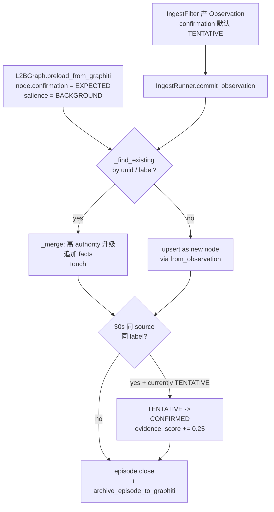

# DSG 当前全景理解快照（决策完成点）

> **本文用途**：把"DSG 在 Phase 4 收口时的真实形状"蒸馏成单一 cold-read snapshot。任何 DSG 设计 chat 进场时，先把这一份吃完，再决定要不要回读 ADR / Opus / 源码。
>
> **本文不做**：不重写决策、不引入新设计、不评估代码质量、不裁决"L1.5 池/lifecycle/L2-B 该怎么升级"（那是 Chat 2 的活）。
>
> **关键基调（用户 2026-05-04 原话）**：
> > 我们倾向于先建立独立 DSG 工作区，统一固化目前的决策和设计理念，把 Opus 里的文档、索引、目前有时效的 DSG 设计理念和架构给固化到独立工作区内，再进行设计。
>
> **2026-05-06 增量补丁**：用户已回答 [open_questions §1-§3.4 第一问](open_questions_for_design_chat.md)，决策总表见 [dsg_decisions_master.md](dsg_decisions_master.md)；本文 §1.2 / §4.2 / §5.2 / §6.5 已加注脚反映新方向，新增 §11 防爆炸门控分层 + §12 工作记忆延迟归档时机。

---

## §0 范围声明 + 边界引用

### §0.1 In scope（本文蒸馏的范围）

- DSG 模块层（L1.5 / L2-A 占位 / L2-B / 触发器 / Ingest 过滤层 / Graphiti 桥）的**当前实现状态 + 设计意图**
- 各 source 当前如何进入 L2-B + 当前 lifecycle 字段如何赋值
- Phase 4 §8 锁定的 DSG 相关接口面（NodeKind / EdgeKind / RefBinding / EcpEvent 中的 DSG 切片）
- ADR-L1.5-001 决定的 source dispatch 当前形态 + §4.1 升级触发条件
- Opus 调研中**仍生效**的设计意图（具体逐条蒸馏见 [opus_dsg_residual_intent.md](opus_dsg_residual_intent.md)）

### §0.2 Out of scope（本文不写）

- 不写 L1.5 预加载池升级设计（Chat 2 的活）
- 不写 lifecycle 差异化方案（Chat 2 的活）
- 不写 L2-B 简单升级方案（Chat 2 的活）
- 不写 A10 入口门控 / IoU / CLIP / ReID 细节（[ConceptGraph SKILL](../../../skills/dsg-l1-5-l2a-conceptgraph-distilled/SKILL.md) 的活）
- 不修订 ADR-L1.5-001 / ADR-PROTOCOL-INTERFACE-001 / Phase 4 §8 任何决策

### §0.3 关键边界引用（本文必备前置）

| 边界 | 锚点 | 影响本文哪一节 |
|:--|:--|:--|
| Source dispatch Q1/Q2/Q3 | [ADR-L1.5-001](../adr_l1_5_source_dispatch_extension_space_20260504.md) | §3 |
| Phase 4 §8 13 决策锁 | [sprint4_phase4_entry_20260430.md §8](../sprint4_phase4_entry_20260430.md) | §9 |
| identify_object 用户口径锚点 | [audit_identify_object_no_screenshot_20260420.md §9.1](../audit_identify_object_no_screenshot_20260420.md) | §3 / §9 |
| Observer / Attention 边界 | [parrot_behavior_rules.md §3.7](../../parrot_behavior_rules.md)（"Observer 不写 L2-B 节点 attention；Attention 不抓帧 / 不写 Graphiti"，引自 [ADR-PROTOCOL-INTERFACE-001 §3.2](../adr_protocol_upgrade_and_interface_refinement_background_20260504.md)）| §7 |
| DSG 是耦合子系统 | [workspace.mdc 关键约束 #3](../../../rules/workspace.mdc) | §1 |

---

## §1 DSG 定位与四层语义架构

### §1.1 DSG 是什么（一句话）

DSG = Dynamic Scene Graph — GOSLO 的"感知-记忆耦合子系统"，把多源传感器输出（Unity AR / Gemini oral / identify_object / Obsidian SSOT / 未来 A10）汇聚成一份**短期工作记忆图**（L2-B），并在适当时机归档到长期记忆（Graphiti）。

**关键性质**（引自 [workspace.mdc §关键约束 #3](../../../rules/workspace.mdc)）：

> DSG 是耦合子系统，通过触发器/预加载/直写和 Graphiti/Brain 紧密耦合，**非独立模块**。

### §1.2 四层语义架构（脑区类比，主源 [module_map_p2.md §10.1](../module_map_p2.md)）

| 层 | 类比 | 职责 | 数据形态 | 当前状态 |
|:--|:--|:--|:--|:--|
| **L0** | 原始事件流 | 跨进程事件总线（Redis Stream `parrot.events.log`）| EventEnvelope | ✅ VERIFIED（Sprint 0 S0.A）|
| **L1** | 感官输入 | Blackboard 短期共享 | 26 BB key（Phase 4 锁定）| ✅ VERIFIED |
| **L1.5** | 视觉皮层 | 多源 sensor 输出归一 — Unity AR telemetry / A10 CV / Sentinel YOLO / Gemini vision-proxy；**升级方向**（[dsg_decisions_master §1.1](dsg_decisions_master.md)）：从纯合同层 → 多源 Node 出口管理池 | `SensorFrame` + `Detection`（Pydantic frozen）| **PLANNED**（合同已锁，无 producer 已接入）|
| **L2-A** | 背侧通路 (Where) | 空间拓扑：Object → Surface → Zone | RustworkX 空间图 | **PLANNED**（P3）|
| **L2-B** | 腹侧通路 (What) | 语义注意力 + 关联 + 新旧判定 | RustworkX 语义图（`l2b_graph.py`）| ✅ **IMPLEMENTED**（P2.5）|
| **L3** | 长期记忆 | Graphiti + FalkorDB 时序图 | Episode / EntityNode / Fact | ✅ IMPLEMENTED |

### §1.3 现在能做什么 / 不能做什么（[module_map_p2.md §10.2](../module_map_p2.md)）

**能做**：

- L2-B 语义记忆：物体标签 / 关联 / 新物体发现 / Episode 分段
- L2-B 触发器：Calendar / Message / SSOTEnrichment / SceneContext 共 4 个
- Ingest 5 过滤器：USER_TAG_OBSIDIAN / IDENTIFY_OBJECT / GEMINI_ORAL / CV_A10（占位）/ MOCK
- Graphiti 双向：preload from `scene` partition + archive Episode 回 `goslo` partition
- Phase 4 W6-7 注意力 threshold + hint writer（引 [§7](#7-触发器与-observer--attention-边界)）

**不能做**：

- ❌ L1 真实视觉识别（需 A10，属 Phase 5+）
- ❌ L2-A 空间拓扑（需 AR 真机数据，P3）
- ❌ L1.5 producer 端（合同 V1 已锁；Unity AR telemetry / A10 CV 都还没真正发 SensorFrame）
- ❌ 不同 source 差异化 lifecycle（待 Chat 2 设计；当前所有 source 走同一 IngestRunner 路径，仅在 `_SOURCE_PRIORITY` 字典里有优先级排序）

---

## §2 源码现状速查（`src/parrot/dsg/`）

### §2.1 文件 + 子包一句话表

| 文件 | 一句话职责 |
|:--|:--|
| `l1_5_protocol.py` | L1.5 SensorFrame / Detection / FrameSource(7) / DetectionAuthority(6) — Pydantic frozen 跨进程合同 |
| `l2b_types.py` | NodeKind(6) / EdgeKind(8) / Salience(5) / ConfirmationStatus(5) / SemanticNode(含 source + source_meta + factory) / SemanticEdge / EpisodeMarker |
| `l2b_graph.py` | RustworkX `PyDiGraph` 工作记忆图 — upsert / connect / episode start/close/archive / Graphiti preload + enrich + scene_summary |
| `interfaces.py` | DSG ↔ Graphiti 桥（preload_object_semantics / update_last_seen / get_expected_objects / emit_trigger / publish_scene_update）|
| `types.py` | L1 事件类型 / SceneTrigger / TriggerType / ObjectInfo（早期类型，与 ingest/base 的 Observation 并存）|
| `expectation_checker.py` | 期望节点 vs 实际感知对比（Opus 19 EXPECTED 落地点）|
| `mode_controller.py` | DsgMode 切换（DSG_TEXT_ONLY / DSG_GEMINI_VISION / DSG_FULL / DSG_SENTINEL_AUX）+ filter enable/disable |
| `trigger_listener.py` | Redis Pub/Sub 订阅 — 把 CH_DSG_EVENTS / CH_TRIGGER_RESULTS / CH_NANOBOT_RESULTS 路由到对应处理器 |

| 子包 | 文件 | 职责 |
|:--|:--|:--|
| `ingest/` | `base.py` | IngestFilter 抽象 + Observation Pydantic + ObservationSource(7) + IngestOutcome |
| `ingest/` | `runner.py` | IngestRunner — Observation → SemanticNode commit；含 `_SOURCE_PRIORITY` + 30s repeat-seen promotion + factory dispatch |
| `ingest/` | `user_tag_filter.py` | Obsidian SSOT 双向链同步 → USER_TAG_OBSIDIAN Observation |
| `ingest/` | `tool_result_filter.py` | identify_object 命中结果 → IDENTIFY_OBJECT Observation |
| `ingest/` | `text_source_filter.py` | Gemini oral / 用户消息 → GEMINI_ORAL / USER_EXPLICIT Observation |
| `ingest/` | `cv_track_filter.py` | A10 SAM2/DINOv2 tracks → CV_A10 Observation（**接入待 Phase 5+**）|
| `ingest/` | `gemini_transcript_extractor.py` | Gemini 转录后实体抽取 |
| `triggers/` | `runner.py` | TriggerRunner — 4 个触发器并发调度 |
| `triggers/` | `calendar_trigger.py` | Google Calendar 三层提醒（digest/prep/imminent）+ quiet hours |
| `triggers/` | `message_trigger.py` | 微信 / Telegram 消息触发 |
| `triggers/` | `scene_context_trigger.py` | Scene 注意力 → 触发主动通报 |
| `triggers/` | `ssot_enrichment_trigger.py` | Obsidian 节点充实回 Graphiti |
| `attention/` | `threshold.py` | Phase 4 W6-7 — Δ_focus=0.2 / Δ_bbox=1.0 / threshold=1.0 阈值器（dsg/attention 不塞 BB）|
| `attention/` | `hint_writer.py` | Phase 4 F-05 — `transient/current_attention_hint` BB writer |

### §2.2 测试覆盖（基线，[Phase 4 完成报告](../sprint4_phase4_completion_and_final_audit_20260430.md)）

- pytest 当前 234/234（含 ADR-L1.5-001 新增 11 项 `tests/test_dsg/test_l2b_node_source_dispatch.py`）
- 跨语言守护 `tests/test_ecp_event/test_cs_parity.py` 4/4 — 守护 EcpEventType / EcpEventSource / topic 常量

---

## §3 Source 字段与 factory 现状（ADR-L1.5-001 已落地）

### §3.1 7 项 ObservationSource 现值（`dsg/ingest/base.py`）

```python
class ObservationSource(str, Enum):
    USER_TAG_OBSIDIAN = "user_tag_obsidian"   # Obsidian SSOT 双向链
    USER_EXPLICIT     = "user_explicit"        # 用户口头/UI 主动声明
    IDENTIFY_OBJECT   = "identify_object"      # Brain tool 命中结果
    GEMINI_ORAL       = "gemini_oral"          # Gemini Live 口头提及
    CV_A10            = "cv_a10"               # A10 视觉管线（Phase 5+ 占位）
    CV_SENTINEL       = "cv_sentinel"          # 笔记本 Sentinel YOLO（Phase 5+ 占位）
    MOCK              = "mock"                 # 测试桩
```

### §3.2 优先级链（`dsg/ingest/runner.py:_SOURCE_PRIORITY`）

| Source | priority |
|:--|:--|
| USER_TAG_OBSIDIAN | 100 |
| USER_EXPLICIT | 95 |
| IDENTIFY_OBJECT | 80 |
| CV_A10 | 60 |
| CV_SENTINEL | 40 |
| GEMINI_ORAL | 30 |
| MOCK | 10 |

合并规则：当新 Observation 与已有节点 label/uuid 冲突时，**只有更高 authority 的 source 能升级 confirmation**；同 authority 不 flapping，仅追加 facts。

### §3.3 SemanticNode source 字段（ADR-L1.5-001 §2.1 Q1 决定）

- `SemanticNode.source: str = ""` — `ObservationSource.value` 字符串值（不是 enum，避免循环 import）
- `SemanticNode.source_meta: dict[str, Any] = {}` — 自由扩展槽
- `SemanticNode.from_observation(obs)` classmethod — 通过 `_SOURCE_META_FACTORIES` 注册表派发

### §3.4 factory 注册表当前状态（**几乎全空**）

```python
_SOURCE_META_FACTORIES: dict[str, Callable] = {}  # 当前未注册任何条目
```

所有 source 当前都走 `_default_source_meta_factory()` → 返回空 dict。这是**预期行为**：Phase 4 收口时没有任何 source 需要 per-source 状态扩展。

新 source 接入时调 `register_source_meta_factory("cv_a10", a10_factory)` 即可注册自己的 builder，**不必动 SemanticNode**。

### §3.5 fallback 启发式（`runner._source_for_node()`）

当读到 `node.source == ""`（pre-Phase-4 节点 / 测试 fixture / Graphiti 直接 preload 的节点），按以下顺序回退：

1. `obsidian_uuid` 非空 → USER_TAG_OBSIDIAN
2. `graphiti_uuid` 非空 → IDENTIFY_OBJECT
3. 都为空 → GEMINI_ORAL

**这是过渡期 fallback，非长期合约**；Chat 2 设计时可决定是否要消除（例如强制所有 preload 节点也带 source）。

---

## §4 L1.5 预加载 Node 池现状

### §4.1 协议合同形态（`l1_5_protocol.py`，Sprint 0 V1 锁）

```python
class FrameSource(str, Enum):
    UNITY_AR_TELEMETRY    # pose-only
    UNITY_WEBCAM_TELEMETRY
    A10_SAM2_DINOV2
    A10_YOLO_WORLD
    SENTINEL_YOLO
    GEMINI_VISION_PROXY
    MOCK

class Detection(BaseModel, frozen=True):
    det_id, label, confidence, authority(DetectionAuthority),
    bbox, track_id, reid_hash, meta

class SensorFrame(BaseModel, frozen=True):
    frame_uuid, ts, source, frame_ref(snapshot uuid 或 path),
    detections: tuple[Detection, ...],
    ar_tracking_state, camera_pose_ref, provenance_parent, meta
```

**设计原则**（`l1_5_protocol.py` 顶部注释）：

- V1 锁**形状**，无具体 producer 是 Sprint 0 强制要求
- 图像字节**不进** SensorFrame —— 通过 `frame_ref`（SnapshotEnvelope uuid 或文件路径）
- `DsgMode`（`shared/tiers.py`）决定**哪些 producer 允许 emit / 哪些 filter 消费**；本文件不强制

### §4.2 当前实现状态

- ✅ Pydantic schema 已锁（`SensorFrame` / `Detection` / `FrameSource` / `DetectionAuthority`）
- ✅ Sprint 0 测试覆盖 schema 兼容性
- ❌ **无任何真实 producer**：Unity AR telemetry / A10 CV / Sentinel / Gemini vision-proxy 都没有真正发 SensorFrame
- ❌ **无"预加载池"具体语义**：当前 L1.5 是个**纯合同层**，没有"池子"形态（即没有 in-memory cache / TTL / eviction policy / 优先级队列）；"预加载"目前是 `L2BGraph.preload_from_graphiti()` 直接拉 Graphiti 节点的事，与 L1.5 协议**没建立映射**
- ❌ **无 source-specific filter chain**：5 个 ingest filter 是按 ObservationSource 分类的；FrameSource 还没真正驱动过任何 filter

**关键 gap**（不是 bug，是设计点）：

> 当前 "L1.5" 名字下有 **合同**（`SensorFrame`）但没有 **池**（preload pool 实体）。Chat 2 要设计的"L1.5 预加载 Node 池 + 状态生命周期"实质上是给这个空名字填装结构。

**2026-05-06 用户决策方向**（[dsg_decisions_master §1](dsg_decisions_master.md)）：

- 池物理形态：给 L2-B 加薄管理层（不独立进程）；具体类拆分 deferred-to-design
- 防爆炸门控**三层分层**（A10 端 / L1.5 入池 / L2-B 入图）— 见本文 [§11](#11-防爆炸门控分层架构) 新增
- 桌面起步分桶：1 主桶 + Obsidian 设定桶 + Google 日程一键导入桶
- 多 Profile / 子图分层 P1-P4 选项（[`dsg-l2b-node-organization-options §6.5`](../../../skills/dsg-l2b-node-organization-options/SKILL.md)） — Chat 2 调研后裁决

---

## §5 状态生命周期现状

### §5.1 SemanticNode 当前 lifecycle 字段（`l2b_types.py`）

| 字段 | 类型 | 当前赋值时机 |
|:--|:--|:--|
| `confirmation: ConfirmationStatus` | EXPECTED / TENTATIVE / UNCERTAIN / CONFIRMED / GHOST | preload → EXPECTED；ingest → 由 Observation 带入（默认 TENTATIVE）；30s 重复见 → CONFIRMED；高 authority 提升 |
| `evidence_score: float` | [0.0, 1.0] | repeat-seen +0.25；Graphiti enrich +0.15；≥0.6 自动升 CONFIRMED |
| `attention: float` | [0.0, 1.0] | from_observation 默认 0.6（CONFIRMED）/ 0.35（其他）；Phase 4 attention/threshold 不写这里（边界）|
| `salience: Salience` | ALERT / FOREGROUND / ACTIVE / BACKGROUND / PERIPHERAL | from_observation 默认 ACTIVE；user-sourced 升 FOREGROUND；preload 默认 BACKGROUND |
| `novelty: float` | [0.0, 1.0] | 默认 1.0；**当前无衰减逻辑**（设计时机未到）|
| `habituation_count: int` | counter | 默认 0；**当前无累加路径**（设计时机未到）|
| `last_attended: float` | timestamp | `touch()` 调用时更新 |
| `last_seen_this_session: float` | timestamp | `touch()` 调用时更新 |
| `interaction_count: int` | counter | `touch()` 累加 |
| `episode_id: str` | EpisodeMarker.episode_id 引用 | `assign_node_to_current_episode()` |
| `provenance_stream_id: str` | L0 EventEnvelope id | Sprint 0 S0.B 引入；ingest 路径已传播 |
| `time_span: tuple[float, float \| None]` | (start, end) | EVENT-kind 节点用；其他默认 (0, None) |
| `reference_image_path: str` | snapshot path | identify_object 命中或用户上传时填入 |
| `last_sighting_path: str` | rolling sighting path | sighting 发生时滚动更新 |
| `source: str` | ObservationSource.value | from_observation 注入；pre-Phase-4 节点为空 |
| `source_meta: dict` | 自由扩展槽 | factory 产出；当前所有 source 都返回 `{}` |

### §5.2 SemanticNode 当前 lifecycle 流转（注释引自 `l2b_types.py`）

```
Graphiti preload → create node (EXPECTED)
    ↓
L1/tool confirms → CONFIRMED
    ↓
archive back to Graphiti on episode end
```

**真实当前实现**（在 `runner.commit_observation` + `l2b_graph.archive_episode_to_graphiti`）：



### §5.3 各 source 当前 lifecycle 处理一览

详细对照见 [source_x_lifecycle_status.md](source_x_lifecycle_status.md)。简表：

- 所有 7 项 source 当前**走同一 IngestRunner 路径**
- 差异**仅体现在**：(a) `_SOURCE_PRIORITY` 数值；(b) Salience 升级（user-sourced 升 FOREGROUND）；(c) factory 注册（**目前全部 default 空 dict**）
- **没有 source-specific 衰减 / TTL / 自动 GHOST 转换 / 池满淘汰策略** —— 这些都是 Chat 2 待设计

### §5.4 注意力实现路径（**双开放** — 2026-05-06 用户决策）

> 用户原话："注意力可以是子类 Node 的特殊字段也可以是 RustworkX 机制层，就是我们要设计的部分需要经过调研和学习"。

| 路径 | 适用 | 落地范式 |
|:--|:--|:--|
| **字段层**（子类 Node 特殊字段）| 高频读写状态（衰减权重 / 计数器 / track_id 等）| `SemanticNode.attention/novelty/habituation_count` 字段已存在；扩展走 `source_meta` factory |
| **RustworkX 机制层**（Cluster / 子图 / 折叠 / 跃迁通道 / Spreading Activation / PPR）| 拓扑遍历 / 中心性 / 子图同构；潜意识联想 | [`dsg-rustworkx-master §3`](../../../skills/dsg-rustworkx-master/SKILL.md) 4 范式 + [`dsg-attention-schema-papers §5.4`](../../../skills/dsg-attention-schema-papers/SKILL.md) Spreading Activation |

**实际很可能是混合**（[`dsg-rustworkx-master §1.2`](../../../skills/dsg-rustworkx-master/SKILL.md) "骨架 vs 血肉"范式）：拓扑骨架走 RustworkX，高频状态挂 Node payload。具体配比由 Chat 2 调研后裁决；详见 [dsg_decisions_master §4](dsg_decisions_master.md)。

---

## §6 L2-B 组织方式现状

### §6.1 数据结构（`l2b_graph.py`）

```python
class L2BGraph:
    _graph: rustworkx.PyDiGraph        # 节点存 SemanticNode；边存 SemanticEdge
    _uuid_to_idx: dict[str, int]        # O(1) UUID → rx_index
    _episodes: dict[str, EpisodeMarker]
    _current_episode_id: str
```

### §6.2 写入路径（**当前所有写入都过这条路**）

```
来源              入口
─────────────────────────────────────────────────────
IngestFilter   →  IngestRunner.commit_observation  →  upsert_node
Graphiti preload → preload_from_graphiti            →  upsert_node (EXPECTED)
identify_object   tool 直接 -> upsert + Graphiti enrich
manage_episode    tool 直接 -> start_episode / close_current_episode
触发器系统          通过 emit_trigger → CH_DSG_EVENTS pub/sub（不直写 L2-B）
```

**关键不变量**（[ingest/base.py docstring](src/parrot/dsg/ingest/base.py)）：

> Ingest 层是**唯一**让外部观察变成 L2-B SemanticNode 的关卡。每一个上游来源（Gemini oral / identify_object / user tag / A10 CV / Sentinel）都过这里的 filter；**L2-B 永远不接受直写**（preload 例外，因为那是 Graphiti 自有节点的 mirror）。

### §6.3 边类型 8 项（`l2b_types.py:EdgeKind`）

| Edge | 用途 | 当前 connect 调用 |
|:--|:--|:--|
| ASSOCIATED_WITH | 通用关联 | 默认 SemanticEdge |
| REMINDS_OF | 联想 | Sprint 5+ |
| CO_OCCURRED | 共现 | episode 级别 |
| SPATIAL_CONTEXT | 空间上下文 | L2-A 协同（P3+）|
| PART_OF_EPISODE | episode 成员关系 | episode 自动维护 |
| HAS_PHOTO | Episode → PhotoNode | Phase 4 W8 锁定，wiring 留 Phase 5+ |
| CAPTURED_VIA | PhotoNode → Focus/BBox 主体 | Phase 5+ |
| CANDIDATE_SUBJECT | PhotoNode → 已知 ObjectNode | Phase 5+（仅 known object 时连）|

### §6.4 episode 与归档

- `start_episode()` 打开新 EpisodeMarker；`close_current_episode()` 关闭并收集成员节点
- `archive_episode_to_graphiti()` 异步把 episode 文本（title + summary + duration + objects）写回 Graphiti `goslo` partition
- 归档后 `archived_to_graphiti = True`，避免重复

### §6.5 当前 L2-B 的"简单"程度（"简单升级"基线）

- ✅ 单 RustworkX 实例（singleton via `get_l2b_graph()`）
- ✅ 唯一 node container：`PyDiGraph`
- ✅ **2026-05-07 baseline 真算法**：`dsg/l2b/clustering.ConnectedComponentsClusterStrategy` (rustworkx.connected_components 子图聚类 baseline) + `dsg/l2b/attention/mechanism.IterativeSpreadingActivation` (Collins-Loftus 迭代扩散，hop hard cap=4 AGCN 实证) + `L2BGraph.connect()` 自动标记 `edge.meta["cross_compartment"]` (event/bucket/scene/location 4 轴)。详见 `architecture/backend_interface_refinement_20260507.md §4`。
- ❌ 没有"池"概念：没有 priority queue / TTL eviction / size cap
- ❌ 没有按 source 分桶：所有节点同一个图
- ❌ 没有按 lifecycle 状态分层：EXPECTED / CONFIRMED / GHOST 都在同一图，依靠字段过滤
- ❌ 没有 attention 主动衰减：novelty / habituation 字段存在但无写者
- ❌ 没有 GHOST 自动转换：confirmation=GHOST 是 enum 值，但没有任何代码会**主动**把节点转成 GHOST

**Chat 2 的"简单升级"留白**：上述 ❌ 项是设计空间，**留有复杂仿生设计**的入口（衰减曲线 / 注意力扩散 / 联想权重 / 期望-实际差异驱动 GHOST）。

**2026-05-06 用户决策方向**（[dsg_decisions_master §2 / §4](dsg_decisions_master.md)）：

- 桌面起步：单 `PyDiGraph`，主图除特殊 Node 种类不分；Obsidian 设定桶 + Google 日程桶 用 Cluster 边连接
- 仿生路径**双开放**（字段层 vs RustworkX 机制层）— 不预先选单一路径
- 子图分层 P1-P4 选项（[`dsg-l2b-node-organization-options §6.5`](../../../skills/dsg-l2b-node-organization-options/SKILL.md)）+ 跳数硬上界 4 跳（[`dsg-rustworkx-master §3.5`](../../../skills/dsg-rustworkx-master/SKILL.md) + AGCN 实证）由 Chat 2 调研裁决

---

## §7 触发器与 Observer / Attention 边界

### §7.1 4 个触发器（`dsg/triggers/`）

| 触发器 | 输入 | 输出 |
|:--|:--|:--|
| `calendar_trigger` | Google Calendar 事件 | 三层提醒（digest / prep / imminent）+ quiet hours |
| `message_trigger` | 微信 / Telegram 消息 | 主动通报 + L2-B PERSON 节点更新 |
| `scene_context_trigger` | L2-B 注意力变化 | 主动通报场景 |
| `ssot_enrichment_trigger` | Obsidian 节点变更 | Graphiti `scene` partition 充实 |

所有触发器**不直写 L2-B**，通过 `emit_trigger()` → Redis `CH_DSG_EVENTS` → trigger_listener → 被各方消费（包括 IngestRunner、Brain context injector）。

### §7.2 Observer / Attention 边界（[parrot_behavior_rules §3.7](../../parrot_behavior_rules.md) + [ADR-PROTOCOL-INTERFACE-001 §3.2](../adr_protocol_upgrade_and_interface_refinement_background_20260504.md)）

> **Observer 不写 L2-B 节点 attention；Attention 不抓帧 / 不写 Graphiti**

落到 Phase 4 W6-7 的实施：

| 模块 | 能做 | 不能做 |
|:--|:--|:--|
| `dsg/attention/threshold.py` | 读 BB Focus/BBox + 计算 Δ + 决策 attention hint | 不抓帧 / 不写 Graphiti / **不直接改 SemanticNode.attention** |
| `dsg/attention/hint_writer.py` | 写 BB `transient/current_attention_hint` | 不写 EcpEvent / 不写 L2-B |
| `brain/observer/{focus,bbox,sighting}.py` | 维护 RefBinding + 累计 sighting | 不读 / 不写 SemanticNode.attention |

### §7.3 Phase 4 §8 L9 锁

| 锁定值 | 锁的内容 |
|:--|:--|
| Δ_focus = 0.2 / Δ_bbox = 1.0 / threshold = 1.0 | 注意力阈值数值 |
| 阈值器在 `dsg/attention/` 不塞 BB | 模块边界 |
| 优先级 explicit > BB > DEFAULT | hint 优先级链 |

**任何动 attention 的 chat 必须先核对此锁。**

---

## §8 与 ConceptGraph 蒸馏的接口（A10 入口侧）

A10 入口门控（视觉门控 / IoU / CLIP / ReID / 跨帧关联 / L2-A 节点描述生成）由独立蒸馏 SKILL 承载：

> [.cursor/skills/dsg-l1-5-l2a-conceptgraph-distilled/SKILL.md](../../../skills/dsg-l1-5-l2a-conceptgraph-distilled/SKILL.md)

**本工作区不重复**蒸馏内容，仅记录跨引用：

| ConceptGraph SKILL 章节 | 对应本工作区 |
|:--|:--|
| §1 A10 入口门控（决策树 / 阈值表 / 多帧 vote）| 对应 L1.5 上游 producer 端的"何时 emit Detection"——本工作区只记录 `Detection` 合同形状（[§4.1](#41-协议合同形态-l15_protocolpy-sprint-0-v1-锁)）|
| §2 A10 入口技术栈（SAM2 / DINOv2 / RAM / Grounded-SAM）| 与本工作区无关；运行在 A10 节点 |
| §3 跨帧关联 / ReID | 对应未来 `cv_track_filter.py` 接入 A10 后的合并策略 |
| §4 L2-A 语义抽象（detection → semantic node 4 步）| 对应 L2-A 占位，本工作区不展开（[§1.2](#12-四层语义架构脑区类比主源-module_map_p2md-101)） |
| §7 与 ParrotCarriers 现状的差异 | 与本工作区 [§3](#3-source-字段与-factory-现状adr-l15-001-已落地) / [§5](#5-状态生命周期现状) 对照阅读 |
| §8a AR 场景特有问题 Q1-Q10 | Chat 2 设计 lifecycle 时要参考的"AR 漂移 / 锚点 / 置信度冲突"问题清单 |

**ConceptGraph SKILL 与本工作区的边界原则**：

> SKILL 是**只读资料**（A10 入口侧门控 + L2-A 语义抽象）；本工作区是 ParrotCarriers 现状的**当前理解**。两者的交集在 L1.5 producer → L2-B node 的链路上，但**不互相覆盖**。

---

## §9 Phase 4 锁定面与 ADR-L1.5-001 §4.1 升级条件

### §9.1 Phase 4 §8 决策锁中**与 DSG 直接相关**的部分

| Lock | 锁定的 DSG 接口面 | 不能动什么 | 真源 |
|:--|:--|:--|:--|
| L1 | `parrot.dsg.l2b_types.NodeKind` 6 项 / `EdgeKind` 8 项 | 增删 enum value 必须先升 schema_version | [entry §8.1](../sprint4_phase4_entry_20260430.md) |
| L7 | PhotoEvent 不自动建 ObjectNode | 必须用 `NodeKind.PHOTO` 而不是 OBJECT；不能让 PhotoEvent 隐式建 candidate ObjectNode | 同上 §8.1 |
| L9 | Δ_focus=0.2 / Δ_bbox=1.0 / threshold=1.0；阈值器在 `dsg/attention` 不塞 BB | 数值 / 位置 / 优先级 | 同上 |
| L11 | identify_object 1.9s 总预算（800 + 200 + 800 + 100ms）| 数值 / 三段 sync 路径 | 同上 §8.5 |
| L13 | `dsg/attention/__init__.py` 不 export Attention 类符号 | export 集合保持不变（防误读为 L3 已落地）| 同上 |

跨语言守护：[`tests/test_ecp_event/test_cs_parity.py`](../../../../tests/test_ecp_event/test_cs_parity.py) 守护 `EcpEventType` / `EcpEventSource` / topic 常量；任何单边改动会立刻 fail。

### §9.2 ADR-L1.5-001 §4.1 子类化触发条件（**核对清单**）

引自 [ADR-L1.5-001 §4.1](../adr_l1_5_source_dispatch_extension_space_20260504.md)：

> 当**满足以下条件之一**时升级到子类（option 3 dispatch）：
>
> 1. L1.5 预加载 Node 池 design（独立 chat = Chat 2）发现 ≥3 个 source 需要的字段差异 ≥3 个
> 2. ≥2 个 source 需要**行为多态**（不只是数据 shape），如 A10 节点 `touch()` 时自动 decay confidence 而 user 节点不 decay
> 3. 类型系统强制 dispatch 的需求被反复手写 isinstance 验证

**当前状态**：3 条触发器**全部未触发**。Chat 2 设计时若发现触发，需在设计稿里显式援引此条 + 起新 ADR `supersedes: [ADR-L1.5-001]`。

### §9.3 不允许提前做的事（[ADR-L1.5-001 §4.2](../adr_l1_5_source_dispatch_extension_space_20260504.md)）

- ❌ 在 L1.5 池设计 / lifecycle 设计 sign off 之前升级到子类（option 3）
- ❌ 在 Q2 选定的 meta dict 之外引入"半结构化"中间方案（如 `meta_schema: str` 字段）
- ❌ 把 source 字段加到 Unity wire（违反 Q1 + entry §8.5 #4 enum 锁）

---

## §10 引用源（按类别分组）

### §10.1 代码真源

- [src/parrot/dsg/l1_5_protocol.py](../../../../src/parrot/dsg/l1_5_protocol.py) — L1.5 合同
- [src/parrot/dsg/l2b_types.py](../../../../src/parrot/dsg/l2b_types.py) — L2-B 类型 + source dispatch
- [src/parrot/dsg/l2b_graph.py](../../../../src/parrot/dsg/l2b_graph.py) — L2-B RustworkX 图
- [src/parrot/dsg/ingest/base.py](../../../../src/parrot/dsg/ingest/base.py) — IngestFilter / Observation / ObservationSource
- [src/parrot/dsg/ingest/runner.py](../../../../src/parrot/dsg/ingest/runner.py) — IngestRunner + 优先级 + repeat-seen promotion
- [src/parrot/dsg/interfaces.py](../../../../src/parrot/dsg/interfaces.py) — DSG ↔ Graphiti 桥
- [src/parrot/dsg/triggers/](../../../../src/parrot/dsg/triggers/) — 4 触发器
- [src/parrot/dsg/attention/](../../../../src/parrot/dsg/attention/) — Phase 4 W6-7 attention 模块
- [tests/test_dsg/](../../../../tests/test_dsg/) — DSG 测试基线
- [tests/test_ecp_event/test_cs_parity.py](../../../../tests/test_ecp_event/test_cs_parity.py) — 跨语言守护

### §10.2 ADR & 决策锁

- [adr_l1_5_source_dispatch_extension_space_20260504.md](../adr_l1_5_source_dispatch_extension_space_20260504.md) — Q1/Q2/Q3 + §4.1 升级条件
- [adr_protocol_upgrade_and_interface_refinement_background_20260504.md](../adr_protocol_upgrade_and_interface_refinement_background_20260504.md) — 协议升级背景（不覆盖本工作区）
- [sprint4_phase4_entry_20260430.md](../sprint4_phase4_entry_20260430.md) — Phase 4 §8 13 锁
- [audit_identify_object_no_screenshot_20260420.md](../audit_identify_object_no_screenshot_20260420.md) — §9 用户口径锚点

### §10.3 Opus 调研

逐条蒸馏见 [opus_dsg_residual_intent.md](opus_dsg_residual_intent.md)。涉及：

- Opus 09 — DSG 技术选型 / RustworkX
- Opus 11 — L1 视觉设计
- Opus 12 — Scene + 时间轴
- Opus 17 — DSG 节点与触发器
- Opus 18 — 传感器置信度 + StabilityGate
- Opus 19 — 异常 / 幽灵 / EXPECTED 节点

### §10.4 Skill（DSG 系列 — 4 个 2026-05-06 新增）

- [.cursor/skills/dsg-rustworkx-master/SKILL.md](../../../skills/dsg-rustworkx-master/SKILL.md) — **总入口路由** + RustworkX 实操 + 仿生 4 范式 + 跨 skill 论文索引
- [.cursor/skills/dsg-l2b-node-organization-options/SKILL.md](../../../skills/dsg-l2b-node-organization-options/SKILL.md) — Node/Edge 组织 5 选项 + 子图分层 P1-P4 + 跨源合并信号
- [.cursor/skills/dsg-attention-schema-papers/SKILL.md](../../../skills/dsg-attention-schema-papers/SKILL.md) — 13 篇论文索引（GAT/DySAT/AGCN/G-HAM/Schema/Hippocampal Indexing/Spreading Activation 等）
- [.cursor/skills/dsg-l1-5-l2a-conceptgraph-distilled/SKILL.md](../../../skills/dsg-l1-5-l2a-conceptgraph-distilled/SKILL.md) — A10 入口 + L2-A 蒸馏

### §10.4b 蒸馏素材池（不进 .cursor/skills/，避免上下文污染）

- `NewZone/distill_output/dsg/concept-graphs/` — ConceptGraph Gemini 蒸馏
- `NewZone/distill_output/dsg/rustworkx-docs/` — rustworkx.org 官方文档子集
- `NewZone/distill_output/dsg/rustworkx-repo/` — rustworkx 全仓库
- `NewZone/distill_output/dsg/superlocalmemory/` — SLM 9 层 + TWF 衰减
- `NewZone/distill_output/dsg_l2b_org_raw/HippoRAG/` — 海马索引 RAG（NeurIPS'24）
- `NewZone/distill_output/dsg_l2b_org_raw/AriGraph/` — episodic + semantic 双类节点
- `NewZone/RustworkX 图模拟研究案例.md` — 案例研究综述（§119-§122 仿生 4 范式）

### §10.5 行为契约

- [parrot_behavior_rules.md](../../parrot_behavior_rules.md) — Observer / Attention 边界
- [module_map_p2.md §10 / §11](../module_map_p2.md) — DSG 分层 + 时间轴 + MemoryValidity 过滤器位置

### §10.6 Phase 4 完成报告 + Sprint 4 Phase 5+ Line B

- [sprint4_phase4_completion_and_final_audit_20260430.md](../sprint4_phase4_completion_and_final_audit_20260430.md) — 协议契约最终态 §3
- [sprint4_phase4_online_smoke_completion_20260504.md](../sprint4_phase4_online_smoke_completion_20260504.md) — 联机 smoke 收口
- [lineb_implementation_completion_20260504.md](../lineb_implementation_completion_20260504.md) — LineB STT-LLM-TTS 双管线兼容性验证

### §10.7 派发

- [sprint4_phase4_downstream_chat_dispatch_plan_20260504.md](../sprint4_phase4_downstream_chat_dispatch_plan_20260504.md) §1.1 Chat 2

### §10.8 工作区决策总表

- [dsg_decisions_master.md](dsg_decisions_master.md) — DSG 工作区决策总表（master，长期累加）

---

## §11 防爆炸门控分层架构（**2026-05-06 用户决策**）

> 用户在背景知识 §2 + Q1.6 拼出的三层门控原则，决策详见 [dsg_decisions_master §1.2](dsg_decisions_master.md)。

```
┌────────────────────────────────────────────────────────────────┐
│ A10 端 CV Flow（Mecha 节点 — 不在 DSG 模块）                   │
│  - IoU + CLIP sim + persistence threshold                      │
│  - obj_min_detections=3                                        │
│  - 自合并：跨帧关联 / ReID / merge_obj2_into_obj1              │
│  → 真源：dsg-l1-5-l2a-conceptgraph-distilled §1.2-1.4          │
└────────────────┬───────────────────────────────────────────────┘
                 │ SensorFrame + Detection（已锁合同）
┌────────────────▼───────────────────────────────────────────────┐
│ L1.5 入池门（Brain 端，Chat 2 设计）                           │
│  - 置信度门控 + 加权投票                                       │
│  - "注意力足够"才入                                            │
│  - "与当前事件相关"才入 L2（防爆炸）                           │
│  - 跳数硬上界（建议 4 跳，AGCN 实证）                          │
│  → 真源：dsg-rustworkx-master §3.5 + dsg-attention-schema-papers §1.3 │
└────────────────┬───────────────────────────────────────────────┘
                 │ Observation + 池内合并
┌────────────────▼───────────────────────────────────────────────┐
│ L2-B 入图门（IngestRunner._find_existing + _merge）            │
│  - UUID 对齐已记忆物体（obsidian_uuid / graphiti_uuid / label）│
│  - 大类背景 Node 合并（杯子 vs 星巴克星冰乐）                  │
│  - 不可能事件（电视瞬移）报错不进 L1.5 标不可信（P3）          │
│  - 同类第二实例需用户确认才进 L2-B（P3）                       │
│  → 真源：dsg-l2b-node-organization-options §3.2 跨源合并信号   │
└────────────────────────────────────────────────────────────────┘
```

### §11.1 三层门控的当前状态

| 层 | 当前实现 | 缺口 | 设计责任 |
|:--|:--|:--|:--|
| A10 端 | 未接入（A10 producer 未启动）| 全部 | A10 独立设计 chat（P3）|
| L1.5 入池 | `commit_observation` 只做 30s repeat-seen → CONFIRMED 升级；无投票 / 注意力门控 | 投票 / 注意力 / 事件相关性 | Chat 2 |
| L2-B 入图 | `_find_existing` 顺序匹配 obsidian_uuid → graphiti_uuid → label | 不可能事件检测 / 同类第二实例确认 | P3 |

### §11.2 关键不变量

- Ingest 层是**唯一**让外部观察变成 L2-B SemanticNode 的关卡（preload 例外）
- 三层门控**不允许跨层短路**（L1.5 不能直接调 L2-B 内部接口；A10 不能直接写 L2-B）
- 跳数硬上界 4 跳（[dsg-rustworkx-master §3.5](../../../skills/dsg-rustworkx-master/SKILL.md)）；任何"全图遍历"反模式禁止（[案例.md §122](../../../../NewZone/RustworkX 图模拟研究案例.md)）

---

## §12 工作记忆延迟归档时机（**2026-05-06 新约束**）

> 用户原话："工作记忆不会在当场的对话中就通过 Graphiti 存档到 nanobot，快照和 Episode 等会而是先存起来到内存或者硬盘，等对话结束后 且 nanobot 闲时 / 夜间空闲时 才启动存档流程"。决策详见 [dsg_decisions_master §5](dsg_decisions_master.md)。

### §12.1 三阶段归档管线

```
对话期间（Hot Path）
  L2-B 工作记忆图 + 内存快照 + Ref 表 + 时间轴标注
  → 全部运行时；不写 Graphiti
        ↓ (对话结束)
对话结束（Cold Storage）
  序列化到硬盘
  data/conversations/{conv_id}/{snapshot,refs,timeline}.{json,jsonl}
        ↓ (nanobot 闲时 / 夜间空闲)
归档（Archive Flow）
  统一过滤器（含 MemoryValidity，module_map_p2 §11.2）
    + LLM
  → 写 Graphiti
```

### §12.2 与现有代码的冲突点（**Chat 2 实施前必查**）

| 现有代码 | 冲突点 | Chat 2 处理 |
|:--|:--|:--|
| [`l2b_graph.py:start_episode()`](../../../../src/parrot/dsg/l2b_graph.py) `loop.create_task(self.archive_episode_to_graphiti(...))` | 当场写 Graphiti — 与新约束冲突 | 改为：序列化到硬盘 + 入 nanobot 闲时队列 |
| [`runner.py:commit_observation`](../../../../src/parrot/dsg/ingest/runner.py) `TODO(S4.B): write-back to Graphiti here for CONFIRMED nodes` | TODO 描述错误方向 | 改 TODO："禁止当场写回；走 §12.1 三阶段流程" |
| `MemoryValidity 过滤器` ([module_map_p2 §11.2](../module_map_p2.md)) | PLANNED P3；位于 L2 Graphiti 写入之前 | 与 §12.1 是同一管线两个角度；Chat 2 + P3 chat 协调 |

### §12.3 衔接位置

| 维度 | 在哪里 |
|:--|:--|
| 序列化格式（JSON / JSONL）| Chat 2 给 schema |
| 硬盘路径约定 | Chat 2 给（建议 `data/conversations/{conv_id}/...`） |
| nanobot 闲时检测信号 | Chat 2 + nanobot skill 协同 |
| MemoryValidity 过滤器接入 | P3 实施 |

---

## 自检清单（cold reader 看完本文应能回答）

冷读完一份本文，应能不查其他文件回答：

- ☑ 当前 DSG 是什么 → [§1](#1-dsg-定位与四层语义架构)
- ☑ 有哪些 source → [§3.1](#31-7-项-observationsource-现值-dsgingestbasepy)
- ☑ 各 source 当前 lifecycle 处理 → [§3](#3-source-字段与-factory-现状adr-l15-001-已落地) + [§5](#5-状态生命周期现状) + [source_x_lifecycle_status.md](source_x_lifecycle_status.md)
- ☑ L2-B 当前组织结构 → [§6](#6-l2-b-组织方式现状)
- ☑ 哪些不能动 → [§9.1](#91-phase-4-8-决策锁中与-dsg-直接相关的部分) + [§9.3](#93-不允许提前做的事adr-l15-001-42)
- ☑ 哪些待设计 → [open_questions_for_design_chat.md](open_questions_for_design_chat.md)
- ☑ 防爆炸三层门控如何分 → [§11](#11-防爆炸门控分层架构2026-05-06-用户决策)
- ☑ 工作记忆何时归档到 Graphiti → [§12](#12-工作记忆延迟归档时机2026-05-06-新约束)
- ☑ 用户已决事项汇总 → [dsg_decisions_master.md](dsg_decisions_master.md)
- ☑ 注意力实现路径（字段层 vs 机制层）→ [§5.4](#54-注意力实现路径双开放--2026-05-06-用户决策) + [dsg_decisions_master §4](dsg_decisions_master.md)
