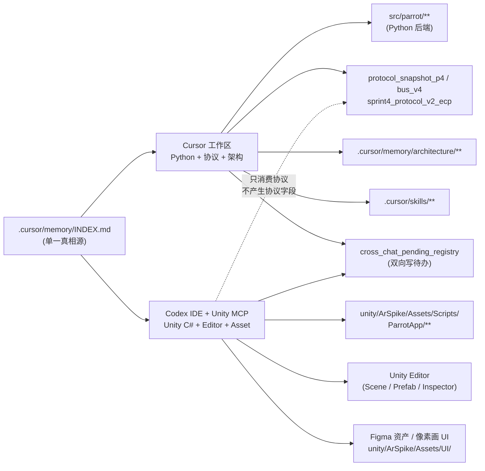

# 第二前端工作区边界（Cursor vs Codex + Unity MCP）

> **背景**：user 计划在 Cursor 之外新增一个 Codex IDE + Unity MCP 插件作为第二前端工作区，便于在 Codex 内同时控制 Unity Editor + LLM，不必频繁切回 Unity Editor。两个工作区**共享同一仓库**（`D:/GOSLOParrot/ParrotCarriers`）+ 同一 SSOT（`.cursor/memory/INDEX.md`）。
> **本文用途**：明确两个前端工作区的**职责边界 + 跨工作区流程**，避免协议字段在 Codex 侧被反复创造。

---

## 1. 拓扑图

---

## 2. 职责边界（5 条核心条款）

### 2.1 Cursor 工作区（既有，主仓）

- **领域**：Python backend / 协议 / 架构 / 文档 / Skill
- **写**：
  - `src/parrot/**`（Bus / Brain / Scheduler / DSG / Memory / shared）
  - `infra/**`（Docker / 部署）
  - `tests/**`（pytest）
  - `.cursor/memory/**`（架构 / INDEX / 决策 / ADR）
  - `.cursor/rules/**`（路由规则）
  - `.cursor/skills/**`（领域技能）
  - `protocol_snapshot_p4.md` / `bus_v4.md` / `sprint4_protocol_v2_ecp.md` / 2 ADR
  - `cross_chat_pending_registry_20260507.md`（双向写）
- **读**：所有上述 + Codex 写过的 C# 文件（看 cs_parity）

### 2.2 Codex + Unity MCP 工作区（新增，第二前端）

- **领域**：Unity C# / Editor / Asset / Prefab / Scene / UI 资产摆放
- **写**：
  - `unity/ArSpike/Assets/Scripts/ParrotApp/**`（C# DTO + RoomManager + ParrotController + 视频 / RPC handler）
  - `unity/ArSpike/Assets/Scenes/**`（Scene wiring）
  - `unity/ArSpike/Assets/Prefabs/**`（Prefab 配置）
  - `unity/ArSpike/Assets/UI/**`（Figma 导入资产 / 像素画 UI）
  - `cross_chat_pending_registry_20260507.md`（双向写——Codex 侧补充 Unity 端 NEED-* 标签）
- **读**：所有 `.cursor/memory/INDEX.md` 链表 + `protocol_snapshot_p4.md` + `Interface/INDEX.md` + `frontend_workspace_boundary.md`（本文）+ `ar_workspace_index.md`

### 2.3 共享 SSOT

- `.cursor/memory/INDEX.md`：两边都读，**只 Cursor 写**
- `architecture/protocol_snapshot_p4.md`：两边都读，**只 Cursor 写**
- `architecture/Interface/INDEX.md`：两边都读，**只 Cursor 写**
- `architecture/cross_chat_pending_registry_20260507.md`：两边**都写**（Codex 加 Unity 侧 NEED 标签时直接 append）

### 2.4 协议字段不外溢（关键）

- **Codex 工作区不能产生新协议字段**——所有 wire / ECP / RPC / DataChannel / topic / BB key 必须先在 Cursor 工作区改 `protocol_snapshot_p4` + 同步 cs_parity 表，Codex 才能动 `unity/ArSpike/Assets/Scripts/ParrotApp/Ecp/*.cs`
- 流程：Codex 发现需要新字段 → 在 `cross_chat_pending_registry` 写 NEED-PROTOCOL-* → 切回 Cursor 开 protocol upgrade 子 chat → Cursor 落地 protocol_snapshot_p4 + cs_parity → 回 Codex 写 C# DTO

### 2.5 跨工作区任务交接

- 发起方在 `cross_chat_pending_registry` 加一行：`[源工作区] [目标工作区] [文件路径] [事项 1 句话] [严重度]`
- 接收方读 registry → 完成后划掉
- 两边**不直接对话**，全经由 registry + memory/INDEX

---

## 3. 典型场景

### 3.1 user 在 Codex 摆放 Figma 导入的菜单 UI

1. Codex 读 `Interface/menu_design_complete_20260507.md`（菜单 SSOT）
2. Codex 在 `unity/ArSpike/Assets/UI/Menu/` 摆放 Figma 资产
3. Codex 在 Scene 内 wire 起来
4. **不动 C# 协议 DTO**——已有 menu_registry RPC 协议早在 Cursor 侧落地（见 `backend_interface_refinement_20260507`）

### 3.2 Cursor 升级了 ECP 字段（新增 lifecycle.audio_fade）

1. Cursor 改 `protocol_snapshot_p4.md` + `sprint4_protocol_v2_ecp.md` + `src/parrot/shared/ecp_event.py`
2. Cursor 在 `cross_chat_pending_registry` 写 `[Cursor → Codex] unity/ArSpike/.../Ecp/EcpEvent.cs 新增 audio_fade 字段；cs_parity 4/4 已锁`
3. Codex 读 registry → 改 C# DTO → 划掉 registry 行

### 3.3 Codex 发现 Unity 侧需要新增 RPC method

1. Codex 写 `cross_chat_pending_registry`：`[Codex → Cursor] NEED-PROTOCOL-NEW-RPC: parrot.glance_at_object`
2. **不动 C# RPC handler**
3. user 切回 Cursor → 开 protocol upgrade 子 chat → Cursor 落地 → 回到 §3.2 流程

---

## 4. 反模式（禁止）

- ❌ Codex 直接在 C# 写新 enum / DTO 字段，等 Cursor 后补 Python
- ❌ Cursor 在 `unity/ArSpike/Assets/Scripts/ParrotApp/**` 改 C# 业务逻辑（除非是 protocol upgrade 期间的 cs_parity 镜像同步）
- ❌ 跨工作区直接读对方未发布的 working tree（必须经过 commit + memory 登记）
- ❌ 在 Codex 工作区改 `.cursor/memory/INDEX.md` 或任何 `architecture/protocol_*` / `architecture/Interface/INDEX.md`

---

## 5. 验收信号

- 任何下游 chat 在两个工作区任一侧动手前，能从 INDEX.md §〇 找到本文件
- `.cursor/rules/workspace.mdc` 末尾含指向本文件的路由条目
- `cross_chat_pending_registry` 内出现明确的 `[Cursor → Codex]` / `[Codex → Cursor]` 标签
- `protocol_snapshot_p4` 的 cs_parity 行只由 Cursor 工作区编辑（Codex 侧检查不修改）
