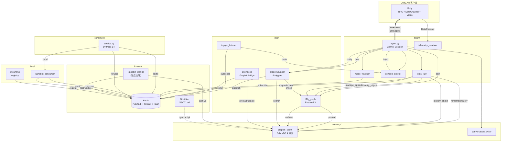

# 模块职责总览 (P2.5)

> 最后更新: 2026-04-22 (补项目边界 / 外挂生态 / DSG 分层 / 时间轴链路)
> 状态: P2.5 审计修复完成 — 进入 AR 特性 Sprint 0-4
> 关联: `milestone_p2.md` (实现清单) / `active_context.md` (进度) / `protocol_snapshot_p1.md` (V1 协议) / `ar_feature_vision.md` (AR 特性愿景)

---

## 〇、项目边界 — GOSLO ⊃ ParrotCarriers

**GOSLO** 是**最终产品** — 一只"AR 鹦鹉大小姐"陪伴 AI Agent, 由多个独立仓库拼起:

| 层级 | 仓库 | 角色 | 状态 |
|:-----|:-----|:-----|:-----|
| **主项目/家族** | `GOSLOParrot/*` (组织) | 产品总称 (GOSLO / Maid / Parrot / Scene / User) | — |
| **🔵 Bus 基建 (当前工作区)** | `GOSLOParrot/ParrotCarriers` | **bus infra 子项目** — 提供所有共享骨架: LiveKit Room / Redis / Graphiti / Brain / Scheduler / DSG / 模块挂载协议 | ✅ VERIFIED |
| **Agent 框架** | `GOSLOParrot/nanobot` (fork HKUDS) | 后台 Agent 框架, 通过 Bus 挂载进来 | ✅ VERIFIED |
| **AR 前端 (未建)** | 待定 (`GOSLOParrot/ParrotApp`?) | Unity AR 客户端, 当前 `unity/ParrotDev/` 是 ParrotCarriers 内的开发子目录 | DESIGNED |

**为什么不把所有东西都写进 ParrotCarriers**:
- ParrotCarriers 是**通用基建**, 不包含角色的具体人格 (SOUL.md 属于每个角色自己)
- Nanobot 是独立的 Agent 框架, 不该锁在 bus 里
- AR 前端是**平台绑定** (Android/iOS), Bus 是**平台无关**

**但当前现实**: 项目演进中, 很多特性代码**直接加在 ParrotCarriers 里**, 因为:
1. 联系紧, 上下文都在这
2. 三层 Bus 协议还没稳定到"对外暴露 SDK"的程度, 拆仓库会同步成本爆炸

**何时拆仓**: 当 Bus 协议 ratified 到 V2+, AR 前端代码量 > Python 端 30% 时。不急。

---

## 一、模块清单与职责

### 1. `brain/` — 云端大脑

**职责**: Gemini RealtimeModel 语音交互入口，管理工具调用、上下文注入、遥测接收。

| 文件 | 职责 |
|:-----|:-----|
| `agent.py` | AgentServer 入口；挂载 Bus → Gemini Session → 注入所有子系统 |
| `soul.py` | ParrotSoul 人格 + BehaviorMode 分支指令 |
| `context_injector.py` | 记忆/场景/通知 → `session.update_instructions()` |
| `mode_watcher.py` | Redis 订阅 BehaviorMode 切换 → 刷新指令 |
| `telemetry_receiver.py` | LiveKit DataChannel 遥测解析（位姿/手/状态） |
| `tools/` | 10 个 `function_tool`（见下方工具链） |

**对外接口**:
- 入: LiveKit Room (语音/视频/DataChannel), Redis Pub/Sub (调度结果, 模式切换, 触发器通知)
- 出: LiveKit RPC → Unity, Redis Pub/Sub → Scheduler, Graphiti 读写

### 2. `bus/` — 总线框架

**职责**: 模块注册、心跳、阶段式挂载协议，Nanobot L2 消费桩。

| 文件 | 职责 |
|:-----|:-----|
| `manifest.py` | `ModuleManifest` 轻量挂载声明 |
| `mounting.py` | 分阶段挂载 (preflight → L2 → L1 → heartbeat) |
| `registry.py` | Redis Hash 注册/发现/在线状态 |
| `heartbeat.py` | 周期性存活证明 |
| `nanobot_consumer.py` | L2-only 消费桩 + `result_channel` 路由支持 |
| `processor_hook.py` | DSG Processor 挂载抽象接口 (Phase 1 stub) |

**对外接口**:
- 入/出: Redis Hash (模块注册), Redis Stream (Nanobot 任务)

### 3. `scheduler/` — 调度器

**职责**: py-trees BT 路由任务、超时检测、Nanobot 结果汇总转发。

| 文件 | 职责 |
|:-----|:-----|
| `service.py` | 主服务：监听命令 → BT 路由 → Nanobot Stream 写入 → 结果转发 Brain |
| `router.py` | py-trees `Selector` BT (HandleReflex / DispatchToNanobot / BrainDirect) |
| `nodes.py` | BT 叶子节点定义 |
| `blackboard.py` | py-trees Blackboard V2 + `/scheduler/` 命名空间 |

**对外接口**:
- 入: `CH_SCHEDULER_COMMANDS` (Brain dispatch), `CH_NANOBOT_RESULTS` (Nanobot 完成)
- 出: `STREAM_NANOBOT_DISPATCH` (任务写入), `CH_SCHEDULER_TO_BRAIN` (结果通知)

### 4. `dsg/` — 动态场景图 (耦合层)

**职责**: L2-B 语义工作记忆、Graphiti 双向接口、触发器系统、物体期望检查。

| 文件 | 职责 |
|:-----|:-----|
| `l2b_types.py` | SemanticNode / SemanticEdge / EpisodeMarker 数据类型 |
| `l2b_graph.py` | RustworkX 工作记忆图 + Graphiti 预加载/归档 + Episode 管理 |
| `interfaces.py` | DSG↔Graphiti 桥 (preload/update_last_seen/emit_trigger) |
| `types.py` | L1 事件类型、触发器类型、物体表示 |
| `expectation_checker.py` | EXPECTED vs 观测对比 → MISSING/NEW/DISPLACED 触发器 |
| `trigger_listener.py` | Brain 侧 Redis 订阅 → Context Injector 路由 |
| `triggers/runner.py` | 触发器生命周期管理 + Redis 事件路由 + Gemini 通知 |
| `triggers/base.py` | 触发器抽象基类 (startup/tick/event) |
| `triggers/calendar_trigger.py` | Google Calendar 三层提醒 (digest/prep/imminent) |
| `triggers/message_trigger.py` | Gmail 重要消息摘要提醒 |
| `triggers/ssot_enrichment_trigger.py` | 新物体 Obsidian/Graphiti SSOT 充实 |
| `triggers/scene_context_trigger.py` | 相似场景记忆检索 |

**对外接口**:
- 入: `CH_DSG_EVENTS` (触发事件), `CH_TRIGGER_RESULTS` (Nanobot 路由结果), `CH_NANOBOT_RESULTS`
- 出: `CH_DSG_SCENE_UPDATE` (场景摘要), Graphiti 读写, `session.generate_reply()` 主动通知

### 5. `memory/` — 记忆子系统

**职责**: Graphiti 持久化上下文图管理，对话自动归档。

| 文件 | 职责 |
|:-----|:-----|
| `graphiti_client.py` | Graphiti 单例 + FalkorDB driver + 4 分区 (goslo/maid/scene/user) |
| `conversation_writer.py` | 对话回合批量归档到 Graphiti |

**对外接口**:
- 出: Graphiti API (add_episode, search) — 被 Brain tools / DSG / Triggers 调用

### 6. `shared/` — 跨模块共享

**职责**: 配置加载、Redis 客户端、常量定义、共享类型。

| 文件 | 职责 |
|:-----|:-----|
| `config.py` | 环境配置 (.env) + FalkorDBConfig |
| `redis_client.py` | 异步 Redis 连接工厂 |
| `constants.py` | Redis 通道/Stream/Hash 命名 |
| `types.py` | ModuleType, Layer 等共享枚举 |
| `parrot_actions.py` | ParrotAnimation(8) / ParrotBodyState(5) / BehaviorMode(5) |
| `telemetry.py` | DataChannel 遥测消息定义 |

---

## 二、模块间数据流



---

## 三、Redis 通道总览

### Pub/Sub 通道

| 常量 | 通道名 | 生产者 | 消费者 | 状态 |
|:-----|:-------|:-------|:-------|:-----|
| `CH_SCHEDULER_COMMANDS` | `parrot.scheduler.commands` | Brain dispatch_task | Scheduler | VERIFIED |
| `CH_SCHEDULER_RESULTS` | `parrot.scheduler.results` | Scheduler | (日志) | VERIFIED |
| `CH_NANOBOT_RESULTS` | `parrot.nanobot.results` | NanobotConsumer | Scheduler, TriggerRunner | VERIFIED |
| `CH_SCHEDULER_TO_BRAIN` | `parrot.scheduler.to_brain` | Scheduler | Brain Agent | VERIFIED |
| `CH_BEHAVIOR_MODE` | `parrot.brain.behavior_mode` | set_mode tool / 外部 | mode_watcher | VERIFIED |
| `CH_DSG_EVENTS` | `parrot.dsg.events` | DSG interfaces, identify_object | trigger_listener, TriggerRunner | ACTIVE |
| `CH_DSG_SCENE_UPDATE` | `parrot.dsg.scene_update` | DSG interfaces | trigger_listener | ACTIVE |
| `CH_TRIGGER_RESULTS` | `parrot.trigger.results` | NanobotConsumer (路由) | TriggerRunner | NEW (P2.5) |
| `CH_EVENTS_FIREHOSE` | `parrot.events.firehose` | — | — | CANDIDATE |
| `CH_BRAIN_DECISIONS` | `parrot.brain.decisions` | — | — | CANDIDATE |
| `CH_BRAIN_FOCUS` | `parrot.brain.focus_commands` | — | — | CANDIDATE |
| `CH_DSG_SENTINEL` | `parrot.dsg.sentinel.evidence` | — | — | CANDIDATE (A10) |
| `CH_EXTERNAL_COMMANDS` | `parrot.external.commands` | — | — | CANDIDATE |

### Redis Stream

| 常量 | Stream 名 | 生产者 | 消费者 | 状态 |
|:-----|:---------|:-------|:-------|:-----|
| `STREAM_NANOBOT_DISPATCH` | `parrot.nanobot.dispatch` | Scheduler | NanobotConsumer / 真实 Nanobot | VERIFIED |

### Redis Hash

| 常量 | Key | 用途 | 状态 |
|:-----|:----|:-----|:-----|
| `HASH_MODULES` | `parrot.modules` | 模块注册表 | VERIFIED |
| `HASH_HEARTBEAT` | `parrot.heartbeat` | 心跳时间戳 | VERIFIED |
| `HASH_GOSLO_MODE` | `parrot.goslo.mode` | GOSLO 活跃身体 (live/chat) | VERIFIED |

---

## 四、Gemini 工具链

| 工具 | 文件 | 职责 | 数据流 |
|:-----|:-----|:-----|:-------|
| `fly_to` | `tools/fly_to.py` | RPC 命令鹦鹉飞到 AR 坐标 | → LiveKit RPC → Unity |
| `animate` | `tools/animate.py` | RPC 驱动 Unity 动画 | → LiveKit RPC → Unity |
| `dispatch_task` | `tools/dispatch_task.py` | 派发后台任务 | → CH_SCHEDULER_COMMANDS → Scheduler → Nanobot |
| `remember` | `tools/remember.py` | 写入长期记忆 | → Graphiti (goslo/user 分区) |
| `query_memory` | `tools/query_memory.py` | 搜索长期记忆 | → Graphiti search |
| `query_scene` | `tools/query_scene.py` | 查询场景物体 | → Graphiti scene 分区 |
| `set_mode` | `tools/set_mode.py` | 切换 BehaviorMode | → CH_BEHAVIOR_MODE → mode_watcher |
| `identify_object` | `tools/identify_object.py` | 物体发现管线 (match/save_new/deep_search) | → Graphiti + L2-B + CH_DSG_EVENTS + Nanobot |
| `manage_episode` | `tools/manage_episode.py` | Episode 分段管理 (start/end/status) | → L2-B graph + Graphiti 归档 |

### Gemini 4 条通信通道

| 通道 | 机制 | 用途 |
|:-----|:-----|:-----|
| 用户语音 | LiveKit → Gemini 直连 | 自然对话 |
| `generate_reply(instructions=...)` | TriggerRunner / Scheduler 结果 | 主动通知 |
| `session.update_instructions()` | ContextInjector | 静默上下文注入 |
| Tools 返回值 | Gemini 调 tool → 结果字符串 | 按需查询/操作 |

---

## 五、实现成熟度矩阵

成熟度标签:
- **VERIFIED**: 有集成测试且跑通过
- **IMPLEMENTED**: 代码完成，未端到端验证
- **DESIGNED**: 有代码骨架，逻辑未完整
- **PLANNED**: 仅设计/调研，无代码

### bus/

| 子模块 | 成熟度 | 备注 |
|:-------|:-------|:-----|
| mounting + registry + heartbeat | VERIFIED | 集成测试通过 |
| nanobot_consumer (stub) | VERIFIED | 含 result_channel 路由 |
| processor_hook | DESIGNED | Phase 1 stub，DSG Processor 接口 |

### brain/

| 子模块 | 成熟度 | 备注 |
|:-------|:-------|:-----|
| agent.py (Gemini Session) | VERIFIED | Console + Dev 模式通过 |
| soul.py (ParrotSoul) | VERIFIED | 含 PLAYFUL 指令 |
| context_injector | IMPLEMENTED | 记忆/场景/通知三路注入 |
| mode_watcher | IMPLEMENTED | Redis 订阅 → 指令切换 |
| telemetry_receiver | IMPLEMENTED | 含手部追踪解析 |
| fly_to / animate | VERIFIED | sim_unity_client 验证 |
| dispatch_task | VERIFIED | 集成测试通过 |
| remember / query_memory | IMPLEMENTED | 需 FalkorDB 运行 |
| query_scene | IMPLEMENTED | 需 FalkorDB 运行 |
| set_mode | IMPLEMENTED | 需 Redis |
| identify_object (3 actions) | IMPLEMENTED | match/save_new/deep_search 已接 L2-B |
| manage_episode | IMPLEMENTED | 已接 L2-B，归档到 Graphiti |

### scheduler/

| 子模块 | 成熟度 | 备注 |
|:-------|:-------|:-----|
| service + BT router | VERIFIED | py-trees Selector + 超时检测 |
| blackboard | VERIFIED | Blackboard V2 + Redis 可选同步 |
| 三级优先级子树 | PLANNED | reflex > intent > task |

### dsg/

| 子模块 | 成熟度 | 备注 |
|:-------|:-------|:-----|
| interfaces (Graphiti bridge) | IMPLEMENTED | preload/update/emit |
| expectation_checker | IMPLEMENTED | EXPECTED vs 观测 |
| l2b_types | IMPLEMENTED | SemanticNode/Edge/Episode 全字段 |
| l2b_graph | IMPLEMENTED | RustworkX + 预加载 + 归档 + Episode |
| trigger_listener | IMPLEMENTED | Redis → Context Injector |
| triggers/runner | IMPLEMENTED | 生命周期管理 + generate_reply 通知 |
| triggers/calendar_trigger | IMPLEMENTED | 三层提醒 + quiet hours (需 Google OAuth) |
| triggers/message_trigger | IMPLEMENTED | Gmail 摘要 (需 Gmail OAuth) |
| triggers/ssot_enrichment_trigger | IMPLEMENTED | 新物体自动充实 |
| triggers/scene_context_trigger | IMPLEMENTED | 场景记忆检索 |
| L2-A 空间图 | PLANNED | 参考 SSG，P3 |
| L3 Observer | PLANNED | 观察者模式，P3+ |

### memory/

| 子模块 | 成熟度 | 备注 |
|:-------|:-------|:-----|
| graphiti_client (FalkorDB) | VERIFIED | 集成测试通过，4 分区 |
| conversation_writer | IMPLEMENTED | Brain/Nanobot 双路归档 |
| MemoryValidity 过滤器 | PLANNED | 有效期鉴定 + Ebbinghaus 衰减，P3 |
| Skill Distillation | PLANNED | 工作流 → skill 自动提炼，P3 |

### shared/

| 子模块 | 成熟度 | 备注 |
|:-------|:-------|:-----|
| config + redis_client | VERIFIED | |
| constants | VERIFIED | 含 P2.5 新通道 |
| parrot_actions | VERIFIED | 枚举定义 |
| telemetry | IMPLEMENTED | DataChannel 消息定义 |

### Unity (C#)

| 子模块 | 成熟度 | 备注 |
|:-------|:-------|:-----|
| RoomManager + RPC | VERIFIED | sim_unity_client 联调通过 |
| ParrotController | VERIFIED | 方块移动 + 颜色反馈 |
| ARVideoPublisher | DESIGNED | 代码就绪，需 AR 项目验证 |
| XRHandTracker | DESIGNED | 代码就绪，需 XR Hands 包 |
| PerchOnHand | DESIGNED | 代码就绪，需手部追踪 |

---

## 六、未完成 / 待改进清单

### 近期 (P2.5 → P3 之间)

| 项目 | 依赖 | 说明 |
|:-----|:-----|:-----|
| DSG 整体端到端测试 | FalkorDB + Redis | L2-B 预加载 → 触发器启动 → 物体发现 → 充实 → 归档 全链路 |
| 触发器真实连接验证 | Google OAuth + Gmail | CalendarTrigger / MessageTrigger 需要用户真实账号 |
| AR 项目创建与验证 | Unity + AR Foundation | ARVideoPublisher / XRHands 端到端 |
| Castle 部署 FalkorDB | ECS SSH | Docker 容器 + 线上验证 |
| 数据标签与时序收集策略 | — | 对话/事件/发现数据的标签分类和时序整合方案 |

### 远期 (P3+)

| 项目 | 依赖 | 说明 |
|:-----|:-----|:-----|
| MemoryValidity 过滤器 | Graphiti | 信息有效期鉴定 + Ebbinghaus 衰减，位于 Graphiti 之前 |
| L2-A 空间图 | AR Foundation / SSG | 空间位置 Map + 导航 + 空间触发器 |
| L3 Observer 模块 | L2-A + L2-B | 注意力/联想/预测观察者 |
| Skill Distillation | Graphiti + Nanobot | 重复工作流 → 自动提炼为 skill |
| 三级调度优先级子树 | — | reflex > intent > task |
| ResourceLockManager | — | body/voice/vision/background 4 通道互斥 |
| 群聊 (Telegram + LobeChat) | — | P3 |
| Gemini Flash 截图匹配 | — | identify_object 增强: 有参考图片的物体匹配 |

---

## 七、Graphiti 分区设计

| group_id | 用途 | 写入方 | 读取方 |
|:---------|:-----|:-------|:-------|
| `goslo` | GOSLO 鹦鹉大小姐的对话记忆 | Brain remember / ConversationWriter | Brain query_memory / ContextInjector |
| `maid` | 猫娘女仆的对话记忆 | Nanobot parrot_bus channel | Brain (共享只读) |
| `scene` | 场景物体信息 (DSG) | identify_object / Obsidian 同步 / DSG interfaces | L2-B preload / triggers / query_scene |
| `user` | 用户偏好与画像 | Brain remember (importance=high) | ContextInjector / identify_object |

---

## 八、触发器系统设计

### 触发模式分类

| TriggerKind | 含义 | 示例 |
|:------------|:-----|:-----|
| STARTUP | Brain Agent 启动时运行一次 | CalendarTrigger: 加载今日日程 |
| PERIODIC | 定时器触发 | CalendarTrigger: 每 15 min 刷新 |
| EVENT_DRIVEN | Redis 事件触发 | SSOTEnrichment: 新物体发现时 |
| ON_DEMAND | Gemini tool / Scheduler 指令触发 | (预留) |

### 当前触发器

| 名称 | 种类 | 间隔 | 事件类型 |
|:-----|:-----|:-----|:---------|
| CalendarTrigger | STARTUP + PERIODIC | 15 min | `calendar_result` |
| MessageNotificationTrigger | PERIODIC + EVENT_DRIVEN | 10 min | `message_result`, `message_push` |
| SSOTEnrichmentTrigger | EVENT_DRIVEN | — | `new_object`, `object_discovered`, `identify_result`, `scene_preloaded` |
| SceneContextTrigger | STARTUP + EVENT_DRIVEN | — | `scene_switch`, `zone_entered`, `scene_preloaded`, `objects_stabilized` |

### Nanobot 结果路由协议

```
Brain dispatch_task(params.result_channel="calendar_result")
  → CH_SCHEDULER_COMMANDS → Scheduler → STREAM_NANOBOT_DISPATCH
  → NanobotConsumer 读取 params.result_channel
  → 结果同时发到 CH_NANOBOT_RESULTS + CH_TRIGGER_RESULTS
  → TriggerRunner._event_loop 路由到对应 Trigger
```

---

## 九、外挂工作区生态 — 为什么用 Obsidian / 副工作区

### 9.1 核心原则

**一个 AI 助理需要和人共享工作区**, 但**不该重新发明一个**。已有成熟的:
- **Obsidian** — 本地 Markdown 笔记, 已有插件生态和用户习惯
- **Google Drive / Workspace** — 云端文档, 副驾驶姐姐用 (P3+)
- **LobeChat / Telegram** — 对话端 (P3+)
- **Cursor/IDE** — 代码端 (人类开发者用)

ParrotCarriers **不做这些工具**, 只定义**如何挂载它们**:

### 9.2 外挂工作区清单

| 外挂 | 宿主 | 协议 | 用途 | 现状 |
|:-----|:-----|:-----|:-----|:-----|
| **Obsidian** | 用户本地笔记本 | `sync_obsidian_to_graphiti.py` 脚本 | SSOT (物体定义, "这是我的水杯") → Graphiti scene 分区 | IMPLEMENTED |
| **Gemini Drive** (副驾驶姐姐) | Google Drive 工作区 | `gemini_drive_bridge.md` (archived, P3) | 文档/日历协作 | PLANNED P3 |
| **Telegram/LobeChat** | 用户手机/浏览器 | GOSLO Chat bot | 无 AR 时的对话入口 | IMPLEMENTED |
| **副工作区 (用户笔记本)** | 用户本地 PC | LiveKit Room as client OR SSH | 当 Castle 资源不够, 本地跑 DSG 残血版 (Sentinel) | PLANNED P4 |

### 9.3 外挂连通的两种模式

**A. 同步模式 (Sync)** — Obsidian 属于这类
- 用户在本地编辑 → 脚本定时 pull → 写入 Graphiti
- **单向或双向**, 但**不实时**
- 优点: 不需要外挂理解总线协议
- 缺点: 有延迟, 不能当命令通道

**B. 挂载模式 (Mount)** — Nanobot / 副工作区属于这类
- 外挂实体**加入 LiveKit Room**, 按 Bus 协议挂载
- **实时**, 能接收命令、发事件
- 需要外挂实现 `ModuleManifest`
- 参考: `bus_v4.md` §挂载协议

**判别规则**: 如果外挂的数据**进入对话回合**(比如 Obsidian 笔记要被 GOSLO 引用), 走 Sync; 如果外挂要**主动发命令或事件**(比如 Nanobot 派发任务), 走 Mount。

### 9.4 Obsidian 配合机制 (当前已实现)

```
用户 Obsidian Vault (本地笔记本)
    ↓ (手动/定时触发)
sync_obsidian_to_graphiti.py
    ↓ (group_id=scene)
Graphiti FalkorDB (Castle)
    ↑ (query_scene tool)
Brain Agent (Gemini Live)
```

**职责边界**:
- Obsidian: **SSOT 定义源** (用户明确的事实, 如"这个水杯是我昨天买的")
- Graphiti scene 分区: **Obsidian 的只读镜像** (通过脚本同步, Brain 不直接写回 Obsidian)
- Brain: **只查询, 不修改** — 要添加新事实走 `remember` tool 写 Graphiti 其他分区, 不碰 scene

---

## 十、DSG 四层语义架构 — 现状 + 占位

### 10.1 四层定位 (脑区类比来自 `system_core.md` archived, 保留概念)

| 层 | 类比 | 职责 | 数据结构 | 当前现状 |
|:---|:-----|:-----|:---------|:---------|
| **L1** | 视网膜 (Retina) | 原始感知 → Detection/Pose/Hand | 帧级数据流 | **PLANNED** (A10 上跑 SAM2+DINOv2, 未启动) |
| **L1.5** | 视觉皮层 | A10 / Sentinel 残血版输出, 过滤到 L2 之前 | Detection 列表 | **PLANNED** (Sprint 2 起) |
| **L2-A** | 背侧通路 (Where) | 空间拓扑: Object→Surface→Zone | RustworkX 空间图 | **PLANNED** (P3) |
| **L2-B** | 腹侧通路 (What) | 语义注意力 + 关联 + 新旧判定 | RustworkX 语义图 (`l2b_graph.py`) | ✅ **IMPLEMENTED** (P2.5) |
| **L3** | 前额叶 (Narrative) | 观察者聚合 + 事件叙事 + Graphiti 归档 | ObservationLog (Redis Stream) + Graphiti | **PLANNED** (Sprint 1 S1.E 铺日志, P3 做观察者) |

### 10.2 现在能做什么 / 不能做什么

**能做 (P2.5 已实现)**:
- L2-B 语义记忆: 物体标签/关联/新物体发现
- L2-B 触发器: 4 个 (Calendar / Message / SSOTEnrichment / SceneContext)
- 对话归档: `conversation_writer` → Graphiti

**不能做 (Sprint 0-4 内不做)**:
- ❌ L1 真实视觉识别 (需 A10, 属 Sprint 2+)
- ❌ L2-A 空间拓扑 (需 AR 真机数据, P3)
- ❌ L3 四观察者 (P3, Sprint 1 只铺 ObservationLog 日志)

### 10.3 DSG 工作模式 (两轴正交, 详见 `ar_feature_vision.md §3.6`)

- **VideoTier** (视频档位): VIDEO_OFF / VIDEO_GEMINI_ONLY / VIDEO_FULL / VIDEO_BURST
- **DsgMode** (DSG 工作模式): DSG_TEXT_ONLY / DSG_GEMINI_VISION / DSG_FULL / DSG_SENTINEL_AUX

两轴独立切换, A10 关闭时 DSG 仍能部分工作。Sprint 2 实现。

---

## 十一、数据时间轴与有效期链路

### 11.1 四层时间轴 (主源: `sprint0_preflight.md §1`)

```
L0 Raw Event Stream        — Redis Stream, 所有事件唯一真相源 (Sprint 0 S0.A 定 schema)
    ↓ (订阅 + 过滤)
L1 Blackboard              — py-trees Blackboard V2, 当前状态缓存 (已实现)
    ↓ (事件完成)
L2 Graphiti Episode        — 对话回合级, 按 group_id 分区 (已实现, conversation_writer)
    ↓ (物体/事件触发)
L3 DSG L2-B Event Node     — 结构化事件, 带 provenance_stream_id 追回 L0 (Sprint 0 S0.B 定字段)
```

### 11.2 有效期 / 过滤器的位置

**用户提出**: "graphiti 之前需要有一个有效期侦测模块"。**对的, 但不急**。

当前状态 (2026-04-22):
- `MemoryValidity 过滤器` — 在 `module_map_p2.md §六 远期` 的 PLANNED 里
- 位置: **在 L2 Graphiti 写入之前**, 拦截低置信度/过期信息
- 设计来源: Ebbinghaus 衰减 + 置信度阈值

**Sprint 0-4 内不实现**, 原因:
1. 当前 Graphiti 数据量小, 没有污染压力
2. 过滤策略需要**真实数据分布**才能设计, 现在拍脑袋会过拟合

**临时方案** (Sprint 1-4): 在 `conversation_writer.py` 和 `identify_object.py` 写入时**简单硬规则** (如 `importance < 0.3` 不写), 留 TODO 标记, 后期替换成 `MemoryValidity` 模块。

### 11.3 时间轴模块 (用户提"还没设计")

**已经变成 Sprint 0 的 S0.A/B/C**:
- S0.A — 锁 L0 Stream schema (`src/parrot/shared/event_log.py` 新文件)
- S0.B — 在 DSG L2-B Event Node 加 `provenance_stream_id` 字段
- S0.C — 文档化时间轴 API 约定

**不单独起一个"时间轴模块"**, 因为它是**跨模块的数据约定**, 不是独立服务。

### 11.4 观察者 L3 模块 (用户提"还没设计")

**Sprint 1 S1.E 铺基础**, 不实现完整观察者:
- 铺一个 `parrot:obs_log` Redis Stream (VIGIL 风格外挂反思层)
- 所有事件**并行**写一份到 obs_log (不阻塞主对话)
- Sprint 4 后, 积累真实数据再设计观察者算法

**完整观察者** (Perception / Conversation / Atmosphere / Archive 四拆分) 是 **P3 任务**, 有真实语料后才做。

---
