# 家族角色拓扑与交互场景 (2026-04-12 修订)

> 基于 doc 25/26 确认的架构愿景更新 + P1.5 实现修订
> 关键变更: Nanobot 从"只读 MCP"重塑为调度器融合的独立实体 / Gemini 二重身机制 / 非阻塞交互原则
> 项目层级: GOSLOParrot (主项目/家族) → ParrotCarriers (Bus 基建子项目)

---

### 一、家族角色清单

| 成员 | 定位 | 运行位置 | 接入方式 |
|:-----|:-----|:---------|:---------|
| **大姐: Gemini App** | 副驾驶，管理 Google 生态 | 用户手机/浏览器 (闭源) | 通过 Extension 管 Drive；**外部分身**通过 Drive 工作区文件同步设定/状态 |
| **大姐分身: Gemini 外部 Agent** | 大姐的外部活动代理 | 云端/聊天室 | 独立参与聊天，与 Gemini App 通过 Drive 双向同步（二重身机制） |
| **妹妹: GOSLO (Live 身体)** | AR 实体鹦鹉大小姐 desuwa（行动者） | Unity Android 客户端 | LiveKit 总线 (RPC + 音视频)。Unity app 打开时活跃 |
| **妹妹: GOSLO (Chat 身体)** | 鹦鹉大小姐聊天分身（常开） | nanobot 独立实例 (ParrotSoul) | Telegram / 微信。Live 在线时转发/静默，否则独立对话 |
| **猫娘女仆: Nanobot** | 后台复杂任务处理（Agents Team） | 同服务器独立实体 | Redis 异步通信 + 微信 bot，跨 session 并发（默认 3 并发） |
| **档案馆: Graphiti** | 持久化记忆 & 知识图谱 (FalkorDB) | Castle 常驻 ECS Docker（当前 `ecs.g9i.large`） | Brain / Nanobot / Obsidian 直接调用 |
| **黑板: Redis** | 即时状态 / Pub/Sub / 任务队列 | Castle 常驻 ECS（当前 `ecs.g9i.large`） | 所有模块共享 |

---

### 二、关键设计原则 (本次确认)

1. **非阻塞交互**: Nanobot 的复杂任务（research/联网/资产管理）完全异步。GOSLO 只通过 Redis Blackboard 读取轻量状态（任务列表、完成状态），不被 Nanobot 阻塞。
2. **Gemini 二重身**: Gemini App（内部唤醒端）+ Gemini 外部 Agent（聊天室参与者），两者通过 Google Drive 固定工作区文件同步设定、状态和交互模式。
3. **Nanobot 不是 MCP Server**: 是改造后的 HKUDS Nanobot，作为调度器融合的独立实体运行在同一服务器上。通过 Redis Channel 接收任务派发，通过 Blackboard 回报进度。
4. **SSOT 兜底**: Graphiti 为主存储，Obsidian 同步关键物体节点信息作为稳定锚点。

---

### 三、场景推演 (修订版)

#### 场景 A: Nanobot 规划行程并通知 GOSLO

1. **大姐外部分身** 在聊天室通知："明天有音乐节"
2. **调度器** 通过 Redis Channel 派发任务给 Nanobot
3. **Nanobot** 查询 Graphiti（直接调用，非 MCP）："大小姐喜欢的水杯 UUID_771 在桌上"
4. Nanobot 生成行程单，写入 **Redis Blackboard** (`nanobot.task_results`)
5. **Brain Agent** 从 Blackboard 读取结果，注入 Context
6. **GOSLO** 飞到水杯旁提醒

#### 场景 B: 降级模式 — A10 离线

1. DSG Worker 掉线（A10 Spot 释放）
2. Brain 自动降级到 Gemini 纯视觉模式
3. 若笔记本 **DSG Sentinel** 在线，YOLO-World 提供低权重物体证据
4. GOSLO 交互不中断，仅感知精度下降

---

### 四、家族拓扑图

```mermaid
graph TD
    classDef sister fill:#e3f2fd,stroke:#1565c0,stroke-width:2px;
    classDef copilot fill:#f3e5f5,stroke:#7b1fa2,stroke-width:2px;
    classDef maid fill:#eceff1,stroke:#455a64,stroke-width:2px;
    classDef house fill:#fff9c4,stroke:#fbc02d,stroke-width:2px;
    classDef core fill:#ffebee,stroke:#b71c1c,stroke-width:2px;
    classDef sentinel fill:#e0f7fa,stroke:#00838f,stroke-width:2px;

    %% ==========================================
    %% 外部世界 (Gemini 二重身)
    %% ==========================================
    subgraph The_Outside_World ["Google 生态 (二重身)"]
        Big_Sister["大姐: Gemini App\n(内部唤醒 · Extension)"]:::copilot
        Big_Sister_Shadow["大姐分身: 外部 Agent\n(聊天室参与者)"]:::copilot
        G_Drive["Google Drive 工作区\n(设定/状态/交互模式同步)"]:::copilot
        Big_Sister <-. "Drive 文件\n双向同步" .-> G_Drive
        Big_Sister_Shadow <-. "Drive 文件\n双向同步" .-> G_Drive
    end

    %% ==========================================
    %% 云端宅邸
    %% ==========================================
    subgraph The_Mansion ["云端宅邸 (Castle 常驻 ECS · 当前 ecs.g9i.large)"]
        Brain["Brain Agent\n(Gemini RealtimeModel)"]:::core
        Scheduler["调度器\n(py-trees BT)"]:::core
        Blackboard[("Redis\n黑板 / Pub-Sub / 任务队列")]:::core

        Brain <--> Blackboard
        Scheduler <--> Blackboard
        Big_Sister_Shadow -. "聊天 / 指令" .-> Brain

        subgraph Servants_Quarters ["猫娘女仆房 (同服务器)"]
            Maid_Cat["Nanobot\n(改造后 HKUDS Nanobot)\n了解 Scene & Preference"]:::maid
            Scheduler -- "Redis Channel\n任务派发" --> Maid_Cat
            Maid_Cat -- "Blackboard\n进度/结果" --> Blackboard
        end

        subgraph Archive ["记忆层"]
            Graphiti[("Graphiti + FalkorDB\n(SSOT 主存储)")]:::house
            Obsidian[("Obsidian\n(SSOT 稳定锚点)")]:::house
            Brain --> Graphiti
            Maid_Cat -- "直接调用\n(非MCP)" --> Graphiti
            Obsidian -. "关键节点\n同步" .-> Graphiti
        end
    end

    %% ==========================================
    %% 感知层
    %% ==========================================
    subgraph Perception ["感知层"]
        DSG["DSG Worker (A10)\nSAM2(主) + DINOv2 + YOLO(插件)"]:::core
        Sentinel["DSG Sentinel (笔记本)\nYOLO-World 轻量探测\n低权重证据"]:::sentinel

        DSG --> Blackboard
        Sentinel -. "parrot.dsg.sentinel.evidence" .-> Blackboard
    end

    %% ==========================================
    %% 物理终端
    %% ==========================================
    subgraph The_Stage ["AR 现实世界"]
        Little_Sister["妹妹: GOSLOParrot (Unity)\nRPC + 音视频"]:::sister
        Brain == "LiveKit 总线\n(行动指令/语音)" === Little_Sister
    end
```



---

### 五、与其他架构文件的关系

```
scene.md (本文件) = 角色拓扑 & 场景推演
    │
    ├── system_core.md → Brain/DSG/Scheduler 内部数据流详图 (v3)
    ├── bus_v4.md → 总线外壳、模块挂载协议、降级策略 (v4)
    ├── doc 25 → Gemini 二重身 & Nanobot 详细设计
    └── doc 26 → 算力分配、降级策略、数据职责愿景
```
