# 总架构图 v3.1 (2026-03-18)

> 基于全部调研结论 (ADR-001 ~ ADR-032) 和核心结论 (1~56) 重新绘制
> 关键变更: RPC 替代 DataChannel 命令 / Observer 四拆分 / py-trees 行为树 / Neo4j 显式化 / SOUL 人格
> v3.1: L1 主发现路径修正(SAM2为主) / YOLO-World 双模插件 / Nanobot Redis 松耦合 / DINOv2 独立

```mermaid
graph TD
    classDef unity fill:#e3f2fd,stroke:#1565c0,stroke-width:2px
    classDef livekit fill:#fff3e0,stroke:#ef6c00,stroke-width:2px
    classDef python fill:#e8f5e9,stroke:#2e7d32,stroke-width:2px
    classDef brain fill:#f3e5f5,stroke:#7b1fa2,stroke-width:2px
    classDef worker fill:#eceff1,stroke:#455a64,stroke-width:2px,stroke-dasharray: 5 5
    classDef memory fill:#fff9c4,stroke:#fbc02d,stroke-width:2px
    classDef dsg fill:#fce4ec,stroke:#c62828,stroke-width:2px
    classDef rpc fill:#e0f7fa,stroke:#00838f,stroke-width:2px

    %% ============================================================
    %% 1. 前端躯体 (Unity AR Client — Android 原生)
    %% ============================================================
    subgraph Client ["Unity AR Client · Android 原生 (躯体)"]
        direction TB
        ARCore["AR Foundation / ARCore\n(Plane / Anchor / Depth / Compass)"]:::unity
        Sensors["Camera · Mic · XR Hands · IMU"]:::unity
        Animator["Animator HSM\n(Idle/Fly/Land/Perch/Dance)"]:::unity
        TTS_Speaker["TTS Speaker"]:::unity

        subgraph LK_Unity ["LiveKit client-sdk-unity v1.3.3"]
            VideoPublish["Video Track\nPublish(CameraVideoSource)"]:::livekit
            AudioIO["Audio I/O"]:::livekit
            RPC_Client["RPC Client\n· RegisterRpcMethod('fly_to')\n· RegisterRpcMethod('animate')\n· RegisterRpcMethod('focus_on')"]:::rpc
            Telemetry_Out["DataChannel Lossy\n(Pose/Hands/Sensors 10Hz)"]:::livekit
        end

        Sensors --> VideoPublish
        Sensors --> AudioIO
        ARCore --> Telemetry_Out
        RPC_Client -- "执行结果返回" --> Animator
        RPC_Client --> TTS_Speaker
    end

    %% ============================================================
    %% 2. 传输层 (LiveKit WebRTC)
    %% ============================================================
    subgraph Bus ["LiveKit Transport Layer (神经总线)"]
        WR_Up["WebRTC Upstream\n(Video + Audio)"]:::livekit
        WR_Down["WebRTC Downstream\n(Audio TTS)"]:::livekit
        RPC_Bus["RPC Channel\n(Reliable · 双向 · 15KB)"]:::rpc
        DC_Lossy["DataChannel Lossy\n(Telemetry · 1300B)"]:::livekit
    end

    VideoPublish --> WR_Up
    AudioIO <--> WR_Down
    RPC_Client <--> RPC_Bus
    Telemetry_Out --> DC_Lossy

    %% ============================================================
    %% 3. 云端大脑 (Python Backend — LiveKit Agent)
    %% ============================================================
    subgraph Backend ["Python Cloud Engine · 阿里云 (大脑)"]
        direction TB

        %% --- Gemini 入口 ---
        subgraph GeminiCore ["Gemini RealtimeModel"]
            Agent["AgentSession\n· model=gemini-2.5-flash\n· proactivity=True\n· affective_dialog=True\n· video_input=True"]:::brain
            SOUL["ParrotSoul\n(SOUL.md → instructions)\n+ BehaviorMode Flag"]:::brain
            SOUL -- "注入 system prompt" --> Agent
        end

        WR_Up -- "Audio + Video\n(自动路由)" --> Agent

        %% --- Gemini Tool Calls (通过 RPC 转发) ---
        subgraph ToolForward ["@function_tool → perform_rpc()"]
            FT_fly["fly_to(target, style)"]:::rpc
            FT_anim["animate(action)"]:::rpc
            FT_focus["focus_on(uuid)"]:::rpc
            FT_describe["describe_object(uuid)"]:::rpc
            FT_remember["remember(fact)"]:::rpc
            FT_event_end["event_end()"]:::rpc
            FT_query["query_scene()"]:::rpc
        end

        Agent -- "Tool Call" --> ToolForward
        FT_fly & FT_anim & FT_focus --> RPC_Bus
        FT_describe --> DSG_Query
        FT_remember --> Graphiti_Write
        FT_event_end --> ArchiveObs

        %% === DSG 感知管线 ===
        subgraph Pipeline_Vision ["DSG Compound Processor (感知皮层)"]

            VS["VideoStream\n(独立订阅 ≤ 30fps)"]:::python
            WR_Up -- "Video Track" --> VS

            Pose_In["Pose Decoder"]:::python
            DC_Lossy -- "Pose/Hands/Sensors" --> Pose_In

            %% --- L1: 视网膜 ---
            subgraph L1 ["L1 · Physical Tracks (视网膜)"]
                StabGate["StabilityGate\n(ARCore Tier 0-3)"]:::python
                SceneMgr["SceneManager\n(Desktop / Indoor / Outdoor)"]:::python
                SAM2["SAM2\n(全分割追踪 · 主发现路径)"]:::python
                YOLO["YOLO-World Plugin\n(语义探测 · 可选补充)\n满血=证据加速\n降级=主力兜底"]:::python
                DINOv2["DINOv2\n(特征提取 · ReID)"]:::python
                Buffers["三层缓冲\n· StabilityBuffer\n· LabelBuffer (投票)\n· PositionBuffer (EMA)"]:::python

                Pose_In --> StabGate
                StabGate --> SAM2
                VS --> SAM2
                SAM2 --> DINOv2
                DINOv2 --> Buffers
                YOLO -. "可选标签\n补充" .-> Buffers
                SceneMgr --> SAM2
                SceneMgr --> YOLO
            end

            %% --- L2-A: 空间拓扑 ---
            subgraph L2A ["L2-A · Spatial Topology (背侧 Where)"]
                SpatialGraph["RustworkX 分层空间图\nObject → Surface → Zone"]:::dsg
                ReID["ReID Engine\n(DINOv2 cosine)"]:::dsg
                GeoQuery["空间查询 API\n(on / near / in_zone / facing)"]:::dsg
                DSG_Query["DSG Query\n(for describe_object etc.)"]:::dsg

                Buffers -- "稳定检测结果" --> SpatialGraph
                Buffers -- "新物体 / 丢失" --> ReID
                ReID -- "UUID 确认" --> SpatialGraph
                SpatialGraph --> GeoQuery
                GeoQuery --> DSG_Query
            end

            %% --- L2-B: 语义注意力 ---
            subgraph L2B ["L2-B · Semantic Attention (腹侧 What)"]
                SemanticGraph["RustworkX 语义联想图\n(注意力权重 · 标签 · 关联)"]:::dsg
                Attention["注意力引擎\n· novelty_gain\n· habituation_decay\n· top-down focus"]:::dsg
                ExpCheck["ExpectationChecker\n(MISSING / DISPLACED / NEW)"]:::dsg
                Triggers["触发器输出\n→ L1Event → L2AEvent\n→ L2BTrigger → ContextInject"]:::dsg

                SpatialGraph -- "UUID + 空间事件" --> SemanticGraph
                Attention --> SemanticGraph
                SemanticGraph --> ExpCheck
                SemanticGraph --> Triggers
                ExpCheck --> Triggers
            end

            %% --- L3: 认知接口 ---
            subgraph L3 ["L3 · Cognitive Interface (前额叶)"]
                PercepObs["Perception Observer\n(感知事件 → 线索)"]:::brain
                ConvObs["Conversation Observer\n(LiveKit 对话事件)"]:::brain
                AtmoObs["Atmosphere Observer\n(氛围/叙事状态)"]:::brain
                ArchiveObs["Archive Observer\n(Episode 归档 · TBC 策略)"]:::brain
                CtxInjector["Context Injector\n→ session.update_chat_ctx()"]:::brain

                Triggers -- "显著事件" --> PercepObs
                PercepObs --> CtxInjector
                ConvObs --> CtxInjector
                AtmoObs --> CtxInjector
                ArchiveObs -- "定期摘要" --> CtxInjector
            end
        end

        CtxInjector -- "Chat Context\nInjection" --> Agent
        Agent -- "top-down\n注意力" --> Attention
        FT_event_end -- "事件分割\ncontract_nodes()" --> SemanticGraph

        %% === 调度层 (py-trees 行为树) ===
        subgraph Scheduler ["py-trees Behavior Tree (脊髓)"]
            BT_Root["Root Selector\n(memory=False)"]:::python
            BT_Safety["Safety Guard\n(异常检测/APP暂停)"]:::python
            BT_Priority["Priority Selector\n(紧急任务)"]:::python
            BT_Parallel["Parallel\n(说话+飞行 同时)"]:::python
            BB["Blackboard\n(DSG状态/资源锁)"]:::python

            BT_Root --> BT_Safety
            BT_Root --> BT_Priority
            BT_Priority --> BT_Parallel
            BB <--> BT_Root
        end

        Agent -- "非前端 Tool\n(dispatch_task)" --> BT_Root
        BT_Parallel -- "Task Done" --> CtxInjector
    end

    %% ============================================================
    %% 4. 持久层 (记忆 + 后台工人)
    %% ============================================================
    subgraph Persistence ["Persistence Layer (灵魂 · 自托管)"]
        subgraph GraphitiStack ["Graphiti + Neo4j (Docker)"]
            Neo4j[("Neo4j\nlocalhost:7474 可视化\nlocalhost:7687 Bolt")]:::memory
            GraphitiCore["Graphiti Core\n· add_episode(group_id)\n· search(group_id)\n· build_communities()"]:::memory
            Graphiti_Write["Graphiti Write\n(remember / archive)"]:::memory

            GraphitiCore <--> Neo4j
            Graphiti_Write --> GraphitiCore
        end

        Nanobot["Nanobot Worker\n(同服务器独立实体 · 猫娘女仆)\n通过 Redis 异步通信\n不阻塞 GOSLO 交互"]:::worker

        BT_Root -. "长任务分发\n(Redis Channel)" .-> Nanobot
        Nanobot -- "Commit" --> Graphiti_Write
        Nanobot -- "Task Done" --> CtxInjector
    end

    %% Graphiti ↔ L2-B 双向
    GraphitiCore -- "Preload\n(语义标签/社区摘要)" --> SemanticGraph
    ArchiveObs -- "Episode 归档\ngroup_id 分区" --> Graphiti_Write
```



---

## 架构说明 v3

### v2 → v3 变更清单

| # | 变更 | 依据 |
|:--|:-----|:-----|
| 1 | **RPC 替代 DataChannel 命令**: Gemini Tool Call → `@function_tool` → `perform_rpc()` → Unity `RegisterRpcMethod()` | ADR-032 |
| 2 | **DataChannel 仅保留 Telemetry (Lossy)**: Pose/Hands/Sensors 10Hz | ADR-032 |
| 3 | **Observer 拆为 4 个**: Perception / Conversation / Atmosphere / Archive | 结论 #14 |
| 4 | **py-trees 行为树替代简单 Dispatcher**: Root Selector + Safety Guard + Parallel + Blackboard | 结论 #16 |
| 5 | **Neo4j 显式化**: Graphiti + Neo4j (Docker), localhost:7474 可视化 | ADR-030 |
| 6 | **ParrotSoul + BehaviorMode**: SOUL.md → instructions 注入, 模式叠加 | 结论 #11, #15 |
| 7 | **L1 主发现路径**: SAM2 全分割为主 → DINOv2 特征提取 → ReID；YOLO-World 作为语义探测插件（满血=加速证据，降级=主力兜底） | doc 26, 本次对话 |
| 8 | **ExpectationChecker 补入 L2-B**: MISSING/DISPLACED/NEW 预期偏离触发 | ADR-025 |
| 9 | **三层缓冲补入 L1**: StabilityBuffer + LabelBuffer + PositionBuffer | ADR-019 |
| 10 | **LiveKit Unity SDK 标注为原生 v1.3.3** | ADR-029 |
| 11 | **Tool Call 具体列出**: fly_to / animate / focus_on / describe_object / remember / event_end / query_scene | 结论 #5, doc 17 |
| 12 | **阿里云标注**: Backend 运行在阿里云 | 用户需求 |

### DSG 四层设计 (生物学映射)

| 层级 | 脑区类比 | 数据结构 | 维护者 | 更新频率 |
|:-----|:---------|:---------|:-------|:---------|
| **L1** | 视网膜 (Retina) | `List[Detection]` 含三层缓冲 | SAM2(主发现) + DINOv2(ReID) + YOLO-World(语义探测插件) | ≤30fps (Tier 依赖) |
| **L2-A** | 背侧通路 (Where) | RustworkX 分层图 (Object→Surface→Zone) | Vision Pipeline + ReID | 事件驱动 |
| **L2-B** | 腹侧通路 (What) | RustworkX 语义图 + 注意力权重 | Attention + ExpectationChecker + Graphiti | 事件驱动 + 预加载 |
| **L3** | 前额叶接口 (Narrative) | 4 个 Observer + ContextInjector | Gemini 事件分割 | Gemini Turn |

### 通信架构 (v3 核心变更)

```
[命令通道] Gemini → @function_tool → perform_rpc("fly_to", payload) → Unity RPC Handler
                                                                        ↓
                                                                  Animator 执行
                                                                        ↓
                                                                  RPC 返回执行结果

[遥测通道] Unity ARCore → DataChannel Lossy (1300B) → Python Pose Decoder → L1 StabilityGate

[音视频]   Unity Camera → WebRTC Video Track → Agent (Gemini video_input)
           Agent TTS → WebRTC Audio → Unity Speaker
```

### Graphiti 分区 (group_id)

```
episodic        — 情景记忆 (对话/事件)
objects         — 物体知识 (笔记本/水杯/人)
personality     — 人格特质 (通过交互习得)
vocabulary      — 词汇/表达习惯
nanobot_research — 后台研究结论
```

### L3 四观察者职责

| Observer | 输入 | 输出 | 归档 |
|:---------|:-----|:-----|:-----|
| **Perception** | L2-B Triggers (新物体/消失/关系变化) | 感知线索 → ContextInjector | — |
| **Conversation** | LiveKit `conversation_item_added` | 对话记录 → ContextInjector | — |
| **Atmosphere** | 定时器 (30s) + 场景状态 | 氛围快照 → ContextInjector | — |
| **Archive** | Gemini `event_end` Tool Call | Episode 打包 → Graphiti (TBC 策略) | ✅ group_id 分区写入 |

### py-trees 行为树结构

```
Root Selector (memory=False, 每 tick 从头评估)
├── [1] Safety Guard (异常/暂停/网络断开)
├── [2] Urgent Selector (高优先级中断)
│   ├── user_calling? → 打断当前 → 响应
│   └── danger_detected? → 紧急回避
├── [3] Active Task Sequence (当前任务)
│   └── Parallel (SuccessOnAll)
│       ├── 说话 (TTS)
│       └── 飞行 (fly_to → land → perch)
└── [4] Idle Behavior (空闲)
    └── 观察环境 / 随机动作 / 呼吸动画
```

### Tool Call 完整清单 (v3)

| Tool | 方向 | 通道 | 执行位置 |
|:-----|:-----|:-----|:---------|
| `fly_to(target, style)` | Agent → Unity | **RPC** | Unity Animator |
| `animate(action)` | Agent → Unity | **RPC** | Unity Animator |
| `focus_on(uuid)` | Agent → L2-B | 内部调用 | Python Attention |
| `describe_object(uuid)` | Agent → DSG | 内部调用 | Python L2-A Query |
| `remember(fact)` | Agent → Graphiti | 内部调用 | Python Graphiti Write |
| `event_end()` | Agent → L3 Archive | 内部调用 | Python Archive Observer |
| `query_scene()` | Agent → DSG | 内部调用 | Python L2-A + L2-B |
| `switch_scene(type)` | Agent → L1 | 内部调用 | Python SceneManager |
| `dispatch_task(desc)` | Agent → BT | 内部调用 | Python py-trees |

---

### v3 → v3.1 变更清单 (2026-03-18)

| # | 变更 | 依据 |
|:--|:-----|:-----|
| 1 | **L1 主发现路径修正**: SAM2 全分割为主 → DINOv2 特征 → ReID；YOLO-World 降为语义探测插件（可选补充） | doc 11/19/26 |
| 2 | **DINOv2 独立节点**: 从 "SAM2+DINOv2" 合并节点拆出，明确其 ReID 职责 | doc 19 修正 |
| 3 | **YOLO-World 双模角色**: 满血=加速证据，降级/哨兵=主力兜底 | doc 26 |
| 4 | **Nanobot 改为 Redis 异步通信**: 从 py-trees 直连改为 Redis Channel 松耦合，不阻塞 GOSLO | doc 25/26 |
| 5 | **变更清单 #7 修正**: L1 主发现路径描述从 "YOLO→SAM2" 修正为 "SAM2(主)→DINOv2→YOLO(插件)" | 本次审计 |
