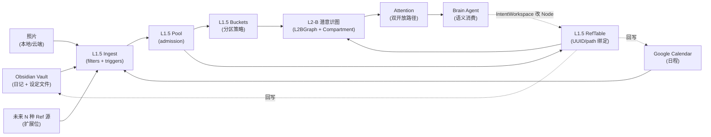

# 用户 Idea + 后端能力 + 三大真连接现状（2026-05-09）

> **本文角色**：替代被删除的 `Interface/goslo_app_game_overview_asset_brief_20260507.md`。
> user 原话：「希望这个文件产出的是我的 idea 和项目介绍，方便我出去设计 Web 工作区、AR App 布局设计 + App 2D 工作区有依据文件和 idea。其实更应该整理整理后端的功能 和 我的 idea 原话 和需求什么的。」
> **本文不是接口设计**（接口设计在 `Interface/INDEX.md`）；是**意图 + 能力 + 缺口**的对账，给设计依据。

---

## §1 项目核心 idea（user 原话保留区）

### §1.1 L1.5 总目标（2026-05-09 user 原话）

> 「这个 L1.5 的最终目标是，能把一堆外部 Ref 信息源，比如 Obsidian 的日记文件 和（后续扩展只要对接就行）进 L2-B 潜意识 的管理模块。」

**翻译**：L1.5 = "外部 Ref 信息源的统一 ingest 入口 + 桶分区 + Ref 表绑定"，把异构源（Obsidian / 照片 / Google 日程 / 未来 N 种）规整成 L2-B 潜意识图可消费的 Node + Edge。

### §1.2 Google 日程读写流程构想（2026-05-09 user 原话）

> 「Google 日程的真连接（这个现在在 nanobot 是连接上了，不知道是通过 MCP 还是什么的，其实我还是更希望能不消耗 token，现在应该是靠 nanobot 通过指令拿到 Google 的一些日程信息？我还没研究格式 和怎么 一键转换格式成 Node 加到 Google 桶里 和 日程的增删改查 nanobot 要修改 Node 导出并回写给 Google，GOSLO 的语音播报和对话里改日程用 IntentWorkspace 同样是改 Node 再传回指令到 Google 吧？现在应该是这样设计的？总之还没具体实现，只有架构能力有部分核心接口，没有业务接口」

**翻译**：双向 sync 数据流构想（待业务化）：
- 读：Nanobot/MCP → Google 日程 → Nanobot 转 Node 格式 → 进 GOOGLE_CALENDAR 桶
- 写：GOSLO 语音 / 对话 → IntentWorkspace 改 Node → Nanobot 把 Node 回写 Google
- 关键约束：**低 token 成本** — 不能每次拿日程都灌进 LLM context

### §1.3 三类工作区愿景

| 工作区 | 用途 | 当前状态 |
|:--|:--|:--|
| **AR App**（unity/ArSpike） | 海盗主题 AR 互动；放大镜 / 望远镜 / 镜片滤镜 / 鹦鹉栖手 / 纸条递交 | 接口工作区 + ECP 骨架已有；UI 资产 user 自管 Figma |
| **Web 工作区 / 控制台** | 开发期可视化 + 配置：DSG 节点查看 / Ref 仓库 / 模块状态 / 菜单画布管理 | 待开 chat (`chat_launches/web_console_launch_20260509.md`) |
| **App 2D 工作区**（P2.5 新需求） | nanobot 汇报 + Google 日程批改 + 工作区模块连接（在 AR App 里 / 桌面端独立） | Sub-Chat A 启动 prompt 已 archive；待重新规划 |

> 详见 `Interface/legacy_issues_split_20260507.md §1` 新 P2.5 需求条目。

---

## §2 后端能力清单（按模块；给设计 chat 当能力锚点）

> 真源详见 `module_map_p2.md`；本节是面向"我能调什么 / 我有什么数据"的速查。

### §2.1 Bus（传输层）

- **三层协议**：DataChannel ≤ 8 KB 遥测 / RPC Reliable 命令 / Redis Stream 长任务（详见 `bus_v4.md`）
- **能力**：Unity ↔ Brain 实时控制 / Brain ↔ Nanobot 长任务派发 / Brain ↔ DSG 触发器分发
- **A10 依赖**：A10-independent（Castle 常驻）

### §2.2 Brain（云端大脑）

- **Agent**：Gemini Live + 10 个 function_tool（fly_to / animate / dispatch_task / remember / query_memory / query_scene / set_mode / identify_object / manage_episode / ...）
- **新增 P2.5 能力**（已落代码 `backend_interface_refinement_20260507.md`）：
  - **Persona** 外挂（`brain/personas/<id>.md`）+ 4-block menu_registry + preset_loader
  - **IntentWorkspace** 升级：disk recovery + scope chain + pressure callbacks + role helpers
  - **L2-B baseline algorithms**：clustering + IterativeSpreadingActivation + cross-compartment tagging
  - **4 active BB keys + watcher registry**（bb_schema.py + bb_watchers.py）
- **A10 依赖**：A10-independent

### §2.3 Scheduler（py-trees BT）

- **三层调度面**：Reflex（毫秒）/ Intent（语义）/ Task（长任务）
- **Blackboard V2** 4-scope 链：Session / Episode / Task / Tick
- **能力**：BT 路由 + 行为优先级 + 超时 + 决策日志

### §2.4 DSG（感知耦合层 L1.5 / L2-A / L2-B）⭐ L1.5 已升级完成

- **L1.5（管理面，view-only）**：
  - **Pool**（`l1_5/pool.py`）：节点准入策略（PoolAdmissionPolicy 可注册）
  - **Buckets**（`l1_5/buckets.py`）：6 个 baseline 桶 = MAIN / OBSIDIAN_SETTING_DAILY / **OBSIDIAN_SETTING_ROLEPLAY** / **GOOGLE_CALENDAR** / AUTONOMOUS_CURIOSITY / ROLEPLAY_TEMP；可运行时 register 自定义桶
  - **RefTable**（`l1_5/ref_table.py`）：8 种 RefKind = GRAPHITI_UUID / **OBSIDIAN_UUID** / **PHOTO_PATH** / URL / RICH_DOC / VIDEO_SHORT / AUDIO_CLIP / OTHER；4 级健康度 = HEALTHY / UNVERIFIED / STALE / BROKEN
  - **Timeline**（`l1_5/timeline.py`）：Episode + IntentEvent 时间轴
  - **SceneSnapshot**（`l1_5/scene_snapshot.py`）：DESKTOP_WEBCAM + AR_HANDHELD 2 baseline
- **L2-B（潜意识图）**：
  - **L2BGraph** 单图 + Compartment view（不分图，按视角组织）
  - **Attention** 双开放路径（字段层 payload + 机制层 RustworkX；骨架 vs 血肉）
  - **NodeKind 6 项 / EdgeKind 8 项 enum 锁**（Phase 4 §8 L1）
- **触发器（12 个）**：4 既有（calendar / message / scene_context / ssot_enrichment）+ 5 新（scene_switch / intent_event_boundary / roleplay_mode / **goslo_curiosity** / **idle_archive**）+ 3 base（base / runner / __init__）
- **Ingest filters（10 个）**：cv_track / text_source / gemini_transcript / transcript_extractor / **user_tag**（Obsidian double-link）/ tool_result / **autonomous_curiosity** / runner / base / __init__
- **A10 依赖**：L2-B = A10-independent；L1 / L2-A = A10-required

### §2.5 Memory（Graphiti + FalkorDB + 三阶段工作记忆）

- **Graphiti** 客户端：episode 时间线 + group_id 分区 + custom entity types
- **FalkorDB**（替代 Neo4j）：~100-500 MB 内存，Castle 2C8G 友好
- **三阶段归档**（`dsg_protocol_archive_v1`）：hot 内存（IntentWorkspace）→ cold 硬盘（disk recovery）→ nanobot 闲时归档
- **A10 依赖**：A10-independent

### §2.6 外挂生态（Bus 之外的服务化能力）

- **Nanobot**（fork from HKUDS/nanobot）：后台 Agent 任务 + heartbeat + cron + Redis 松耦合
- **Vision-Agents (SVA)**：VideoProcessor + Gemini Realtime
- **LiveKit Agents**：Worker / Room / RPC / DataChannel
- **MCP 接入点**：当前已知 = Google Calendar MCP（user 自述「nanobot 那边连上了」）

---

## §3 L1.5 → L2-B Ref 化总目标 + 当前状态对账

### §3.1 总目标（user §1.1 原话翻译）



### §3.2 当前对账（架构能力 vs 业务接口）

| 维度 | 架构能力 | 业务接口 | 缺口 |
|:--|:--|:--|:--|
| **入口分流** | ✅ Ingest 10 filters + 12 触发器 | ⚠️ 只有 cv_track / message / 桌面模拟跑通；user_tag / autonomous_curiosity 等仅有骨架 | **真 Obsidian Vault 监听 / 真照片导入触发器 / 真 Google sync 写回** |
| **桶分区** | ✅ 6 baseline buckets + 自定义桶可注册 | ⚠️ 桶定义在；准入策略没真挂源 | **每桶的 admission policy 业务化** |
| **Ref 绑定** | ✅ RefTable + 8 RefKind + 4 健康度 | ⚠️ RefBinding 接口在；verify_ref / health_report baseline-binary | **真 Obsidian UUID 同步 / 真照片路径校验 / 真 URL 健康检查** |
| **节点本体** | ✅ L2BGraph 单图 + 6 NodeKind + 8 EdgeKind 锁 | ⚠️ 节点 CRUD 只在 dsg/l2b_graph.py 内部；Web 控制台读 / 改没接 | **节点查询 / 修改的 read API + write API（Web 控制台 read-only 优先）** |
| **注意力** | ✅ IterativeSpreadingActivation + threshold 锁 + decay 策略可注册 | ⚠️ baseline 算法在；具体 scope 业务激活规则缺 | **每个业务场景的 attention scope 定义** |
| **回写** | ⚠️ IntentWorkspace 升级完成；nanobot dispatch_task 在 | ❌ 没真回写 Obsidian / 没真回写 Google | **3 条回写链路全部业务化** |

---

## §4 三大真连接现状（user 关心的真任务）

### §4.1 Obsidian 真连接

**架构能力**（已具备）：
- `dsg/ingest/user_tag_filter.py` — 处理 `[[name]]` + `uuid::...` 结构化 payload
- `dsg/triggers/ssot_enrichment_trigger.py` — 上行 Obsidian payload 到 user_tag_filter
- 3 个 Obsidian 桶（OBSIDIAN_SETTING_DAILY / OBSIDIAN_SETTING_ROLEPLAY + Ref-加强通过 `meta.obsidian_uuid` 引用）
- RefKind.OBSIDIAN_UUID

**业务接口缺口**（待 chat）：
- 真 Vault 监听（文件变化 → ssot_enrichment_trigger）— Obsidian 这端怎么发通知到 ssot_enrichment_trigger？文件 watcher / Obsidian plugin / 周期 scan？
- 3 子类语义分流逻辑（Ref-加强 / 设定-日常 / 设定-Roleplay 路由判定）
- UUID 不存在时的拒绝路径（freeform 走 text_source_filter USER_EXPLICIT 通道）
- 不需要 Web 写回（user 原话「我们可以直接用 Obsidian」）

**入口**：`chat_launches/obsidian_realconnect_launch_20260509.md`

### §4.2 照片真存放和绑定

**架构能力**（已具备）：
- Phase 4 PhotoNode 字段（reference_image_path / last_sighting_path）
- RefKind.PHOTO_PATH + RefBinding
- L7 锁：PhotoEvent 不自动建 ObjectNode（Phase 4 §8）
- identify_object 1.9s 预算 + captureSnapshot

**业务接口缺口**（待 chat / 待规划）：
- 照片真存哪：Castle 本地 / 云对象存储 / FalkorDB blob？
- 照片到节点的真绑定流程（拍照 → 存 → 写 PHOTO_PATH RefBinding → 链到 ObjectNode）
- 真路径校验：verify_ref 实现（当前是 baseline-binary）
- AR App 端拍照入口（菜单 / 望远镜 / 自动注意力框？）

**待办标签**（已在 cross_chat_pending_registry）：
- NEED-P2.5-* 相关标签查 `cross_chat_pending_registry_20260507.md` §5

### §4.3 Google Calendar 真连接

**架构能力**（已具备）：
- `dsg/triggers/calendar_trigger.py` — 三层提醒（DIGEST / PREP / IMMINENT）+ 安静时段（23:00–07:00）+ Cooldown
- 已订阅 nanobot 的 `calendar_result` event 通道
- BucketKind.GOOGLE_CALENDAR
- IntentWorkspace 改 Node 链路就绪

**Nanobot 侧现状**（user 自述）：
- Google 日程已通过 nanobot + Google Calendar MCP 连上（OAuth user 已配）
- nanobot 拿日程 → result_channel → calendar_trigger 处理（**当前路径**）

**业务接口缺口**（待 chat）：
- ⚠️ **格式约定**：nanobot 返回的 raw event 字段 → Node 字段 的映射没固化（user 原话「我还没研究格式」）
- ⚠️ **一键转换**：format_google_event_to_node() 函数缺
- ⚠️ **CRUD 回写**：
  - 增：GOSLO 语音 / 对话 → IntentWorkspace 改 Node → nanobot dispatch_task("create_calendar_event") → Google
  - 删：同上
  - 改：同上
  - 查：nanobot 已能拿
- ⚠️ **Token 成本控制**：user 原话「更希望能不消耗 token」— 大量日程不能灌 LLM context；可考虑：
  - calendar_trigger 在 BB 写聚合摘要（"今日 5 件事" 替代逐条）
  - 仅在 IntentWorkspace 内拉详情（pressure-aware）
  - GOSLO 语音命令时按需触发（不主动列）

**待办**（建议在 cross_chat_pending_registry 加 NEED）：
- NEED-BIZ-GCAL-FORMAT-MAPPING：固化 Google event → Node 字段映射
- NEED-BIZ-GCAL-CRUD-WRITEBACK：增删改 3 个 nanobot 工具或扩展现有 dispatch_task
- NEED-BIZ-GCAL-TOKEN-BUDGET：定义 BB 聚合策略（不灌 context）

---

## §5 待提醒：未提交的代码

P2.5 后端实施 + L1.5 实施完成报告对应的代码改动**至今未 commit**：

```
未提交（M / ??）:
  src/parrot/brain/intent_workspace.py / intent_workspace_backend.py / soul.py
  src/parrot/brain/{persona_loader, menu_registry, preset_loader, bb_watchers, personas/}
  src/parrot/dsg/l1_5/scene_snapshot.py
  src/parrot/dsg/l2b/__init__.py / attention/mechanism.py / l2b_graph.py / clustering.py
  src/parrot/shared/bb_schema.py / parrot_actions.py
  tests/test_brain/test_intent_workspace_phase3_upgrade.py
  tests/test_dsg/test_l2b_baseline_algorithms.py
  data/presets/default.json
  .cursor/memory/architecture/Interface/concept_dictionary_20260507.md
  .cursor/memory/architecture/Interface/menu_design_complete_20260507.md
  .cursor/memory/architecture/cross_chat_pending_registry_20260507.md
  .cursor/memory/architecture/dsg/dsg_current_state_distilled.md
  .cursor/memory/architecture/backend_interface_refinement_20260507.md（??）
  .cursor/memory/architecture/protocol_snapshot_p4.md（?? + 旧位置 D）
```

**建议**：开一个独立 commit chat，按 `commit_guidelines.md` 拆 2-3 个原子 commit：
1. `feat(brain): P2.5 - persona/menu/preset/IntentWorkspace upgrade + L2-B baseline algos` （src/ 实施 + 对应 tests）
2. `docs(p2.5): backend_interface_refinement + protocol_snapshot_p4 ratification + Interface workspace updates`
3. （可选）`chore: relocate protocol_snapshot_p4 from .cursor/memory/ root to architecture/`

---

## §6 给三类工作区设计的"能力锚点"（设计 chat 直接抄）

### §6.1 Web 工作区设计依据

read-only 优先。可读字段 / 端点候选：

- DSG：l2b_graph 全图 dump / 单节点详情 / 桶分区视图 / Ref 表 / 健康度统计 / Timeline / 注意力分数
- Brain：menu_registry snapshot / preset list / IntentWorkspace 当前 scope chain / BB 4 keys 当前值 / persona_loader list
- Bus：注册表 / 心跳 / 通道堵塞监测
- Scheduler：当前 BT 路径 / 4-scope BB 跨 scope diff
- Memory：Graphiti episode 时间线 / group_id 分区列表 / 三阶段归档队列长度

### §6.2 AR App 布局设计依据

海盗主题（详见 `lore/ideas.md`）：
- HUD：眼罩 skin / 望远镜替放大镜 / 半边黑色遮挡 / 镜片滤镜
- 工具柜：4 类块菜单（model / persona / mode / scene）+ 预设
- 注意力框：基于 L2-B attention 分数渲染
- 纸条递交：可猫爪伸出（Paper Please / Last Report 风格）
- 拍照入口：望远镜 / 注意力框点击 / 菜单按键

### §6.3 App 2D 工作区设计依据（P2.5 新需求）

3 子任务（详见 `Interface/legacy_issues_split_20260507.md §1`）：
- nanobot 汇报批改：nanobot 跑完后台任务 → 回报到 2D 工作区 → user 批改 / 接受 / 撤回
- Google 日程批改：拉日程 → 2D 列表 → user 改 → 写回（流程见 §4.3）
- 工作区模块连接：把多个 2D 模块（汇报 / 日程 / 笔记 / Ref 表）按节点画布串联

---

> **本文不是设计 SSOT**（设计 SSOT 在 `Interface/menu_design_complete_20260507.md` / `ar_app_flow_ui_design.md`）。是**给设计 chat 的 idea + 能力 + 缺口对账表**，下一步 user Figma 自管 UI 时直接抄 §6 当能力锚点；任何"该做什么 / 该用什么后端 / 缺什么业务接口"问题先回到本文 §2-§4。
