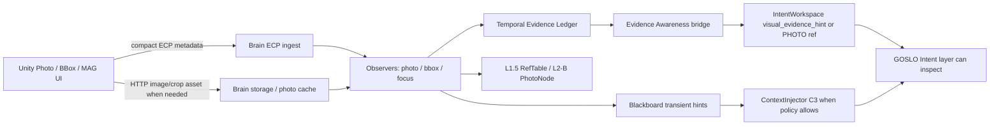

# App Evidence Tools: BBox / MAG / Photo / IntentWorkspace (2026-05-15)

Owner: Unity App chat
Status: active handoff / implementation guardrail
Category: App business interface
Scope: Formal App Photo, BBox, MAG/Focus, time-aligned evidence, IntentWorkspace staging, GOSLO awareness boundary
Source: Web Console audit on 2026-05-15; `parrot-cursor-skill-bridge`, `sva-vision-agents`, `livekit-agents`, `parrot-bus-orchestration`; code/test readback from Brain, Web Console, and Unity formal App scripts
Related TODO: APP-005, APP-015.21, APP-015.27, APP-015.29, APP-022, APP-024, APP-026, WEB-015
Related SSOT:
- `.cursor/memory/architecture/Interface/time_aligned_evidence_interface_20260515.md`
- `.cursor/memory/architecture/Interface/photo_memory_awareness_true_connection_guide_20260509.md`
- `.cursor/memory/architecture/Interface/goslo_trigger_awareness_taxonomy_20260515.md`
- `codex_workspace/design_workspace/backend_interface_map/core_interface_candidate_queue_20260513.md` (`CORE-012`, `CORE-014`)
- `codex_workspace/design_workspace/backend_interface_map/app/unity_livekit_ecp_sva_data_flow_map_20260515.md`

This file is the App-facing handoff for evidence tools. It answers the current
question: what is actually runnable, what can App continue building now, and
what must remain disabled until phone/stability/evidence-contract gates pass.

## 1. Current Readiness

| Flow | Current status | App may use now? | Notes |
|:--|:--|:--|:--|
| CAM / Photo capture | Backend and Unity owner path exist. Focused tests pass. | Yes, behind existing main-ready and phone-safe upload gates. | `FormalHomeToolController.CapturePhoto()` delegates to `PhotoController`, which sends `photo.taken_preview` by ECP and uploads full JPEG by HTTP/storage. |
| Photo -> IntentWorkspace | Implemented in backend observer. | Indirectly yes. | Backend stages short preview refs by Photo Awareness and full photo asset refs after upload. App does not write IntentWorkspace directly. |
| Photo -> L2-B / RefTable | Implemented in backend observer. | Indirectly yes. | Backend creates/updates `NodeKind.PHOTO` and binds `RefKind.PHOTO_PATH` through L1.5 RefTable. Unity must not write L2-B directly. |
| Photo Awareness -> GOSLO | Implemented as C3 context only. | Yes through App HTTP awareness setting. | `AWARE_SILENT` / `AWARE_REACT` can notify GOSLO as no-interrupt chat context after preview staging. C4/interrupt is not enabled. |
| BBox / Focus backend refs | Implemented at ECP observer/test level. | Yes for compatibility/dev tests. | `bbox.placed` / `focus.anchored` create unresolved refs and feed the older conservative threshold path. Do not use these as high-frequency drag packets. |
| BBox / MAG lifecycle -> Evidence -> IntentWorkspace | Backend V1 implemented. | Yes for App controller implementation behind feature flag. | `POST /api/app/visual-tool/event` and ECP `visual_tool.lifecycle` accept semantic tool phases, record `TimeAlignedSampleRef`, bind BBox/Focus refs, stage IntentWorkspace, and optionally C3. |
| MAG / Magnifier | Implemented as Focus-family visual-tool lifecycle. | Yes for App controller implementation behind feature flag. | MAG defaults to `intent_only`; C3 only on `explicit_send`, explicit `delivery_preference=c3`, or later reviewed policy. |
| identify_object from BBox/MAG/Photo | Backend evidence resolver exists. | App should only provide evidence refs/assets. | `identify_object` is GOSLO Intent-layer behavior. It resolves `evidence_id` / `bbox_ref_id` / `focus_ref_id` / `target_time_ms`; App should not call snapshot RPC or send image bytes by RPC. |
| Real phone proof | Partial for Photo/CAM; not complete for BBox/MAG. | Required before enabling BBox/MAG. | iQOO Neo9 still needs full media/lifecycle/network/AR/video proof under APP-024. |

Bottom line for App Chat:

- Continue CAM/Photo integration now, but only through `FormalHomeToolController`
  and `PhotoController`, with a phone-reachable `photoUploadUrl` or
  `photoUploadHost/photoUploadPort`.
- Continue BBox/MAG visual design, animation, touch ergonomics, and controller
  implementation behind feature flags. The backend now exposes
  `POST /api/app/visual-tool/event` plus ECP `visual_tool.lifecycle`, so App is
  no longer blocked on a backend packet surface.
- Do not treat the new route as phone-proof by itself. Production toolbar
  enablement still needs the App phone pass, UI feel review, and optional tool
  crop/upload path if the controller wants rendered image assets.
- Do not add image-byte RPC, `captureSnapshot` RPC, or Unity-side direct L2-B
  writes.

## 2. Channel Ownership

| Channel | Use for these tools | Do not use for |
|:--|:--|:--|
| App HTTP | Menu state, camera mode, photo awareness policy, photo asset upload, future explicit tool settings. | Per-frame drag, binary RPC images, direct Graphiti/L2-B surgery. |
| ECP reliable event | `photo.taken_preview`, `bbox.placed`, `bbox.removed`, `focus.anchored`, `focus.released`, compact evidence metadata, optional `payload.timebase`. | Full images, long documents, durable menu snapshots. |
| ECP lossy tick | Future high-frequency drag/pose tendencies only. | Final BBox/Focus facts, photo completion, command success. |
| LiveKit media | Continuous mic/video streams and backend frame sampling. | Auditable still-photo storage by itself. Store evidence refs separately. |
| LiveKit RPC | Compact in-room commands like `setVideoTier`, `flyTo`, `animate`, START/session sync. | Photo bytes, captureSnapshot image payloads, full menu/canvas data. |
| Temporal Evidence Ledger | Backend canonical sample/ref timeline for Photo/BBox/MAG/ASR/CV. | Unity-owned persistent DTO or long-term photo archive. |
| IntentWorkspace | Passive working set for GOSLO Intent-layer refs and plans. | Strong notification by itself, direct Unity CRUD, or App-side L2-B mutation. |

### Visual Tool Production Surface

App now has a backend-owned lifecycle route:

- HTTP: `POST /api/app/visual-tool/event`
- HTTP asset upload: `POST /api/app/visual-tool/asset/{asset_id}`
- ECP reliable event: `visual_tool.lifecycle`
- Web debug mirror: `POST /api/vision/evidence/tool-lifecycle`
- Receipt BB key: `transient/visual_tool_lifecycle_receipt`

Required payload fields:

```json
{
  "tool_id": "bbox_or_mag_stable_id",
  "tool_kind": "bbox | mag | focus",
  "interaction_phase": "preview_start | hover | drag_update | resize_update | dwell_tick | lock | unlock | settings_open | confirm | explicit_send | cancel | release",
  "region": {
    "x": 0.25,
    "y": 0.30,
    "width": 0.40,
    "height": 0.25,
    "coordinate_space": "screen_normalized"
  },
  "timebase": {
    "clock_domain": "unity",
    "wall_time_ms": 1770000000000,
    "monotonic_ms": 123456,
    "source_id": "unity:formal_app"
  },
  "delivery_preference": "default | silent | intent_only | c3 | c4"
}
```

Optional fields: `pose`, `source_surface`, `asset_ref`, `asset_path`,
`asset_uri`, `mime_type`, `evidence_id`, `attention_hint`, `subject_hint`,
`label`, and `meta`.

If the tool has a rendered crop/preview image, upload raw bytes first:

```http
POST /api/app/visual-tool/asset/bb_crop_001
Content-Type: image/png
X-Parrot-Tool-Id: bb_001
X-Parrot-Tool-Kind: bbox
X-Parrot-Tool-Phase: confirm
X-Parrot-Timebase: {"clock_domain":"unity","wall_time_ms":1770000000000}
X-Parrot-Region: {"x":0.25,"y":0.30,"width":0.40,"height":0.25}
```

The response returns `asset_path` and an `image_asset` evidence row. Put that
`asset_path` into the following lifecycle event so IntentWorkspace/GOSLO sees a
real stored image reference instead of only a region anchor.

Default body-feel policy:

- BBox `confirm` / `explicit_send` means strong framed evidence: stage
  IntentWorkspace and request C3 context, with `allow_interrupt=false`.
- MAG `confirm` means user inspection: stage IntentWorkspace silently by
  default.
- MAG `explicit_send` or `delivery_preference=c3` requests C3 context.
- `delivery_preference=c4` is accepted for audit but downgraded to C3 in V1;
  no C4 speech/interrupt is enabled.
- `cancel` / `release` unbinds the tool ref and does not notify GOSLO.

## 3. Accepted Data Flow



Important interpretation:

- IntentWorkspace staging is not a direct interruption. It means GOSLO has a
  passive working-set ref available.
- The first strong notification path is Blackboard notice plus `ContextInjector`
  C3 chat context. It still does not speak over the user.
- C4 / interrupt / startled behavior is not approved for these tools yet.

## 4. Photo Flow For App

Current formal owner:

- `unity/ArSpike/Assets/ParrotApp/Runtime/Scripts/UI/FormalHomeToolController.cs`
- `unity/ArSpike/Assets/ParrotApp/Runtime/Scripts/Photo/PhotoController.cs`

Current backend owners:

- `src/parrot/brain/photo_upload_server.py`
- `src/parrot/brain/observer/photo.py`
- `src/parrot/brain/photo_awareness.py`
- `src/parrot/brain/vision/evidence.py`

Operational flow:

1. User taps CAM after formal main-ready.
2. `FormalHomeToolController` verifies LiveKit/Brain/main-ready and rejects
   loopback upload endpoints on phone.
3. `PhotoController` captures a JPEG from `Camera.main`.
4. It sends compact `photo.taken_preview` ECP metadata:
   `photo_id`, pose, `bbox_refs`, `focus_refs`, candidate node UUID, preview
   JPEG base64, and legacy `ts_ms`.
5. It uploads the full JPEG to
   `POST /upload/photo/{photo_id}` with header
   `X-Photo-Preview-Event-Id`.
6. Backend stores the file under `data/photos/{yyyy-mm-dd}/{photo_id}.jpg`.
7. Backend publishes `photo.asset_uploaded`, updates the PhotoNode, records an
   `image_asset` evidence row, stages IntentWorkspace photo refs, and binds
   L1.5 RefTable.

Known gap for App to close next:

- Backend upload already accepts `X-Parrot-Timebase` or discrete
  `X-Parrot-*` headers. Unity `PhotoController` still primarily sends `ts_ms`
  and does not yet send the new upload timebase header. Add this before calling
  time-aligned Photo fully complete on device.

Recommended upload timebase header:

```json
{
  "clock_domain": "unity",
  "wall_time_ms": 1770000000000,
  "monotonic_ms": 123456,
  "media_time_us": 0,
  "sequence": 12,
  "estimated": false,
  "source_id": "unity:formal_app"
}
```

## 5. BBox / MAG / Focus Flow For App

Current Unity reference owners:

- `unity/ArSpike/Assets/ParrotApp/Runtime/Scripts/Attention/BBoxController.cs`
- `unity/ArSpike/Assets/ParrotApp/Runtime/Scripts/Attention/FocusController.cs`

Current formal toolbar owner:

- `FormalHomeToolController.ToggleBBox()` and `ToggleMagnifier()` return
  deferred statuses and do not mount/publish active BBox/Focus events.

Current backend owners:

- `src/parrot/brain/observer/bbox.py`
- `src/parrot/brain/observer/focus.py`
- `src/parrot/brain/observer/visual_tool.py`
- `src/parrot/brain/vision/tool_lifecycle.py`
- `src/parrot/dsg/attention/threshold.py`
- `src/parrot/brain/vision/evidence_awareness.py`
- `src/parrot/brain/vision/evidence.py`

Current backend behavior:

1. `bbox.placed` / `focus.anchored` register unresolved refs.
2. `FocusBboxThreshold` accumulates attention weight.
3. Threshold crossing publishes `attention.threshold.crossed`.
4. Threshold crossing writes `transient/current_attention_hint`.
5. Threshold crossing records a `bbox_focus` evidence row.
6. Evidence Awareness tries to resolve the nearest stored frame/photo by
   `bbox_ref_id`, `focus_ref_id`, or sample time.
7. If ready evidence exists, backend stages `visual_evidence_hint` in
   IntentWorkspace and writes `transient/evidence_awareness_notice`.
8. If no image/frame exists, backend records a pending evidence request instead
   of analyzing an unrelated latest frame.
9. New formal route `POST /api/app/visual-tool/event` accepts BBox/MAG
   lifecycle packets, records a ledger sample immediately, binds the matching
   BBox/Focus ref, stages IntentWorkspace on stable milestones, and applies
   backend-owned C3 policy.
10. New ECP reliable event `visual_tool.lifecycle` bridges into the same
    handler for the DataChannel path.

Formal lifecycle packet shape for BBox:

```json
{
  "tool_id": "bb_<guid8>",
  "tool_kind": "bbox",
  "interaction_phase": "confirm",
  "label": "optional user label",
  "region": {
    "x": 0.25,
    "y": 0.30,
    "width": 0.40,
    "height": 0.25,
    "coordinate_space": "screen_normalized"
  },
  "pose": {},
  "source_surface": "formal_home.mag_bbox",
  "timebase": {
    "clock_domain": "unity",
    "wall_time_ms": 1770000000000,
    "monotonic_ms": 123456,
    "source_id": "unity:formal_app"
  },
  "delivery_preference": "default"
}
```

Formal lifecycle packet shape for MAG uses the same route and Focus-family ref:

```json
{
  "tool_id": "mag_<guid8>",
  "tool_kind": "mag",
  "interaction_phase": "confirm",
  "region": {
    "x": 0.42,
    "y": 0.40,
    "width": 0.20,
    "height": 0.20,
    "coordinate_space": "screen_normalized"
  },
  "pose": {"zoom": 2.0},
  "source_surface": "formal_home.mag",
  "timebase": {
    "clock_domain": "unity",
    "wall_time_ms": 1770000000000,
    "monotonic_ms": 123456,
    "source_id": "unity:formal_app"
  },
  "delivery_preference": "intent_only"
}
```

If App produces an actual crop/rendered image, send image bytes by
HTTP/storage and put only the resulting asset ref / evidence id in ECP.

## 6. IntentWorkspace Rules

IntentWorkspace is owned by the Brain Intent layer:

- Photo preview and full asset refs are staged by backend observers.
- Visual evidence hints are staged by backend evidence awareness.
- Plan/nanobot/report refs may be scoped by actor/Plan id.
- App should not treat IntentWorkspace as a local Unity bucket or a special
  `NodeKind`.

For BBox/MAG:

- The tool creates attention/evidence refs.
- The backend may stage `visual_evidence_hint` when evidence is ready.
- L2-B sync is a later graph/link policy, not a Unity-side direct write.
- Do not create `WorkspaceNodeKind` for "this is in IntentWorkspace." Use
  overlay/status metadata and Ref/IntentWorkspace linkage instead.

## 7. App Implementation Checklist

CAM / Photo now:

- Configure a phone-reachable `photoUploadUrl` or `photoUploadHost` /
  `photoUploadPort`; do not use `127.0.0.1` on device.
- Use `FormalHomeToolController.CapturePhoto()` as the formal entry.
- Keep PhotoController as the only owner of photo ECP metadata and HTTP upload.
- Add `X-Parrot-Timebase` or discrete `X-Parrot-*` headers in the next App
  slice.
- Keep `photo.asset_uploaded` Brain-owned; Unity must not publish it.
- Keep awareness policy changes through App HTTP, not direct Blackboard writes.

BBox/MAG now:

- Build UI/animation/touch ergonomics and real controllers behind a feature or
  developer flag.
- Use `POST /api/app/visual-tool/event` for App HTTP development, or ECP
  `visual_tool.lifecycle` when the formal DataChannel path is ready.
- Send high-frequency drag/resize locally; summarize stable milestones such as
  `lock`, `confirm`, `explicit_send`, `cancel`, and `release`.
- Do not call old snapshot RPC.
- Plan for optional crop/render asset upload through HTTP/storage; until then
  the route still records region/time evidence and can stage a text/ref hint.
- Include timebase and coordinate-space fields in every production packet.

Backend/App boundary:

- App owns visible tool affordance, animation, touch hit testing, AR/screen
  coordinates, and user feedback.
- Backend owns evidence alignment, threshold policy, GOSLO awareness delivery,
  identify_object, L1.5/RefTable/L2-B promotion, and audit receipts.

## 8. Validation Snapshot

2026-05-15 focused audit validation:

```text
.venv\Scripts\python.exe -m pytest `
  tests/test_ecp_event/test_w8_photo_upload_server.py `
  tests/test_ecp_event/test_w8_observer_photo.py `
  tests/test_ecp_event/test_observer_bbox_focus.py `
  tests/test_ecp_event/test_threshold_emit.py `
  tests/test_ecp_event/test_attention_threshold.py `
  tests/test_brain/test_evidence_awareness_context_injector.py `
  tests/test_brain/test_intent_workspace_lifecycle.py `
  tests/test_brain/test_time_aligned_evidence.py `
  tests/test_unity/test_app_v1_meta_ui_static.py -q

118 passed
```

This proves module-level backend/Unity guard behavior. It does not replace
the required iQOO Neo9 phone pass for camera upload, AR/video, reconnect,
Bluetooth/mic routes, and formal BBox/MAG production feel.

2026-05-16 backend unblock validation:

```text
.venv\Scripts\python.exe -m pytest `
  tests/test_brain/test_visual_tool_lifecycle.py `
  tests/test_brain/test_app_v1_monitor.py::test_console_action_endpoints_drive_app_tool_flows `
  tests/test_brain/test_app_first_version_facade.py::test_tool_cabinet_documents_camera_and_attention_tools `
  tests/test_web_console/test_web_console_server.py::test_vision_evidence_routes_are_secret_safe_and_record_timeline -q

7 passed
```

This proves the App-facing route, ECP bridge, BBox/MAG policy defaults,
IntentWorkspace staging, C3/no-interrupt receipts, and Web debug route at
module/route level. It still does not replace the physical phone proof.

## 9. Open Gaps

| Gap | Owner | Blocker / next action |
|:--|:--|:--|
| Unity Photo upload timebase header | App | Add `X-Parrot-Timebase` or discrete `X-Parrot-*` headers from capture time. |
| BBox/MAG App controller implementation | App | Build controllers against `/api/app/visual-tool/event` / `visual_tool.lifecycle`; send stable milestones, not every pointer frame. |
| BBox/MAG phone stability | App | Complete APP-024 phone pass before enabling formal toolbar emission. |
| LiveKit screen/video evidence smoke | Web/backend + App | Prove sampler/frame cache with real Unity video or screen-share source. |
| C4 / interrupt / startled awareness | backend + product review | Not enabled. Needs session policy, safe-turn lifecycle, cooldown, and user approval. |
| Evidence -> L1.5/L2-B apply | Web/backend | Currently draft/preview first. Real apply waits for CORE-006/CORE-012 review. |
| Tool visual crop asset route | App + backend | Basic lifecycle works without an image asset. Crops/rendered previews still need HTTP/storage; do not send image bytes by ECP/RPC. |

## 10. Decision For App Chat

App can continue with:

- Photo/CAM UI and phone validation.
- Formal toolbar polish.
- MAG/BBox controller implementation, visual design, animation, and local
  interaction prototypes behind a feature flag.
- Adding timebase metadata to Photo upload and future tool packets.

App should not yet:

- Treat production MAG/BBox as phone-proof before APP-024 validation.
- Add image-byte RPC or revive snapshot RPC.
- Write L2-B/Graphiti/FalkorDB directly.
- Treat IntentWorkspace as a Unity-owned bucket or a special NodeKind.

## 11. 2026-05-16 App Blocker Audit

This audit answers the current App-blocking question before Web Console returns
to the larger L2-B/Graphiti roadmap.

### Source Request Verbatim

The following is the user request that this audit must preserve. Keep this
source text here so App Chat can compare implementation choices against the
original intent, not only against a summarized handoff.

```text
1.现在App还不能完成Bbox和MAG工具了？也就是说仙子时间轴和那Cache，ECP 事件、Preview和captureSnapshot工具没升级好？也不会放IntentWorkspace和设计有触发器，C3 C4的通道也存在吧？ 
所以到底还差了那里？
之前我在App Chat要求现在不完成这两个工具是因为我们这后端在升级，现在升级的怎么样了，App能写控制器什么的了吗？还有按道理BBox 和 MAG 是到达阈值后，分别走 IntentWorkspace渲染图片 + C3 和 IntentWorkspace 渲染图片+ C3/不通知 对吧？现在的后端注意力计算是怎么联动前端的，这个注意力累加你分析分析完善的怎么样。
是要放在前端还是后端，后端是只提供一些注意力增加接口，具体累加和减少规则需要前端设计？后端够完善吗不会只增不减吧？要让前端来设计规则接口能力起码得给够一些？可以检查我们注意力在后端那前端要怎么持续传送状态，前端自己设计规则在拖动、放置、拉大拉小、选中，确认的的情况。
且BBox加注意力强是给GOSLO框东西用的，MAG 加注意力弱，MAG更多是用来放大画面、查阅文件的放大镜工具，只不过两个都是像素风格的metaUI，在注意力足够后或者确认后可以推送到IntentWorkspace和一个最终要的是ECP是否要通知后端和GOSLO用户的状态（在框住东西 还是在 拿放大镜看东西和批阅消息提醒和推出来的文件），退出来的文件是nanobot猫爪推出来的像素UI羊皮纸或者纸条汇报等等，纸条汇报时给User的，是nanobot给User的消息提醒，nanobt完成Task得到结果的种类也不知有给GOSLO来口头汇报、规则可以是让nanobot自己选推送对象。
你检查一下后端能力和接口是否完善，吧这个阻塞任务给加到那一堆我们新完成的TODOList之前，需求也给我固定好，我们先完成这个，然后继续修缮一下那个给App的接口知道指导文件和SSOT核心接口等，让App完成不要被后端阻塞。然后我再完成那个调查问卷。
```

UTF-8 readable copy:

```text
1.现在App还不能完成Bbox和MAG工具了？也就是说现在时间轴和那Cache，ECP 事件、Preview和captureSnapshot工具没升级好？也不会放IntentWorkspace和设计有触发器，C3 C4的通道也存在吧？
所以到底还差了那里？
之前我在App Chat要求现在不完成这两个工具是因为我们这后端在升级，现在升级的怎么样了，App能写控制器什么的了吗？还有按道理BBox 和 MAG 是到达阈值后，分别走 IntentWorkspace渲染图片 + C3 和 IntentWorkspace 渲染图片+ C3/不通知 对吧？现在的后端注意力计算是怎么联动前端的，这个注意力累加你分析分析完善的怎么样。
是要放在前端还是后端，后端是只提供一些注意力增加接口，具体累加和减少规则需要前端设计？后端够完善吗不会只增不减吧？要让前端来设计规则接口能力起码得给够一些？可以检查我们注意力在后端那前端要怎么持续传送状态，前端自己设计规则在拖动、放置、拉大拉小、选中，确认的的情况。
且BBox加注意力强是给GOSLO框东西用的，MAG 加注意力弱，MAG更多是用来放大画面、查阅文件的放大镜工具，只不过两个都是像素风格的metaUI，在注意力足够后或者确认后可以推送到IntentWorkspace和一个最终要的是ECP是否要通知后端和GOSLO用户的状态（在框住东西 还是在 拿放大镜看东西和批阅消息提醒和推出来的文件），退出来的文件是nanobot猫爪推出来的像素UI羊皮纸或者纸条汇报等等，纸条汇报时给User的，是nanobot给User的消息提醒，nanobt完成Task得到结果的种类也不知有给GOSLO来口头汇报、规则可以是让nanobot自己选推送对象。
你检查一下后端能力和接口是否完善，吧这个阻塞任务给加到那一堆我们新完成的TODOList之前，需求也给我固定好，我们先完成这个，然后继续修缮一下那个给App的接口知道指导文件和SSOT核心接口等，让App完成不要被后端阻塞。然后我再完成那个调查问卷。
```

### Terminology Boundary

This audit is about **visual-tool evidence attention**, not the future DSG L3
attention module.

- BBox/MAG attention here means user-tool intent signals: framed region,
  magnifier dwell, explicit confirm, optional tool crop asset, and notification
  preference.
- Backend support should stay simple and useful: parse tool state, accumulate
  bounded salience, align evidence, stage IntentWorkspace, and decide C3/C4
  policy.
- Do not turn this blocker into the full L3 attention/neural graph project.
  DSG L3 may later replace or consume these signals, but App should not wait
  for L3 to build BBox/MAG controllers.

### What Is Ready Enough For App Now

Photo/CAM is the only formal toolbar tool that can continue on the production
path now:

- `FormalHomeToolController.CapturePhoto()` is the formal entry.
- `PhotoController` owns preview ECP metadata and full JPEG HTTP upload.
- Backend observers stage Photo refs into IntentWorkspace, create/update
  PhotoNode/RefTable state, and route Photo Awareness as C3 no-interrupt
  context when the menu policy allows it.
- Next App fix: add `X-Parrot-Timebase` or discrete `X-Parrot-*` upload
  headers from the capture sample time. This is a small App task, not a
  backend blocker.

BBox and MAG can now continue as real controller work behind a feature flag:

- App may build pixel metaUI, drag/resize/confirm visuals, local preview boxes,
  magnifier glass behavior, hover feedback, and packet-builder code.
- App may call `POST /api/app/visual-tool/event` for HTTP development, or emit
  ECP `visual_tool.lifecycle` once the controller is wired to DataChannel.
- App should keep production toolbar enablement gated until APP-024 phone
  stability and UI feel review pass; this is no longer blocked by missing
  backend packet acceptance.
- App must not send image bytes through RPC/ECP and must not reintroduce
  `captureSnapshot`.

### What Backend Already Does

The backend evidence spine is real but conservative:

1. `bbox.placed` / `bbox.removed` and `focus.anchored` / `focus.released`
   register BBox/Focus refs and feed `FocusBboxThreshold`.
2. `FocusBboxThreshold` reads `global/attention_thresholds` on construction,
   so Unity Echo can tune `delta_focus`, `delta_bbox`, `threshold`, and
   `target_ttl_s` for new threshold instances.
3. Threshold crossing writes `transient/current_attention_hint`, publishes
   `attention.threshold.crossed`, records a `bbox_focus` evidence row, and asks
   Evidence Awareness to find a nearby stored frame/photo.
4. If a stored image/frame is found, backend stages an IntentWorkspace
   `visual_evidence_hint` and may deliver C3 context through `ContextInjector`.
5. If no image/frame is found, backend records a pending evidence request
   instead of analyzing an unrelated newest frame.

The existing backend path does not capture a new frame, does not upload a tool
crop, does not mutate L2-B, and does not do C4 speech/interruption.

2026-05-16 implementation update:

- Added `src/parrot/brain/vision/tool_lifecycle.py` with typed
  `VisualToolLifecyclePacket`, backend salience policy, ref binding,
  evidence-ledger recording, IntentWorkspace staging, C3/no-interrupt delivery,
  and audit receipt.
- Added ECP event type `visual_tool.lifecycle` and observer
  `src/parrot/brain/observer/visual_tool.py`.
- Added App HTTP route `POST /api/app/visual-tool/event`.
- Added App HTTP asset route `POST /api/app/visual-tool/asset/{asset_id}` for
  BBox/MAG rendered crop or preview bytes.
- Added Web debug route `POST /api/vision/evidence/tool-lifecycle`.
- Added BB key `transient/visual_tool_lifecycle_receipt` with writer
  `brain.vision.tool_lifecycle`.
- Updated App tool-cabinet read model: `magnifier_focus` and `boundary_box`
  now report `backend_ready` and expose `/api/app/visual-tool/event`.

### Current Attention Semantics

Backend should own the canonical salience/threshold policy, TTL, threshold
crossing, evidence alignment, GOSLO delivery policy, and future L1.5/L2-B
promotion. App should own the visible tool state and send semantic state
transitions. This split prevents each App surface from inventing a different
attention rule, while still leaving App free to design the touch feel.

Legacy threshold code is not a full attention model:

- BBox `placed` is treated as one strong explicit-confirm pulse
  (`delta_bbox=1.0`, default threshold `1.0`).
- Focus/MAG `anchored` is treated as a weak pulse (`delta_focus=0.2`, five
  pulses reach the default threshold).
- `removed` / `released` subtract and cap at zero.
- Stale targets are evicted on the next received event after `target_ttl_s`.
- There is no continuous decay tick yet.
- Formal BBox/MAG lifecycle phases now exist in
  `VisualToolEvidenceLifecycle.backend_v1`; they are still a bounded tool
  salience contract, not the future DSG L3 attention model.

Therefore App should not publish repeated `bbox.placed` while the user drags or
resizes. Use local UI state for dragging and either send lossy/coarse summaries
or stable lifecycle milestones through `/api/app/visual-tool/event` /
`visual_tool.lifecycle`.

Recommended near-term ownership:

| Concern | Owner | Reason |
|:--|:--|:--|
| Pointer/touch state, drag rectangle, resize handles, magnifier glass, hover/selected visuals | App | These are high-frequency UI feel and should not spam backend. |
| Semantic tool events: preview/update/confirm/cancel/release/dwell | App emits, backend interprets | App knows the UI state; backend owns shared meaning and audit. |
| Salience weights, thresholds, TTL, cooldown, C3/C4 policy | Backend | Keeps BBox/MAG/GOSLO behavior consistent across App/Web and future devices. |
| Optional local UI hint such as "this feels important" | App may send as `attention_hint` | It is a hint, not authority; backend still gates notification and memory writes. |
| IntentWorkspace staging, Evidence Ledger, Ref/L2-B promotion | Backend | App must not write Brain working memory or L2-B directly. |

### CORE-014 Packet

The formal Visual Tool Evidence Lifecycle packet is now implemented as
backend/App HTTP + ECP V1. It is ratified in the Time-Aligned Evidence SSOT as
an App/backend interface while Unity top-level DTOs remain unchanged:

```json
{
  "tool_event_id": "vtool_<id>",
  "tool_kind": "bbox | mag | focus",
  "interaction_phase": "preview_start | hover | drag_update | resize_update | dwell_tick | lock | unlock | settings_open | confirm | explicit_send | cancel | release",
  "region": {
    "x": 0.25,
    "y": 0.30,
    "width": 0.40,
    "height": 0.25,
    "coordinate_space": "screen_normalized"
  },
  "pose": {},
  "source_surface": "formal_home.tool_overlay",
  "timebase": {
    "clock_domain": "unity",
    "wall_time_ms": 1770000000000,
    "monotonic_ms": 123456,
    "source_id": "unity:formal_app"
  },
  "asset_ref": "",
  "asset_path": "",
  "asset_uri": "",
  "mime_type": "",
  "evidence_id": "",
  "attention_hint": 0.0,
  "delivery_preference": "default | silent | intent_only | c3 | c4",
  "subject_hint": "",
  "label": "",
  "meta": {}
}
```

`asset_ref` / `evidence_id` are optional in the event and should point to
HTTP/storage output when App renders a crop or snapshot for the tool. Use
`POST /api/app/visual-tool/asset/{asset_id}` for those bytes; do not reuse
generic RPC or inline ECP bytes. The lifecycle route also works without an
image asset by recording region/time/ref evidence.

### BBox Default Flow

Expected production intent:

1. User draws/resizes the BBox locally.
2. App confirms the selection and sends one formal packet with
   `tool_kind=bbox`, `interaction_phase=confirm`, strong attention, region,
   pose, and timebase.
3. App uploads an optional rendered/cropped asset by HTTP/storage when the tool
   needs a concrete image preview.
4. Backend records evidence, aligns it to frame/photo/cache time, stages
   IntentWorkspace `visual_evidence_hint`, writes Blackboard audit, and uses C3
   if the user's awareness policy allows it.
5. L2-B/RefTable apply remains a later review path through CORE-006/CORE-012,
   not an automatic Unity write.

### MAG Default Flow

MAG is primarily a local inspection/reading tool, so it should be gentler:

1. User moves/anchors the magnifier locally.
2. App sends weak focus/MAG lifecycle events only when anchored, released,
   dwell-ticked, or explicitly confirmed.
3. Backend may stage an IntentWorkspace hint when a useful image/crop exists.
4. Default delivery is `intent_only` or L2/Blackboard; C3 is allowed only on
   explicit send/confirm, high dwell, or high relevance. C4 remains future.

This matches the intended body feel: BBox asks GOSLO to notice a framed thing;
MAG mostly helps the user read/inspect, with optional GOSLO awareness.

### Remaining Backend Blockers Before Production BBox/MAG

| Blocker | Why it matters | Candidate / owner |
|:--|:--|:--|
| App controller wiring | Backend lifecycle packet exists; Unity still needs controller code to emit stable phases and handle responses. | APP-026 / App |
| Tool rendered asset upload hardening | Basic `POST /api/app/visual-tool/asset/{asset_id}` exists. It still needs phone throughput proof, auth/deploy review, and App wrapper code. | CORE-012 / CORE-014 + APP-024 |
| Live phone or screen-share evidence smoke | Need proof that a real App/LiveKit/screen-share frame can be sampled, stored, found by time, and staged. | WEB-015 + APP-024 |
| Visual-tool salience tuning | Backend V1 has bounded phase deltas, subtract, TTL-compatible refs, and C3 policy; product feel still needs tuning on device. This is not the full DSG L3 attention module. | CORE-014 + App feel review |
| C3/C4 body-feel policy | C3 works; C4/interrupt is intentionally blocked. | Trigger/Awareness SSOT |
| Evidence -> L2-B apply | Current memory-draft is preview-only. | CORE-006 / CORE-012 |

### App Work That Is Safe Next

1. Add Photo upload timebase headers.
2. Keep CAM formal and phone-safe.
3. Build BBox/MAG visual controllers and animations behind a feature flag.
4. Upload rendered crop/preview bytes to `/api/app/visual-tool/asset/{asset_id}`
   when the tool needs a real image, then include returned `asset_path`.
5. Send stable lifecycle milestones to `/api/app/visual-tool/event` in App
   HTTP development mode; switch to ECP `visual_tool.lifecycle` when the
   formal DataChannel controller path is ready.
6. Add UI copy/status that says BBox/MAG are waiting for phone/feel validation,
   not silently disabled.
7. Coordinate the head-tilt/listening animation from the trigger/body-feel SSOT
   without tying it to BBox/MAG backend readiness.
