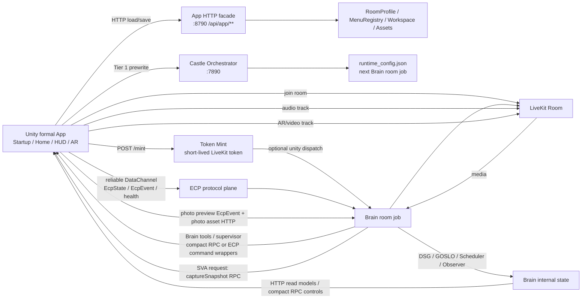

# Unity LiveKit / ECP / SVA Data-Flow Map (2026-05-15)

Owner: Unity App chat
Status: active map
Category: App business interface
Related TODO: APP-015.19, APP-018, APP-022, APP-023, APP-024

This map is the homepage-prep guardrail. New Unity homepage, HUD, menu,
LiveKit, SVA, and device-lifecycle work must cite this file before adding a new
transport, RPC, DataChannel topic, or menu persistence path.

## A. Source Readback

Read in this pass:

- `codex_workspace/design_workspace/backend_interface_map/app/unity_app_transport_interface_taxonomy_20260515.md`
- `codex_workspace/design_workspace/backend_interface_map/app/unity_homepage_menu_livekit_audit_20260515.md`
- `.cursor/memory/architecture/sprint4_protocol_v2_ecp.md`
- `.cursor/memory/architecture/protocol_snapshot_p4.md`
- `.cursor/skills/client-sdk-unity/SKILL.md`
- `.cursor/skills/livekit-unity-lifecycle/SKILL.md`
- `.cursor/skills/livekit-unity-video-publish/IMPL_REF.md`
- `.cursor/skills/sva-vision-agents/SKILL.md`
- `.cursor/rules/ar-foundation.mdc`
- `src/parrot/castle/token_mint.py`
- `src/parrot/castle/orchestrator/server.py`
- `src/parrot/brain/app_monitor_server.py`
- `src/parrot/brain/app_first_version.py`
- `src/parrot/brain/agent.py`
- `src/parrot/brain/event_ingest.py`
- `src/parrot/brain/tools/_rpc_bridge.py`
- `src/parrot/brain/vision/snapshot.py`
- `unity/ArSpike/Assets/ParrotApp/Runtime/Scripts/**`

## B. One-Page Flow

## C. Ownership Rules

| Surface | Current code | Owns | Must not own |
|:--|:--|:--|:--|
| App HTTP | `app_monitor_server.py`, `AppFirstVersionFacade`, `AppRoomSettingClient` | RoomSetting load/new/save/apply, personas, line profiles, modules, tool cabinet, assets, canvas read model, live-state read model, camera/photo operator requests. | Per-frame telemetry, room media, full Brain command lifecycle, secret-bearing LiveKit API operations. |
| Orchestrator HTTP | `orchestrator/server.py`, `OrchestratorClient` | Tier 1 runtime prewrite, active Line/Profile governance, forced reconnect requests, component restart control. | Menu rendering, RoomSetting persistence, Unity local device state. |
| Token Mint HTTP | `token_mint.py`, `LiveKitTokenMintClient` | Short-lived LiveKit token, Unity identity, server-side Brain dispatch when configured. | Settings saves, menu snapshots, durable user state, exposing LiveKit API secret to Unity. |
| LiveKit media | `RoomManager`, `MicrophonePublisher`, `ARVideoPublisher` | Mic input, remote Brain audio, AR/video track, video tier rebuild. | Room/Profile persistence, menu payloads, app config snapshots. |
| LiveKit RPC | `AppStartupFlowController`, `agent.py`, `_rpc_bridge.py`, `ParrotRpcHandler`, `VideoTierReceiver` | Compact in-room request/response: post-join Brain sync, capability mode, workspace switch, video tier, GOSLO fly/animate, placement gates, small menu/control toggles. | Full RoomSetting snapshot, full canvas/menu load, large or durable saves, binary assets. |
| ECP protocol plane | `parrot.shared.ecp*`, `EcpEvent*`, `LifecycleHeartbeatPublisher`, `event_ingest.py` | Command/ack causality, frontend state, lifecycle health, attention/photo/sighting events, lossy interaction ticks, snapshot/ref evidence links, L0 auditability. | A generic dump pipe for all App UI data, Web admin state, Graphiti direct writes, persistent RoomSetting CRUD. |
| ECP reliable DataChannel | `parrot.ecp.state`, `parrot.ecp.event`, `parrot.ecp.health`, `parrot.ecp.intent_disconnect` | Small reliable state/fact/health envelopes. | Full menu/canvas snapshots, assets, long documents. |
| ECP lossy DataChannel | `parrot.ecp.tick` | High-frequency transient gesture/pose/focus drag tendency. | Final facts, photos, command completion, saved settings. |
| SVA / vision | `ARVideoPublisher`, `VideoTierReceiver`, `vision/snapshot.py`, perception supervisor | Video tiers, snapshot requests, visual state, identify-object/photo evidence pipeline. | Homepage menu ownership, RoomSetting selection semantics. |
| Unity local | Unity C# services | Rendering, AR Foundation session, prefab/model driver, HUD/menu presentation, permissions, Android mic/Bluetooth route detection, app background/resume handling. | Backend source of truth, Brain policy truth, secrets beyond ignored runtime config. |
| Smoke/test | `Assets/Tests/**`, test scripts | Fast evidence and regression checks. | Production completion proof for phone mic, Bluetooth, app switch, AR/video, reconnect. |

## D. Phase Flow

### Cold Start / RoomSetting

Before LiveKit exists, Unity uses App HTTP:

- `GET /api/app/room-setting`
- `POST /api/app/room-setting/preview`
- `POST /api/app/room-setting/new`
- `POST /api/app/room-setting/save`
- `POST /api/app/room-setting/apply`
- `GET /api/app/personas`
- `GET /api/app/line-profiles`
- `GET /api/app/assets`

`Room` means `RoomProfile`. User-facing `Theme` maps to `skin_id`. The old
desktop/indoor/outdoor interpretation of `Scene` must not return to
RoomSetting; environment classification is automatic policy. If a backend field
still says `scene_profile_id`, the homepage should render it as a launch
baseline/internal profile unless the user approves a renamed visual theme field.

### START

The formal START chain is:

1. Android/network/permission gate.
2. Orchestrator Tier 1 prewrite when LineB or another cold-start setting
   requires the next Brain job to read new runtime config.
3. App HTTP `room-setting/apply`.
4. Token Mint.
5. LiveKit join.
6. Wait for Brain participant.
7. Brain RPC `applyRoomProfile`.
8. Brain RPC `setAppCapabilityMode`.
9. Bind `parrot.ecp.state` heartbeat DataChannel.
10. Enter main-ready hold.

START is still not the final homepage. `FormalMainReadyGate` now owns
`ReportRunning()` and waits for HUD, menu snapshot, model, AR/video, and
clean-state gates after transport/Brain/DataChannel sync. The HUD shell gate
is satisfied by `FormalHomeHudController`; the menu snapshot gate is satisfied
by `FormalHomeMenuLoader` using App HTTP `/api/app/canvas` with bounded retry
and real payload validation; model resolution is owned by
`FormalModelReadyReporter`; AR runtime mounting is owned by
`FormalArRuntimeBootstrap`, which stays mounted but does not auto-start on the
startup page. The AR baseline gate calls it on demand for video/AR modes, with
XRGeneralSettings auto-loading/running the ARCore/ARKit/XR Simulation loaders;
and AR/session baseline is owned by `FormalArSessionBaselineReporter`, which waits for mobile
`ARSessionState.SessionTracking`. `FormalMainReadyGate` self-reevaluates while
waiting so missing one-shot loader events degrade instead of silently hanging.
The final drawer UI, production model placement, and phone proof remain pending.

### Homepage / Menu

Homepage menu loading should use App HTTP for larger data:

- `GET /api/app/canvas`
- `GET /api/app/modules`
- `GET /api/app/tool-cabinet`
- `GET /api/app/assets`
- `GET /api/app/personas`
- `GET /api/app/line-profiles`
- `GET /api/app/live-state`

Compact in-room actions can use RPC after Brain is present:

- `applyWorkspace`
- `setAppCapabilityMode`
- `setPhotoAwareness`
- `setCameraMode`
- `setXrHandMode`
- `setLineBAudioRoutePolicy`

Legacy menu RPC wrappers (`listMenuBlocks`, `applyMenuSelection`,
`applyPreset`, `saveAsPreset`) are no longer registered by the active Brain
room job. Formal menu load/save belongs to App HTTP.

### GOSLO / DSG / Scheduler / ECP

GOSLO embodied actions should stay in the compact command path:

- Brain tools call Unity RPC through `_rpc_bridge.py`.
- Unity registered handlers currently include `flyTo`, `animate`, and
  `setVideoTier`.
- RPC outcomes are mirrored to Brain blackboard ack keys for felt-experience
  reporting.

ECP carries command causality, lifecycle state, connection health, attention,
photo/sighting evidence, and lossy interaction ticks. It is a broad protocol
plane, not "the DataChannel heartbeat."

### SVA / Photo / Snapshot

Current split:

- `ARVideoPublisher` publishes the live video track and owns video health
  producers.
- `VideoTierReceiver` receives Brain `setVideoTier` intent.
- `PhotoController` builds `photo.taken_preview` EcpEvents and uploads full
  photo assets by HTTP.
- Brain `vision/snapshot.py` calls Unity `captureSnapshot` RPC for identify
  object / snapshot work.

Gap: formal Unity runtime currently has `capturePhoto` code, but no formal
`captureSnapshot` RPC handler was found under
`unity/ArSpike/Assets/ParrotApp/Runtime/Scripts/**`. Do not claim SVA snapshot
completion until that handler is implemented or the Brain caller is rerouted to
the photo pipeline.

### Phone Lifecycle / Audio Route

Current split:

- `AudioRouteDetector` detects speaker/wired/Bluetooth route changes.
- `MicrophonePublisher` republishes the LiveKit mic track with route-aware
  sample rate and device preference.
- `AudioRoutePolicyBrainReporter` sends compact Brain RPC
  `setLineBAudioRoutePolicy`, separating `input_route` from `output_route` so
  speaker/A2DP output does not masquerade as the microphone input.
- Brain writes the accepted policy to `session/audio_route_policy`.

Gap: Android API 31+ route detection still needs phone proof and likely a native
`AudioManager.getDevices(...)` upgrade. This remains APP-015.15 / APP-024.

## E. Registered Surfaces

### App HTTP

Active app-monitor routes include:

- `GET /api/app/canvas`
- `GET /api/app/modules`
- `GET /api/app/tool-cabinet`
- `GET /api/app/assets`
- `GET /api/app/personas`
- `GET /api/app/room-setting`
- `POST /api/app/room-setting/preview`
- `POST /api/app/room-setting/new`
- `POST /api/app/room-setting/save`
- `POST /api/app/room-setting/apply`
- `GET /api/app/line-profiles`
- `POST /api/app/line-profiles/preview`
- `POST /api/app/line-profiles/save`
- `POST /api/app/line-profiles/apply`
- `POST /api/app/lineb/audio-route`
- `POST /api/app/lineb/tts-segment`
- `POST /api/app/lineb/mic-input`
- `POST /api/app/lineb/voiceprint/verify-embedding`
- `GET /api/app/live-state`
- `POST /api/app/workspace/apply`
- `POST /api/app/camera/mode`
- `POST /api/app/camera/capture-request`
- `POST /api/app/awareness`
- test/self-check/admin-style routes that must not be treated as formal mobile
  menu completion evidence.

### Orchestrator HTTP

Active routes:

- `GET /health`
- `GET /status`
- `POST /set_active_line`
- `POST /apply_room_profile`
- `POST /force_unity_reconnect`
- admin restart/config routes for ops, not mobile menu UI.

### Token Mint HTTP

Active route:

- `POST /mint`

Unity identities are dispatch-eligible when server config enables Unity
dispatch. Unity must still wait for Brain presence and business-ok RPC replies.

### Brain RPC

Current Brain in-room RPCs include:

- Startup/room sync: `applyRoomProfile`, `setAppCapabilityMode`,
  `onSceneReady`, `onGosloPlaced`, `setScene`.
- LineB/audio diagnostics: `setLineBAudioRoutePolicy`,
  `registerLineBTtsSegment`, `classifyLineBMicInput`,
  `verifyLineBVoiceprintEmbedding`.
- Workspace/camera/module toggles: `applyWorkspace`, `setPhotoAwareness`,
  `setCameraMode`, `setXrHandMode`.
- Runtime reconnect: `forceUnityReconnect`.

`getRoomSettingSnapshot` is not an active dependency and must not be
reintroduced for startup or menu loading. RoomSetting load/save stays HTTP.

### Unity RPC Handlers

Current formal Unity handlers include:

- `flyTo`
- `animate`
- `setVideoTier`

Known gap:

- Brain can call `captureSnapshot`, but formal Unity runtime does not yet expose
  a matching handler in `Assets/ParrotApp/Runtime/Scripts/**`.

## F. Phone Config Rule

Editor and phone use the same `Resources/parrot_config.json` shape:

- `mintUrl`
- `mintSecret`
- `liveKitUrl`
- `room`
- `appApiUrl`
- `appApiSecret`
- `orchestratorUrl`
- `orchestratorSecret`

Only values differ by environment. Phone must use public ECS/domain URLs, not
localhost. Do not commit or paste real secrets into repo docs. Personal/dev
Bearer values are acceptable only in ignored local config.

## G. Open Gaps Before Homepage Implementation

| Gap | TODO | Required next action |
|:--|:--|:--|
| Old AppV1/Smoke controller can be confused with formal home | APP-016, APP-016.1 | Demote/rename as test/reference-only while preserving `.meta`. |
| Legacy menu RPC active surface removed | APP-015.18 | Old menu/preset RPCs are no longer registered; build formal menu load/save on App HTTP and add only compact in-room controls through RPC. |
| Formal menu DTO/load/save design is not finished | APP-022, APP-015.16 | `/api/app/canvas` loading exists in Unity. Add persona/line-profile selector loaders, accepted drawer controls, and persistence actions through App HTTP; keep compact RPC controls small. |
| Fresh-token reconnect/backoff needs phone proof | APP-015.14, APP-023, APP-024 | `LiveKitReconnectSupervisor` now remints, reconnects, waits for Brain via startup RPC sync, and rebinds heartbeat after passive post-main-ready drops; START while already connected to a Tier1/LineB-changing Room now runs graceful shutdown plus fresh reconnect instead of hard-failing, waits for shutdown cool-down/`ReportDisconnected()`, then re-enters token/AR-starting lifecycle gates so the old shutdown cannot mark the fresh session disconnected. Reconnect/startup failures can now report degraded from token/AR/connecting/reconnecting states. Validate network flap/background behavior on iQOO Neo9. |
| Audio route policy phone proof missing | APP-015.15, APP-024 | `AudioRoutePolicyBrainReporter` now publishes accepted Brain RPC payloads with separate input/output routes. Add iQOO Neo9 SCO/A2DP/wired/speaker logs before calling it stable. |
| Downstream ECP UI not yet built | APP-015.17, APP-015.4 | The Unity dispatcher now extracts object payloads into `payload_json`; homepage consumers and runtime phone evidence are still future work. |
| Formal `captureSnapshot` RPC missing in Unity | APP-022 / SVA follow-up | Implement a handler or reroute Brain snapshot requests to an accepted photo/video path. |
| Formal drawer/model placement and AR phone proof not yet built | APP-015.6, APP-015.7, APP-015.16 | Gate reporters and AR runtime bootstrap now exist. Add actual touch drawer, production model mount/placement, and iQOO Neo9 AR/video evidence before marking homepage complete. |
| Phone proof missing | APP-015.8, APP-015.13, APP-024 | Verify iQOO Neo9 mic/Bluetooth/app switch/network/AR/video/reconnect in the formal App. |

## H. Completion Signal

This file completes APP-015.19 as a documented map. It does not complete
homepage implementation, phone stability, legacy menu cleanup, or final menu
save/load design.
