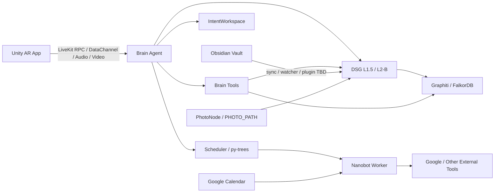

# 后端模块协作简述

## 主链路

## 模块分工

| 模块 | 负责什么 | App 设计时怎么体现 |
|:--|:--|:--|
| Unity AR App | 摄像头主界面、HUD、工具柜、拍照、注意力框、纸条 / 2D 工作区。 | 用户能看见、点按、拖动、确认。 |
| Brain | 对话、理解意图、调用工具、维护 persona / menu / preset / IntentWorkspace。 | GOSLO 的语音、回应、主动提醒、菜单模式切换。 |
| Bus | 三层通信：短遥测 DataChannel、可靠 RPC、长任务 Redis Stream。 | App 不需要知道所有 Redis 细节，只需要稳定连接状态和结果事件。 |
| Scheduler | 行为树、任务优先级、Nanobot 派发、超时。 | “后台任务正在跑 / 完成 / 失败”的可视化。 |
| DSG L1.5 | 外部 Ref 信息源入口、桶、RefTable、时间轴、SceneSnapshot。 | Obsidian / Google / 照片进入系统后的分类与可见状态。 |
| DSG L2-B | 潜意识语义图、注意力扩散、节点 / 边 / compartment 视图。 | 注意力框、Ref 关系、Web 调试图谱、App 中“GOSLO aware 到什么”。 |
| Memory | Graphiti 记忆和长期检索。 | 过去记录、物体事实、对话记忆、Obsidian 镜像查询。 |
| Nanobot | 后台外部工具和长任务，含 Google 日程连接。 | 女仆 / 水手递交纸条报告；日程读写建议。 |

## 三类真连接的设计焦点

| 连接 | 先问什么 | App 里怎么呈现 |
|:--|:--|:--|
| Obsidian | Vault 如何监听？三子类如何进桶？UUID 不存在怎么拒绝？ | 设定 Node / Ref Node 的状态、已同步 / 待修复、Roleplay 可启用。 |
| Google Calendar | Nanobot 返回 raw event 什么格式？如何转 Node？写回指令怎么发？ | 日程纸条、今日摘要、修改建议、用户确认后写回。 |
| PhotoNode | 照片存哪里？路径怎么绑定 RefTable？何时生成 ObjectNode？ | 相机按钮、照片预览、绑定到物体 / 场景、GOSLO 是否 aware。 |

