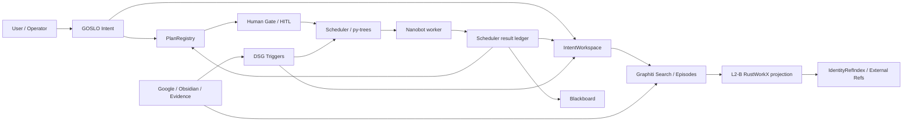

# Collaboration Flow Workbench SSOT (2026-05-17)

Owner: Web Console / Runtime Flow line
Status: active_design
Scope: GOSLO Intent, Plan, HITL, Scheduler, Nanobot, AgentTeam, triggers, Graphiti/L2-B/Refs capability catalog, workflow design/import, Runtime Flow page

## Purpose

This is the reread file before changing the collaboration-flow page or workflow
backend. The target is not a decorative graph. The target is a Web Console
workbench where an operator can search real backend capabilities, insert
triggers/modules into a workflow, draft a Plan, dispatch compatible tasks to
Nanobot/Scheduler, and route results back into GOSLO memory/runtime surfaces.

## Stable User Requirements

These are the original phrases that must guide implementation:

- “先理解后端模块的协作方式，注意记录好稳定需求和原话”
- “GOSLO行为模式的变化和如何变化”
- “结合已有设计和AgentTeams的主Agent设计等，包括LangGraph、ClaudeCode，或者Codex的优秀设计，GeminiLive能力边界，上升通道的级别和如何利用”
- “设计好模块和触发器插入工作流等”
- “完成触发器的真触发和插入工作流等，工作流的一键导入Plan等，Plan /Tasks派发等设计、发给纯nanobot”
- “GOSLO是否Intent的开关”
- “能够搜索和拉动Refs 和 Nodes/Nodes搜索/ Edges管理 /触发器 和 Graphiti的搜索 等等一系列的模块化真接口和能力分类好 和注释好，写好SSOT”
- “协作流页面里搜索这些接口和触发器等，进行一次能够给nanobot，也可以给整个架构的 自定义Plan 也可以是整个工作流的真自定义设计”
- “实现前调研和需求决策重读以及实现后的审计，真连接判断和提炼和bug修复”

## Current Verdict

The current Runtime Flow page is good enough as a live observability baseline,
but it is not yet the full Collaboration Flow Workbench.

Already real:

- Runtime read model: `GET /api/runtime/flow`, changed-since polling, and SSE.
- Plan HITL V1: pending gates, draft decision, operator-gated apply.
- Trigger catalog and real fire route: `GET /api/dsg/triggers/catalog`,
  `POST /api/dsg/triggers/draft-event`, `POST /api/dsg/triggers/fire-event`.
- Scheduler/Nanobot task catalog and Plan dispatch return path exist in core
  Plan/Scheduler code.
- Graphiti, L2-B, IdentityRefIndex, Ref scan, Google Calendar, evidence, and
  Obsidian routes already have Web BFF surfaces, many with real ECS paths.

Missing for this workbench:

- A single searchable backend capability catalog across Runtime, Triggers,
  Plan/Nanobot, Graphiti, L2-B, Refs, Google/Obsidian/Evidence.
- A workflow draft model that can insert capability nodes and preserve execution
  policy/result-destination metadata.
- A one-click Web route that converts a workflow draft into a `PlanProposal`
  and stages it in the Plan/HITL path.
- Trigger/message HITL targets beyond Plan gates.
- Durable result-destination policy on Plan steps. Current `PlanStepProposal`
  has `expected_tool`, `inputs`, and `depends_on`, but no explicit
  `result_destination`.

## Backend Collaboration Model

Working interpretation:

- `GOSLO Intent` is not a raw on/off switch. It is a routing and policy mode.
  A capability may be allowed as record-only, staged context, Plan proposal,
  Nanobot task, or C3/C4 interaction depending on ascent channel, operator
  gate, and result destination.
- `Scheduler` remains the runtime router and behavior-tree layer. It should not
  become a generic workflow editor.
- `Nanobot` is a background task executor compatibility target. It can receive
  tasks such as `research`, `summarize`, `ref_scan`, `calendar_fetch`, and
  `message_check`, but it is not the entire GOSLO brain.
- `Graphiti` owns temporal memory, episode provenance, extracted facts/entities,
  and search semantics. L2-B imports must preserve Graphiti raw payloads and add
  only pointer/projection/buff metadata.
- `L2-B/RustWorkX` is a fast working graph for bounded subgraph context,
  transforms, activation, and operator-visible structure. RustworkX indices are
  ephemeral; durable identity is UUID/ref based.

## Behavior Mode Design

Use the existing trigger/awareness levels as the behavior-mode backbone:

| Level | Meaning | Collaboration-flow use |
|:--|:--|:--|
| `L0 record_only` | record without surfacing | archive, audit, passive ref health |
| `L1 working_set` | keep in local working set | L1.5 staging, selected refs/nodes |
| `L2 blackboard_notice` | runtime-readable notice | Scheduler/Plan context |
| `C3 context_notice` | can affect next reply/context | normal GOSLO context injection |
| `C4 safe_turn_speech` | can speak at safe turn | explicit, rare, operator-policy controlled |
| `I0 interrupt` | immediate interruption | future-only, highest-risk gate |

Design decision:

- The workbench should expose these as capability policy fields, not as a
  single global toggle.
- Trigger categories (`ascending_channels`, `interaction_modules`,
  `information_tags`) are view/filter/algorithm metadata. They are not a
  one-to-one rewrite of Graphiti relation predicates.
- C3 is the default for useful context. C4/I0 require explicit policy and
  later HITL/interrupt design.

## Capability Taxonomy For The Workbench

Every searchable capability row should carry:

- `capability_id`: stable Web id, e.g. `trigger.intent_event_boundary`.
- `kind`: `trigger`, `runtime_read`, `hitl_gate`, `nanobot_task`,
  `graphiti_search`, `l2b_graph_op`, `ref_op`, `source_import`,
  `evidence_op`, or `workflow_template`.
- `title` / `description`: operator-facing text.
- `ascent_channels`: trigger/behavior channel labels when relevant.
- `interaction_modules`: Runtime/Graphiti/L2-B/Refs/Scheduler/Nanobot/etc.
- `information_tags`: calendar, graphiti_context, staged_ref, etc.
- `route`: existing true BFF endpoint if callable from Web.
- `method`: `GET`/`POST`.
- `execution_policy`: `read_only`, `draft_only`, `operator_gated`,
  `nanobot_dispatch`, `external_oauth`, or `ecs_proxy`.
- `plan_step_compatible`: whether it can be expressed as a Plan step today.
- `nanobot_task_type`: `research`, `ref_scan`, `calendar_fetch`, etc. when it
  can be sent to pure Nanobot/Scheduler.
- `result_destinations`: `view_only`, `return_to_goslo`, `return_to_app`,
  `stage_to_intent_workspace`, `write_to_memory_draft`,
  `write_graphiti_episode`, `materialize_l2b`.
- `true_connection`: what proof exists and what route proves it.
- `notes`: short caveat.

## Research Summary

Local skills consulted:

- `parrot-cursor-skill-bridge`
- `.cursor/skills/nanobot/SKILL.md`
- `.cursor/skills/nanobot-overview/SKILL.md`
- `.cursor/skills/py-trees/SKILL.md`
- `.cursor/skills/parrot-bus-orchestration/SKILL.md`
- `.cursor/skills/graphiti/SKILL.md`
- `.cursor/skills/dsg-rustworkx-master/SKILL.md`
- `.cursor/skills/dsg-l2b-node-organization-options/SKILL.md`

External docs consulted:

- LangGraph interrupts/HITL: https://docs.langchain.com/oss/python/langgraph/interrupts
- LangGraph persistence: https://docs.langchain.com/oss/python/langgraph/persistence
- LangChain multi-agent patterns: https://docs.langchain.com/oss/python/langchain/multi-agent/index
- LangChain subagents: https://docs.langchain.com/oss/python/langchain/multi-agent/subagents
- LangChain handoffs: https://docs.langchain.com/oss/python/langchain/multi-agent/handoffs
- ComfyUI workflow JSON: https://docs.comfy.org/specs/workflow_json
- ComfyUI workflow concept: https://docs.comfy.org/development/core-concepts/workflow
- Comfy Cloud API workflow/job pattern: https://docs.comfy.org/development/cloud/overview
- Gemini Live API overview: https://ai.google.dev/gemini-api/docs/live-api
- Gemini Live capabilities: https://ai.google.dev/gemini-api/docs/live-api/capabilities
- Claude Code subagents: https://code.claude.com/docs/en/sub-agents
- Claude Code hooks: https://code.claude.com/docs/en/hooks
- OpenAI Agents SDK: https://developers.openai.com/api/docs/guides/agents
- OpenAI Codex web/cloud: https://developers.openai.com/codex/cloud
- Graphiti adding episodes: https://help.getzep.com/graphiti/core-concepts/adding-episodes
- Graphiti custom entity/edge types: https://help.getzep.com/graphiti/core-concepts/custom-entity-and-edge-types/
- rustworkx PyDiGraph API: https://www.rustworkx.org/apiref/rustworkx.PyDiGraph.html
- rustworkx introduction: https://www.rustworkx.org/stable/0.12/tutorial/introduction.html

Key transfer:

- LangGraph: HITL should persist state, surface a payload, and resume by
  command. For Parrot, Plan HITL already follows the same shape; trigger/message
  HITL needs its own persisted state before promotion.
- Multi-agent patterns: use a main-agent/supervisor model for GOSLO. Use
  subagents/Nanobot as tool-like workers when isolated context and background
  work are useful. Use handoff/state changes only when direct behavior mode
  needs to persist across turns.
- ComfyUI: node graphs are compact JSON, versionable, executable as async jobs,
  and monitored by polling/WebSocket. For Parrot, workflow draft JSON should be
  small, auditable, and convertible into Plan/Scheduler actions.
- Gemini Live: good for realtime voice/vision C3/C4 surfaces, but production
  client-side use needs ephemeral tokens and strict capability boundaries. It
  should not directly mutate memory or fire high-risk workflows.
- Claude Code/Codex: useful patterns are explicit task framing, subagent/tool
  boundaries, hooks/checkpoints, parallel background work, and human review
  before mutation. For Parrot, that means capability nodes must state their
  execution policy and result destination.
- Graphiti: episodes are provenance-bearing ingestion events; custom entity and
  edge types can enrich extraction, but old data needs re-ingest to be typed.
  Web/L2-B should preserve Graphiti raw facts/entities/episodes and not flatten
  them into L2-B-only categories.
- RustWorkX: payloads can be arbitrary Python objects, but integer indices are
  runtime graph handles. Durable binding must use UUIDs/Refs, not RustWorkX
  indices.

## Version Locks

From `pyproject.toml` / `uv.lock`:

- `graphiti-core[falkordb,google-genai] >=0.28,<0.29`; lock contains
  `graphiti-core 0.28.x`.
- `rustworkx >=0.15,<1.0`; lock contains `rustworkx 0.17.1`.
- `py-trees >=2.4,<3.0`.
- `livekit-agents[google] >=1.5,<2.0`; lock contains `livekit-agents 1.5.5`.
- `livekit 1.1.5`.

## UI Target

The current `RuntimeFlowWorkspace` should evolve into:

- Left/top: searchable capability catalog with filters for channel, module,
  tag, execution policy, true connection, and Plan/Nanobot compatibility.
- Center: Runtime swimlane graph plus a lightweight workflow draft canvas.
- Right: selected capability/workflow node detail, payload editor, Plan draft
  preview, HITL gate/receipt detail.
- Bottom: event/receipt tape.

First acceptable implementation:

- Capability catalog is real and backend-generated.
- Runtime page can search it.
- Operator can insert a capability into a local workflow draft.
- Trigger capabilities can call existing draft/fire routes from the inserted
  node.
- Nanobot-compatible capabilities show the exact task type and Plan compatibility.
- Plan one-click import may start as a draft-only route; operator execution must
  stay HITL/operator-gated.

## True-Connection Standard

A capability is not complete until its row states one of:

- `read_only_live`: proven live read endpoint.
- `draft_route`: only preview/draft is implemented.
- `operator_gated_write`: real write exists with `operator_mode=true` and
  `dry_run=false`.
- `nanobot_dispatch`: real Scheduler/Nanobot ledger path exists.
- `ecs_proxy`: desktop BFF routes to ECS service.
- `not_implemented`: intentionally visible as a gap.

For collaboration-flow work, dry-run UI alone is insufficient unless the row is
explicitly marked `draft_only`.

## TODO Before Implementation

- Re-read this SSOT and `_tmp/collaboration_flow_workplan_20260517.md`.
- Re-read `observability_runtime_business_flow_20260513.md`.
- Re-read `graphiti_l2b_longline_review_20260517.md` before touching
  Graphiti/L2-B wiring.
- Check dirty worktree and avoid unrelated Unity/App edits.
- Confirm current true routes from `server.py`, `runtime_flow.py`,
  `memory_ops.py`, `plan_registry.py`, and `task_catalog.py`.

## TODO During Implementation

1. Add `GET /api/runtime/capabilities/catalog` as a backend-generated catalog.
2. Add TypeScript types/API client for the catalog.
3. Add capability search/filter UI to Runtime Flow.
4. Add local workflow draft list/canvas with inserted capability nodes.
5. Wire trigger capability execution to existing draft/fire routes.
6. Add Plan draft/import route from workflow draft to `PlanProposal`.
7. Add result-destination preview and later durable Plan step/result policy.
8. Add trigger/message HITL only after backend target state is explicit.

## TODO After Implementation

- Unit-test catalog shape and route.
- Typecheck/build frontend.
- HTTP smoke `GET /api/runtime/capabilities/catalog`.
- If code changes affect ECS-served behavior, commit/push and update ECS before
  calling it complete.
- Record review results and gaps in the workplan.

## 2026-05-17 First Slice Completion

Implemented:

- `GET /api/runtime/capabilities/catalog` as the backend-generated capability
  catalog. Rows classify Runtime/HITL, triggers, Nanobot task types, Graphiti,
  L2-B, Refs, Google/Obsidian imports, Evidence, and workflow Plan drafting by
  kind, execution policy, ascent channel, interaction module, information tag,
  Plan compatibility, Nanobot task type, result destination, and true-connection
  state.
- `POST /api/runtime/workflow/plan-draft` converts workflow capability nodes
  into `PlanProposal` steps when the capability maps to a real
  `NANOBOT_TASK_TYPES` value. Preview mode returns steps/skips; operator mode
  creates a real Plan and submits it to the existing HITL gate.
- The React Runtime page now has a searchable capability catalog, kind filter,
  Insert action, local workflow draft list, trigger node Execute action, and
  Import Plan action. Trigger execution reuses the existing
  `/api/dsg/triggers/draft-event` / `/api/dsg/triggers/fire-event` split.
- Two true-smoke compatibility fixes were made: workflow plan drafting accepts
  both `workflow_nodes` and nested `workflow.nodes`; Graphiti import-plan accepts
  `selected_hits` as an alias for `hits`.

Verification:

- `pytest tests/test_web_console/test_web_console_server.py -q` -> `90 passed`.
- `npm run typecheck` -> passed.
- `npm run build` -> passed with the existing 507.75 KiB chunk warning.
- `git diff --check` -> only CRLF warnings.
- Restarted local `7893` with ECS Graphiti proxy
  `http://8.216.45.45:8790`.
- HTTP smoke:
  - capability catalog returned Graphiti rows with `true_state=ecs_proxy`;
  - nested workflow Plan draft returned one compatible `ref_scan` step;
  - trigger draft matched `intent_event_boundary` on `parrot.dsg.events`;
  - Graphiti status reported remote proxy enabled and partitions including
    `noble_etiquette`;
  - `noble_etiquette` query `greeting rank etiquette note` returned `3` hits,
    `7` nodes, and `3` edges;
  - Graphiti import-plan with `selected_hits` returned `2` observations, `2`
    bundle facts, `3` bundle entities, and destination `isolated_compartment`.

Remaining gaps:

- Workflow drafts are local UI state, not durable workflow documents yet.
- Only Nanobot-compatible capabilities become Plan steps. Trigger nodes can be
  executed from the draft, but they are not yet represented as durable Plan
  steps with result-routing semantics.
- Result destinations are catalog metadata. A durable Plan result-destination
  contract is still needed before autonomous chained workflows can be trusted.
- Trigger/message HITL state machines remain future work; current trigger fire
  is operator-gated and receipt-based.
- C4/I0 behavior-mode changes still need explicit safe-turn and interruption
  policy before any realtime Gemini Live surface can mutate memory or fire
  workflows.
