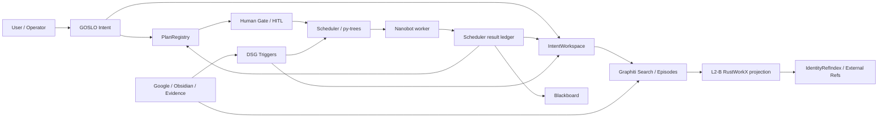

# Collaboration Flow Workbench SSOT (2026-05-17)

Owner: Web Console / Runtime Flow line
Status: active_design
Scope: GOSLO Intent, Plan, HITL, Scheduler, Nanobot, AgentTeam, triggers, Graphiti/L2-B/Refs capability catalog, workflow design/import, Runtime Flow page

## Purpose

This is the reread file before changing the collaboration-flow page or workflow
backend. The target is not a decorative graph. The target is a Web Console
workbench where an operator can search real backend capabilities, insert
triggers/modules into a workflow, draft a Plan, dispatch compatible tasks to
Nanobot/Scheduler, and route results back into GOSLO memory/runtime surfaces.

## Stable User Requirements

These are the original phrases that must guide implementation:

- “先理解后端模块的协作方式，注意记录好稳定需求和原话”
- “GOSLO行为模式的变化和如何变化”
- “结合已有设计和AgentTeams的主Agent设计等，包括LangGraph、ClaudeCode，或者Codex的优秀设计，GeminiLive能力边界，上升通道的级别和如何利用”
- “设计好模块和触发器插入工作流等”
- “完成触发器的真触发和插入工作流等，工作流的一键导入Plan等，Plan /Tasks派发等设计、发给纯nanobot”
- “GOSLO是否Intent的开关”
- “能够搜索和拉动Refs 和 Nodes/Nodes搜索/ Edges管理 /触发器 和 Graphiti的搜索 等等一系列的模块化真接口和能力分类好 和注释好，写好SSOT”
- “协作流页面里搜索这些接口和触发器等，进行一次能够给nanobot，也可以给整个架构的 自定义Plan 也可以是整个工作流的真自定义设计”
- “实现前调研和需求决策重读以及实现后的审计，真连接判断和提炼和bug修复”

## Current Verdict

The current Runtime Flow page is good enough as a live observability baseline,
but it is not yet the full Collaboration Flow Workbench.

Already real:

- Runtime read model: `GET /api/runtime/flow`, changed-since polling, and SSE.
- Plan HITL V1: pending gates, draft decision, operator-gated apply.
- Trigger catalog and real fire route: `GET /api/dsg/triggers/catalog`,
  `POST /api/dsg/triggers/draft-event`, `POST /api/dsg/triggers/fire-event`.
- Scheduler/Nanobot task catalog and Plan dispatch return path exist in core
  Plan/Scheduler code.
- Graphiti, L2-B, IdentityRefIndex, Ref scan, Google Calendar, evidence, and
  Obsidian routes already have Web BFF surfaces, many with real ECS paths.

Missing for this workbench:

- A single searchable backend capability catalog across Runtime, Triggers,
  Plan/Nanobot, Graphiti, L2-B, Refs, Google/Obsidian/Evidence.
- A workflow draft model that can insert capability nodes and preserve execution
  policy/result-destination metadata.
- A one-click Web route that converts a workflow draft into a `PlanProposal`
  and stages it in the Plan/HITL path.
- Trigger/message HITL targets beyond Plan gates.
- Durable result-destination policy on Plan steps. Current `PlanStepProposal`
  has `expected_tool`, `inputs`, and `depends_on`, but no explicit
  `result_destination`.

## Backend Collaboration Model

Working interpretation:

- `GOSLO Intent` is not a raw on/off switch. It is a routing and policy mode.
  A capability may be allowed as record-only, staged context, Plan proposal,
  Nanobot task, or C3/C4 interaction depending on ascent channel, operator
  gate, and result destination.
- `Scheduler` remains the runtime router and behavior-tree layer. It should not
  become a generic workflow editor.
- `Nanobot` is a background task executor compatibility target. It can receive
  tasks such as `research`, `summarize`, `ref_scan`, `calendar_fetch`, and
  `message_check`, but it is not the entire GOSLO brain.
- `Graphiti` owns temporal memory, episode provenance, extracted facts/entities,
  and search semantics. L2-B imports must preserve Graphiti raw payloads and add
  only pointer/projection/buff metadata.
- `L2-B/RustWorkX` is a fast working graph for bounded subgraph context,
  transforms, activation, and operator-visible structure. RustworkX indices are
  ephemeral; durable identity is UUID/ref based.

## Behavior Mode Design

Use the existing trigger/awareness levels as the behavior-mode backbone:

| Level | Meaning | Collaboration-flow use |
|:--|:--|:--|
| `L0 record_only` | record without surfacing | archive, audit, passive ref health |
| `L1 working_set` | keep in local working set | L1.5 staging, selected refs/nodes |
| `L2 blackboard_notice` | runtime-readable notice | Scheduler/Plan context |
| `C3 context_notice` | can affect next reply/context | normal GOSLO context injection |
| `C4 safe_turn_speech` | can speak at safe turn | explicit, rare, operator-policy controlled |
| `I0 interrupt` | immediate interruption | future-only, highest-risk gate |

Design decision:

- The workbench should expose these as capability policy fields, not as a
  single global toggle.
- Trigger categories (`ascending_channels`, `interaction_modules`,
  `information_tags`) are view/filter/algorithm metadata. They are not a
  one-to-one rewrite of Graphiti relation predicates.
- C3 is the default for useful context. C4/I0 require explicit policy and
  later HITL/interrupt design.

Implemented interaction-mode read model:

- `GET /api/runtime/capabilities/catalog` returns the stable mode ladder as
  `interaction_modes` and assigns each capability row its applicable mode ids.
- The route accepts `interaction_mode=L0|L1|L2|C3|C4|I0` for filtering on both
  Web Console and ECS app-monitor.
- React Runtime exposes the interaction-mode filter in the capability catalog.
- C4/I0 are visible as future-policy definitions only; no current workflow node
  can auto-speak or interrupt through this catalog.

## Capability Taxonomy For The Workbench

Every searchable capability row should carry:

- `capability_id`: stable Web id, e.g. `trigger.intent_event_boundary`.
- `kind`: `trigger`, `runtime_read`, `hitl_gate`, `nanobot_task`,
  `graphiti_search`, `l2b_graph_op`, `ref_op`, `source_import`,
  `evidence_op`, or `workflow_template`.
- `title` / `description`: operator-facing text.
- `ascent_channels`: trigger/behavior channel labels when relevant.
- `interaction_modules`: Runtime/Graphiti/L2-B/Refs/Scheduler/Nanobot/etc.
- `information_tags`: calendar, graphiti_context, staged_ref, etc.
- `route`: existing true BFF endpoint if callable from Web.
- `method`: `GET`/`POST`.
- `execution_policy`: `read_only`, `draft_only`, `operator_gated`,
  `nanobot_dispatch`, `external_oauth`, or `ecs_proxy`.
- `plan_step_compatible`: whether it can be expressed as a Plan step today.
- `nanobot_task_type`: `research`, `ref_scan`, `calendar_fetch`, etc. when it
  can be sent to pure Nanobot/Scheduler.
- `result_destinations`: `view_only`, `return_to_goslo`, `return_to_app`,
  `stage_to_intent_workspace`, `write_to_memory_draft`,
  `write_graphiti_episode`, `materialize_l2b`.
- `true_connection`: what proof exists and what route proves it.
- `notes`: short caveat.

## Research Summary

Local skills consulted:

- `parrot-cursor-skill-bridge`
- `.cursor/skills/nanobot/SKILL.md`
- `.cursor/skills/nanobot-overview/SKILL.md`
- `.cursor/skills/py-trees/SKILL.md`
- `.cursor/skills/parrot-bus-orchestration/SKILL.md`
- `.cursor/skills/graphiti/SKILL.md`
- `.cursor/skills/dsg-rustworkx-master/SKILL.md`
- `.cursor/skills/dsg-l2b-node-organization-options/SKILL.md`

External docs consulted:

- LangGraph interrupts/HITL: https://docs.langchain.com/oss/python/langgraph/interrupts
- LangGraph persistence: https://docs.langchain.com/oss/python/langgraph/persistence
- LangChain multi-agent patterns: https://docs.langchain.com/oss/python/langchain/multi-agent/index
- LangChain subagents: https://docs.langchain.com/oss/python/langchain/multi-agent/subagents
- LangChain handoffs: https://docs.langchain.com/oss/python/langchain/multi-agent/handoffs
- ComfyUI workflow JSON: https://docs.comfy.org/specs/workflow_json
- ComfyUI workflow concept: https://docs.comfy.org/development/core-concepts/workflow
- Comfy Cloud API workflow/job pattern: https://docs.comfy.org/development/cloud/overview
- Gemini Live API overview: https://ai.google.dev/gemini-api/docs/live-api
- Gemini Live capabilities: https://ai.google.dev/gemini-api/docs/live-api/capabilities
- Claude Code subagents: https://code.claude.com/docs/en/sub-agents
- Claude Code hooks: https://code.claude.com/docs/en/hooks
- OpenAI Agents SDK: https://developers.openai.com/api/docs/guides/agents
- OpenAI Codex web/cloud: https://developers.openai.com/codex/cloud
- Graphiti adding episodes: https://help.getzep.com/graphiti/core-concepts/adding-episodes
- Graphiti custom entity/edge types: https://help.getzep.com/graphiti/core-concepts/custom-entity-and-edge-types/
- rustworkx PyDiGraph API: https://www.rustworkx.org/apiref/rustworkx.PyDiGraph.html
- rustworkx introduction: https://www.rustworkx.org/stable/0.12/tutorial/introduction.html

Key transfer:

- LangGraph: HITL should persist state, surface a payload, and resume by
  command. For Parrot, Plan HITL already follows the same shape; trigger/message
  HITL needs its own persisted state before promotion.
- Multi-agent patterns: use a main-agent/supervisor model for GOSLO. Use
  subagents/Nanobot as tool-like workers when isolated context and background
  work are useful. Use handoff/state changes only when direct behavior mode
  needs to persist across turns.
- ComfyUI: node graphs are compact JSON, versionable, executable as async jobs,
  and monitored by polling/WebSocket. For Parrot, workflow draft JSON should be
  small, auditable, and convertible into Plan/Scheduler actions.
- Gemini Live: good for realtime voice/vision C3/C4 surfaces, but production
  client-side use needs ephemeral tokens and strict capability boundaries. It
  should not directly mutate memory or fire high-risk workflows.
- Claude Code/Codex: useful patterns are explicit task framing, subagent/tool
  boundaries, hooks/checkpoints, parallel background work, and human review
  before mutation. For Parrot, that means capability nodes must state their
  execution policy and result destination.
- Graphiti: episodes are provenance-bearing ingestion events; custom entity and
  edge types can enrich extraction, but old data needs re-ingest to be typed.
  Web/L2-B should preserve Graphiti raw facts/entities/episodes and not flatten
  them into L2-B-only categories.
- RustWorkX: payloads can be arbitrary Python objects, but integer indices are
  runtime graph handles. Durable binding must use UUIDs/Refs, not RustWorkX
  indices.

## Version Locks

From `pyproject.toml` / `uv.lock`:

- `graphiti-core[falkordb,google-genai] >=0.28,<0.29`; lock contains
  `graphiti-core 0.28.x`.
- `rustworkx >=0.15,<1.0`; lock contains `rustworkx 0.17.1`.
- `py-trees >=2.4,<3.0`.
- `livekit-agents[google] >=1.5,<2.0`; lock contains `livekit-agents 1.5.5`.
- `livekit 1.1.5`.

## UI Target

The current `RuntimeFlowWorkspace` should evolve into:

- Left/top: searchable capability catalog with filters for channel, module,
  tag, execution policy, true connection, and Plan/Nanobot compatibility.
- Center: Runtime swimlane graph plus a lightweight workflow draft canvas.
- Right: selected capability/workflow node detail, payload editor, Plan draft
  preview, HITL gate/receipt detail.
- Bottom: event/receipt tape.

First acceptable implementation:

- Capability catalog is real and backend-generated.
- Runtime page can search it.
- Operator can insert a capability into a local workflow draft.
- Trigger capabilities can call existing draft/fire routes from the inserted
  node.
- Nanobot-compatible capabilities show the exact task type and Plan compatibility.
- Plan one-click import may start as a draft-only route; operator execution must
  stay HITL/operator-gated.

## True-Connection Standard

A capability is not complete until its row states one of:

- `read_only_live`: proven live read endpoint.
- `draft_route`: only preview/draft is implemented.
- `operator_gated_write`: real write exists with `operator_mode=true` and
  `dry_run=false`.
- `nanobot_dispatch`: real Scheduler/Nanobot ledger path exists.
- `ecs_proxy`: desktop BFF routes to ECS service.
- `not_implemented`: intentionally visible as a gap.

For collaboration-flow work, dry-run UI alone is insufficient unless the row is
explicitly marked `draft_only`.

## TODO Before Implementation

- Re-read this SSOT and `_tmp/collaboration_flow_workplan_20260517.md`.
- Re-read `observability_runtime_business_flow_20260513.md`.
- Re-read `graphiti_l2b_longline_review_20260517.md` before touching
  Graphiti/L2-B wiring.
- Check dirty worktree and avoid unrelated Unity/App edits.
- Confirm current true routes from `server.py`, `runtime_flow.py`,
  `memory_ops.py`, `plan_registry.py`, and `task_catalog.py`.

## TODO During Implementation

1. Add `GET /api/runtime/capabilities/catalog` as a backend-generated catalog.
2. Add TypeScript types/API client for the catalog.
3. Add capability search/filter UI to Runtime Flow.
4. Add local workflow draft list/canvas with inserted capability nodes.
5. Wire trigger capability execution to existing draft/fire routes.
6. Add Plan draft/import route from workflow draft to `PlanProposal`.
7. Add result-destination preview and later durable Plan step/result policy.
8. Add trigger/message HITL only after backend target state is explicit.

## TODO After Implementation

- Unit-test catalog shape and route.
- Typecheck/build frontend.
- HTTP smoke `GET /api/runtime/capabilities/catalog`.
- If code changes affect ECS-served behavior, commit/push and update ECS before
  calling it complete.
- Record review results and gaps in the workplan.

## 2026-05-17 First Slice Completion

Implemented:

- `GET /api/runtime/capabilities/catalog` as the backend-generated capability
  catalog. Rows classify Runtime/HITL, triggers, Nanobot task types, Graphiti,
  L2-B, Refs, Google/Obsidian imports, Evidence, and workflow Plan drafting by
  kind, execution policy, ascent channel, interaction module, information tag,
  Plan compatibility, Nanobot task type, result destination, and true-connection
  state.
- `POST /api/runtime/workflow/plan-draft` converts workflow capability nodes
  into `PlanProposal` steps when the capability maps to a real
  `NANOBOT_TASK_TYPES` value. Preview mode returns steps/skips; operator mode
  creates a real Plan and submits it to the existing HITL gate.
- The React Runtime page now has a searchable capability catalog, kind filter,
  Insert action, local workflow draft list, trigger node Execute action, and
  Import Plan action. Trigger execution reuses the existing
  `/api/dsg/triggers/draft-event` / `/api/dsg/triggers/fire-event` split.
- Two true-smoke compatibility fixes were made: workflow plan drafting accepts
  both `workflow_nodes` and nested `workflow.nodes`; Graphiti import-plan accepts
  `selected_hits` as an alias for `hits`.

Verification:

- `pytest tests/test_web_console/test_web_console_server.py -q` -> `90 passed`.
- `npm run typecheck` -> passed.
- `npm run build` -> passed with the existing 507.75 KiB chunk warning.
- `git diff --check` -> only CRLF warnings.
- Restarted local `7893` with ECS Graphiti proxy
  `http://8.216.45.45:8790`.
- HTTP smoke:
  - capability catalog returned Graphiti rows with `true_state=ecs_proxy`;
  - nested workflow Plan draft returned one compatible `ref_scan` step;
  - trigger draft matched `intent_event_boundary` on `parrot.dsg.events`;
  - Graphiti status reported remote proxy enabled and partitions including
    `noble_etiquette`;
  - `noble_etiquette` query `greeting rank etiquette note` returned `3` hits,
    `7` nodes, and `3` edges;
  - Graphiti import-plan with `selected_hits` returned `2` observations, `2`
    bundle facts, `3` bundle entities, and destination `isolated_compartment`.

Remaining gaps:

- Workflow drafts now persist in Web-only JSON storage, but they are not shared
  Scheduler workflow documents yet.
- Only Nanobot-compatible capabilities become Plan steps. Trigger nodes can be
  executed from the draft, but they are not yet represented as durable Plan
  steps with result-routing semantics.
- Result destinations are catalog metadata. A durable Plan result-destination
  contract is still needed before autonomous chained workflows can be trusted.
- Trigger/message HITL state machines remain future work; current trigger fire
  is operator-gated and receipt-based.
- C4/I0 behavior-mode changes still need explicit safe-turn and interruption
  policy before any realtime Gemini Live surface can mutate memory or fire
  workflows.

## 2026-05-17 Second Slice Completion

Implemented:

- Added Web-only durable workflow draft storage under
  `PARROT_WEB_CONSOLE_WORKFLOW_DRAFTS_PATH` or
  `data/web_console/workflow_drafts.json`.
- Added routes:
  - `GET /api/runtime/workflows/drafts`
  - `POST /api/runtime/workflows/drafts`
  - `GET /api/runtime/workflows/drafts/{workflow_id}`
  - `DELETE /api/runtime/workflows/drafts/{workflow_id}`
- Added `workflow_id` support to `POST /api/runtime/workflow/plan-draft`, so a
  saved draft can be imported into the existing Plan/HITL path after page
  reload.
- Draft records preserve workflow title, capability nodes, edges, tags, result
  destinations, created/updated timestamps, and Web-only audit fields.
- Draft persistence redacts likely sensitive keys such as `token`, `secret`,
  `password`, `api_key`, `authorization`, and `credential`.
- React Runtime now has workflow title, Save, Import Plan, saved workflow list,
  Load, and Delete controls.

Verification:

- `py_compile` for `workflow_drafts.py`, `runtime_flow.py`, `server.py`, and
  `capability_catalog.py` passed.
- Focused route tests passed.
- `pytest tests/test_web_console/test_web_console_server.py -q` -> `91 passed`.
- `npm run typecheck` -> passed.
- `npm run build` -> passed with the existing chunk warning.
- Restarted local `7893` with temporary draft storage and ECS Graphiti proxy.
- HTTP smoke saved `wf-smoke`, listed it, loaded it with `api_token` redacted to
  `[REDACTED]`, imported it by `workflow_id` into one `ref_scan` Plan step, and
  deleted it.
- ECS parity fix: `parrot-app-monitor` on `8790` is not the full 7893 Web BFF,
  so the workflow draft routes must be mounted there explicitly for true remote
  smoke. `src/parrot/brain/app_monitor_server.py` now exposes the same runtime
  capability catalog, workflow draft registry, and plan-draft route subset.

Remaining gaps after second slice:

- Workflow drafts are durable Web operator artifacts, not shared Scheduler
  execution graphs.
- Plan result destinations are still stored in step inputs/catalog metadata,
  not a reviewed Plan/Scheduler result-routing schema.
- Trigger nodes can execute directly from the workbench, but durable trigger
  nodes inside Plan/HITL still need a separate target-state design.

## 2026-05-17 Third Slice Completion

Implemented:

- Added `POST /api/runtime/workflow/run` to preview or run a whole Collaboration
  Flow draft.
- The route accepts inline workflow nodes or a saved `workflow_id`.
- Trigger nodes are routed through the existing DSG trigger draft/fire path.
- Nanobot-compatible nodes are routed through the existing
  `/api/runtime/workflow/plan-draft` Plan/HITL path.
- Unsupported nodes are reported as skipped.
- React Runtime exposes a `Run` button next to Save and Import Plan.
- ECS `8790` app-monitor exposes the same route for remote parity.

Design decision:

- This is a Web orchestration route, not a new shared Scheduler workflow
  protocol. It composes existing true routes and receipts while keeping the
  Scheduler/Plan schema stable.

Verification:

- `py_compile` passed for the touched runtime/app-monitor files.
- `pytest tests/test_web_console/test_web_console_server.py -q` -> `91 passed`.
- `pytest tests/test_brain/test_app_v1_monitor.py -q` -> `11 passed`.
- `npm run typecheck` -> passed.
- `npm run build` -> passed with the existing chunk warning.
- Local `7893` HTTP smoke saved `wf-run-smoke`, ran it in preview, returned one
  `dsg.trigger.draft_event` receipt matched to `intent_event_boundary`, one
  `runtime.workflow.plan_draft` receipt with one `ref_scan` step, and deleted
  the draft.
- ECS commit `206f315` remote smoke on `8790` saved
  `ecs-run-smoke-20260517213107`, ran `POST /api/runtime/workflow/run`, returned
  one trigger draft receipt and one Plan draft receipt, and deleted the draft.

Remaining gaps after third slice:

- Real operator workflow run can publish trigger events and create Plan/HITL
  gates, but trigger/message HITL is still not durable beyond receipts.
- Plan result destinations remain metadata inside step inputs; they are not yet
  an enforced Scheduler result-routing contract.

## 2026-05-17 Fourth Slice Completion

Implemented:

- Added `POST /api/runtime/workflow/result-contract`.
- The route accepts inline workflow nodes or a saved `workflow_id`.
- It returns `workflow_result_contract_v1` with per-node `result_routes`,
  destination counts, route-state counts, and an explicit execution model.
- Nanobot-compatible Plan steps now carry `result_contract_version` and
  `result_routes` inside `PlanStepProposal.inputs`.
- React Runtime exposes a `Routes` / `结果路由` button for workflow drafts.
- ECS `8790` app-monitor exposes the same route for remote parity.

Design decision:

- The result contract is carried as Plan input metadata and can be inspected by
  Nanobot/Scheduler dispatch payloads, but Scheduler does not enforce chained
  result routing yet. This avoids freezing an autonomous workflow protocol
  before the trigger/message HITL state machine is reviewed.

Contract states:

- `implemented`: Web receipt/read path exists.
- `partially_implemented`: route can stage through existing Plan/Intent paths,
  but no autonomous follow-up chain is guaranteed.
- `operator_gated_route`: mutation-capable route exists and still needs
  operator mode.
- `metadata_only`: visible to the plan/result consumer but not enforced.
- `not_implemented`: declared future destination only.

Verification:

- Local `7893` smoke saved `local-result-contract-smoke-20260517214347`,
  returned `workflow_result_contract_v1`, confirmed destination counts
  `stage_to_intent_workspace:1`, `return_to_goslo:2`, `view_only:1`, confirmed
  `scheduler_enforced=false`, confirmed Plan preview carried two result routes
  on the `ref_scan` step, then deleted the draft.
- ECS commit `8902965` remote smoke on `8790` saved
  `ecs-result-contract-smoke-20260517214654`, returned the same contract shape
  and Plan step result-route metadata, then deleted the draft.

Remaining gaps after fourth slice:

- Scheduler/Nanobot still needs a reviewed result-routing consumer before it
  can automatically fan out result payloads to IntentWorkspace, Graphiti, L2-B,
  or App events.
- Trigger/message HITL state remains receipt-based rather than durable gates.

## 2026-05-17 Fifth Slice Completion

Implemented:

- Added Web-only workflow action gates:
  - `GET /api/runtime/workflow/action-gates`
  - `POST /api/runtime/workflow/action-gates`
  - `POST /api/runtime/workflow/action-gates/decision`
  - `DELETE /api/runtime/workflow/action-gates/{gate_id}`
- The state machine stores pending trigger/message workflow actions, supports
  `apply`, `approve`, `reject`, and `cancel`, and records bounded decision
  history plus safe/redacted receipts.
- Supported first targets are trigger workflow nodes and
  `nanobot_task_type=message_check`.
- Apply still calls existing routes only:
  - trigger gates -> `draft_trigger_event` / `fire_trigger_event`
  - message gates -> `draft_message_check` / `dispatch_message_check`
- React Runtime can create a Gate from supported workflow nodes and operate
  pending gates from the Collaboration Flow panel.
- ECS `8790` app-monitor exposes the same route subset for remote parity.

Design decision:

- This is separate from Plan HITL. It is a Web operator state machine for
  trigger/message actions, not a shared App DTO and not a Scheduler workflow
  protocol. It can be promoted later as CORE-011 after the trigger/message
  lifecycle is reviewed.

Verification:

- Python compile passed for `workflow_action_gates.py`, `server.py`,
  `app_monitor_server.py`, and `capability_catalog.py`.
- `pytest tests/test_web_console/test_web_console_server.py -q` -> `91 passed`.
- `pytest tests/test_brain/test_app_v1_monitor.py -q` -> `11 passed`.
- `npm run typecheck` -> passed.
- `npm run build` -> passed with the existing chunk-size warning.
- Local `7893` smoke saved a workflow draft, created trigger and
  `message_check` gates, previewed trigger apply through
  `dsg.trigger.draft_event`, applied a real operator reject decision on the
  message gate, listed two gates before cleanup, then deleted both gates and
  the draft.
- ECS `8790` smoke after commit `f749acc` saved
  `ecs-action-gate-smoke-*`, confirmed the catalog row, created trigger and
  `message_check` gates, applied the trigger gate with
  `operator_mode=true`/`dry_run=false`, got `dsg.trigger.fire_event` with
  `published=true`, rejected the message gate to `state=rejected`, listed two
  gates before cleanup, then deleted both gates and the workflow draft.

Remaining gaps after fifth slice:

- Trigger gates can execute real trigger publishes, but this is still an
  operator route rather than a durable Scheduler step.
- Message gates can dispatch `message_check` through the existing
  Scheduler/Nanobot path, but result routing still depends on the existing
  task ledger and the non-enforced `workflow_result_contract_v1` metadata.
- Autonomous chained workflow behavior remains blocked until Scheduler consumes
  result routes and trigger/message gates are reviewed for shared promotion.

## 2026-05-17 Sixth Slice Completion

Implemented:

- Added Web-only workflow result intake:
  - `GET /api/runtime/workflow/result-intake`
  - `POST /api/runtime/workflow/result-intake`
  - `DELETE /api/runtime/workflow/result-intake/{entry_id}`
- The route consumes either an explicit `workflow_result_contract_v1` or a
  saved/inline workflow draft, selects routes by `workflow_node_id` or
  `capability_id`, and returns per-route intake decisions.
- Operator apply currently mutates only IntentWorkspace:
  `stage_to_intent_workspace` becomes a `StagedRefKind.RICH_REPORT` with
  custom role `workflow_result`.
- `view_only` and `return_to_goslo` remain receipt/context drafts.
- `write_to_memory_draft`, `write_graphiti_episode`, and `materialize_l2b`
  remain blocked until their explicit operator routes are reviewed.
- React Runtime exposes a `Result intake` action, a small intake ledger list,
  and operator/smoke cleanup for individual intake entries.
- ECS `8790` app-monitor exposes the same route subset for remote parity.

Design decision:

- This is the first reviewed result-route consumer, not Scheduler enforcement.
  It proves the contract can be consumed and safely staged for GOSLO context
  without silently mutating Graphiti, L2-B, files, or App DTOs.

Verification:

- Python compile passed for `workflow_result_intake.py`, `server.py`,
  `app_monitor_server.py`, and `capability_catalog.py`.
- `pytest tests/test_web_console/test_web_console_server.py -q` -> `91 passed`.
- `pytest tests/test_brain/test_app_v1_monitor.py -q` -> `11 passed`.
- `npm run typecheck` -> passed.
- `npm run build` -> passed with the existing chunk-size warning.
- Local `7893` smoke saved `local-result-intake-smoke-*`, confirmed catalog row
  `runtime.workflow.result_intake`, previewed intake with `would_stage=true`
  and `recorded=false`, then applied operator intake with `recorded=true`,
  one IntentWorkspace staged ref, and one ledger row.
- ECS `8790` smoke after commit `f942e2a` saved
  `ecs-result-intake-smoke-*`, confirmed the catalog row, previewed intake with
  `recorded=false` and `would_stage=true`, applied operator intake with
  `recorded=true`, one IntentWorkspace staged ref, ledger entry
  `wri_f7936482c893`, and deleted the temporary workflow draft.

Remaining gaps after sixth slice:

- Scheduler still does not automatically consume result routes from
  Nanobot task completion.
- The intake ledger is Web-only JSON storage, not the shared Scheduler result
  ledger.
- Graphiti/L2-B/materialization result routes are intentionally blocked until
  each destination has its own audited apply path.

Bugfix after sixth slice:

- Result-intake route results now expose `intake_state` values:
  `preview`, `applied`, or `blocked`.
- Dry-run `view_only` and `return_to_goslo` routes no longer claim
  `applied=true`.
- Operator attempts whose destinations are blocked now record ledger
  `state=blocked` instead of `state=applied`.

Bugfix after route-state fix:

- Result-intake now has an explicit cleanup route instead of requiring SSH
  ledger edits after true 7893/8790 smoke tests.
- React Runtime can delete individual result-intake rows, and the capability
  catalog marks the route as `GET/POST/DELETE`.

## 2026-05-17 Workflow Schema Import/Export Slice

Implemented:

- Added portable `workflow_schema_v1` normalization and validation in
  `src/parrot/web_console/workflow_drafts.py`.
- Added shared routes on both Web Console `7893` and app-monitor `8790`:
  - `POST /api/runtime/workflow/validate`
  - `GET /api/runtime/workflow/export`
  - `POST /api/runtime/workflow/import-preview`
- Saved workflow drafts now carry `schema: workflow_schema_v1` while
  preserving the existing Web-only audit and Save/Load/Delete behavior.
- Exported artifacts preserve nodes, edges, tags, result destinations,
  timestamps, source, safe unknown extension fields, and redacted raw payloads.
- Import preview validates without writing and returns node/capability diff
  fields such as `added_nodes`, `removed_nodes`, `kept_nodes`,
  `added_capabilities`, and `removed_capabilities`.
- Runtime Flow exposes Validate, Export, Import preview, Load import, a JSON
  artifact field, and a compact diff summary.
- Capability catalog exposes schema helpers as searchable workflow-template
  capabilities.

Design decision:

- `workflow_schema_v1` is an operator artifact format, not a Scheduler workflow
  protocol. It is deliberately portable and reviewable first; execution still
  goes through existing Plan, run, gate, result-contract, and result-intake
  routes.
- Import preview is non-mutating. Saving an imported artifact still requires
  the operator-visible Save action, so an imported JSON blob cannot silently
  replace a draft.
- Secrets and credentials remain outside workflow JSON. Secret-like keys are
  redacted during draft save/export/validation receipts.

Verification:

- `py_compile` passed for `workflow_drafts.py`, `server.py`,
  `app_monitor_server.py`, and `capability_catalog.py`.
- `pytest tests/test_web_console/test_web_console_server.py -q` -> `91 passed`.
- `pytest tests/test_brain/test_app_v1_monitor.py -q` -> `11 passed`.
- `npm run typecheck` -> passed.
- `npm run build` -> passed with the existing 523 KiB chunk-size warning.
- `git diff --check` reported only existing CRLF warnings.
- Temporary local HTTP smoke on port `7894` saved `wf-schema-smoke`, validated
  it, exported `workflow_schema_v1`, import-previewed a diff with
  `wf-trigger` added and `wf-ref-scan` kept, confirmed `smoke-secret` was
  absent from the export, then deleted the draft.
- ECS `8790` smoke after commit `24b0ef5` exposed catalog rows
  `runtime.workflow.validate`, `runtime.workflow.export`, and
  `runtime.workflow.import_preview`; saved
  `ecs-schema-smoke-20260517233147`; validated it; exported
  `workflow_schema_v1`; import-previewed `wf-trigger` as added and
  `wf-ref-scan` as kept; confirmed `ecs-schema-secret` was absent from the
  export; confirmed Plan draft still produced one `ref_scan` step; and deleted
  the temporary workflow draft.

Remaining gaps after this slice:

- Broader CLI commands such as workflow dry-run, result-intake preview, and
  local/ECS smoke remain future slices and must reuse these helper functions
  instead of inventing another schema parser.
- Rich canvas layout, subflow reuse, loops, and deploy/activate semantics remain
  future work until the schema and operator review model are stable.

## 2026-05-17 Thin CLI First Slice

Implemented:

- Added `python -m parrot.web_console.flow_cli`.
- Added `catalog list`, backed by the same
  `build_runtime_capability_catalog()` helper used by 7893/8790.
- Added `workflow validate`, backed by `validate_workflow_artifact()`.
- CLI output defaults to JSON for automation and supports `--output table` for
  quick human inspection.
- `workflow validate` accepts a JSON file path or `-` for stdin, returns exit
  code `0` for valid workflows and `2` for invalid workflow artifacts or
  invalid JSON.
- The CLI is read-only. It does not save drafts, run workflows, fire triggers,
  dispatch Plan steps, write Graphiti Episodes, or materialize L2-B.
- File reads use `utf-8-sig` so JSON written by Windows/PowerShell with a UTF-8
  BOM still validates correctly.

Design decision:

- This CLI is a companion control plane, not a nanobot gateway and not a
  replacement for the Web workbench. It exists so Codex/CI/operators can run
  repeatable catalog and schema checks against the same artifact definitions
  the Web UI uses.

Verification:

- `py_compile` passed for `flow_cli.py`.
- `pytest tests/test_web_console/test_flow_cli.py -q` -> `5 passed`.
- `pytest tests/test_web_console/test_web_console_server.py -q` -> `91 passed`.
- CLI smoke `catalog list --kind workflow_template --q workflow_schema --limit
  2` returned workflow schema capability rows.
- CLI smoke `workflow validate` over a PowerShell-written JSON file returned
  `workflow_schema_v1`, workflow id `cli-smoke`, and did not print the
  embedded `cli-smoke-secret`.

Remaining gaps after this slice:

- `workflow run --dry-run`, `workflow export`, `workflow import --dry-run`,
  `result-intake preview`, and `smoke ecs/local` are still future CLI slices.
- The CLI still uses local helper functions, not remote HTTP targeting. Remote
  ECS proof remains covered by the Web/app-monitor HTTP routes until a CLI
  `--base-url` mode is deliberately designed.

## 2026-05-17 Thin CLI Export/Import Dry-Run Slice

Implemented:

- Extended `python -m parrot.web_console.flow_cli` with:
  - `workflow export <workflow_id>`
  - `workflow import <workflow.json> --target-workflow <workflow.json>`
- `workflow export` reuses `export_workflow_artifact()` and reads the same
  Web-only workflow draft store used by the BFF routes.
- `workflow import` reuses `preview_workflow_import()` and always operates as a
  non-mutating preview. It validates the imported artifact and returns the same
  diff fields as Web import preview.
- Both commands default to JSON receipts, support compact table output, and
  redact secret-like payload keys.
- Import preview does not save drafts, run workflows, fire triggers, dispatch
  Plan/Nanobot steps, write Graphiti Episodes, materialize L2-B, or mutate
  Refs.

Design decision:

- This slice deliberately stays local-helper based. It proves artifact
  export/import can be scripted by Codex/operators without introducing a new
  remote CLI protocol or bypassing the Web/HITL review model.
- `workflow import` is preview-only even when a target workflow is supplied.
  The reviewed write remains the existing Web draft save route.

Verification:

- `py_compile` passed for `flow_cli.py`.
- `pytest tests/test_web_console/test_flow_cli.py -q` -> `8 passed`.
- `pytest tests/test_web_console/test_web_console_server.py -q` -> `91 passed`.
- Local CLI smoke exported `cli-export-smoke` with `cli-export-secret`
  redacted.
- Local CLI import preview reported `wf-trigger` as added,
  `wf-ref-scan` as kept, and kept `cli-import-secret` out of the receipt.
- ECS release to commit `e2fc57c5` completed through
  `infra/ecs-release.ps1`; all six services returned active.
- ECS CLI smoke on `/opt/parrot/ParrotCarriers` exported `ecs-cli-export-*`
  from a temporary draft store with `ecs-cli-export-secret` redacted, then
  import-previewed `ecs-cli-import` against `ecs-cli-target` with
  `wf-trigger` added, `wf-ref-scan` kept, `ecs-cli-import-secret` redacted,
  and `would_save=false`.

Remaining gaps after this slice:

- The CLI still has no `--base-url` remote HTTP mode; ECS proof for the command
  currently means running the same installed code on ECS after release.
- `workflow run --dry-run`, `plan draft`, `result-intake preview`, and
  `smoke local/ecs` remain future CLI slices.
- Workflow import still does not merge or save anything. This is intentional
  until overwrite/merge policy is reviewed in the Web workbench.

## 2026-05-17 Thin CLI Plan/Run Preview Slice

Implemented:

- Extended `python -m parrot.web_console.flow_cli` with:
  - `workflow plan-draft <workflow.json>`
  - `workflow run <workflow.json>`
- Both commands also accept stdin through `-` and can target a saved local
  draft via `--workflow-id`.
- `workflow plan-draft` reuses `draft_workflow_plan()` and returns the same
  `runtime.workflow.plan_draft` receipt shape as the Web route.
- `workflow run` reuses `run_workflow_draft()` and returns the same
  `runtime.workflow.run` receipt shape as the Web route, including trigger
  preview receipts, Plan preview receipts, and `workflow_result_contract_v1`.
- Both commands force `dry_run=true` and `operator_mode=false`. The CLI does
  not expose trigger publishing, Plan creation, Graphiti writes, L2-B
  materialization, or result-intake apply.
- CLI output now has a final generic redaction pass for secret/token/password
  style keys, because Plan/run preview receipts can legitimately carry
  capability `sample_payload` metadata.

Design decision:

- This is still a thin control-plane CLI, not a runtime executor. It is meant
  for scripted proof that a workflow artifact can be converted into existing
  Web receipts. Operator execution remains in Web/HITL routes.

Verification:

- `py_compile` passed for `flow_cli.py`.
- `pytest tests/test_web_console/test_flow_cli.py -q` -> `11 passed`.
- `pytest tests/test_web_console/test_web_console_server.py -q` -> `91 passed`.
- Local CLI smoke returned one `ref_scan` Plan step through
  `runtime.workflow.plan_draft`.
- Local CLI smoke returned one `dsg.trigger.draft_event` receipt plus one
  `runtime.workflow.plan_draft` receipt through `runtime.workflow.run`.
- The smoke secret `cli-run-smoke-secret` was absent from CLI output.
- ECS release to commit `3f61b11b` completed through
  `infra/ecs-release.ps1`; all six services returned active.
- ECS CLI smoke on `/opt/parrot/ParrotCarriers` returned the same Plan/run
  preview shape: one `ref_scan` Plan step, one `dsg.trigger.draft_event`
  trigger receipt, one Plan draft receipt, `dry_run=true`,
  `operator_mode=false`, and `ecs-cli-run-secret` absent from output.

Remaining gaps after this slice:

- The CLI still has no remote HTTP `--base-url` mode.
- `workflow run` has no operator execution path by design; real trigger fire
  and Plan creation remain Web/HITL operations.
- `result-intake preview` and `smoke local/ecs` remain future CLI slices.

## 2026-05-18 Thin CLI Result-Intake Preview Slice

Implemented:

- Extended `python -m parrot.web_console.flow_cli` with
  `result-intake preview <result.json>`.
- The command accepts a result payload JSON path, full intake body JSON path, or
  stdin.
- Route sources:
  - `--workflow <workflow.json>` derives `workflow_result_contract_v1` from a
    workflow artifact.
  - `--workflow-id <id>` derives from a saved local workflow draft.
  - `--contract <contract.json>` supplies an explicit result contract.
  - `--routes <routes.json>` supplies explicit result routes.
- Route selection can use `--workflow-node-id` and `--capability-id`.
- Metadata can carry `--task-id` and `--result-channel`.
- The command always calls `intake_workflow_result()` with `dry_run=true` and
  `operator_mode=false`.
- It applies the same CLI secret redaction pass as workflow plan/run preview.

Design decision:

- This is a preview-only inspection command. It proves result contracts can be
  consumed by the same route logic as Web, but it does not record intake ledger
  entries, stage IntentWorkspace refs, write Graphiti Episodes, materialize
  L2-B, or return context to GOSLO automatically.

Verification:

- `py_compile` passed for `flow_cli.py`.
- `pytest tests/test_web_console/test_flow_cli.py -q` -> `13 passed`.
- `pytest tests/test_web_console/test_web_console_server.py -q` -> `91 passed`.
- Local CLI smoke returned `runtime.workflow.result_intake` with two preview
  routes (`stage_to_intent_workspace` and `return_to_goslo`),
  `recorded=false`, `preview_route_count=2`, and
  `cli-intake-smoke-secret` absent from output.
- ECS release to commit `86e12139` completed through
  `infra/ecs-release.ps1`; all six services returned active.
- ECS CLI smoke on `/opt/parrot/ParrotCarriers` returned the same preview
  shape: two preview routes, `recorded=false`, `dry_run=true`,
  `operator_mode=false`, and `ecs-cli-intake-secret` absent from output.

Remaining gaps after this slice:

- The CLI still has no remote HTTP `--base-url` mode.
- Operator result-intake apply remains Web/HITL only.
- `smoke local/ecs` remains the next CLI slice; it should wrap existing safe
  checks without duplicating `infra/ecs-release.ps1`.

Bugfix after CFW-24:

- CLI table output for `workflow plan-draft`, `workflow run`, and
  `result-intake preview` could show an empty `workflow_id` for workflow JSON
  files even though the JSON receipt carried the workflow artifact.
- Root cause: runtime helpers only read top-level `workflow_id` and saved draft
  ids; nested `workflow.workflow_id` / `workflow.id` from `workflow_schema_v1`
  was not promoted into the runtime receipt.
- Fixed `draft_workflow_plan()`, `draft_workflow_result_contract()`, and
  `run_workflow_draft()` to preserve nested workflow ids.
- Fixed CLI table rendering to also read workflow ids from `data.workflow_id`,
  `data.source_workflow_id`, and `data.result_contract.workflow_id`, and to
  render `data.error` as an error row.
- ECS proof after commit `34bcb763`: remote table smoke confirmed
  `workflow plan-draft`, `workflow run`, and `result-intake preview` all print
  `workflow_id=ecs-table-smoke`.

Bugfix after workflow-id table fix:

- `result-intake preview <result.json> --workflow <workflow.json>` could
  misclassify a raw result payload containing its own `workflow_id` field as a
  full intake envelope and fail with `result_payload_required`.
- Fixed CLI payload parsing so externally supplied route context makes the
  positional JSON a raw result payload unless it explicitly contains
  `result_payload`, `result`, or `payload`.
- This preserves task-result source ids as data while using the workflow/route
  flags for intake routing.
- ECS proof after commit `dd6884b4`: remote `result-intake preview` accepted a
  raw result payload containing its own `workflow_id`, used the supplied
  workflow route context (`workflow_id=ecs-payload-fix`), returned
  `route_count=1`, `recorded=false`, `dry_run=true`, and kept secret fields
  redacted.

## 2026-05-18 True-Connection Audit Follow-up

Findings:

- ECS `8790` proved Graphiti, L2-B, and runtime workflow subset routes, but it
  did not expose the Google Calendar smoke routes that the browser needs for a
  same-origin true-connection test.
- Local `7893` had working Google Calendar OAuth/API and Nanobot fetch paths,
  but Graphiti proxying depended on manually setting
  `PARROT_WEB_CONSOLE_GRAPHITI_URL`.
- This means the system was partly true-connected, but not yet repeatably
  launchable or smoke-testable from both Web surfaces.

Decision:

- Keep the full Web BFF as the richer source/import surface.
- Add only read-only Google Calendar preview/API/Nanobot routes to the ECS
  app-monitor subset so `8790` can prove Calendar connectivity without
  mutating Calendar, Graphiti, L2-B, or workflow ledgers.
- Add local launcher flags for Graphiti URL/timeout, Nanobot API URL, and
  Google credentials path so `7893` can be restarted into the same true-proxy
  shape without ad hoc environment setup.

Validation:

- `py_compile` passed for `app_monitor_server.py` and `start_web_console.py`.
- `pytest tests/test_brain/test_app_v1_monitor.py -q` -> `12 passed`.
- `pytest tests/test_web_console/test_web_console_server.py
  tests/test_web_console/test_flow_cli.py -q` -> `106 passed`.

Post-release proof required:

- `POST /api/google/calendar/nanobot-fetch` through ECS `8790`.
- `POST /api/google/calendar/api-fetch` through ECS `8790`.
- One lightweight `POST /api/graphiti/subgraph/search` through ECS `8790` for
  `noble_etiquette`.

Bugfix during ECS smoke:

- The Nanobot Google Workspace MCP route succeeded, but official API
  `api-fetch` initially failed because the Web credential resolver did not
  search the ECS/nanobot OAuth mount.
- Added `~/.nanobot/google-workspace-credentials/credentials_python.json` and
  `credentials.json` to the credential candidates, before the local
  google-workspace-mcp fallback.
- Credential receipts now label that source as
  `ecs_nanobot_google_workspace_mcp`, keeping it distinct from local desktop
  OAuth files and explicit operator configuration.

ECS proof after `e9289bd`:

- Installed the OAuth files for the `parrot` service user under
  `/home/parrot/.nanobot/google-workspace-credentials`.
- `POST /api/google/calendar/api-fetch` through `8790` returned
  `success=true`, `credential_source=ecs_nanobot_google_workspace_mcp`, and
  `count=0`.
- `POST /api/google/calendar/nanobot-fetch` through `8790` returned
  `success=true`, `nanobot_success=true`, and `count=0`.
- `POST /api/graphiti/subgraph/search` through `8790` for
  `noble_etiquette / etiquette calling card visit` returned one real Graphiti
  fact hit, three nodes, one edge, and UUID
  `ed386742-4e4e-4065-8151-6511960902b9`.
- `POST /api/graphiti/subgraph/import-plan` preserved the Graphiti bundle and
  returned `graphiti_bundle_to_l2b_rustworkx_preview` with
  `direct_l2b_write=false`.
- `POST /api/graphiti/subgraph/materialize-l2b` with operator mode wrote the
  pointer graph with `direct_l2b_write=true`, `nodes_upserted=3`, and
  `edges_added=3`.
- `POST /api/l2b/subgraphs/context` then read the materialized UUID back with
  three nodes and three edges.

Durability correction after the proof:

- Runtime materialization alone was not enough: `L2BGraph` is intentionally a
  RustWorkX-backed singleton and app-monitor restarts can clear it.
- Added a narrow durable pointer store for Graphiti materializations:
  `data/web_console/l2b_materialized_graphiti_pointers.json`, overridable with
  `PARROT_L2B_GRAPH_POINTER_STORE_PATH`.
- The store persists only operator-reviewed Graphiti pointer nodes/edges,
  stable L2-B/Graphiti UUIDs, and raw Graphiti metadata. It does not persist
  RustWorkX integer indices, temporary preview indices, or arbitrary session
  graph state.
- New `L2BGraph` singleton instances hydrate this store once, so
  `l2b.subgraphs.context` can read materialized Graphiti UUIDs after a service
  restart without repeating the Graphiti search/import-plan flow.

ECS proof after `80ee1017`:

- Materialized one `noble_etiquette` Graphiti fact into L2-B and persisted the
  pointer store with three nodes and three edges.
- The persisted store reported `rwx_indices_persisted=False`, preserving the
  rule that RustWorkX indices are runtime handles only.
- After restarting `parrot-app-monitor`, a context-only read for the
  materialized UUID returned three nodes, three edges, zero missing UUIDs, and
  preserved raw Graphiti metadata.
