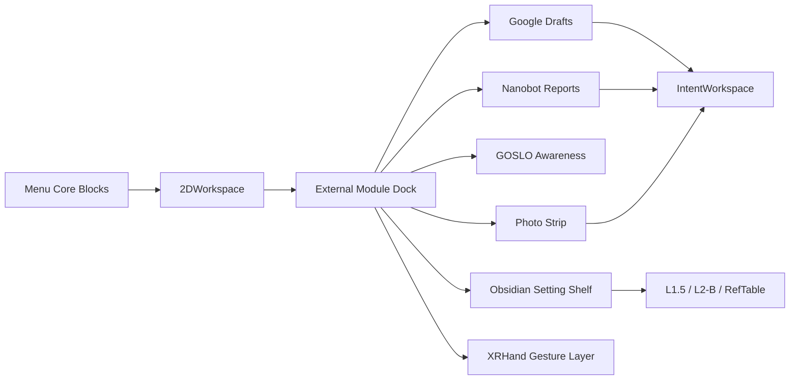

# 第一版 App 白膜：菜单画布 + 外部模块 Dock

> 状态：实现对齐草案。  
> 对应后端：`parrot.brain.app_first_version.AppFirstVersionFacade`。  
> 目标：先让 Unity App 第一版能被操作、能显示状态、能进入确认流；美术皮肤后接 Pixel Asset。

## 1. 第一屏结构

第一版 App 不做完整复杂后台，采用一个横屏白膜：

```text
┌──────────────────────────────────────────────────────────────┐
│  GOSLO Parrot                                health chips     │
│                                                              │
│  [Model] [Persona] [Mode] [Scene] [2DWorkspace]              │
│                                                              │
│  ┌──────────── External Module Dock ─────────────┐           │
│  │ Google │ Obsidian │ GOSLO │ Nanobot │ Photo │ XRHand │   │
│  └───────────────────────────────────────────────┘           │
│                                                              │
│  current surface: Mansion Hub / Workdesk / Report Desk       │
└──────────────────────────────────────────────────────────────┘
```

核心五块仍是 App 启动和 preset 的主入口；外部模块 Dock 是可空、可降级的状态区。

## 2. Pixel Asset 使用方向

用户提供的素材位于：

```text
D:\GOSLOParrot\Pixel Asset
```

当前可直接利用的素材：

| 素材 | 第一版用途 |
|:--|:--|
| `Paper UI/*.png` | Nanobot 报告纸条、Google draft、Obsidian note preview |
| `Book UI V1.zip` / `Fantasy Book UI V2.zip` | Obsidian 设定 shelf / roleplay 设定书 |
| `Wood UI.zip` | 菜单按钮、模块 dock 木质边框 |
| `MagicalUI 1.1.zip` | GOSLO Module / Awareness 状态点缀 |
| `Pixelwood Valley Icon Pack 1.0.zip` | 模块图标候选 |
| `moderninteriors-win.zip` / `Craftland.zip` | 2DWorkspace 背景候选，暂不解压进仓库 |

第一版白膜只引用素材方向，不把大 zip 复制进 Unity 项目。等 Figma / Unity 资产落地时再挑选、裁剪、入库。

## 3. 模块白膜

### Google Calendar

显示：

- `ready_readonly` / `ready_for_draft` / `needs_auth`。
- pending draft count。
- 最近同步时间。

交互：

- `Refresh`：只触发读路径。
- `Create / Patch / Delete`：创建 IntentWorkspace `calendar_draft`，等待用户确认。

### Obsidian

显示：

- vault path。
- markdown count / ingest-ready count。
- profile counts：`daily` / `roleplay` / `ref`。
- invalid notes。

规则：

- daily / roleplay 是设定源 note，不要求 UUID。
- ref 是强化绑定 note，要求 UUID / Graphiti / L2-B 线索。
- vault 留在本地，不送 ECS。

### GOSLO Module

显示：

- session capability mode。
- Photo Awareness policy。
- 是否允许 interrupt。第一版固定 false。

交互：

- 切换 silent / voice / full AR 能力时走 backend-owned RPC。
- Photo Awareness 第一版只做 `UNAWARE_RECORDED` / `AWARE_SILENT` / `AWARE_REACT`。

### Nanobot

显示：

- idle / busy / result_ready。
- report count。
- last active。

交互：

- 结果变成 IntentWorkspace `nanobot_report`，再显示为 Paper UI 纸条。
- 用户确认后再归档或写回，不自动变长期记忆。

### Photo / Camera

显示：

- camera mode：`off` / `preview` / `photo_ready` / `capture_locked`。
- photo ref count。
- awareness policy。

交互：

- 相机模式只改变 capture UI 和能力状态。
- Awareness 决定 GOSLO 是否知道拍照，不负责曝光/镜头参数。

### XRHand

显示：

- off / tracking / gesture_select。
- active scene id。

规则：

- XRHand 不改变 Scene。
- XRHand 不销毁 LiveKit room。
- gesture select 后续可连接 attention box / 2DWorkspace 拖拽。

## 4. 画布连接版本



2DWorkspace 是用户看到的表面；IntentWorkspace 是大 payload / draft 暂存；L1.5 和 L2-B 是记忆边界。

## 5. 第一版完成判据

- 后端 `AppFirstVersionFacade.list_module_statuses()` 能返回七个模块状态。
- Unity 白膜可按模块状态展示空态、就绪态、draft 态。
- Google 写操作只产生 draft。
- Obsidian daily / roleplay 设定无需 UUID。
- Photo Awareness 不打断当前对话。
- XRHand 状态不切 Scene。
- Pixel Asset 先作为皮肤候选，不阻塞白膜功能。
