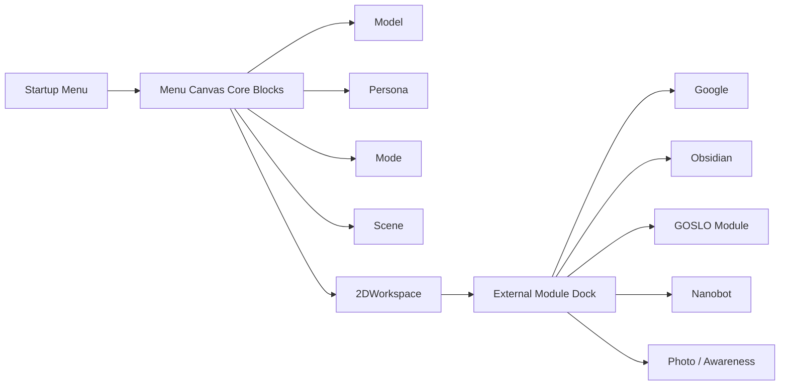
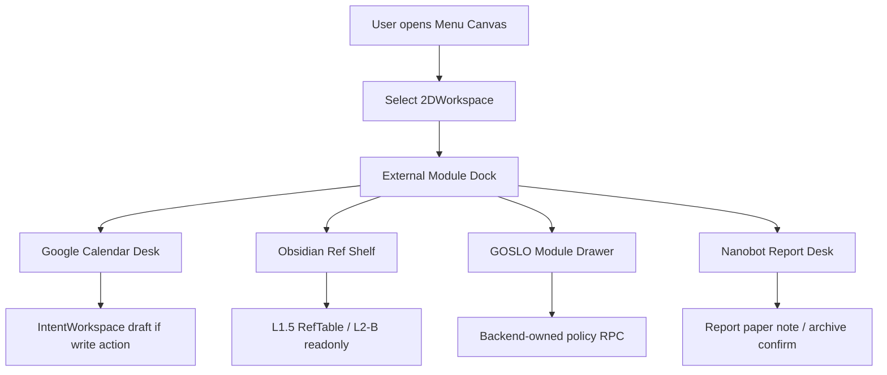

# 菜单画布外部模块设计：Google / Obsidian / GOSLO / Nanobot

> 状态：设计草案，可进入 App 第一版菜单画布实现前评审。  
> 目标：在 `Model / Persona / Mode / Scene / 2DWorkspace` 五个核心块之外，补齐外部连接模块的业务位置和交互边界。  
> 结论：现在可以开始设计菜单画布，不必等待 Google / Obsidian 真账号全量测试；但写回动作必须等 App 第一版统一测。

## 1. 总体判断

当前连接层已经足够支撑下一步设计：

- Obsidian：本地 vault 通过 Markdown ingest 进入 L1.5，MCP 只作为后续交互式读写增强。
- Google：Scheduler -> Nanobot -> Google -> L1.5 的 read path 已有设计和代码基础。
- Photo：高质量 HTTP 落盘、PhotoNode、IntentWorkspace staged ref、RefTable binding 已成型，AwarenessPolicy 仍是下一步缺口。
- Nanobot：作为后台任务和外部工具代理，不直接写 L2-B，由 Scheduler 和 L1.5 统一收口。

菜单画布不应该变成外部工具后台。它只做三件事：

1. 展示连接状态。
2. 让用户选择当前 App 工作表面和模块入口。
3. 把需要确认的写操作送进 IntentWorkspace draft。

## 2. 结构层级



核心块决定“当前 GOSLO 和 App 是什么状态”；外部模块只决定“哪些连接和任务可以被当前 workspace 打开”。

## 3. 外部模块卡片

| 模块 | 用户看到什么 | 点击后去哪里 | 不能做什么 |
|:--|:--|:--|:--|
| Google | 授权状态、今日事件数、待确认草稿数、最近同步时间 | 日程批改区 / workdesk draft | 不能直接编辑 Google 原始日程 |
| Obsidian | 本地 vault 状态、profile、有效 note 数、最近同步结果 | 设定 Node / Ref shelf | 不能绕过 L1.5 直接写 L2-B |
| GOSLO Module | Awareness、静默保活、语音/相机/会话能力状态 | GOSLO 设置抽屉 | 不能直接改图片 payload 或 LiveKit room |
| Nanobot | heartbeat、busy、当前任务、最近报告 | 报告桌 / paper note | 不能直接把报告当长期记忆 |
| Photo | 最近照片、上传状态、Awareness decision、IntentWorkspace ref | Photo strip / bind panel | 不能把原图塞进 2DWorkspace |

## 4. Google 模块

### 4.1 卡片状态

```json
{
  "module_id": "google_calendar",
  "connection_state": "connected | needs_auth | error | unknown",
  "today_event_count": 3,
  "pending_draft_count": 1,
  "last_sync_at": "2026-05-09T15:00:00Z",
  "health": "ok"
}
```

### 4.2 业务动作

| 动作 | 结果 |
|:--|:--|
| Refresh | Scheduler 派发 `calendar_fetch`，结果进 L1.5 |
| Open Desk | 打开 2DWorkspace 的日程批改区 |
| Create / Patch / Delete | 创建 IntentWorkspace calendar draft，等待用户确认 |

Google 模块第一版只允许 read 和 draft，不做无确认写回。

## 5. Obsidian 模块

### 5.1 本地连接选择

GOSLObsidian vault 应保持在本地，例如：

```text
D:\GOSLOParrot\GOSLObsidian\GOSLOParrot
```

它不需要送到 ECS。ECS 可以跑 Brain / LiveKit / TURN / Nanobot 等服务，但 Obsidian vault 是用户本地知识库，第一版只做本地扫描和同步。

### 5.2 MCP 判断

`cyanheads/obsidian-mcp-server` 适合作为后续“交互式读写 Obsidian”的连接层，因为它提供 note read/search/write/patch/frontmatter/tag 工具，并支持只读和路径级权限。但它依赖 Obsidian Local REST API 插件和本机 API key。

第一版建议：

- ingest：继续用本地 Markdown 脚本 `sync_obsidian_to_graphiti.py`。
- 检查：用 `check_obsidian_vault.py` 验证 vault 是否有合法 frontmatter。菜单里的 daily / roleplay 设定 note 不要求 UUID；只有 `profile=ref` 的强化绑定 note 才要求 UUID。
- 写回：暂缓；未来走 Obsidian MCP + IntentWorkspace draft + 用户确认。

### 5.3 三 profile UI 硬边界

Obsidian 模块必须把三类 note 分开显示：

- `daily` / `roleplay`：设定来源。显示 note title/path、profile、同步状态和最近更新时间；不能提示“缺 UUID”。
- `ref`：引用强化。显示 UUID、target node、Graphiti/L2-B 绑定状态；缺 UUID 时显示可修复错误。

“大小姐宅邸设定”“RolePlay Mode 设定”等菜单设定文件属于 `roleplay` 设定源，不应被误放进 UUID-bound Ref 流程。

### 5.4 卡片状态

```json
{
  "module_id": "obsidian",
  "vault_path": "D:/GOSLOParrot/GOSLObsidian/GOSLOParrot",
  "connection_state": "local_reachable | no_valid_notes | mcp_ready | error",
  "markdown_count": 6,
  "ingest_ready_count": 5,
  "profile_counts": {"daily": 1, "roleplay": 3, "ref": 1},
  "last_sync_at": null
}
```

## 6. GOSLO Module

GOSLO Module 不是“换模型”块。模型选择仍属于 `Model`，GOSLO Module 是当前 GOSLO 运行能力的控制面。

| 控制 | 第一版默认 |
|:--|:--|
| Session keepalive | on |
| Silent keepalive | on when workspace requires quiet |
| Photo Awareness | `AWARE_SILENT` or off, never interrupt by default |
| Voice input | follows audio route policy |
| Camera mode | open tool drawer, not always-on |
| Greeting | wait for placement / user action |

这些开关要通过 backend-owned RPC 写入，不能让 Unity 直接写 Blackboard。

## 7. Nanobot 模块

Nanobot 在菜单画布里应表现为“后台任务柜台”，不是聊天主角。

| 状态 | UI 表达 |
|:--|:--|
| idle | 可派发任务 |
| busy | 显示当前 task type 和 elapsed |
| result_ready | 把报告变成 paper note |
| error | 显示短错误和 retry |
| disconnected | 显示连接断开，不阻塞主 App |

Nanobot result 进入 App 时，优先变成 2DWorkspace 的报告纸条。只有用户确认归档时，才进入对应 L1.5 / L2-B 或外部写回路径。

## 8. 2DWorkspace 与 IntentWorkspace

| 维度 | 2DWorkspace | IntentWorkspace |
|:--|:--|:--|
| 用户是否直接看见 | 是 | 通常否 |
| 存什么 | 页面、卡片、模块入口、ref id | 大 payload、draft、staged ref |
| 生命周期 | 随 App 页面和 preset | 随 IntentEvent / pressure 回收 |
| 写者 | Menu / Workspace registry | Brain / DSG trigger / tool |
| 示例 | 日程桌、报告桌、Obsidian shelf | calendar draft、photo staged ref、report payload |

菜单画布可以显示 IntentWorkspace ref 的存在，但不能持有 payload。

## 9. App 第一版业务入口



## 10. 第一版验收

- 菜单画布仍能只靠五个核心块启动 App。
- 外部模块 dock 可以为空，不阻塞 LiveKit / AR 主流程。
- Google / Obsidian / Nanobot / Photo 状态缺失时显示明确空态。
- 写操作都进入 IntentWorkspace draft。
- 切换 2DWorkspace 不销毁 LiveKit room。
- GOSLO Awareness 默认不打断当前对话。
