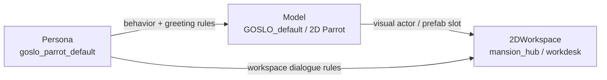

# 菜单画布 MVP：Model / Persona / 2DWorkspace 连接设计

> 状态：设计草案，待用户审查。  
> 目标：先完成菜单画布最小可测试闭环，而不是一次性做完所有模块。  
> 结论：在既有 4-block `Model / Persona / Mode / Scene` 之外，新增 user-visible `2DWorkspace` 块。

## 为什么要新增 2DWorkspace 块

原后端菜单核心是：

- `Model`
- `Persona`
- `Mode`
- `Scene`

但当前 App 设计里，`2DWorkspace` 不是普通 Scene：

- `Scene` 更偏感知/环境 baseline，例如 `AR_HANDHELD`、`DESKTOP_WEBCAM`，会影响 DSG mode、video tier、CV flow、bucket 管理。
- `2DWorkspace` 是 App 内的工作表面，例如宅邸大厅、工作桌、报告桌、日程批改区、Obsidian 设定 Node 区。
- `2DWorkspace` 可以和 LiveKit Session 同时存在，也可以在不销毁 Session 的情况下从 AR 主界面切换进去。
- `2DWorkspace` 要和角色、模型、工具、任务面板、菜单模块连接，后续会承载 Google / Obsidian / Nanobot 等外挂模块。

所以它应该是第五个 user-visible block，而不是塞到 `Scene` 枚举里。

## MVP 范围

第一轮只做 3 个块：

| Block | 作用 | 先测什么 |
|:--|:--|:--|
| `Model` | 选择当前可视/可操作角色模型 | `GOSLO_default` / 2D 鹦鹉占位能被工作区消费 |
| `Persona` | 选择当前人格/话术/行为约束 | `goslo_parrot_default` 能和模型绑定 |
| `2DWorkspace` | 选择 App 内工作空间 | `mansion_hub` / `workdesk` / `reports` 等占位能切换 |

暂时不做：

- Google 模块
- Obsidian 模块
- Nanobot 模块
- Camera / PhotoNode 模块
- 复杂连线规则编辑器
- 完整保存/分享预设 UI

## 2DWorkspace 与 Scene 的边界

| 维度 | Scene | 2DWorkspace |
|:--|:--|:--|
| 核心含义 | 感知环境 / baseline | App 内工作表面 / 交互空间 |
| 例子 | `ar_handheld`, `desktop_webcam` | `mansion_hub`, `workdesk`, `report_desk` |
| 影响 | DSG mode, video tier, CV flow, bucket 管理 | UI route, 2D prefab, task surface, report interaction |
| 是否一定要视频 | 可能需要 | 不一定 |
| 是否销毁 LiveKit Session | 不应直接决定 | 不销毁，只改变交互表面 |
| 是否属于菜单画布模块 | 是 | 是，新增第五块 |

## 建议新增核心状态

如果进入代码实现，需要新增一个 active key：

```text
global/active_workspace_id
```

建议单写者：

```text
brain.preset_loader
```

原因：

- 当前 `PresetLoader` 已经是 `global/active_model_id`、`global/active_persona_id`、`global/active_scene_id`、`global/active_mode` 的单写者。
- `2DWorkspace` 需要和 preset 一起保存/恢复。
- 避免 Unity 菜单画布直接写 Blackboard。

这属于核心菜单状态扩展。实现时需要在代码注释或 commit msg 写明理由：

> reason: 2DWorkspace is an app interaction surface, not a perception Scene; it must persist with menu presets without destroying the LiveKit session.

## Preset schema 扩展草案

当前：

```json
{
  "schema_version": 1,
  "preset_id": "default",
  "active_model_id": "GOSLO_default",
  "active_persona_id": "goslo_parrot_default",
  "active_mode": ["BASE", "COMPANION"],
  "active_scene_id": "ar_handheld",
  "metadata": {
    "user_label": "Default GOSLO setup",
    "theme_skin": "manor"
  }
}
```

建议 v2：

```json
{
  "schema_version": 2,
  "preset_id": "default",
  "active_model_id": "GOSLO_default",
  "active_persona_id": "goslo_parrot_default",
  "active_mode": ["BASE", "COMPANION"],
  "active_scene_id": "ar_handheld",
  "active_workspace_id": "mansion_hub",
  "metadata": {
    "user_label": "Default GOSLO setup",
    "theme_skin": "manor"
  }
}
```

向后兼容：

- 旧 schema 没有 `active_workspace_id` 时，默认 `mansion_hub`。
- 不强迫旧 preset 迁移。

## Workspace block 数据草案

```json
{
  "workspace_id": "mansion_hub",
  "display_name": "宅邸大厅",
  "workspace_type": "hub",
  "default_scene_id": "ar_handheld",
  "session_policy": "keep_session_silent",
  "allowed_tools": ["menu_canvas", "report", "calendar", "obsidian_ref"],
  "model_slots": ["companion_main", "module_npc"],
  "metadata": {
    "ui_prefab": "Workspace/MansionHub",
    "pixel_theme": "manor"
  }
}
```

第一轮可内置 3 个：

| workspace_id | 显示名 | 用途 |
|:--|:--|:--|
| `mansion_hub` | 宅邸大厅 | 2D 管理工作区入口 / 多区域导航 |
| `workdesk` | 工作桌 | Papers, Please 式批改、盖章、拖拽文件 |
| `report_desk` | 报告桌 | Nanobot / Brain 结果纸条阅读与确认 |

## 三块连接语义



### Model -> 2DWorkspace

含义：

- 当前模型提供工作区里的 2D sprite / prefab / 动作集。
- 启动页标题旁的 2D 鹦鹉形象来自这里。
- 如果模型没有 2D 表现，工作区使用默认占位 sprite。

测试：

- 选择 `GOSLO_default`。
- 工作区显示 GOSLO Parrot 占位。
- 切换模型后，工作区角色槽更新。

### Persona -> Model

含义：

- 当前 persona 约束模型说话、动作、问候时机。
- LiveKit 连接后不立即问候，必须等 AR 平面识别 + 用户放置完成；2D 工作区可按 workspace rule 打招呼。

测试：

- 选择 `goslo_parrot_default`。
- Model 的行为说明显示当前 persona。
- 不因连接成功就触发 greeting。

### Persona -> 2DWorkspace

含义：

- 工作区内的对话、报告呈现、按钮文案、任务确认风格受 persona 影响。
- 工作桌里的“批准/驳回/稍后处理”可以用 persona 文案包装。

测试：

- 进入 `workdesk`。
- 工作桌显示当前 persona 风格的短提示。
- 切换 workspace 时，LiveKit Session 不销毁。

## Session 策略

`2DWorkspace` 切换不能销毁 Session。建议 `workspace.session_policy` 只控制能力开关：

| policy | 含义 |
|:--|:--|
| `keep_session_silent` | 保持 Session，不主动说话 |
| `voice_only_no_video` | 保持对话，不启用视频 |
| `voice_video_no_action_monitor` | 保持对话和视频，不监控动作 |
| `full_ar_companion` | 全开 |

这些可以先复用 ChatA 设计里的四档能力模式，后续再决定是否进入 `Mode` block 或 workspace metadata。

## 第一轮完成判据

正向：

- 菜单画布能显示 `Model`、`Persona`、`2DWorkspace` 三个块。
- 三个块能连接成一条最小链路。
- 应用选择后得到一个 preset-like selection：

```json
{
  "active_model_id": "GOSLO_default",
  "active_persona_id": "goslo_parrot_default",
  "active_workspace_id": "mansion_hub",
  "active_scene_id": "ar_handheld",
  "active_mode": ["BASE", "COMPANION"]
}
```

- 切换到 2D workspace 时，LiveKit Session 保持。

失败：

- workspace 未注册时，UI 显示 fallback `mansion_hub`。
- 模型没有 2D 表现时，UI 使用默认 2D 鹦鹉占位。
- Persona 加载失败时，使用 `goslo_parrot_default`。

## 后续扩展

下一批模块再接：

- Google 模块：日程区 / 工作桌确认。
- Obsidian 模块：设定 Node / Ref 区。
- Nanobot 模块：报告桌 / 任务执行区。
- PhotoNode 模块：照片绑定 / 场景证据区。
- GOSLO module：更完整的模型能力 / intent / aware 控制。

