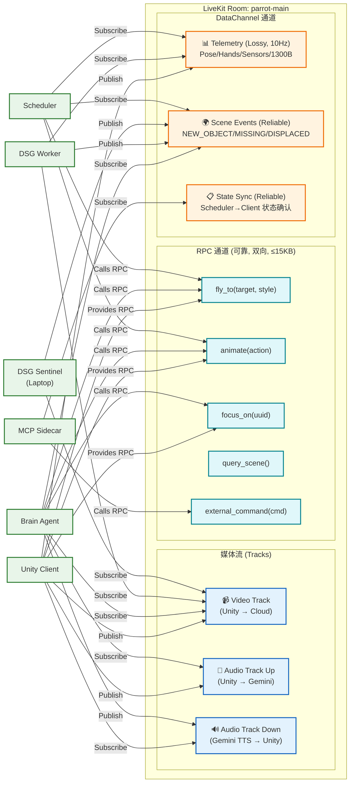

# ParrotCarriers 总线架构 v4 — 可挂载服务总线设计

> 生成日期: 2026-03-06
> 前置依赖: `10_architecture_diagram.md` (v3 架构图), `14_scheduler_and_state_machine.md`, `13_soul_memory_communication.md`
> 核心变更: 将 LiveKit 从"传输层"提升为"服务总线骨架"；定义模块挂载协议；显式化 DSG/调度器/生态集成的插槽设计
> 设计目标: **一条总线、三层协议、N 个可插拔模块**

---

## 0. 对 plan02 / plan03 的审计与改进意见

### 0.1 plan02 / plan03 的核心思路回顾

| 来源 | 核心主张 | 评价 |
|:-----|:---------|:-----|
| plan02 | 补充 LobeChat/Dify 多智能体群聊 + Obsidian MCP 工作台 + FastAPI 插口 | 方向正确，但"继承外部 UI"与"总线自治"是两件事，不应混为一谈 |
| plan03 | 三插槽 (Firehose / Command Hook / MCP Sidecar) + 先跑总线后挂生态 | 插槽思路好，但缺乏形式化定义——"留口子"不等于"设计口子" |
| plan03 | AR 宝可梦 (Niantic Lightship ARDK) 作为未来视觉参考 | 好的远景，但属于 Phase 3+，不影响总线设计 |

### 0.2 本文档的改进点

| # | plan02/03 的不足 | 本文改进 |
|:--|:----------------|:---------|
| 1 | LiveKit 仅被视为"传输层"——一根管道 | **提升为三层服务总线**：实时层(LiveKit) + 状态层(Redis) + 知识层(Graphiti)，每层都有明确的挂载协议 |
| 2 | 三插槽只是概念描述，没有接口定义 | **定义 ModuleManifest 协议**：每个模块必须声明 capabilities / subscriptions / publications |
| 3 | DSG 模块与主 Agent 紧耦合 | **DSG 作为独立 LiveKit Worker**：可热插拔，支持 Castle/Mecha 跨节点部署 |
| 4 | 调度器(py-trees)内嵌在主进程 | **调度器作为可替换模块**：通过 Redis Blackboard 解耦，允许 py-trees / 简单路由 / 自定义调度器 切换 |
| 5 | 多智能体(大姐/妹妹/猫猫)的通信路径不明确 | **定义 Room Topology**：主房间 + 侧车房间，多 Agent 通过 LiveKit Room 级别隔离/桥接 |
| 6 | MCP Sidecar 只是个 HTTP 端口 | **MCP Sidecar 作为完整总线参与者**：既暴露外部 API，又消费内部事件 |
| 7 | 没有考虑模块健康检查与优雅降级 | **Heartbeat + Graceful Degradation**：模块离线时总线自动降级而非崩溃 |

---

## 1. 核心架构理念：LiveKit Room = Service Bus

### 1.1 关键洞察

LiveKit 不仅仅是 WebRTC 传输层——它的 Room 模型天然就是一个**服务总线**：

| LiveKit 概念 | 总线类比 | ParrotCarriers 映射 |
|:-------------|:---------|:-------------------|
| Room | Message Bus / Topic | 一个 Bus 实例 = 一个 Room |
| Participant | Service / Module | 每个模块 = 一个 Participant |
| RPC | Synchronous Call (请求-响应) | 可靠指令 (fly_to, animate) |
| DataChannel Reliable | Guaranteed Message Queue | 状态同步、事件通知 |
| DataChannel Lossy | Best-effort Telemetry | 传感器遥测 (10Hz) |
| Audio Track | Voice Stream | 语音对话 (STT/TTS) |
| Video Track | Vision Stream | 摄像头帧流 |
| Agent Worker | Microservice | Python 后端各模块 |

### 1.2 设计原则

```
┌────────────────────────────────────────────────────────────┐
│                    ParrotCarriers 设计原则                    │
│                                                              │
│  1. 总线即房间 (Bus = Room)                                  │
│     → 模块通过加入 LiveKit Room 挂载到总线                      │
│                                                              │
│  2. 模块即参与者 (Module = Participant)                       │
│     → 每个模块声明自己的 capabilities (RPC/Track/DataChannel)  │
│                                                              │
│  3. 三层协议 (Three-Tier Protocol)                            │
│     → 实时层: LiveKit (毫秒级，媒体+指令)                      │
│     → 状态层: Redis (亚秒级，黑板+事件广播)                     │
│     → 知识层: Graphiti/Neo4j (秒级，长期记忆+图谱)             │
│                                                              │
│  4. 热插拔 (Hot-Pluggable)                                   │
│     → 模块可动态加入/离开，总线自动发现与降级                     │
│                                                              │
│  5. 协议不绑实现 (Protocol over Implementation)               │
│     → 调度器可以是 py-trees 也可以是简单路由                     │
│     → DSG 可以在本地也可以在 GPU 节点                          │
│     → MCP 可以接 LobeChat 也可以接 Obsidian                   │
└────────────────────────────────────────────────────────────┘
```

---

## 2. 三层总线协议

### 2.1 总线分层全景

```
                     ParrotCarriers 三层总线
    ┌──────────────────────────────────────────────────┐
    │                                                    │
    │  ╔═══════════════════════════════════════════════╗  │
    │  ║ Layer 1: 实时层 (LiveKit Room)                 ║  │
    │  ║ 延迟: <50ms  │  传输: WebRTC                   ║  │
    │  ║ 内容: 音视频流 / RPC指令 / DataChannel遥测      ║  │
    │  ║ 特点: 每个模块=一个Participant, 自动发现         ║  │
    │  ╚═══════════════════════════════════════════════╝  │
    │                       ↕ 双向桥接                    │
    │  ╔═══════════════════════════════════════════════╗  │
    │  ║ Layer 2: 状态层 (Redis)                        ║  │
    │  ║ 延迟: <5ms   │  传输: TCP                      ║  │
    │  ║ 内容: Blackboard / Pub/Sub / 资源锁 / 任务队列  ║  │
    │  ║ 特点: 解耦模块间状态, 支持离线模块监听           ║  │
    │  ╚═══════════════════════════════════════════════╝  │
    │                       ↕ 异步写入                    │
    │  ╔═══════════════════════════════════════════════╗  │
    │  ║ Layer 3: 知识层 (Graphiti + Neo4j)             ║  │
    │  ║ 延迟: <500ms │  传输: Bolt/HTTP               ║  │
    │  ║ 内容: 情景记忆 / 物体知识 / 人格特质 / 社区摘要  ║  │
    │  ║ 特点: 持久化, Leiden社区检测, group_id分区       ║  │
    │  ╚═══════════════════════════════════════════════╝  │
    │                                                    │
    └──────────────────────────────────────────────────┘
```

### 2.2 各层职责边界

| 层级 | 适合传输的数据 | 不适合传输的数据 |
|:-----|:-------------|:---------------|
| **L1 实时层** (LiveKit) | 摄像头帧流、语音、RPC 指令、实时遥测 | 大批量历史查询、持久化状态 |
| **L2 状态层** (Redis) | 模块状态、资源锁、事件广播、任务分发 | 音视频流、大文件、长期存储 |
| **L3 知识层** (Graphiti) | 情景归档、知识图谱查询、社区摘要预加载 | 实时数据、高频更新 |

### 2.3 层间桥接

```python
class BusLayerBridge:
    """三层总线之间的桥接器 — 运行在 brain-agent 进程内"""

    async def livekit_to_redis(self, event: LiveKitEvent):
        """L1 → L2: 将 LiveKit 事件广播到 Redis"""
        await self.redis.publish("parrot.events.firehose", event.to_json())

    async def redis_to_livekit(self, channel: str, message: str):
        """L2 → L1: 将 Redis 命令转发为 LiveKit RPC"""
        cmd = Command.from_json(message)
        await self.room.local_participant.perform_rpc(
            destination_identity=cmd.target,
            method=cmd.method,
            payload=cmd.payload
        )

    async def redis_to_graphiti(self, event: ArchiveEvent):
        """L2 → L3: 将归档事件写入 Graphiti"""
        await self.graphiti.add_episode(
            name=event.summary,
            episode_body=event.body,
            group_id=event.partition
        )
```

---

## 3. 模块挂载协议 (Module Manifest Protocol)

### 3.1 ModuleManifest 定义

每个挂载到 ParrotCarriers 总线的模块必须声明一份清单：

```python
from dataclasses import dataclass, field
from enum import Enum

class ModuleType(Enum):
    CORE = "core"           # 核心模块 (brain, scheduler)
    PERCEPTION = "perception"  # 感知模块 (DSG, vision)
    WORKER = "worker"       # 后台工人 (nanobot)
    BRIDGE = "bridge"       # 生态桥接 (MCP, LobeChat)
    CLIENT = "client"       # 前端客户端 (Unity)

@dataclass
class ModuleManifest:
    """模块挂载清单 — 声明模块的身份和能力"""

    module_id: str                          # "brain-agent" / "dsg-worker" / "mcp-sidecar"
    module_type: ModuleType
    version: str

    # L1 实时层能力
    livekit_identity: str                   # LiveKit Participant 身份
    rpc_methods_provided: list[str] = field(default_factory=list)   # 对外暴露的 RPC
    rpc_methods_consumed: list[str] = field(default_factory=list)   # 需要调用的 RPC
    tracks_published: list[str] = field(default_factory=list)       # "video" / "audio"
    tracks_subscribed: list[str] = field(default_factory=list)
    data_channels: list[dict] = field(default_factory=list)         # [{name, direction, reliable}]

    # L2 状态层能力
    redis_channels_publish: list[str] = field(default_factory=list)  # Pub/Sub 发布频道
    redis_channels_subscribe: list[str] = field(default_factory=list)
    blackboard_keys_read: list[str] = field(default_factory=list)    # 读取的黑板键
    blackboard_keys_write: list[str] = field(default_factory=list)

    # L3 知识层能力
    graphiti_partitions: list[str] = field(default_factory=list)     # 访问的 Graphiti 分区

    # 运行约束
    requires_gpu: bool = False
    min_memory_mb: int = 256
    health_check_interval_s: int = 30
```

### 3.2 核心模块清单注册

```python
BRAIN_AGENT = ModuleManifest(
    module_id="brain-agent",
    module_type=ModuleType.CORE,
    version="1.0.0",
    livekit_identity="brain-agent",
    rpc_methods_consumed=["fly_to", "animate", "focus_on"],
    tracks_subscribed=["video", "audio"],
    tracks_published=["audio"],     # TTS output
    data_channels=[
        {"name": "telemetry", "direction": "subscribe", "reliable": False},
        {"name": "scene-events", "direction": "subscribe", "reliable": True},
    ],
    redis_channels_publish=["parrot.brain.decisions", "parrot.events.firehose"],
    redis_channels_subscribe=["parrot.scheduler.results", "parrot.nanobot.results"],
    blackboard_keys_read=["parrot_state", "scene_context", "active_modes"],
    blackboard_keys_write=["parrot_state", "active_modes", "chat_context"],
    graphiti_partitions=["episodic", "objects", "personality", "vocabulary"],
)

DSG_WORKER = ModuleManifest(
    module_id="dsg-worker",
    module_type=ModuleType.PERCEPTION,
    version="1.0.0",
    livekit_identity="dsg-worker",
    tracks_subscribed=["video"],
    data_channels=[
        {"name": "telemetry", "direction": "subscribe", "reliable": False},
        {"name": "scene-events", "direction": "publish", "reliable": True},
    ],
    redis_channels_publish=["parrot.dsg.events", "parrot.dsg.scene_update"],
    redis_channels_subscribe=["parrot.brain.focus_commands", "parrot.dsg.sentinel.evidence"],
    blackboard_keys_read=["scene_context", "parrot_state"],
    blackboard_keys_write=["scene_context", "dsg_l2a_snapshot", "dsg_l2b_snapshot"],
    requires_gpu=True,      # L1 模型 (SAM2/DINOv2/YOLO) 需要 GPU
    min_memory_mb=4096,
)

DSG_SENTINEL = ModuleManifest(
    module_id="dsg-sentinel-laptop",
    module_type=ModuleType.PERCEPTION,
    version="1.0.0",
    livekit_identity="dsg-sentinel",
    tracks_subscribed=["video"],  # 可选：如果用手机摄像头。或者自带摄像头不走 LiveKit
    redis_channels_publish=["parrot.dsg.sentinel.evidence"],
    blackboard_keys_read=["scene_context"],
    requires_gpu=False,     # 可用笔记本 CPU/核显跑 YOLO
)

SCHEDULER = ModuleManifest(
    module_id="scheduler",
    module_type=ModuleType.CORE,
    version="1.0.0",
    livekit_identity="scheduler",
    rpc_methods_consumed=["fly_to", "animate"],
    redis_channels_publish=["parrot.scheduler.commands", "parrot.nanobot.dispatch"],
    redis_channels_subscribe=["parrot.brain.decisions", "parrot.dsg.events"],
    blackboard_keys_read=["parrot_state", "scene_context", "resource_locks"],
    blackboard_keys_write=["resource_locks", "task_queue", "scheduler_state"],
)

NANOBOT_WORKER = ModuleManifest(
    module_id="nanobot-worker",
    module_type=ModuleType.WORKER,
    version="1.0.0",
    livekit_identity="nanobot-worker",
    redis_channels_publish=["parrot.nanobot.results"],
    redis_channels_subscribe=["parrot.nanobot.dispatch"],
    blackboard_keys_read=["parrot_state"],
    graphiti_partitions=["nanobot_research", "objects"],
)

MCP_SIDECAR = ModuleManifest(
    module_id="mcp-sidecar",
    module_type=ModuleType.BRIDGE,
    version="1.0.0",
    livekit_identity="mcp-sidecar",
    redis_channels_publish=["parrot.external.commands"],
    redis_channels_subscribe=["parrot.events.firehose"],
    blackboard_keys_read=["parrot_state", "scene_context"],
)

UNITY_CLIENT = ModuleManifest(
    module_id="unity-client",
    module_type=ModuleType.CLIENT,
    version="1.0.0",
    livekit_identity="unity-client",
    rpc_methods_provided=["fly_to", "animate", "focus_on"],
    tracks_published=["video", "audio"],
    tracks_subscribed=["audio"],
    data_channels=[
        {"name": "telemetry", "direction": "publish", "reliable": False},
    ],
)
```

---

## 4. 总线架构图 v4

### 4.1 宏观拓扑 (Macro Topology)

```mermaid
graph TB
    classDef bus fill:#fff3e0,stroke:#ef6c00,stroke-width:3px
    classDef core fill:#e8f5e9,stroke:#2e7d32,stroke-width:2px
    classDef perception fill:#fce4ec,stroke:#c62828,stroke-width:2px
    classDef worker fill:#eceff1,stroke:#455a64,stroke-width:2px,stroke-dasharray: 5 5
    classDef bridge fill:#e0f7fa,stroke:#00838f,stroke-width:2px
    classDef client fill:#e3f2fd,stroke:#1565c0,stroke-width:2px
    classDef redis fill:#fff9c4,stroke:#fbc02d,stroke-width:2px
    classDef graphiti fill:#f3e5f5,stroke:#7b1fa2,stroke-width:2px
    classDef socket fill:#ffecb3,stroke:#ff6f00,stroke-width:3px,stroke-dasharray: 10 5

    %% ========================================
    %% 中央总线
    %% ========================================
    subgraph BUS ["🔶 ParrotCarriers Bus"]
        direction TB

        subgraph L1_BUS ["Layer 1 · 实时层 (LiveKit Room: parrot-main)"]
            LK_Room["LiveKit Server\n(Room: parrot-main)\n· RPC Router\n· Track Router\n· DataChannel Router"]:::bus
        end

        subgraph L2_BUS ["Layer 2 · 状态层 (Redis)"]
            Redis_BB["Redis Blackboard\n· parrot_state\n· scene_context\n· resource_locks"]:::redis
            Redis_PS["Redis Pub/Sub\n· parrot.events.firehose\n· parrot.brain.*\n· parrot.dsg.*\n· parrot.scheduler.*\n· parrot.nanobot.*\n· parrot.external.*"]:::redis
            Redis_Q["Redis Streams\n· task_queue\n· event_log"]:::redis
        end

        subgraph L3_BUS ["Layer 3 · 知识层 (Graphiti + Neo4j)"]
            Graphiti["Graphiti Core\n· episodic\n· objects\n· personality\n· vocabulary\n· nanobot_research"]:::graphiti
            Neo4j[("Neo4j\n· Leiden 社区\n· 图谱可视化")]:::graphiti
            Graphiti <--> Neo4j
        end
    end

    %% ========================================
    %% 核心模块 (Core Modules)
    %% ========================================
    subgraph CORE ["🟢 Core Modules (Castle 常驻)"]
        Brain["🧠 Brain Agent\n(Gemini RealtimeModel)\n· AgentSession\n· ParrotSoul\n· Context Injector\n· Tool Forwarding"]:::core
        Scheduler["⚙️ Scheduler\n(可替换引擎)\n· MVP: 简单路由\n· Phase3: py-trees BT\n· 资源锁管理器\n· 优先级中断"]:::core
    end

    %% ========================================
    %% 感知模块 (Perception Modules)
    %% ========================================
    subgraph PERCEPTION ["🔴 Perception Modules (Mecha 按需)"]
        DSG["👁️ DSG Worker\n(可热插拔)\n· L1: YOLO-World+SAM2+DINOv2\n· L2-A: RustworkX 空间图\n· L2-B: RustworkX 语义图\n· L3: Observer Pipeline"]:::perception
        SVA["🎥 SVA Vision\n(可选扩展)\n· Stream Processor\n· 多模型编排\n· 实时翻译"]:::perception
    end

    %% ========================================
    %% 后台工人 (Worker Modules)
    %% ========================================
    subgraph WORKERS ["⚪ Worker Modules (Castle 常驻)"]
        Nanobot["🐱 Nanobot Worker\n· research\n· memory_consolidation\n· vocabulary_learn\n· reminder_check"]:::worker
        Nanobot2["🐱 Nanobot Worker #2\n(可水平扩展)"]:::worker
    end

    %% ========================================
    %% 生态桥接 (Bridge / Socket Modules)
    %% ========================================
    subgraph BRIDGES ["🔵 Bridge Modules (可选挂载)"]
        MCP["🔌 MCP Sidecar\n(FastMCP / FastAPI)\n· /mcp (MCP协议)\n· /api/v1 (REST)\n· /ws (WebSocket)\n→ Claude/Cursor/LobeChat"]:::bridge
        Lobe["💬 LobeChat Bridge\n(Agent Teams)\n· 大姐(Gemini App)\n· 妹妹(GOSLO)\n· 猫猫(Nanobot)\n→ 多智能体群聊"]:::bridge
        Obsidian["📝 Obsidian Bridge\n(MCP Client)\n· Canvas 读写\n· 笔记查询\n· 知识同步"]:::bridge
    end

    %% ========================================
    %% 前端客户端 (Client Module)
    %% ========================================
    subgraph CLIENTS ["🔷 Client Modules"]
        Unity["📱 Unity AR Client\n(client-sdk-unity v1.3.3)\n· ARCore / XR Hands\n· Animator HSM\n· RPC Handler\n· DataChannel Telemetry"]:::client
        WebClient["🌐 Web Client\n(可选, 调试用)\n· LiveKit JS SDK\n· 状态监控面板"]:::client
    end

    %% ========================================
    %% 连接关系
    %% ========================================

    %% 所有模块 ↔ LiveKit Room (L1)
    Brain <-- "WebRTC\nRPC + Audio + Video" --> LK_Room
    Scheduler <-- "RPC\n+ DataChannel" --> LK_Room
    DSG <-- "Video Track\n+ DataChannel" --> LK_Room
    SVA -. "Video Track\n(可选)" .-> LK_Room
    Unity <-- "WebRTC\n全通道" --> LK_Room
    WebClient -. "WebRTC\n(调试)" .-> LK_Room
    MCP <-- "RPC\n(桥接)" --> LK_Room

    %% 核心模块 ↔ Redis (L2)
    Brain <--> Redis_BB
    Brain <--> Redis_PS
    Scheduler <--> Redis_BB
    Scheduler <--> Redis_PS
    DSG --> Redis_PS
    DSG <--> Redis_BB
    Nanobot <--> Redis_PS
    Nanobot <--> Redis_Q
    Nanobot2 <--> Redis_Q
    MCP --> Redis_PS
    Lobe <--> Redis_PS
    Obsidian <--> Redis_PS

    %% 知识层连接 (L3)
    Brain <--> Graphiti
    Nanobot --> Graphiti
    DSG -- "语义预加载" --> Graphiti
    Obsidian -. "知识同步" .-> Graphiti
```



### 4.2 LiveKit 内部通信详图



---

## 5. 模块挂载点详细设计

### 5.1 DSG 模块挂载

DSG 模块是 ParrotCarriers 总线上最重要的**感知引擎**，但它也是最吃资源的模块。设计为可热插拔：

```
┌─────────────────────────────────────────────────────────┐
│                   DSG 模块挂载设计                         │
│                                                           │
│  挂载方式: LiveKit Agent Worker (独立进程/独立节点)         │
│  部署位置: Mecha (A10 GPU) 或 Castle (降级 CPU 模式)       │
│                                                           │
│  ┌──── 挂载时 (Mecha 在线) ─────────────────────────┐     │
│  │                                                    │     │
│  │  DSG Worker 加入 Room "parrot-main"               │     │
│  │  ↓                                                │     │
│  │  订阅 Unity 的 Video Track (独立副本, ≤30fps)      │     │
│  │  订阅 DataChannel "telemetry" (Pose/Sensors)       │     │
│  │  ↓                                                │     │
│  │  L1 (YOLO+SAM2+DINOv2) → L2-A (空间图) → L2-B    │     │
│  │  ↓                                                │     │
│  │  发布 DataChannel "scene-events" (Reliable)        │     │
│  │  写入 Redis: dsg_l2a_snapshot, dsg_l2b_snapshot    │     │
│  │  写入 Redis Pub/Sub: parrot.dsg.events             │     │
│  │                                                    │     │
│  └────────────────────────────────────────────────────┘     │
│                                                           │
│  ┌──── 卸载时 (Mecha 离线 / 降级) ─────────────────┐      │
│  │                                                    │     │
│  │  Brain Agent 检测到 DSG Worker 心跳超时            │     │
│  │  ↓                                                │     │
│  │  自动降级: Brain 直接通过 Gemini video_input       │     │
│  │  处理视频帧 (无 DSG 图, 纯语言理解)                │     │
│  │  ↓                                                │     │
│  │  Redis 中 dsg_l2a_snapshot 保持最后已知状态         │     │
│  │  场景感知降级为 "Gemini 纯视觉问答" 模式            │     │
│  │                                                    │     │
│  └────────────────────────────────────────────────────┘     │
│                                                           │
│  ┌──── 未来扩展: 多 DSG Worker ───────────────────┐       │
│  │                                                    │     │
│  │  DSG Worker #1: L1 + L2-A (空间拓扑, GPU 密集)    │     │
│  │  DSG Worker #2: L2-B + L3 (语义注意力, CPU 密集)  │     │
│  │  → 通过 Redis Pub/Sub 协同, 独立扩缩              │     │
│  │                                                    │     │
│  └────────────────────────────────────────────────────┘     │
└─────────────────────────────────────────────────────────┘
```

### 5.1.1 DSG 哨兵挂载 (Sentinel)

为了利用用户的闲置算力（如笔记本电脑），我们引入 **DSG Sentinel**。它是一个"残血版"的 DSG Worker，专门负责用轻量模型（如 YOLO）做特征匹配和已知物体兜底检测，避免云端 GPU 过载。

```
┌─────────────────────────────────────────────────────────┐
│                 DSG Sentinel 挂载设计                      │
│                                                           │
│  部署位置: 用户本地笔记本 (CPU 或 核显)                     │
│  模型: YOLO-World (或者更轻量的 YOLOv8/v10)                 │
│                                                           │
│  挂载方式:                                                 │
│  1. 加入 Room "parrot-main", 作为独立 Participant          │
│  2. 订阅 Unity 的 Video Track (或使用笔记本自带摄像头)      │
│  3. 接收 Redis 中 `parrot.brain.focus_commands` 的提示词    │
│                                                           │
│  职责: 提供小权重的兜底证据                                 │
│  - "主 DSG (云端) 没发现笔记本，但我(哨兵)看到了笔记本特征"     │
│  - 输出: 发布至 `parrot.dsg.sentinel.evidence` 通道         │
│                                                           │
│  冲突规避:                                                 │
│  - 独立 Identity: `dsg-sentinel`                          │
│  - 独立数据通道，不干扰主 `scene-events`                    │
│  - 主 DSG 的 EvidenceAccumulator 吸收哨兵证据，但赋予较小权重 │
│    (例如：云端 ReID +0.20, 哨兵 YOLO +0.10)                │
└─────────────────────────────────────────────────────────┘
```

### 5.2 调度器模块挂载

调度器通过 Redis Blackboard 与总线解耦，允许不同的调度策略热替换：

```
┌─────────────────────────────────────────────────────────┐
│                  调度器模块挂载设计                         │
│                                                           │
│  挂载方式: 独立 asyncio Task (与 Brain 同进程或独立)       │
│  核心接口: Redis Blackboard + Pub/Sub                     │
│                                                           │
│  ┌──── 调度器抽象接口 ──────────────────────────────┐     │
│  │                                                    │     │
│  │  class SchedulerEngine(ABC):                      │     │
│  │      async def tick(self) -> list[Command]: ...    │     │
│  │      async def submit_task(self, task): ...        │     │
│  │      async def cancel_task(self, task_id): ...     │     │
│  │      async def get_state(self) -> SchedulerState   │     │
│  │                                                    │     │
│  └────────────────────────────────────────────────────┘     │
│                                                           │
│  ┌──── 实现 A: SimpleRouter (MVP) ─────────────────┐      │
│  │  Reflex / Intent / Task 三级路由                   │     │
│  │  无行为树, 无并行, 简单优先级                       │     │
│  │  适合: Phase 1-2                                  │     │
│  └────────────────────────────────────────────────────┘     │
│                                                           │
│  ┌──── 实现 B: PyTreesScheduler (Phase 3+) ────────┐      │
│  │  py-trees 行为树 + Blackboard                     │     │
│  │  Root Selector → Safety → Priority → Parallel     │     │
│  │  4 通道资源锁 (body/voice/vision/background)       │     │
│  │  适合: 复杂多任务并行                              │     │
│  └────────────────────────────────────────────────────┘     │
│                                                           │
│  ┌──── 实现 C: 自定义调度器 (Future) ──────────────┐      │
│  │  Utility AI 评分式调度                             │     │
│  │  LLM-based 规划 (ReAct / Plan-Execute)            │     │
│  │  混合: BT + Utility AI                            │     │
│  └────────────────────────────────────────────────────┘     │
│                                                           │
│  切换方式: 修改配置文件 → 重启 scheduler 进程              │
│  零停机: Brain Agent 不依赖特定调度器实现                   │
└─────────────────────────────────────────────────────────┘
```

### 5.3 生态集成挂载 (MCP / LobeChat / Obsidian)

```
┌─────────────────────────────────────────────────────────────────┐
│                    生态集成挂载设计 (Ecosystem Bridges)           │
│                                                                   │
│  ╔══════════════════════════════════════════════════════════════╗  │
│  ║ 插槽 1: MCP Sidecar (万能外部接口)                           ║  │
│  ║                                                              ║  │
│  ║  挂载方式: FastMCP 进程 + LiveKit Participant                ║  │
│  ║  暴露协议:                                                   ║  │
│  ║  · MCP SSE  → Claude Desktop / Cursor / LobeChat            ║  │
│  ║  · REST API → 任何 HTTP 客户端                               ║  │
│  ║  · WebSocket → 实时状态推送                                   ║  │
│  ║                                                              ║  │
│  ║  MCP Tools 映射:                                             ║  │
│  ║  ┌──────────────────┬────────────────────────────────┐      ║  │
│  ║  │ MCP Tool         │ 总线内部路由                     │      ║  │
│  ║  ├──────────────────┼────────────────────────────────┤      ║  │
│  ║  │ get_parrot_state │ Redis → parrot_state           │      ║  │
│  ║  │ send_command     │ Redis Pub → parrot.external.*  │      ║  │
│  ║  │ query_scene      │ Redis → dsg_l2a_snapshot       │      ║  │
│  ║  │ search_memory    │ Graphiti.search()              │      ║  │
│  ║  │ add_reminder     │ Redis Stream → task_queue      │      ║  │
│  ║  │ get_event_log    │ Redis Stream → event_log       │      ║  │
│  ║  └──────────────────┴────────────────────────────────┘      ║  │
│  ║                                                              ║  │
│  ║  MCP Resources 映射:                                         ║  │
│  ║  · parrot://state/current    → 鹦鹉当前状态                  ║  │
│  ║  · parrot://scene/snapshot   → 场景快照                       ║  │
│  ║  · parrot://memory/{group}   → 记忆分区                      ║  │
│  ║  · parrot://events/stream    → 实时事件流 (SSE)               ║  │
│  ╚══════════════════════════════════════════════════════════════╝  │
│                                                                   │
│  ╔══════════════════════════════════════════════════════════════╗  │
│  ║ 插槽 2: LobeChat / Dify Bridge (多智能体群聊)               ║  │
│  ║                                                              ║  │
│  ║  挂载方式: MCP Sidecar 的下游消费者                          ║  │
│  ║  LobeChat 通过 MCP 协议连接 Sidecar                         ║  │
│  ║                                                              ║  │
│  ║  角色映射:                                                   ║  │
│  ║  · 大姐 (Gemini App) → LobeChat Agent #1                   ║  │
│  ║  · 妹妹 (GOSLO)      → LobeChat Agent #2 (总线云端分身)     ║  │
│  ║  · 猫猫 (Nanobot)    → LobeChat Agent #3 (任务汇报)        ║  │
│  ║                                                              ║  │
│  ║  通信路径:                                                   ║  │
│  ║  LobeChat UI → MCP Tool call → Sidecar → Redis Pub/Sub     ║  │
│  ║  → Brain Agent → LiveKit RPC → Unity 执行                   ║  │
│  ╚══════════════════════════════════════════════════════════════╝  │
│                                                                   │
│  ╔══════════════════════════════════════════════════════════════╗  │
│  ║ 插槽 3: Obsidian Bridge (知识画布)                           ║  │
│  ║                                                              ║  │
│  ║  挂载方式: Obsidian MCP Server (本地) → MCP Sidecar (云端)   ║  │
│  ║                                                              ║  │
│  ║  双向数据流:                                                  ║  │
│  ║  · Obsidian Canvas → MCP → Sidecar → Graphiti (知识写入)    ║  │
│  ║  · Graphiti → Sidecar → MCP → Obsidian (知识同步回来)       ║  │
│  ║                                                              ║  │
│  ║  场景: 用户在 Obsidian 白板上拖卡片 → Nanobot 自动整理      ║  │
│  ║        → 写入 Graphiti → GOSLO 说"画布上的设计好棒呀!"       ║  │
│  ╚══════════════════════════════════════════════════════════════╝  │
│                                                                   │
│  ╔══════════════════════════════════════════════════════════════╗  │
│  ║ 插槽 4: 预留扩展位 (Future Bridges)                         ║  │
│  ║                                                              ║  │
│  ║  · Home Assistant Bridge → 智能家居控制                      ║  │
│  ║  · Telegram / Discord Bot → 社交平台交互                     ║  │
│  ║  · AR Lightship Bridge → Niantic ARDK 高级空间映射           ║  │
│  ║  · RAG Pipeline → 外部文档检索增强                           ║  │
│  ║                                                              ║  │
│  ║  挂载方式: 统一通过 ModuleManifest 注册                      ║  │
│  ║  只需实现: subscribe → process → publish 三步                 ║  │
│  ╚══════════════════════════════════════════════════════════════╝  │
└─────────────────────────────────────────────────────────────────┘
```

---

## 6. LiveKit 总线角色详解 — 怎么用 LiveKit 完成总线设计

### 6.1 LiveKit 承担的 5 个总线职责

| 职责 | LiveKit 特性 | 实现方式 |
|:-----|:------------|:---------|
| **服务发现** | Room 中 Participant 自动可见 | 模块加入 Room 即注册，离开即注销；`participant_connected` / `participant_disconnected` 事件 |
| **请求-响应** | RPC (performRpc / registerRpcMethod) | Brain 调用 Unity 的 `fly_to`；MCP Sidecar 调用 Brain 的 `external_command` |
| **事件广播** | DataChannel (Reliable/Lossy) | DSG 发布 scene-events → Brain + Scheduler 同时收到 |
| **媒体路由** | Audio/Video Track 自动路由 | Unity 发布 Video → Brain (Gemini 看) + DSG (分析) 同时订阅 |
| **弹性扩展** | Agent Worker 自动分配 | 多个 DSG Worker 可以负载均衡处理不同房间 |

### 6.2 LiveKit Agent Worker 模型

```python
from livekit.agents import WorkerOptions, cli, JobContext

# Brain Agent Worker — 在 Castle（当前 ecs.g9i.large）常驻
async def brain_entrypoint(ctx: JobContext):
    await ctx.connect()
    session = AgentSession(...)
    # Brain 逻辑...

brain_worker = cli.run_app(
    WorkerOptions(
        entrypoint_fnc=brain_entrypoint,
        worker_type=WorkerType.ROOM,       # 每个 Room 一个实例
        # agent_name="brain-agent",        # livekit-agents 1.4+ 支持
    ),
)

# DSG Worker — 在 Mecha (A10) 按需启动
async def dsg_entrypoint(ctx: JobContext):
    await ctx.connect()
    # 订阅 Video Track, 启动 DSG Pipeline...

dsg_worker = cli.run_app(
    WorkerOptions(
        entrypoint_fnc=dsg_entrypoint,
        worker_type=WorkerType.ROOM,
    ),
)

# MCP Sidecar Worker — 在 Castle 常驻, 同时启动 FastAPI
async def mcp_entrypoint(ctx: JobContext):
    await ctx.connect()
    # 同时启动 FastMCP HTTP Server...

mcp_worker = cli.run_app(
    WorkerOptions(
        entrypoint_fnc=mcp_entrypoint,
        worker_type=WorkerType.ROOM,
    ),
)
```

### 6.3 多 Agent 同 Room 架构

```
LiveKit Room: "parrot-main"
│
├─ Participant: "unity-client"    (类型: CLIENT)
│  ├─ 发布: Video Track, Audio Track, DC "telemetry"
│  └─ 注册 RPC: fly_to, animate, focus_on
│
├─ Participant: "brain-agent"     (类型: AGENT)
│  ├─ 订阅: Video, Audio, DC "scene-events"
│  ├─ 发布: Audio (TTS)
│  └─ 调用 RPC → unity-client
│
├─ Participant: "dsg-worker"      (类型: AGENT)
│  ├─ 订阅: Video, DC "telemetry"
│  └─ 发布: DC "scene-events"
│
├─ Participant: "scheduler"       (类型: AGENT)
│  ├─ 订阅: DC "scene-events"
│  └─ 调用 RPC → unity-client
│
├─ Participant: "mcp-sidecar"     (类型: AGENT)
│  └─ 订阅: DC "state-sync"
│
└─ Participant: "web-debug"       (类型: CLIENT, 可选)
   └─ 订阅: 全部 (只读监控)
```

### 6.4 LiveKit 如何留空给其他模块

**核心机制**: LiveKit Room 的 Participant 列表是**开放**的。任何持有 Room Token 的进程都可以在任何时刻加入。

```python
# 新模块挂载示例: Home Assistant Bridge (未来)
async def homeassistant_entrypoint(ctx: JobContext):
    await ctx.connect()

    # 1. 声明自己
    manifest = ModuleManifest(
        module_id="ha-bridge",
        module_type=ModuleType.BRIDGE,
        livekit_identity="ha-bridge",
        redis_channels_subscribe=["parrot.events.firehose"],
        redis_channels_publish=["parrot.external.ha_commands"],
    )

    # 2. 注册到 Redis (服务发现)
    await redis.hset("parrot.modules", manifest.module_id, manifest.to_json())

    # 3. 监听总线事件
    @ctx.room.on("data_received")
    def on_data(data: DataPacket):
        if data.topic == "scene-events":
            event = SceneEvent.from_bytes(data.data)
            if event.type == "LIGHT_LEVEL_LOW":
                # 通知 Home Assistant 开灯
                await ha_client.turn_on("living_room_light")

    # 4. 心跳保活
    while True:
        await redis.hset("parrot.heartbeat", manifest.module_id, time.time())
        await asyncio.sleep(30)
```

---

## 7. 物理部署拓扑 (与 Castle/Mecha 对应)

```
┌───────────────────────────────────────────────────────────────────┐
│                    东京 VPC: Parrot-VPC (内网 <0.1ms)              │
│                                                                     │
│  ┌──── Castle (ecs.g9i.large 2C8G 常驻 24/7) ──────────────────┐  │
│  │                                                                │  │
│  │  Docker Compose:                                               │  │
│  │  ┌─────────────┐  ┌─────────────┐  ┌─────────────────────┐   │  │
│  │  │  LiveKit     │  │  Redis 7    │  │  Neo4j              │   │  │
│  │  │  Server      │  │  (AOF+RDB)  │  │  (JVM 1G cap)      │   │  │
│  │  │  :7880       │  │  :6379      │  │  :7474/:7687        │   │  │
│  │  └─────────────┘  └─────────────┘  └─────────────────────┘   │  │
│  │                                                                │  │
│  │  Python Workers:                                               │  │
│  │  ┌──────────────────┐  ┌──────────────┐  ┌──────────────┐    │  │
│  │  │  Brain Agent     │  │  Scheduler    │  │  Nanobot     │    │  │
│  │  │  (Gemini Core)   │  │  (SimpleRouter│  │  Worker(s)   │    │  │
│  │  │                  │  │   / py-trees) │  │              │    │  │
│  │  └──────────────────┘  └──────────────┘  └──────────────┘    │  │
│  │                                                                │  │
│  │  Optional Bridges:                                             │  │
│  │  ┌──────────────────┐  ┌──────────────────┐                   │  │
│  │  │  MCP Sidecar     │  │  LobeChat Bridge │                   │  │
│  │  │  :8000           │  │  (if enabled)    │                   │  │
│  │  └──────────────────┘  └──────────────────┘                   │  │
│  │                                                                │  │
│  └────────────────────────────────────────────────────────────────┘  │
│                           ↕ 内网 VPC 互通                           │
│  ┌──── Mecha (A10 GPU 按需 Spot) ──────────────────────────────┐  │
│  │                                                                │  │
│  │  Python Workers:                                               │  │
│  │  ┌─────────────────────────────────────────────────────────┐  │  │
│  │  │  DSG Worker                                             │  │  │
│  │  │  · YOLO-World (GPU)                                     │  │  │
│  │  │  · SAM2 + DINOv2 (GPU)                                 │  │  │
│  │  │  · L2-A / L2-B (CPU + RustworkX)                       │  │  │
│  │  │  · 连接: ws://[Castle内网IP]:7880 (LiveKit)             │  │  │
│  │  │  · 连接: redis://[Castle内网IP]:6379 (Redis)            │  │  │
│  │  └─────────────────────────────────────────────────────────┘  │  │
│  │                                                                │  │
│  │  (Stateless — 可随时销毁重建, 数据全在 Castle)                 │  │
│  │                                                                │  │
│  └────────────────────────────────────────────────────────────────┘  │
│                                                                     │
└───────────────────────────────────────────────────────────────────┘
                              ↕ 公网 WebRTC
                   ┌──────────────────────┐
                   │  Unity AR Client     │
                   │  (用户手机 Android)    │
                   │  连接: wss://[公网]:7880│
                   └──────────────────────┘
```

---

## 8. Redis 通道命名规范

```
parrot.                                    # 顶级命名空间
├── events.
│   └── firehose                           # 全量事件流 (给外部 Observer)
│
├── brain.
│   ├── decisions                          # Brain 的决策输出
│   ├── focus_commands                     # Brain → DSG 注意力指令
│   └── chat_context_updated               # 上下文更新通知
│
├── dsg.
│   ├── events                             # DSG 场景事件 (NEW/MISSING/DISPLACED)
│   ├── scene_update                       # 场景快照更新
│   └── l2b_triggers                       # L2-B 语义触发器
│
├── scheduler.
│   ├── commands                           # 调度器 → 执行器 命令
│   ├── results                            # 执行结果回报
│   └── state_changed                      # 调度器状态变更
│
├── nanobot.
│   ├── dispatch                           # 任务分发 (Redis Stream)
│   └── results                            # 任务完成通知
│
├── external.
│   ├── commands                           # 外部 MCP/API 发来的命令
│   └── ha_commands                        # Home Assistant 命令
│
├── modules                                # Hash: 已注册模块清单
└── heartbeat                              # Hash: 模块心跳时间戳
```

---

## 9. 模块生命周期与健康管理

### 9.1 模块启动流程

```
Module 启动
    │
    ▼
(1) 连接 LiveKit Room (获取 Participant 身份)
    │
    ▼
(2) 注册到 Redis: HSET parrot.modules {module_id} {manifest_json}
    │
    ▼
(3) 开始心跳: HSET parrot.heartbeat {module_id} {timestamp} (每 30s)
    │
    ▼
(4) 发布 Pub/Sub: parrot.events.firehose → {"type": "MODULE_ONLINE", "module_id": "..."}
    │
    ▼
(5) 开始正常工作 (订阅/发布/处理)
```

### 9.2 健康检查与降级策略

| 模块 | 心跳超时 | 降级行为 |
|:-----|:---------|:---------|
| **Brain Agent** | 不允许超时 (核心) | 自动重启 (Docker restart policy) |
| **DSG Worker** | 90s | Brain 回退到 Gemini 纯视觉模式；Redis 保留最后场景快照 |
| **Scheduler** | 60s | Brain 内置 fallback 简单路由；已发出的 RPC 指令继续执行 |
| **Nanobot Worker** | 120s | 任务队列暂停分发；已接受的任务继续执行 |
| **MCP Sidecar** | 不影响核心 | 外部 API 返回 503；内部总线不受影响 |
| **Unity Client** | 30s | Brain 进入"等待模式"；DSG 暂停视频处理；Nanobot 继续后台任务 |

---

## 10. 命令注册与装饰器协议

plan03 提到的 `@dispatcher.register_command` 装饰器，在总线架构下进化为更通用的 **Command Registry**：

```python
from livekit.agents import function_tool

class CommandRegistry:
    """总线命令注册表 — 所有模块通过此注册可调用的命令"""

    _commands: dict[str, CommandHandler] = {}

    @classmethod
    def register(cls, name: str, channel: str = "body",
                 priority: int = 5, requires_lock: bool = True):
        """装饰器: 注册一个总线命令"""
        def decorator(func):
            cls._commands[name] = CommandHandler(
                name=name, func=func, channel=channel,
                priority=priority, requires_lock=requires_lock,
            )
            return func
        return decorator

    @classmethod
    def as_function_tools(cls) -> list:
        """将所有注册命令导出为 Gemini @function_tool"""
        return [cmd.to_function_tool() for cmd in cls._commands.values()]

# 注册命令 — 任何模块都可以注册
@CommandRegistry.register("fly_to", channel="body", priority=3)
async def fly_to(target: str, style: str = "normal"):
    """让鹦鹉飞向目标"""
    await room.local_participant.perform_rpc(
        destination_identity="unity-client",
        method="fly_to",
        payload=json.dumps({"target": target, "style": style})
    )

@CommandRegistry.register("dance", channel="body", priority=7)
async def dance(dance_type: str = "happy"):
    """让鹦鹉跳舞 (新增命令, 无需修改核心总线)"""
    await room.local_participant.perform_rpc(
        destination_identity="unity-client",
        method="animate",
        payload=json.dumps({"action": f"dance_{dance_type}"})
    )

# 外部模块也可以注册命令
@CommandRegistry.register("turn_on_light", channel="external", priority=8)
async def turn_on_light(room_name: str):
    """通过 Home Assistant 开灯 (Bridge 模块注册)"""
    await ha_client.services.async_call("light", "turn_on",
                                        {"entity_id": f"light.{room_name}"})
```

---

## 11. v3 → v4 变更清单

| # | 变更 | 依据 |
|:--|:-----|:-----|
| 1 | **DSG Sentinel 挂载 (笔记本哨兵)** | 笔记本作为外挂哨兵，运行 YOLO + 残血 DSG，提供特征匹配和兜底发现。通过 `parrot.dsg.sentinel.*` 频道通信。 |
| 2 | **三层总线协议 (实时/状态/知识)** | 统一 LiveKit + Redis + Graphiti 的职责边界 |
| 3 | **ModuleManifest 挂载协议** | 形式化 plan03 的"三插槽"为可执行的接口定义 |
| 4 | **DSG 独立为 LiveKit Worker** | 支持 Castle/Mecha 跨节点部署 + 热插拔 |
| 5 | **调度器可替换 (SchedulerEngine 接口)** | 解耦 MVP 简单路由 vs Phase3 py-trees |
| 6 | **MCP Sidecar 升级为完整总线参与者** | 不只是 HTTP 端口，而是双向消费/生产总线事件 |
| 7 | **CommandRegistry 装饰器** | 实现 plan03 的 `@register_command` 设计，且与 Gemini @function_tool 打通 |
| 8 | **模块健康检查与降级策略** | v3 未考虑模块离线场景 |
| 9 | **Redis 通道命名规范** | plan03 的 `parrot.events.firehose` + 更完整的命名空间 |
| 10 | **多 Agent 同 Room 架构** | 明确 LiveKit Room 中各 Participant 的角色和通信关系 |
| 11 | **物理部署拓扑与总线对应** | 将 Castle/Mecha 双节点与总线模块明确映射 |
| 12 | **预留扩展插槽** | Home Assistant / Telegram / AR Lightship 等未来桥接 |
| 13 | **DSG Sentinel 挂载 (哨兵机制)** | 利用本地笔记本残血算力，作为云端主 DSG 的特征匹配兜底，分离数据通道避免冲突 |

---

## 12. 实施路线图 (Bus-Centric)

### Phase 1: 最小总线 (MVP Bus)

```
目标: 跑通 LiveKit Room 中 Brain + Unity 的双向通信

模块:
  [Brain Agent] ←→ [LiveKit Room] ←→ [Unity Client]
  [Redis] (基础 Blackboard)

验证:
  ✓ Unity 发布 Audio → Brain (Gemini) 响应 → Unity 播放 TTS
  ✓ Brain 调用 RPC fly_to → Unity 执行动画
  ✓ Unity 发送 Telemetry → Brain 接收
```

### Phase 2: 调度总线 (Scheduler Bus)

```
目标: 加入调度器 + 手势反射 + 资源锁

模块:
  [Brain] + [Scheduler (SimpleRouter)] + [Redis Locks] + [Unity]

验证:
  ✓ 手势事件 → Scheduler → RPC fly_to → Unity
  ✓ 语音 + 飞行并行 (voice/body 通道分离)
  ✓ Nanobot 后台任务队列
```

### Phase 3: 感知总线 (Perception Bus)

```
目标: 挂载 DSG Worker (Mecha 节点)

模块:
  [Brain] + [DSG Worker] + [Scheduler (py-trees)] + [Nanobot] + [Unity]

验证:
  ✓ DSG Worker 在 Mecha 节点独立运行
  ✓ DSG Worker 离线时 Brain 自动降级
  ✓ "飞到奶奶的杯子上" 端到端
```

### Phase 4: 生态总线 (Ecosystem Bus)

```
目标: 挂载 MCP Sidecar + 外部生态

模块:
  全部核心模块 + [MCP Sidecar] + [LobeChat Bridge] + [Obsidian Bridge]

验证:
  ✓ Claude Desktop 通过 MCP 查询鹦鹉状态
  ✓ LobeChat 群聊中大姐/妹妹/猫猫协作
  ✓ Obsidian Canvas 知识双向同步
```

---

## 13. 参考项目与总线设计的映射

| 参考项目 | 对总线设计的贡献 | 挂载位置 |
|:---------|:---------------|:---------|
| **livekit/agents** (v1.4.3) | AgentSession / Worker / RPC / DataChannel 底层 API | L1 实时层 (总线骨架) |
| **client-sdk-unity** (v1.3.3) | Unity 端 RPC Handler / Track 发布订阅 / DataChannel | L1 客户端侧 |
| **agent-starter-python** | Brain Agent 的启动模板和最佳实践 | Brain 模块 |
| **GetStream/Vision-Agents** (v0.3.8) | Processor 编排模式 / 多模型协作 / 视频帧处理 | DSG 模块内部设计 |
| **py-trees** | 行为树 / Blackboard / 并行节点 | Scheduler 模块 (Phase 3+ 实现) |
| **FastMCP** | MCP 协议服务端实现 | MCP Sidecar 模块 |
| **LobeChat** | 多智能体群聊 UI | LobeChat Bridge 模块 |
| **Obsidian MCP Server** | 本地知识库 MCP 暴露 | Obsidian Bridge 模块 |

---

## 14. 与 v3 架构图的关系

本文档 (v4) **不替代** v3 架构图 (`10_architecture_diagram.md`)。v3 描述的是**系统内部**的详细数据流（DSG 四层 / Observer 四拆分 / py-trees 结构 / Tool Call 清单）。

v4 描述的是**总线层面**的模块化架构 — 关注的是：
- 模块怎么挂载到总线
- 模块之间怎么通信
- 新模块怎么加入
- 模块离线怎么降级

两者的关系：

```
v4 (本文档) = 总线外壳 (Bus Shell)
    │
    ├── Brain Agent 内部 = v3 的 GeminiCore + ToolForward + L3 Observer
    ├── DSG Worker 内部 = v3 的 L1 + L2-A + L2-B
    ├── Scheduler 内部 = v3 的 py-trees Behavior Tree
    └── 新增: MCP / LobeChat / Obsidian 桥接 (v3 未覆盖)
```
